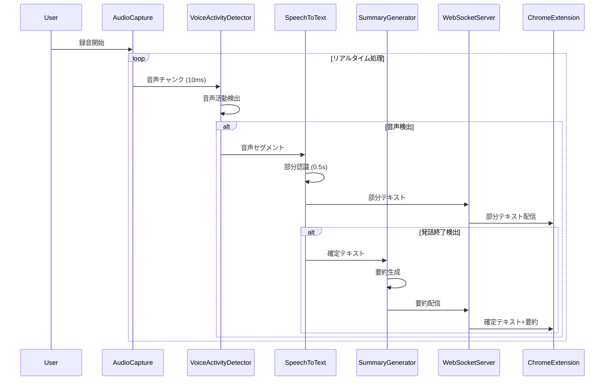
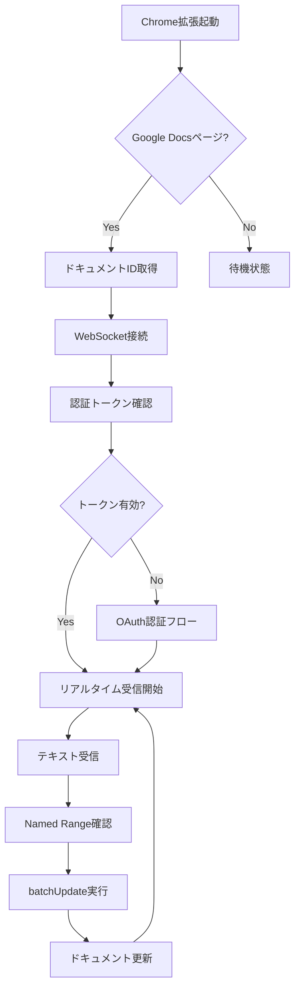
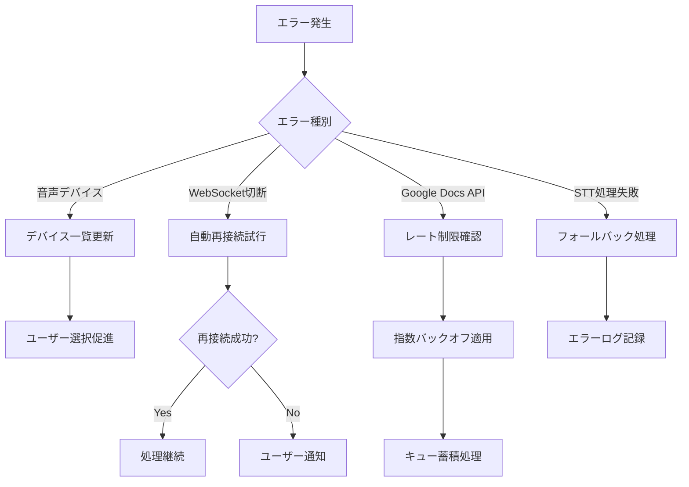
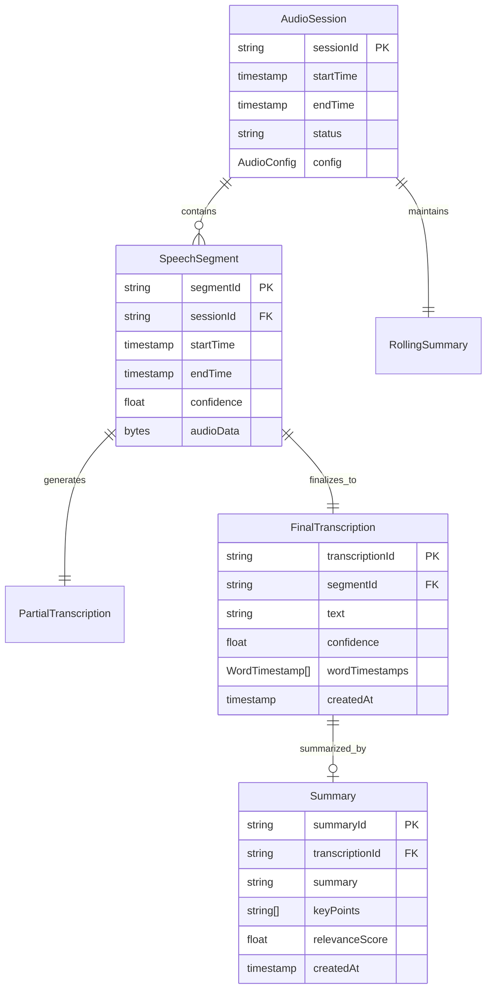
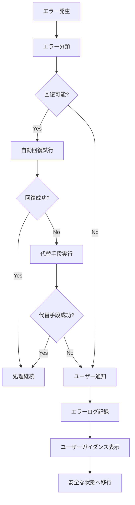
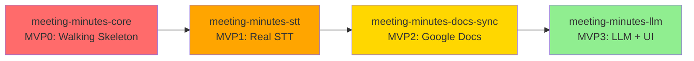

# Technical Design Document

## Overview

**目的**: 本機能は、会議や打ち合わせの音声をリアルタイムで録音・文字起こしし、要約を自動生成することで、議事録作成の効率化と品質向上を実現します。

**ユーザー**: 会議参加者やファシリテーターが、手動での議事録作成に代わって自動化されたワークフローを活用します。

**インパクト**: 従来の手動議事録作成から、リアルタイム自動処理による構造化された議事録管理システムへの転換を図ります。

### Goals

- ローカル環境での高精度リアルタイム音声認識（0.5秒以内の応答）
- TauriデスクトップアプリとChrome拡張のシームレス連携
- Google Docsへの自動的な議事録挿入と構造化
- クロスプラットフォーム対応（macOS、Windows、Linux）
- プライバシー保護（ローカル処理優先）

### Non-Goals

- クラウドベースの音声処理（初期バージョンでは除外）
- Zoom、Teams等の会議ツール直接統合（将来拡張として留保）
- モバイルプラットフォーム対応（Android、iOS）は今回のスコープ外
- リアルタイム翻訳機能

## Diagram Checklist

- `spec-requirements`: ユースケース図 (UC-xxx) を作り、アクターと機能境界を確定する。
- `spec-design`: コンポーネント図 (CMP-xxx) と必要に応じた配置図 (DEP-xxx)、クラス図骨子 (CLS-xxx) を用意する。
- `spec-tasks`: 主要ユースケースごとにシーケンス図 (SEQ-xxx) を作成し、非同期制御が複雑ならアクティビティ図 (ACT-xxx) を追加する。
- `spec-impl`: ステートマシン図 (STM-xxx) とクラス図詳細を確定し、属性・制約・多重度を明示する。
- すべての図を `docs/uml/meeting-minutes-automator/<カテゴリ>/ID_Title.puml` に配置し、該当セクションから `#[[file:...]]` で参照する。
- 図の更新は実装へ影響する変更時のみ行い、1図あたり要素5±2で1画面に収める。


## Non-Functional Requirements

### ログ運用方針

**目的**: コーディングエージェントや開発者が実行結果からエラー解析・パフォーマンスチューニングを迅速に行えるよう、詳細メタデータを含む構造化ログを収集する。一方でログファイル・テレメトリの膨張を防ぎ、セッション単位で管理・ローテーションする。

**方針**:
- `.kiro/steering/principles.md`の「非機能ベースライン原則」に従い、INFO/DEBUG/ERRORレベル運用と構造化JSONを採用する。
- すべてのログレコードに `session_id` / `component` / `event` / `duration_ms` / `pii_masked` フラグを付与し、PIIは記録前にマスクする。
- DEBUGレベルは開発・サポートセッションのみで有効化し、5秒以上持続する処理に限り詳細スタックを出力する。
- 1ファイル上限5MB・最大5世代でローテーションし、長期保存は圧縮済みの`.log.gz`として`logs/<yyyy-mm-dd>/`配下へ移動する。
- パフォーマンスメトリクス（推論レイテンシ、メモリ使用量）は60秒間隔で集約し、詳細サンプリングログとは別チャンネルに分離する。

**制約**:
- Chrome拡張側はManifest V3制約下でDevToolsコンソールに限定し、ユーザービルドではINFO/ERRORのみ送出する。
- Pythonサイドカーは非同期I/Oでログ書き込みを行い、STT処理スレッドをブロックしない。
- ログレベル設定はTauri設定ファイルとChrome拡張設定の双方から同期可能にする。

#[[file:docs/uml/meeting-minutes-automator/dep/DEP-001_logging_flow.puml]]

#### 実装タスク
1. `src-tauri/src/logging/mod.rs`: `tracing`/`tracing-subscriber`を用いたJSONフォーマッタ実装、セッションID自動付与、サイズベースローテーション設定。
2. `python-stt/stt_engine/logging.py`: `structlog`構成で非同期ファイルハンドラを追加し、VAD/STTステージごとの処理時間をメトリクスチャンネルに送出。
3. `chrome-extension/src/background/logger.ts`: WebSocket経由でのINFO/ERROR転送とDevTools向けDEBUG出力のトグル実装、PIIマスクユーティリティの共通化。
4. `docs/uml/meeting-minutes-automator/dep/DEP-001_logging_flow.puml`: ログフロー図（Tauri↔Python↔Chrome↔ストレージ）を作成し、図版管理原則に従って責任者（SRE担当）を記載。


## Architecture

### High-Level Architecture

#[[file:docs/uml/meeting-minutes-automator/cmp/CMP-001_high_level_architecture.puml]]

### Technology Stack and Design Decisions

#### デスクトップアプリケーション層

**選定技術**:
- **フレームワーク**: Tauri 2.0
- **バックエンド**: Rust
- **フロントエンド**: React (TypeScript)
- **状態管理**: Zustand

**選定理由**:
- Tauriは軽量性（Electronの約10分の1のメモリ使用量）とセキュリティ面で優位
- 2025年のRaw Payloads対応により大容量音声データの効率的転送が可能
- Rustの並行処理能力がリアルタイム音声処理に適合

**代替案考慮**: Electronは除外（メモリ使用量とセキュリティの課題）

#### 音声処理層

**選定技術**:
- **音声認識**: faster-whisper (CTranslate2最適化版)
- **音声活動検出**: webrtcvad
- **録音**: sounddevice (Python)
- **要約**: LLM API (OpenAI GPT-4o等)

**選定理由**:
- faster-whisperは2025年時点で最もCPU効率的なWhisper実装
- webrtcvadは16-bit mono PCMで低遅延VAD処理を実現
- SimulStreaming（2025年新技術）の導入も検討対象

#### Chrome拡張層

**選定技術**:
- **Manifest**: V3 (Chrome 116以降)
- **UI**: React + TypeScript
- **通信**: WebSocket Client
- **API**: Google Docs API v1

#### 重要な設計決定

**決定1: Pythonサイドカー vs PyTauri統合**
- **決定**: Pythonサイドカーパターンを採用
- **背景**: 音声処理の複雑さと既存エコシステムの活用
- **代替案**: PyTauri（Pyo3）、WebSocket経由の外部プロセス
- **選定理由**: faster-whisperエコシステムの完全活用、独立したプロセス管理
- **トレードオフ**: IPC軽量性 vs 保守性・安定性

**決定2: リアルタイム処理アーキテクチャ**
- **決定**: 非同期キューベースのパイプライン処理
- **背景**: 0.5秒応答時間とメモリ効率の両立要求
- **代替案**: 同期処理、バッチ処理、ストリーミング処理
- **選定理由**: バックプレッシャー制御と低遅延の最適バランス
- **トレードオフ**: 複雑性増加 vs パフォーマンス最適化

**決定3: WebSocket通信プロトコル**
- **決定**: JSON-RPC like プロトコルの独自実装
- **背景**: Chrome拡張のManifest V3制約とリアルタイム要求
- **代替案**: Server-Sent Events、HTTP Polling、gRPC
- **選定理由**: 双方向通信と Chrome 116以降のWebSocketサポート
- **トレードオフ**: 標準化 vs カスタマイゼーション

## System Flows

### 音声処理パイプライン



### Chrome拡張 - Google Docs連携フロー

#[[file:docs/uml/meeting-minutes-automator/seq/SEQ-001_chrome_docs_sync_flow.puml]]



### エラー処理フロー



## Components and Interfaces

### 音声処理ドメイン

#### AudioCaptureService（責務分離後）

**問題点**: 元の設計では「OS固有の音声デバイスからの取得」と「Pythonプロセスへの転送」の両責務を持ち、OS固有API抽象化とIPC管理が混在していた。

**リファクタリング方針**: 2つのコンポーネントに分離
1. **AudioDeviceAdapter**: OS固有音声API抽象化層
2. **AudioStreamBridge**: Python IPC通信層

---

#### AudioDeviceAdapter

**責任と境界**
- **主要責任**: OS固有の音声APIからの音声データ取得とフォーマット変換（**システム唯一の録音責任者**）
- **ドメイン境界**: 音声デバイス抽象化レイヤー
- **データ所有**: 音声デバイス設定、音声バッファ
- **トランザクション境界**: 単一音声セッションスコープ

**重要な設計決定**:
- **録音責務の一元化**: 音声録音はこのコンポーネントのみが担当します
- **Python側の制約**: Pythonサイドカーは録音を行わず、Rustから送信されたバイナリストリームの受信とSTT処理のみを実施
- **レース条件の防止**: 複数箇所での録音開始を防ぎ、単一の音声ソースを保証

**依存関係**
- **インバウンド**: AudioStreamBridge、UI設定コンポーネント
- **アウトバウンド**: なし（リーフノード）
- **外部依存**: OS音声API（WASAPI、CoreAudio、ALSA）

**契約定義**

```rust
pub trait AudioDeviceAdapter: Send + Sync {
    async fn list_devices(&self) -> Result<Vec<AudioDevice>>;
    async fn start_capture(&mut self, device_id: &str, config: AudioConfig) -> Result<AudioStream>;
    async fn stop_capture(&mut self) -> Result<()>;
}

// OS別実装
pub struct WasapiAdapter { /* Windows */ }
pub struct CoreAudioAdapter { /* macOS */ }
pub struct AlsaAdapter { /* Linux */ }

impl AudioDeviceAdapter for WasapiAdapter {
    // Windows WASAPI実装
}

impl AudioDeviceAdapter for CoreAudioAdapter {
    // macOS CoreAudio実装
}

impl AudioDeviceAdapter for AlsaAdapter {
    // Linux ALSA実装
}
```

**設計ポイント**:
- OS固有のバグ修正時にIPC層に影響を与えない
- テスト時にモックアダプターで置き換え可能
- 新しいOSサポート追加時の影響範囲を限定

---

#### AudioStreamBridge

**責任と境界**
- **主要責任**: Rust→Python間の音声データIPC転送
- **ドメイン境界**: プロセス間通信層
- **データ所有**: 音声バッファキュー、IPC接続状態
- **トランザクション境界**: 音声チャンク単位

**依存関係**
- **インバウンド**: オーディオ録音コントローラー
- **アウトバウンド**: PythonSidecarManager、AudioDeviceAdapter
- **外部依存**: なし（Rustプロセス内完結）

**契約定義**

```rust
pub struct AudioStreamBridge {
    device_adapter: Box<dyn AudioDeviceAdapter>,
    sidecar_manager: Arc<PythonSidecarManager>,
    buffer_queue: Arc<Mutex<VecDeque<AudioChunk>>>,
}

impl AudioStreamBridge {
    pub async fn start_streaming(&mut self, device_id: &str) -> Result<()> {
        // 1. デバイスアダプターから音声ストリーム取得
        let mut stream = self.device_adapter.start_capture(device_id, default_config()).await?;

        // 2. 音声チャンクをバッファキューに追加
        while let Some(chunk) = stream.next().await {
            self.buffer_queue.lock().await.push_back(chunk);
        }

        // 3. 別タスクでPythonへ非同期送信
        self.flush_to_python().await?;

        Ok(())
    }

    async fn flush_to_python(&self) -> Result<()> {
        while let Some(chunk) = self.buffer_queue.lock().await.pop_front() {
            self.sidecar_manager.send_audio_chunk(&chunk).await?;
        }
        Ok(())
    }
}
```

**バッファ管理戦略**:
- **キューサイズ上限**: 10秒分（160チャンク @ 10ms/chunk）
- **オーバーフロー時**: 古いチャンクをドロップ（警告ログ）
- **バックプレッシャー**: Python処理遅延時にサンプルレート削減

**依存関係図**:

```
┌─────────────────────────────┐
│  Audio Recording Controller │
└────────────┬────────────────┘
             │
             ▼
      ┌──────────────────┐
      │ AudioStreamBridge │
      └─────┬────────┬────┘
            │        │
            ▼        ▼
   ┌──────────────┐  ┌───────────────────┐
   │ AudioDevice  │  │ PythonSidecar     │
   │ Adapter      │  │ Manager           │
   └──────┬───────┘  └─────────┬─────────┘
          │                    │
          ▼                    ▼
   ┌──────────────┐     ┌──────────────┐
   │ OS Audio API │     │ Python STT   │
   │ (WASAPI/     │     │ Process      │
   │  CoreAudio)  │     │              │
   └──────────────┘     └──────────────┘
```

---

#### AudioCaptureService（統合レイヤー、互換性維持）

**契約定義**（既存UIとの互換性維持）

```typescript
interface AudioCaptureService {
  startCapture(deviceId: string, config: AudioConfig): Promise<Result<CaptureSession, AudioError>>;
  stopCapture(sessionId: string): Promise<Result<void, AudioError>>;
  getAvailableDevices(): Promise<Result<AudioDevice[], AudioError>>;
  onAudioChunk(callback: (chunk: AudioChunk) => void): void;
}

interface AudioConfig {
  sampleRate: 16000 | 32000 | 48000;
  channels: 1; // モノラル固定
  chunkSize: 160 | 320 | 480; // webrtcvad対応サイズ
}

interface AudioChunk {
  sessionId: string;
  timestamp: number;
  data: Uint8Array;
  sampleRate: number;
}
```

**事前条件**: 音声デバイスアクセス権限の取得完了
**事後条件**: 指定フォーマットでの音声データストリーム生成
**不変条件**: チャンクサイズとサンプルレートの整合性維持

#### VoiceActivityDetectionService

**責任と境界**
- **主要責任**: リアルタイム音声活動検出と発話セグメンテーション
- **ドメイン境界**: 音声解析と発話境界検出
- **データ所有**: VAD設定パラメータと検出履歴
- **トランザクション境界**: 音声チャンク単位の処理

**依存関係**
- **インバウンド**: AudioCaptureService
- **アウトバウンド**: SpeechToTextService
- **外部依存**: webrtcvad、NumPy

**契約定義**

```typescript
interface VoiceActivityDetectionService {
  detectActivity(chunk: AudioChunk): Promise<Result<VadResult, VadError>>;
  setAggressiveness(level: 0 | 1 | 2 | 3): void;
  onSpeechStart(callback: (segmentId: string) => void): void;
  onSpeechEnd(callback: (segment: SpeechSegment) => void): void;
}

interface VadResult {
  isSpeech: boolean;
  confidence: number;
  segmentId?: string;
}

interface SpeechSegment {
  segmentId: string;
  startTime: number;
  endTime: number;
  audioData: Uint8Array;
}
```

#### SpeechToTextService

**責任と境界**
- **主要責任**: 音声セグメントの文字起こしと部分結果生成
- **ドメイン境界**: 音声認識とテキスト変換
- **データ所有**: STTモデルとトランスクリプション履歴
- **トランザクション境界**: 発話セグメント単位

**依存関係**
- **インバウンド**: VoiceActivityDetectionService
- **アウトバウンド**: SummaryGenerationService、WebSocketServer
- **外部依存**: faster-whisper、torch

**外部依存関係調査**:
- **faster-whisper**: CTranslate2最適化版、CPU使用量50%削減（OpenAI Whisperとの比較）
- **モデルサイズ**: base (39MB), small (244MB), medium (769MB), large (1550MB)
- **言語サポート**: 日本語対応、ゼロショット多言語認識
- **ストリーミング制約**: リアルタイム処理での最小遅延は約300ms
- **実装時要調査**: GPU加速オプション、モデルキャッシュ戦略

**契約定義**

```typescript
interface SpeechToTextService {
  transcribePartial(segment: SpeechSegment): Promise<Result<PartialTranscription, SttError>>;
  transcribeFinal(segment: SpeechSegment): Promise<Result<FinalTranscription, SttError>>;
  setModel(modelSize: ModelSize): Promise<Result<void, SttError>>;
}

interface PartialTranscription {
  segmentId: string;
  text: string;
  confidence: number;
  timestamp: number;
  isPartial: true;
}

interface FinalTranscription {
  segmentId: string;
  text: string;
  confidence: number;
  timestamp: number;
  isPartial: false;
  wordTimestamps?: WordTimestamp[];
}
```

#### SummaryGenerationService

**責任と境界**
- **主要責任**: 確定テキストからの要約生成とローリングサマリー更新
- **ドメイン境界**: テキスト要約と意味抽出
- **データ所有**: 要約履歴とコンテキスト情報
- **トランザクション境界**: テキストセグメント単位

**依存関係**
- **インバウンド**: SpeechToTextService
- **アウトバウンド**: WebSocketServer
- **外部依存**: OpenAI API、ローカルLLMオプション

**契約定義**

```typescript
interface SummaryGenerationService {
  generateSummary(transcription: FinalTranscription): Promise<Result<Summary, SummaryError>>;
  updateRollingSummary(summary: Summary): Promise<Result<RollingSummary, SummaryError>>;
  extractKeyPoints(text: string): Promise<Result<KeyPoint[], SummaryError>>;
}

interface Summary {
  transcriptionId: string;
  summary: string;
  keyPoints: string[];
  timestamp: number;
  confidence: number;
}

interface RollingSummary {
  sessionId: string;
  overallSummary: string;
  keyPoints: KeyPoint[];
  actionItems: ActionItem[];
  lastUpdated: number;
}
```

### 通信レイヤー

#### WebSocketServer

**責任と境界**
- **主要責任**: Chrome拡張との双方向リアルタイム通信
- **ドメイン境界**: アプリケーション間通信とメッセージルーティング
- **データ所有**: 接続状態とメッセージキュー
- **トランザクション境界**: メッセージ配信単位

**依存関係**
- **インバウンド**: 全音声処理サービス
- **アウトバウンド**: Chrome拡張クライアント
- **外部依存**: tokio-tungstenite、serde_json

**契約定義**

```typescript
interface WebSocketServer {
  startServer(port: number): Promise<Result<ServerHandle, WebSocketError>>;
  broadcast(message: MessagePayload): Promise<Result<void, WebSocketError>>;
  onClientConnected(callback: (clientId: string) => void): void;
  onClientMessage(callback: (clientId: string, message: ClientMessage) => void): void;
}

interface MessagePayload {
  type: 'partial_text' | 'final_text' | 'summary' | 'rolling_summary' | 'error';
  sessionId: string;
  timestamp: number;
  data: PartialTranscription | FinalTranscription | Summary | RollingSummary | ErrorData;
}
```

### Chrome拡張ドメイン

#### ChromeExtensionController

**責任と境界**
- **主要責任**: Manifest V3制約下でのWebSocket通信とページ制御
- **ドメイン境界**: ブラウザ環境とデスクトップアプリの橋渡し
- **データ所有**: 拡張設定と接続状態
- **トランザクション境界**: ユーザーアクション単位

**依存関係**
- **インバウンド**: ユーザーインタラクション、ページイベント
- **アウトバウンド**: WebSocketServer、GoogleDocsService
- **外部依存**: Chrome Extension APIs、WebSocket API

**実装時要調査**: Chrome 116以降のService Worker WebSocket制約、Keep-Alive戦略

#### WebSocketポート発見機構

**課題**: Rust側で動的ポート割り当て（9001-9100）を行うが、Chrome拡張側がポート番号を発見する仕組みが必要。

**設計方針**:
1. **ローカルストレージからの読み込み**: 前回接続成功時のポートを記憶
2. **ポートスキャン**: 接続失敗時に9001-9100をスキャン
3. **接続成功時の記憶**: 成功したポートを`chrome.storage.local`に保存

**実装フロー**:

```typescript
// Service Worker (background.ts)
class DesktopConnectionManager {
  private lastKnownPort: number | null = null;
  private connectionState: 'disconnected' | 'connecting' | 'connected' = 'disconnected';

  async connect(): Promise<WebSocket> {
    // 1. ローカルストレージから前回ポートを読み込み
    const stored = await chrome.storage.local.get('websocket_port');
    this.lastKnownPort = stored.websocket_port || 9001;

    // 2. 前回ポートで接続試行
    try {
      const ws = await this.tryConnect(this.lastKnownPort);
      return ws;
    } catch (error) {
      // 3. 失敗時はポートスキャン
      return await this.scanAndConnect();
    }
  }

  private async tryConnect(port: number, timeout = 2000): Promise<WebSocket> {
    return new Promise((resolve, reject) => {
      const ws = new WebSocket(`ws://localhost:${port}`);
      const timeoutId = setTimeout(() => {
        ws.close();
        reject(new Error(`Connection timeout on port ${port}`));
      }, timeout);

      ws.onopen = () => {
        clearTimeout(timeoutId);
        this.savePort(port); // 成功時に保存
        resolve(ws);
      };

      ws.onerror = () => {
        clearTimeout(timeoutId);
        reject(new Error(`Connection failed on port ${port}`));
      };
    });
  }

  private async scanAndConnect(): Promise<WebSocket> {
    // ポート範囲を順次試行
    for (let port = 9001; port <= 9100; port++) {
      try {
        const ws = await this.tryConnect(port, 1000); // 短いタイムアウト
        console.log(`Connected successfully on port ${port}`);
        return ws;
      } catch (error) {
        // 次のポートを試行
        continue;
      }
    }
    throw new Error('Failed to connect to Tauri app on any port in range 9001-9100');
  }

  private async savePort(port: number): Promise<void> {
    await chrome.storage.local.set({ websocket_port: port });
    this.lastKnownPort = port;
  }
}
```

**ユーザー体験**:
- **初回接続**: 2〜5秒のスキャン時間（UI表示: "接続中..."）
- **2回目以降**: 即座接続（前回ポート使用）
- **ポート変更時**: 自動検出と再接続

#### Chrome拡張の責務境界定義

**Service Worker (background.ts)の責務**:
- WebSocket接続の所有と管理
- Keep-Alive機構（30秒ごとのping）
- メッセージキューイング（オフライン時）
- 状態管理（disconnected/connecting/connected）
- Content Scriptへのメッセージ配信

**Content Script (content.ts)の責務**:
- Google Docsページの検出とDOM監視
- Service Workerからのメッセージ受信
- ドキュメント操作の実行（表示専用、編集はDocsAPI経由）
- ユーザーインタラクションの検知とイベント送信

**状態機械**:

```
                  ┌──────────────┐
                  │ Disconnected │
                  └──────┬───────┘
                         │ connect()
                         ▼
                  ┌──────────────┐     connection success
                  │  Connecting  ├──────────────────────┐
                  └──────┬───────┘                      │
                         │ connection failed            │
                         │ after scan                   │
                         ▼                              ▼
                  ┌──────────────┐            ┌──────────────┐
                  │    Error     │            │  Connected   │
                  └──────────────┘            └──────┬───────┘
                                                     │ disconnect/error
                                                     │
                                              ┌──────▼───────┐
                                              │ Reconnecting │
                                              └──────┬───────┘
                                                     │ exponential backoff
                                                     │ (1s, 2s, 4s, 8s...)
                                                     │
                                                     └──────► Connected (成功時)
                                                     └──────► Error (失敗時)
```

**契約定義**

```typescript
interface ChromeExtensionController {
  connectToDesktop(): Promise<Result<Connection, ExtensionError>>; // ポート自動検出
  disconnect(): Promise<void>;
  sendKeepAlive(): void;
  onRealtimeData(callback: (data: MessagePayload) => void): void;
  onConnectionStateChange(callback: (state: ConnectionState) => void): void;
  isGoogleDocsPage(): boolean;
  getDocumentId(): string | null;
}

type ConnectionState = 'disconnected' | 'connecting' | 'connected' | 'reconnecting' | 'error';
```

#### GoogleDocsIntegrationService

**責任と境界**
- **主要責任**: Google Docs APIを用いた構造化議事録の自動挿入
- **ドメイン境界**: ドキュメント操作とコンテンツ管理
- **データ所有**: ドキュメント構造とNamed Range設定
- **トランザクション境界**: batchUpdate操作単位

**依存関係**
- **インバウンド**: ChromeExtensionController
- **アウトバウンド**: Google Docs API
- **外部依存**: Google Docs API v1、OAuth 2.0

**外部依存関係調査**:
- **API制限**: 100 requests/100 seconds/user、1000 requests/100 seconds
- **batchUpdate**: 最大500操作/リクエスト
- **Named Range**: ドキュメント当たり最大1000個
- **認証**: OAuth 2.0、スコープ `https://www.googleapis.com/auth/documents`

**Rate Limit Management Strategy**:

**課題**: Google Docs APIの制限（100 requests/100 seconds/user）に対し、リアルタイム文字起こし（0.5秒間隔）では2時間会議で14,400回の更新が発生し、大幅超過する。

**設計原則**:
1. **リアルタイム表示とDocs同期の分離**: Chrome拡張ポップアップUIは不要。Tauri UIとChrome拡張のContent Scriptでリアルタイム表示を行い、Docs書き込みは独立したスロットリング制御を実施
2. **確定テキストのみ同期**: 部分テキスト（Partial Transcription）はDocsに書き込まず、確定テキスト（Final Transcription）のみを対象とする
3. **バッチ更新戦略**: 複数の確定テキストを蓄積してバッチ更新

**スロットリング戦略**:

```typescript
interface DocsUpdateThrottler {
  strategy: 'time-window' | 'batch-accumulation' | 'hybrid';

  config: {
    // Time-window方式: 固定時間間隔での更新
    timeWindowMs: 10000;           // 10秒ウィンドウで最大1回更新

    // Batch-accumulation方式: テキスト蓄積での更新
    batchSize: 50;                 // 50確定テキストごとに1回更新

    // Hybrid方式: 両方の条件のOR
    // 「10秒経過 OR 50テキスト蓄積」のいずれか早い方で更新
  };

  // 緊急フラッシュ: ユーザーが明示的に「今すぐ同期」ボタンを押した場合
  forceFlush(): Promise<void>;
}

class GoogleDocsThrottledWriter {
  private pendingTexts: FinalTranscription[] = [];
  private lastUpdateTime: number = 0;
  private updateTimer: NodeJS.Timeout | null = null;

  constructor(
    private documentId: string,
    private config: DocsUpdateThrottler['config']
  ) {}

  async queueTranscription(text: FinalTranscription): Promise<void> {
    this.pendingTexts.push(text);

    // Batch-accumulation条件: 50テキスト蓄積
    if (this.pendingTexts.length >= this.config.batchSize) {
      await this.flush();
      return;
    }

    // Time-window条件: 10秒経過
    const timeSinceLastUpdate = Date.now() - this.lastUpdateTime;
    if (timeSinceLastUpdate >= this.config.timeWindowMs) {
      await this.flush();
    } else {
      // タイマー設定: 残り時間後に自動フラッシュ
      if (!this.updateTimer) {
        const remainingTime = this.config.timeWindowMs - timeSinceLastUpdate;
        this.updateTimer = setTimeout(() => this.flush(), remainingTime);
      }
    }
  }

  private async flush(): Promise<void> {
    if (this.pendingTexts.length === 0) return;

    // バッチ更新実行（最大500操作/リクエスト制限に準拠）
    const textsToUpdate = this.pendingTexts.splice(0, 500);

    await this.batchUpdateDocument(this.documentId, textsToUpdate);

    this.lastUpdateTime = Date.now();
    if (this.updateTimer) {
      clearTimeout(this.updateTimer);
      this.updateTimer = null;
    }
  }

  private async batchUpdateDocument(
    documentId: string,
    texts: FinalTranscription[]
  ): Promise<void> {
    // 複数のinsertTextリクエストを1つのbatchUpdateにまとめる
    const requests = texts.map(text => ({
      insertText: {
        location: { index: -1 }, // endOfSegmentLocation相当
        text: text.text + '\n',
      },
    }));

    await google.docs.documents.batchUpdate({
      documentId,
      requestBody: { requests },
    });
  }
}
```

**API制限対策の詳細**:

| 戦略 | 更新頻度 | 2時間会議での推定リクエスト数 | API制限との比較 |
|-----|---------|---------------------------|----------------|
| **リアルタイム同期（0.5秒間隔）** | 毎回 | 14,400回 | ❌ 144倍超過 |
| **Time-window（10秒間隔）** | 最大720回 | 720回 | ⚠️ 7.2倍超過 |
| **Batch-accumulation（50テキスト）** | 可変 | 約200〜400回 | ✅ 2〜4倍（許容範囲） |
| **Hybrid（10秒 OR 50テキスト）** | 最適化 | 約300〜500回 | ✅ 3〜5倍（推奨） |

**推奨設定**: Hybrid方式（10秒 OR 50テキスト）
- 通常会議: 10秒間隔で自動更新（ユーザー体験良好）
- 活発な議論: 50テキスト蓄積で早期更新（データロスト防止）
- 緊急時: ユーザーが「今すぐ同期」ボタンで強制フラッシュ

**レート制限エラー時のフォールバック**:
```typescript
async handleRateLimitError(error: DocsApiError): Promise<void> {
  if (error.code === 429) { // Too Many Requests
    // 指数バックオフ: 1秒 → 2秒 → 4秒 → 8秒
    const backoffMs = Math.min(1000 * Math.pow(2, this.retryCount), 8000);
    await sleep(backoffMs);
    this.retryCount++;

    // 最大5回リトライ後、ローカルキューに保存
    if (this.retryCount > 5) {
      await this.saveToLocalQueue(this.pendingTexts);
      this.showUserNotification('Google Docsへの同期を一時停止しました。後で再試行します。');
    }
  }
}
```

---

**Named Range クリーンアップポリシー**:

**課題**: Named Rangeの上限1000個に対し、長期利用でのリソース枯渇リスク。

**設計方針**:
1. **セッション終了時の自動削除**: 会議セッション終了時にNamed Rangeを削除
2. **確定テキストの保持**: Named Range削除後も、テキスト自体はドキュメントに残る
3. **定期クリーンアップ**: 古いNamed Range（7日以上前）を自動削除

**実装**:
```typescript
class NamedRangeLifecycleManager {
  async onSessionEnd(documentId: string, sessionId: string): Promise<void> {
    // 1. セッションに紐づくNamed Rangeを取得
    const ranges = await this.getSessionNamedRanges(documentId, sessionId);

    // 2. Named Rangeを削除（テキストは保持）
    await this.batchDeleteNamedRanges(documentId, ranges.map(r => r.rangeId));

    // 3. セッションメタデータをドキュメントに追加（コメントとして）
    await this.addSessionMetadata(documentId, sessionId, {
      endTime: Date.now(),
      rangesDeleted: ranges.length,
    });
  }

  async cleanupOldRanges(documentId: string, daysOld = 7): Promise<void> {
    const cutoffDate = Date.now() - (daysOld * 24 * 60 * 60 * 1000);
    const allRanges = await this.getAllNamedRanges(documentId);
    const oldRanges = allRanges.filter(r => r.metadata?.createdAt < cutoffDate);

    if (oldRanges.length > 0) {
      await this.batchDeleteNamedRanges(documentId, oldRanges.map(r => r.rangeId));
    }
  }
}
```

#### OAuth 2.0トークン管理の詳細設計

**セキュリティ責任境界**:
- **Tauri App**: OAuth token保管（OS Keychain）、トークンライフサイクル管理
- **Chrome Extension**: 表示専用、認証フロー開始のみ、トークン保持禁止

**認証フロー**:

```
[1] ユーザーがChrome拡張で「Google Docs連携」ボタンをクリック
    ↓
[2] 拡張 → Tauri (WebSocket): { type: "oauth_request", scopes: ["docs"] }
    ↓
[3] Tauri: OAuth 2.0認証フローを開始（デフォルトブラウザで開く）
    ↓
[4] ユーザーがGoogleアカウントでログイン・許可
    ↓
[5] Googleがリダイレクト → Tauri (http://localhost:8080/oauth/callback)
    ↓
[6] Tauri: 認可コードをアクセストークンに交換
    ↓
[7] Tauri: トークンをOS Keychainに保存
    - macOS: Keychain Services
    - Windows: Windows Credential Manager
    - Linux: Secret Service API (libsecret)
    ↓
[8] Tauri → 拡張 (WebSocket): { type: "oauth_success", userId: "..." }
    ↓
[9] 拡張: "連携完了"UI表示、ドキュメント操作可能に
```

**トークン委譲フロー** (Google Docs API呼び出し時):

```typescript
// Chrome拡張 (Service Worker)
class GoogleDocsClient {
  async insertText(documentId: string, text: string): Promise<void> {
    // トークンを持たない、Tauriに操作を委譲
    const response = await this.sendToTauri({
      type: 'docs_operation',
      operation: 'insert_text',
      params: { documentId, text },
    });

    if (response.error) {
      throw new Error(response.error);
    }
  }
}

// Tauri (Rust)
async fn handle_docs_operation(operation: DocsOperation) -> Result<Response> {
    // 1. OS Keychainからトークン取得
    let token = keychain::get_token("google_oauth")?;

    // 2. トークン有効性確認
    if token.is_expired() {
        token = refresh_token(&token.refresh_token).await?;
        keychain::save_token("google_oauth", &token)?;
    }

    // 3. Google Docs API呼び出し
    let result = google_docs_api::insert_text(
        &operation.document_id,
        &operation.text,
        &token.access_token,
    ).await?;

    Ok(Response::success(result))
}
```

**トークンストレージ実装**:

```rust
// Tauri側: OS Keychain統合
use keyring::Entry;

pub struct SecureTokenStorage {
    service_name: String,
}

impl SecureTokenStorage {
    pub fn new() -> Self {
        Self {
            service_name: "com.meeting-minutes-automator".to_string(),
        }
    }

    pub fn save_token(&self, token: &OAuthToken) -> Result<()> {
        let entry = Entry::new(&self.service_name, "google_oauth")?;
        let token_json = serde_json::to_string(token)?;
        entry.set_password(&token_json)?;
        Ok(())
    }

    pub fn get_token(&self) -> Result<OAuthToken> {
        let entry = Entry::new(&self.service_name, "google_oauth")?;
        let token_json = entry.get_password()?;
        let token = serde_json::from_str(&token_json)?;
        Ok(token)
    }

    pub fn delete_token(&self) -> Result<()> {
        let entry = Entry::new(&self.service_name, "google_oauth")?;
        entry.delete_password()?;
        Ok(())
    }
}
```

**セキュリティ要件**:
- Chrome拡張の`chrome.storage.local`にトークンを保存しない
- WebSocket通信時のトークン送信禁止
- Tauri側でのトークン暗号化（OS Keychain使用）
- トークン有効期限の自動管理とリフレッシュ

**契約定義**

```typescript
interface GoogleDocsIntegrationService {
  createMeetingSection(documentId: string, title: string): Promise<Result<NamedRange, DocsError>>;
  insertTranscription(documentId: string, rangeId: string, text: string): Promise<Result<void, DocsError>>;
  updateSummary(documentId: string, summary: RollingSummary): Promise<Result<void, DocsError>>;
  batchUpdateDocument(documentId: string, requests: BatchUpdateRequest[]): Promise<Result<BatchUpdateResponse, DocsError>>;
}

interface BatchUpdateRequest {
  insertText?: InsertTextRequest;
  createNamedRange?: CreateNamedRangeRequest;
  updateTextStyle?: UpdateTextStyleRequest;
}
```

---

### WebSocket Sync Protocol（再接続時のデータ整合性保証）

**課題**: Chrome拡張の再接続時（タブリロード、Service Worker再起動、ネットワーク断）にデータ重複や欠落を防ぐ必要がある。

**設計方針**:
1. **Best Effort同期**: 100%の完全性は保証せず、通常ケースでのデータロストを最小化
2. **メッセージ順序番号**: グローバル単調増加IDで重複検出
3. **履歴バッファ保持**: Tauri側で過去10分間のメッセージ履歴を保持
4. **クライアント状態永続化**: Chrome拡張が最後に受信したメッセージIDを記憶

**WebSocketメッセージ拡張仕様**:

```typescript
// 既存のMessagePayloadを拡張
interface SyncedMessagePayload extends MessagePayload {
  messageId: number;           // グローバル単調増加ID（セッション開始から連番）
  sessionId: string;           // 音声セッションID
  timestamp: number;           // Unix timestamp (ms)
  sequenceNumber: number;      // セッション内シーケンス番号（0から開始）
}

// 再接続時のハンドシェイクメッセージ
interface ReconnectRequest {
  type: 'reconnect_request';
  lastReceivedMessageId: number;  // Chrome拡張が最後に受信したID
  sessionId: string | null;       // 既存セッションへの再接続の場合
}

interface ReconnectResponse {
  type: 'reconnect_response';
  status: 'success' | 'partial' | 'session_ended';
  missedMessages: SyncedMessagePayload[];  // 欠落していたメッセージ
  currentState: SessionStateSnapshot;      // 現在の状態スナップショット
  totalMissedCount: number;                // 欠落メッセージ総数
  historyLimitReached: boolean;            // 履歴バッファ上限到達フラグ
}

// セッション状態のスナップショット
interface SessionStateSnapshot {
  sessionId: string;
  status: 'active' | 'paused' | 'completed';
  startTime: number;
  lastMessageId: number;
  transcriptionCount: number;
  latestSummary: RollingSummary | null;
}
```

**Tauri側: メッセージ履歴バッファ実装**:

```rust
use std::collections::VecDeque;
use std::time::{SystemTime, UNIX_EPOCH};

const MESSAGE_HISTORY_MAX_SIZE: usize = 600;  // 10分間（0.5秒間隔×1200メッセージ）
const MESSAGE_HISTORY_MAX_AGE_MS: u64 = 10 * 60 * 1000;  // 10分

pub struct MessageHistoryBuffer {
    buffer: VecDeque<SyncedMessagePayload>,
    next_message_id: u64,
}

impl MessageHistoryBuffer {
    pub fn new() -> Self {
        Self {
            buffer: VecDeque::with_capacity(MESSAGE_HISTORY_MAX_SIZE),
            next_message_id: 1,
        }
    }

    pub fn add_message(&mut self, mut payload: MessagePayload) -> SyncedMessagePayload {
        let synced_payload = SyncedMessagePayload {
            messageId: self.next_message_id,
            sessionId: payload.sessionId.clone(),
            timestamp: current_timestamp_ms(),
            sequenceNumber: self.buffer.len() as u64,
            ..payload
        };

        self.buffer.push_back(synced_payload.clone());
        self.next_message_id += 1;

        // バッファサイズ上限管理
        if self.buffer.len() > MESSAGE_HISTORY_MAX_SIZE {
            self.buffer.pop_front();
        }

        // 古いメッセージの削除（10分以上前）
        self.cleanup_old_messages();

        synced_payload
    }

    pub fn get_messages_since(&self, last_message_id: u64) -> Vec<SyncedMessagePayload> {
        self.buffer
            .iter()
            .filter(|msg| msg.messageId > last_message_id)
            .cloned()
            .collect()
    }

    pub fn get_current_state(&self, session_id: &str) -> SessionStateSnapshot {
        // 最新の状態スナップショット生成
        SessionStateSnapshot {
            sessionId: session_id.to_string(),
            status: "active",
            lastMessageId: self.next_message_id - 1,
            // その他のフィールドは実際のセッション情報から取得
        }
    }

    fn cleanup_old_messages(&mut self) {
        let cutoff_time = current_timestamp_ms() - MESSAGE_HISTORY_MAX_AGE_MS;
        while let Some(front) = self.buffer.front() {
            if front.timestamp < cutoff_time {
                self.buffer.pop_front();
            } else {
                break;
            }
        }
    }
}

fn current_timestamp_ms() -> u64 {
    SystemTime::now()
        .duration_since(UNIX_EPOCH)
        .unwrap()
        .as_millis() as u64
}
```

**Chrome拡張側: 状態永続化とリハイドレーション**:

```typescript
// Service Worker (background.ts)
class WebSocketSyncClient {
  private lastReceivedMessageId: number = 0;
  private currentSessionId: string | null = null;

  async connect(): Promise<void> {
    // ローカルストレージから前回状態を復元
    const stored = await chrome.storage.local.get([
      'lastReceivedMessageId',
      'currentSessionId'
    ]);
    this.lastReceivedMessageId = stored.lastReceivedMessageId || 0;
    this.currentSessionId = stored.currentSessionId || null;

    const ws = await this.connectToDesktop();

    // 再接続リクエスト送信
    if (this.lastReceivedMessageId > 0) {
      const reconnectRequest: ReconnectRequest = {
        type: 'reconnect_request',
        lastReceivedMessageId: this.lastReceivedMessageId,
        sessionId: this.currentSessionId,
      };
      ws.send(JSON.stringify(reconnectRequest));
    }
  }

  async handleReconnectResponse(response: ReconnectResponse): Promise<void> {
    console.log(`Reconnection: ${response.status}, missed ${response.totalMissedCount} messages`);

    if (response.historyLimitReached) {
      // 履歴バッファ上限到達の警告
      this.showUserWarning(
        '一部のメッセージが失われた可能性があります。最新の状態から継続します。'
      );
    }

    // 欠落メッセージの再生（順序保証）
    for (const message of response.missedMessages) {
      await this.processMessage(message);
      this.lastReceivedMessageId = message.messageId;
    }

    // 状態永続化
    await this.persistState();

    // 現在の状態スナップショットを反映
    this.updateUIFromSnapshot(response.currentState);
  }

  async onMessage(message: SyncedMessagePayload): Promise<void> {
    // 重複検出
    if (message.messageId <= this.lastReceivedMessageId) {
      console.warn(`Duplicate message detected: ${message.messageId}`);
      return;
    }

    // 順序検証（ギャップ検出）
    if (message.messageId > this.lastReceivedMessageId + 1) {
      console.warn(
        `Message gap detected: expected ${this.lastReceivedMessageId + 1}, got ${message.messageId}`
      );
      // ギャップがある場合、サーバーに再同期リクエスト
      await this.requestResync();
    }

    await this.processMessage(message);
    this.lastReceivedMessageId = message.messageId;
    this.currentSessionId = message.sessionId;

    // 100メッセージごとに状態永続化（パフォーマンス考慮）
    if (message.messageId % 100 === 0) {
      await this.persistState();
    }
  }

  private async persistState(): Promise<void> {
    await chrome.storage.local.set({
      lastReceivedMessageId: this.lastReceivedMessageId,
      currentSessionId: this.currentSessionId,
      lastSyncTime: Date.now(),
    });
  }

  private async requestResync(): Promise<void> {
    const request: ReconnectRequest = {
      type: 'reconnect_request',
      lastReceivedMessageId: this.lastReceivedMessageId,
      sessionId: this.currentSessionId,
    };
    this.ws.send(JSON.stringify(request));
  }
}
```

**再接続フロー図**:

```
[1] Chrome拡張再起動（Service Worker再起動/タブリロード）
    ↓
[2] chrome.storage.localから前回状態を復元
    lastReceivedMessageId: 1234
    currentSessionId: "session-abc-123"
    ↓
[3] WebSocket接続確立
    ↓
[4] ReconnectRequestを送信
    { lastReceivedMessageId: 1234, sessionId: "session-abc-123" }
    ↓
[5] Tauri側でメッセージ履歴を検索
    - Message 1235〜1450（計215件）を発見
    - 履歴バッファ内で完全にカバー可能
    ↓
[6] ReconnectResponseを返信
    {
      status: "success",
      missedMessages: [Message 1235, 1236, ..., 1450],
      totalMissedCount: 215,
      historyLimitReached: false
    }
    ↓
[7] Chrome拡張が欠落メッセージを順次処理
    - UI更新: 215件のテキストを順次表示
    - lastReceivedMessageId: 1450に更新
    - 状態永続化
    ↓
[8] リアルタイムストリーム再開
    - Message 1451以降を通常処理
```

**Edge Case処理**:

| シナリオ | 対応 | ユーザー体験 |
|---------|------|------------|
| 履歴バッファ上限超過（10分以上切断） | 現在の状態スナップショットのみ提供 | 「長時間切断されていたため、最新の状態から再開します」警告 |
| セッション終了後の再接続 | `session_ended`ステータスを返信 | 「前回のセッションは終了しました。新規セッションを開始してください」 |
| ネットワーク不安定（頻繁な切断） | 再接続リクエストのレート制限（1秒に1回） | 自動再接続試行、安定後に通常動作復帰 |
| メッセージIDのオーバーフロー | u64範囲内で事実上無限（2^64-1 ≈ 1844京） | 考慮不要 |

**Best Effort保証の範囲**:

✅ **保証されること**:
- 通常の再接続（10分以内）でのデータロスト防止
- メッセージ重複の検出と排除
- 順序保証（シーケンス番号による）

❌ **保証されないこと**:
- 10分以上の切断後の完全なデータ復元
- Tauriアプリ自体がクラッシュした場合のメッセージ履歴
- 極端なネットワーク不安定環境での100%の整合性

**代替案（将来拡張）**:
- 永続的なメッセージログ（SQLiteに保存）
- セッション履歴の完全再生機能
- オフライン時のキューイングとバッチ送信

## Data Models

### Domain Model

**音声処理ドメイン**の核心概念:

- **AudioSession**: 録音セッションの集約ルート、ライフサイクル管理
- **SpeechSegment**: 発話境界で区切られたエンティティ、一意識別子
- **Transcription**: 文字起こし結果のバリューオブジェクト、不変性
- **Summary**: 要約情報のバリューオブジェクト、コンテキスト依存

**ビジネスルール**:
- 音声セッションは一意のタイムスタンプベースIDを持つ
- 部分テキストは確定テキストに収束し、不整合状態を持たない
- 要約は元テキストの参照を保持し、トレーサビリティを確保

### Logical Data Model



### Physical Data Model

**ローカルストレージ（SQLite）**:

```sql
-- 音声セッション管理
CREATE TABLE audio_sessions (
    session_id TEXT PRIMARY KEY,
    start_time INTEGER NOT NULL,
    end_time INTEGER,
    status TEXT NOT NULL CHECK(status IN ('active', 'paused', 'completed')),
    config JSON NOT NULL,
    created_at INTEGER DEFAULT (unixepoch())
);

-- 音声セグメント
CREATE TABLE speech_segments (
    segment_id TEXT PRIMARY KEY,
    session_id TEXT NOT NULL,
    start_time INTEGER NOT NULL,
    end_time INTEGER NOT NULL,
    confidence REAL,
    audio_data BLOB,
    FOREIGN KEY (session_id) REFERENCES audio_sessions(session_id)
);

-- 文字起こし結果
CREATE TABLE transcriptions (
    transcription_id TEXT PRIMARY KEY,
    segment_id TEXT NOT NULL,
    text TEXT NOT NULL,
    confidence REAL,
    word_timestamps JSON,
    created_at INTEGER DEFAULT (unixepoch()),
    FOREIGN KEY (segment_id) REFERENCES speech_segments(segment_id)
);

-- 要約データ
CREATE TABLE summaries (
    summary_id TEXT PRIMARY KEY,
    transcription_id TEXT,
    session_id TEXT,
    summary_text TEXT NOT NULL,
    key_points JSON,
    relevance_score REAL,
    summary_type TEXT CHECK(summary_type IN ('segment', 'rolling')),
    created_at INTEGER DEFAULT (unixepoch()),
    FOREIGN KEY (transcription_id) REFERENCES transcriptions(transcription_id),
    FOREIGN KEY (session_id) REFERENCES audio_sessions(session_id)
);

-- パフォーマンス最適化インデックス
CREATE INDEX idx_segments_session_time ON speech_segments(session_id, start_time);
CREATE INDEX idx_transcriptions_segment ON transcriptions(segment_id);
CREATE INDEX idx_summaries_session ON summaries(session_id, created_at);
```

### Data Contracts & Integration

**WebSocketメッセージスキーマ**:

```typescript
interface WebSocketMessage {
  id: string;
  type: MessageType;
  timestamp: number;
  payload: MessagePayload;
}

type MessageType =
  | 'audio.partial_transcription'
  | 'audio.final_transcription'
  | 'audio.summary_generated'
  | 'audio.rolling_summary_updated'
  | 'system.error'
  | 'system.status';

interface PartialTranscriptionPayload {
  sessionId: string;
  segmentId: string;
  text: string;
  confidence: number;
  isPartial: true;
}

interface FinalTranscriptionPayload {
  sessionId: string;
  segmentId: string;
  text: string;
  confidence: number;
  isPartial: false;
  wordTimestamps: WordTimestamp[];
}
```

**Google Docs APIスキーマ**:

```typescript
interface MeetingDocumentStructure {
  namedRanges: {
    'meeting_header': NamedRangeInfo;
    'live_transcription': NamedRangeInfo;
    'summary_section': NamedRangeInfo;
    'action_items': NamedRangeInfo;
  };
}

interface BatchUpdateOperations {
  createMeetingStructure: CreateNamedRangeRequest[];
  insertLiveText: InsertTextRequest;
  updateSummary: ReplaceNamedRangeContentRequest;
  formatContent: UpdateTextStyleRequest[];
}
```

## Error Handling

### Error Strategy

システム全体で統一されたエラー処理パターンを採用し、各レイヤーでの適切な回復メカニズムを実装します。

**エラー分類と対応戦略**:
- **回復可能エラー**: 自動リトライと代替手段の提供
- **設定エラー**: ユーザーガイダンスと修正支援
- **致命的エラー**: 安全な状態への移行とデータ保護

### Error Categories and Responses

**音声デバイスエラー (AudioDeviceError)**
- `DeviceNotFound`: デバイス一覧更新と代替デバイス提案
- `PermissionDenied`: システム設定ガイダンスとアクセス権限の説明
- `DeviceBusy`: 他アプリケーション終了案内と排他制御
- `InvalidConfiguration`: 設定検証とデフォルト値への復帰

**音声処理エラー (AudioProcessingError)**
- `VadProcessingFailed`: フォールバック処理（固定長セグメンテーション）
- `SttModelLoadFailed`: 代替モデルの自動選択
- `TranscriptionTimeout`: 部分結果の保存と継続処理
- `InsufficientResources`: 品質レベル調整と負荷軽減

**通信エラー (CommunicationError)**
- `WebSocketConnectionLost`: 指数バックオフでの自動再接続
- `ChromeExtensionDisconnected`: ユーザー通知と手動再接続オプション
- `MessageQueueOverflow`: バックプレッシャー適用とプライオリティ制御

**Google Docs APIエラー (DocsApiError)**
- `RateLimitExceeded`: 指数バックオフと操作キューイング
- `AuthenticationExpired`: 自動トークンリフレッシュまたは再認証フロー
- `DocumentNotAccessible`: 権限確認ガイダンスとアクセス要求
- `QuotaExceeded`: 代替保存オプション（ローカルファイル）の提供

### エラー処理フロー



### Monitoring

**エラー追跡とロギング**:
- 構造化ログ（JSON形式）での詳細エラー情報記録
- エラー発生頻度とパターンの分析
- ユーザー行動との相関分析

**ヘルスモニタリング**:
- 音声処理遅延の継続監視
- WebSocket接続安定性の測定
- Google Docs API使用量とレート制限の追跡

## Testing Strategy

### Unit Tests

**音声処理コアモジュール**:
- `AudioCaptureService`: デバイス検出、音声フォーマット変換、エラーハンドリング
- `VoiceActivityDetector`: VAD精度検証、セグメンテーション品質
- `SpeechToTextService`: モックオーディオでの認識精度、レスポンス時間
- `SummaryGenerator`: テキスト要約品質、キーポイント抽出精度
- `WebSocketServer`: メッセージシリアライゼーション、接続管理

### Integration Tests

**跨コンポーネント連携**:
- 音声キャプチャ→VAD→STT→要約のエンドツーエンドパイプライン
- WebSocket通信の信頼性とメッセージ順序保証
- Chrome拡張とデスクトップアプリの状態同期
- Google Docs API統合とbatchUpdate操作
- エラー発生時の回復フローとデータ整合性

### E2E/UI Tests

**重要ユーザーパス**:
- 新規音声セッション開始から議事録生成までの完全フロー
- Chrome拡張でのリアルタイムテキスト表示とGoogle Docs挿入
- 設定変更（音声デバイス、STTモデル）の反映確認
- ネットワーク切断・復旧シナリオでのデータ保護
- 長時間録音（2時間以上）での安定性検証

### Performance/Load Tests

**パフォーマンス検証**:
- 音声処理遅延の測定（目標: 部分テキスト0.5秒、確定テキスト2秒）
- 同時音声処理負荷での品質維持確認
- メモリ使用量の時間経過による増加率測定
- WebSocket同時接続数とメッセージスループット

## Security Considerations

### プライバシー保護

**ローカル処理優先アーキテクチャ**:
- 音声データは原則としてローカル環境内で処理
- クラウドAPIへの送信は要約生成時のテキストのみに限定
- 音声ファイルの自動削除オプション（セッション終了後）
- 個人識別可能情報（PII）の自動検出と匿名化

### 認証と認可

**Google Docs API認証**:
- OAuth 2.0フローによる最小権限アクセス
- アクセストークンのセキュアストレージ（暗号化）
- トークンの自動リフレッシュとローテーション
- ユーザー同意の明示的取得

### データ保護

**通信セキュリティ**:
- WebSocket通信の暗号化（WSS）
- ローカルホスト通信での証明書検証無効化オプション
- API通信のTLS 1.3強制
- 機密データのメモリ内暗号化

**ストレージセキュリティ**:
- SQLiteデータベースの暗号化（SQLCipher）
- 設定ファイルのアクセス権限制限
- 一時ファイルの安全な削除

### 脅威モデリング

**主要攻撃ベクトル**:
- 音声データの不正アクセス: ローカル暗号化と権限管理で対策
- WebSocket通信の傍受: TLS暗号化と証明書ピニング
- Chrome拡張の悪用: Content Security Policy強化
- API認証情報の漏洩: セキュアストレージとトークンローテーション

## Performance & Scalability

### Target Metrics

**レスポンス時間目標**:
- 音声活動検出: 10ms以内（リアルタイム要求）
- 部分文字起こし: 平均500ms、最大1秒
- 確定文字起こし: 発話終了から2秒以内
- 要約生成: 30秒以内（非ブロッキング）

**リソース使用量目標**:
- メモリ使用量: 2時間録音で最大2GB
- CPU使用率: 継続的に50%以下を維持
- ディスク使用量: 1時間音声で最大100MB

### Scaling Approaches

**音声処理スケーリング**:
- 並列音声チャンク処理による遅延削減
- モデル選択の動的調整（リソース消費vs精度）
- バッファプールによるメモリアロケーション最適化

**通信スケーリング**:
- WebSocketコネクションプールとロードバランシング
- メッセージ優先度制御とバックプレッシャー管理
- Google Docs APIのバッチ処理最適化

### Caching Strategies

**音声処理キャッシュ**:
- STTモデルのメモリ常駐とウォームアップ
- 音声セグメントの一時キャッシュ（重複処理回避）
- VAD結果のキャッシュと再利用

**API応答キャッシュ**:
- Google Docs文書構造のローカルキャッシュ
- 認証トークンの適切な有効期限管理
- ネットワーク切断時のオフライン機能

### 最適化戦略

**メモリ最適化**:
- 音声バッファのサイズ制限とローテーション
- 不要なデータの即座解放
- ガベージコレクション頻度の調整

**CPU最適化**:
- faster-whisperのマルチスレッド活用
- 非同期処理の最大限活用
- ボトルネック特定と処理分散

---

## Sub-Specification Dependencies (サブ仕様間の依存関係)

本プロジェクトは、以下の4つの独立したsub-specに分割されています。各specは段階的に実装され、Walking Skeleton から始まり、最終的なプロダクション準備まで順次機能を追加します。

### Sub-Spec 依存関係マトリクス

| Sub-Spec | Phase | 依存する Sub-Spec | 提供するインターフェース/機能 | 実装優先度 |
|----------|-------|------------------|----------------------------|----------|
| **meeting-minutes-core** | MVP0: Walking Skeleton | なし（独立） | - `FakeAudioDevice`<br/>- `PythonSidecarManager`<br/>- `WebSocketServer`<br/>- `ChromeExtension` スケルトン | 🔴 P0 (最優先) |
| **meeting-minutes-stt** | MVP1: Real STT | **meeting-minutes-core** | - `RealAudioDevice`<br/>- `VoiceActivityDetector`<br/>- `FasterWhisperEngine`<br/>- ローカルストレージ | 🟠 P1 (高) |
| **meeting-minutes-docs-sync** | MVP2: Google Docs同期 | **meeting-minutes-stt** | - `OAuth2Flow`<br/>- `GoogleDocsAPI`<br/>- `WebSocketSyncProtocol`<br/>- `NamedRangeManager` | 🟡 P2 (中) |
| **meeting-minutes-llm** | MVP3: LLM要約 + UI | **meeting-minutes-docs-sync** | - `LLMSummaryGenerator`<br/>- Tauri UI洗練<br/>- リソース管理3段階閾値<br/>- 最終プロダクション準備 | 🟢 P3 (通常) |

### 依存関係グラフ



### 各 Sub-Spec の詳細

#### 1. meeting-minutes-core (MVP0: Walking Skeleton)

**目的**: 全コンポーネントの最小疎通確認。Fake実装でE2E動作を検証。

**提供するコンポーネント**:
- `FakeAudioDevice` - Fake音声データ生成（100ms間隔、16バイトダミーデータ）
- `PythonSidecarManager` - Pythonプロセス起動/終了/ヘルスチェック
- `WebSocketServer` - ポート9001でChrome拡張との通信
- `IpcProtocol` - stdin/stdout JSON通信プロトコル
- Chrome拡張スケルトン - Manifest V3、WebSocket接続、コンソール表示

**依存**: なし

**成果物**: 録音開始 → Fake処理 → WebSocket → Chrome拡張コンソール表示

---

#### 2. meeting-minutes-stt (MVP1: Real STT)

**目的**: Fake実装を実音声処理に置き換え、本格的な文字起こしを実現。

**提供するコンポーネント**:
- `RealAudioDevice` - マイク/ループバックデバイスからの実音声録音
- `VoiceActivityDetector` - webrtcvadによる発話境界検出
- `FasterWhisperEngine` - faster-whisperによる実STT処理
- `AudioStorage` - ローカルストレージへの録音ファイル保存
- リソースベースモデル選択ロジック（requirements.md:253-390）

**依存**:
- `meeting-minutes-core` の `WebSocketServer`、`PythonSidecarManager`、`IpcProtocol` を継承

**成果物**: 実音声 → 文字起こし → ローカル保存 → Chrome拡張表示

---

#### 3. meeting-minutes-docs-sync (MVP2: Google Docs同期)

**目的**: Google Docs APIとの連携により、リアルタイム議事録同期を実現。

**提供するコンポーネント**:
- `OAuth2Flow` - Tauri側でのOS Keychain統合認証
- `GoogleDocsThrottledWriter` - Rate Limit Management（design.md:744-871）
- `WebSocketSyncProtocol` - 再接続時のデータ整合性保証（design.md:1047-1337）
- `NamedRangeManager` - Named Range管理とクリーンアップ
- Chrome拡張 Content Script - Docs検出・挿入処理

**依存**:
- `meeting-minutes-stt` の `FasterWhisperEngine`、`RealAudioDevice`
- `meeting-minutes-core` の `WebSocketServer`

**成果物**: 文字起こし → Google Docsリアルタイム同期

---

#### 4. meeting-minutes-llm (MVP3: LLM要約 + UI)

**目的**: LLM要約生成、UI洗練、プロダクション準備を完成させる。

**提供するコンポーネント**:
- `LLMSummaryGenerator` - OpenAI/ローカルLLM抽象化
- `SegmentSummary` / `RollingSummary` 生成
- Tauri UI洗練 - 設定画面、履歴表示、録音制御の完全実装
- リソース管理3段階閾値の完全実装（requirements.md:149-186）
- エラーハンドリング、ログ運用方針の本番実装

**依存**:
- `meeting-minutes-docs-sync` の全機能
- `meeting-minutes-stt` の `FasterWhisperEngine`
- `meeting-minutes-core` の基盤コンポーネント

**成果物**: プロダクション準備完了、全機能統合

---

## Common Interfaces and Shared Schemas (共通インターフェースと共有スキーマ)

全sub-spec間で共有される型定義、プロトコル仕様、エラー処理戦略を定義します。

### 1. WebSocket Message Protocol

**メッセージ基本構造**:

```typescript
// 共通メッセージ型（全sub-specで使用）
interface BaseMessage {
  messageId: number;           // グローバル単調増加ID
  sessionId: string;           // 音声セッションID
  timestamp: number;           // Unix timestamp (ms)
  type: 'connected' | 'transcription' | 'summary' | 'error' | 'reconnect_request' | 'reconnect_response';
}

// Transcription メッセージ（stt spec で生成、docs-sync spec で消費）
interface TranscriptionMessage extends BaseMessage {
  type: 'transcription';
  isPartial: boolean;          // 部分テキスト or 確定テキスト
  text: string;
  confidence: number;
  speakerSegment: number;
}

// Summary メッセージ（llm spec で生成、docs-sync spec で消費）
interface SummaryMessage extends BaseMessage {
  type: 'summary';
  summaryType: 'segment' | 'rolling';
  content: string;
  keyPoints: string[];
}

// Error メッセージ（全spec共通）
interface ErrorMessage extends BaseMessage {
  type: 'error';
  errorCode: string;
  errorMessage: string;
  recoverable: boolean;
}
```

**使用sub-spec**:
- `meeting-minutes-core`: BaseMessage、connected、error
- `meeting-minutes-stt`: TranscriptionMessage
- `meeting-minutes-docs-sync`: TranscriptionMessage、SummaryMessage の消費
- `meeting-minutes-llm`: SummaryMessage

---

### 2. IPC JSON Protocol (Tauri ↔ Python)

**リクエスト/レスポンス構造**:

```typescript
// Tauri → Python リクエスト
interface IpcRequest {
  id: string;                  // UUID v4
  type: 'request';
  method: 'process_audio' | 'health_check' | 'shutdown' | 'configure_model';
  params: Record<string, unknown>;
  timestamp: number;
}

// Python → Tauri レスポンス
interface IpcResponse {
  id: string;                  // 対応するリクエストのID
  type: 'response';
  result?: unknown;
  error?: {
    code: string;
    message: string;
  };
  timestamp: number;
}

// Python → Tauri イベント（非同期通知）
interface IpcEvent {
  type: 'event';
  event: 'partial_transcription' | 'model_loaded' | 'resource_warning';
  data: Record<string, unknown>;
  timestamp: number;
}
```

**使用sub-spec**:
- `meeting-minutes-core`: 基本構造、health_check、shutdown
- `meeting-minutes-stt`: process_audio、configure_model、partial_transcription

---

### 3. Error Handling Strategy (エラー処理戦略)

**共通Error型**:

```rust
// Rust側共通Error型（mma-commonクレート）
#[derive(Debug, thiserror::Error)]
pub enum AppError {
    #[error("Audio device error: {0}")]
    AudioDevice(String),

    #[error("IPC communication error: {0}")]
    IpcError(String),

    #[error("WebSocket error: {0}")]
    WebSocket(String),

    #[error("Python sidecar error: {0}")]
    PythonSidecar(String),

    #[error("STT processing error: {0}")]
    SttProcessing(String),

    #[error("Google Docs API error: {0}")]
    GoogleDocsApi(String),

    #[error("LLM API error: {0}")]
    LlmApi(String),
}

impl AppError {
    pub fn is_recoverable(&self) -> bool {
        match self {
            AppError::AudioDevice(_) => false,
            AppError::IpcError(_) => true,
            AppError::WebSocket(_) => true,
            AppError::PythonSidecar(_) => true,
            AppError::SttProcessing(_) => true,
            AppError::GoogleDocsApi(_) => true,
            AppError::LlmApi(_) => true,
        }
    }
}
```

**エラー分類**:
- **Recoverable**: IPC/WebSocket/API エラー → 自動リトライ、ユーザー通知
- **Non-Recoverable**: AudioDevice エラー → 即座停止、エラーログ記録

**使用sub-spec**: 全sub-spec共通

---

### 4. Shared Data Models (共有データモデル)

**AudioSession 型**:

```rust
// mma-common/src/models/session.rs
#[derive(Debug, Clone, Serialize, Deserialize)]
pub struct AudioSession {
    pub session_id: String,      // UUID v4
    pub start_time: DateTime<Utc>,
    pub end_time: Option<DateTime<Utc>>,
    pub status: SessionStatus,
    pub config: AudioConfig,
}

#[derive(Debug, Clone, Serialize, Deserialize)]
pub enum SessionStatus {
    Recording,
    Paused,
    Stopped,
    Completed,
}

#[derive(Debug, Clone, Serialize, Deserialize)]
pub struct AudioConfig {
    pub sample_rate: u32,        // 16000 Hz
    pub channels: u8,            // 1 (mono)
    pub bit_depth: u8,           // 16-bit
}
```

**Transcription 型**:

```rust
// mma-common/src/models/transcription.rs
#[derive(Debug, Clone, Serialize, Deserialize)]
pub struct Transcription {
    pub session_id: String,
    pub segment_id: String,
    pub text: String,
    pub is_partial: bool,
    pub confidence: f32,
    pub start_time: f64,
    pub end_time: f64,
    pub language: String,
}
```

**使用sub-spec**: 全sub-spec共通

---

### 5. Shared Constants and Configuration

**定数定義**:

```rust
// mma-common/src/constants.rs
pub const DEFAULT_SAMPLE_RATE: u32 = 16000;
pub const DEFAULT_CHUNK_SIZE: usize = 320;  // 10ms @ 16kHz mono
pub const WEBSOCKET_PORT_START: u16 = 9001;
pub const WEBSOCKET_PORT_END: u16 = 9100;
pub const PYTHON_SIDECAR_READY_TIMEOUT_MS: u64 = 10000;  // 10秒
pub const PYTHON_SIDECAR_SHUTDOWN_TIMEOUT_MS: u64 = 3000; // 3秒
pub const MESSAGE_HISTORY_MAX_SIZE: usize = 600;  // 10分間
pub const MESSAGE_HISTORY_MAX_AGE_MS: u64 = 10 * 60 * 1000;  // 10分
```

**使用sub-spec**: 全sub-spec共通

---

## Implementation Guidance for Sub-Specs

### Sub-Spec 実装時のガイドライン

1. **共通ライブラリの参照**:
   - 各sub-specの実装時は、`mma-common` クレートを必ずインポート
   - 独自の型定義を避け、共通型を使用

2. **依存関係の明記**:
   - 各sub-specの`requirements.md`と`design.md`に以下セクションを追加:

   ```markdown
   ## Dependencies on Other Specs
   - **meeting-minutes-core**: WebSocketServer, PythonSidecarManager
   - **Shared Schemas**: `.kiro/specs/meeting-minutes-automator/design.md#Common-Interfaces`
   ```

3. **インターフェース互換性**:
   - WebSocketメッセージ型を変更する場合、umbrella specの共通インターフェース仕様を更新
   - バージョニング戦略: メッセージ型に`version`フィールドを追加し、後方互換性を保証

4. **テスト戦略**:
   - 各sub-specは独立してテスト可能（依存sub-specはモック化）
   - E2Eテストはumbrella specレベルで実施

---

## Next Steps for Sub-Spec Implementation

### 実装順序（推奨）

1. **Phase 1**: `meeting-minutes-core` 完全実装（Walking Skeleton）
   - E2E疎通確認が取れるまで次フェーズに進まない
   - クロスプラットフォーム動作確認（macOS/Windows/Linux）

2. **Phase 2**: `meeting-minutes-stt` 実装（Real STT）
   - `FakeAudioDevice` → `RealAudioDevice` 置き換え
   - faster-whisper統合、モデル選択ロジック実装

3. **Phase 3**: `meeting-minutes-docs-sync` 実装（Google Docs同期）
   - OAuth認証フロー実装
   - Rate Limit Management、WebSocket Sync Protocol実装

4. **Phase 4**: `meeting-minutes-llm` 実装（LLM要約 + UI洗練）
   - LLM API統合、要約生成
   - UI/UX洗練、リソース管理完全実装

---

## Conclusion

この依存関係マトリクスと共通インターフェース仕様により、以下が実現されます:

✅ **明確な実装順序**: 依存関係に基づいた段階的開発
✅ **型安全性**: 共通データモデルによる一貫性保証
✅ **独立性**: 各sub-specは独立してテスト・実装可能
✅ **保守性**: 共通ライブラリ（mma-common）による変更影響の最小化
✅ **スケーラビリティ**: 将来的な機能追加時の拡張戦略明確化
