# Technical Design Document - meeting-minutes-core

## Overview

meeting-minutes-coreは、Meeting Minutes Automatorプロジェクト全体の基盤となるWalking Skeleton実装です。この設計は、Tauri+Python+Chrome拡張の3プロセスアーキテクチャにおける最小限の疎通確認を実現し、後続MVP（STT、Docs同期、LLM要約）の実装基盤を構築します。

**Purpose**: 全コンポーネント間の通信経路とプロセス管理パターンを検証し、実装リスクを早期に特定することで、後続フェーズの開発を加速させます。

**Users**: ソフトウェアエンジニアがこのWalking Skeletonを基盤として、実際の音声処理（MVP1）、Google Docs連携（MVP2）、LLM要約（MVP3）を段階的に実装します。

**Impact**: ゼロベースから3プロセスアーキテクチャの基盤を構築し、E2E疎通確認が完了した状態を実現します。これにより、アーキテクチャ選択の妥当性が検証され、プロセス間通信の実装パターンが確立されます。

### Goals

- **E2E疎通確認**: 録音開始 → Fake処理 → WebSocket → Chrome拡張コンソール表示の一連動作
- **プロセスライフサイクル管理**: Pythonサイドカーの起動/終了/異常時回復の実装パターン確立
- **通信プロトコル確立**: stdin/stdout JSON IPC とWebSocketメッセージングの動作検証
- **クロスプラットフォーム動作**: macOS、Windows、Linuxの3環境での動作保証
- **テスト可能性**: 各コンポーネントの単体テスト・統合テスト実装による品質保証

### Non-Goals

- 実際の音声処理（MVP1 meeting-minutes-sttで実装）
- Google Docs API連携（MVP2 meeting-minutes-docs-syncで実装）
- LLM要約生成（MVP3 meeting-minutes-llmで実装）
- データ永続化（SQLite/ローカルストレージ）
- 本番レベルのエラーハンドリング・リトライロジック
- パフォーマンス最適化（後続MVPで段階的に実施）

---

## Architecture

### High-Level Architecture

#[[file:docs/uml/meeting-minutes-core/cmp/CORE-CMP-001_walking_skeleton_components.puml]]

**アーキテクチャの特徴**:
- **3プロセス分離**: Tauri（Rust）/ Python / Chrome拡張が独立したプロセスとして動作し、プロセス境界を明確化
- **疎結合通信**: stdin/stdout IPC（Tauri-Python間）とWebSocket（Tauri-Chrome拡張間）による非同期通信
- **Fake実装**: 全データ処理ロジックをFake実装とし、通信パスのみを検証

### Architecture Integration

**Existing patterns preserved**:
- なし（本specがプロジェクト初のWalking Skeleton実装）

**New components rationale**:
- **FakeAudioDevice**: 実音声録音の代替として100ms間隔でダミーデータ生成。MVP1での`RealAudioDevice`への置き換え容易性を担保
- **PythonSidecarManager**: Pythonプロセスのライフサイクル管理（起動/終了/ヘルスチェック）。ゾンビプロセス防止とリソースリーク対策
- **WebSocketServer**: Chrome拡張とのリアルタイム双方向通信基盤。ポート9001-9100の動的割り当て
- **IPC Handler (Python)**: stdin/stdout JSON通信の受信・応答処理。メッセージディスパッチとエラー処理

**Technology alignment**:
- Steering document (`.kiro/steering/tech.md`) のTauri 2.0 + Rust + Python + Chrome Extension技術スタック準拠
- Umbrella spec (`.kiro/specs/meeting-minutes-automator/design.md`) の共通インターフェース仕様に準拠

**Steering compliance**:
- **プロセス境界の明確化原則** (`.kiro/steering/principles.md`): 各プロセスの責務を明確に分離し、IPC/WebSocketプロトコルを明文化
- **オフラインファースト原則**: ネットワーク依存機能を排除し、ローカル完結動作を保証
- **スケルトン先行実装とTDD原則**: E2Eテスト→ユニットテストの順で段階的に実装

---

## Class Structure and UML Diagrams

このセクションでは、Walking Skeleton実装の詳細なクラス構造とコンポーネント間の関係を可視化します。スケルトン先行実装戦略に基づき、全体構造を事前に定義することで、実装時の型安全性とインターフェース整合性を保証します。

### Sequence: Fake Recording Flow

#[[file:docs/uml/meeting-minutes-core/seq/CORE-SEQ-001_fake_recording_flow.puml]]

### Rust Layer Class Diagram

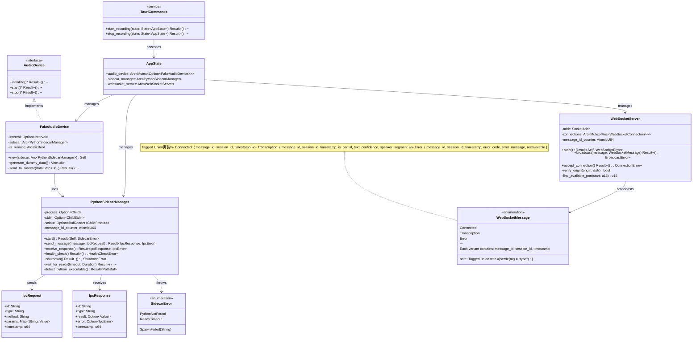

### State Machine: Python Sidecar Lifecycle

#[[file:docs/uml/meeting-minutes-core/stm/CORE-STM-001_python_sidecar_lifecycle.puml]]

**主要クラスの責務**:

- **AudioDevice trait**: 音声デバイスの共通インターフェース。MVP1でRealAudioDeviceへの置き換えを容易化
- **FakeAudioDevice**: 100ms間隔で16バイトのダミーデータを生成し、Pythonサイドカーに送信
- **PythonSidecarManager**: Pythonプロセスのライフサイクル管理（起動/終了/ヘルスチェック/IPC通信）
- **WebSocketServer**: Chrome拡張とのWebSocket接続管理とメッセージブロードキャスト
- **AppState**: アプリケーション全体の状態管理（Tauriの状態管理機構）
- **TauriCommands**: フロントエンドからのコマンド受信とバックエンドロジック呼び出し

---

### Python Layer Class Diagram

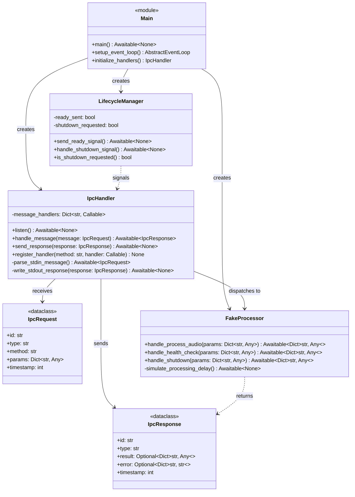

**主要クラスの責務**:

- **IpcHandler**: stdin/stdoutからのJSON IPC通信を管理。メッセージディスパッチとエラーハンドリング
- **FakeProcessor**: `process_audio`メッセージを受信し、固定文字列を返却。100ms遅延シミュレーション
- **LifecycleManager**: プロセスライフサイクル管理（ready通知、shutdown処理）
- **IpcRequest/IpcResponse**: IPC通信のメッセージ型定義（umbrella spec準拠）

---

### Chrome Extension Layer Class Diagram

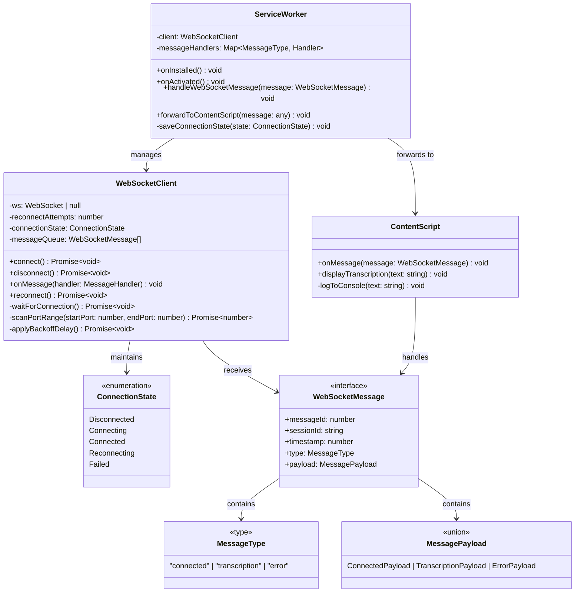

**主要クラスの責務**:

- **WebSocketClient**: WebSocket接続管理（接続/切断/再接続/ポートスキャン）
- **ServiceWorker**: Chrome拡張のバックグラウンドプロセス。WebSocketClientを管理しメッセージをContent Scriptに転送
- **ContentScript**: コンソールへの文字起こし結果表示（Walking Skeleton段階）
- **ConnectionState**: WebSocket接続状態の列挙型

---

### Component Interaction Diagram

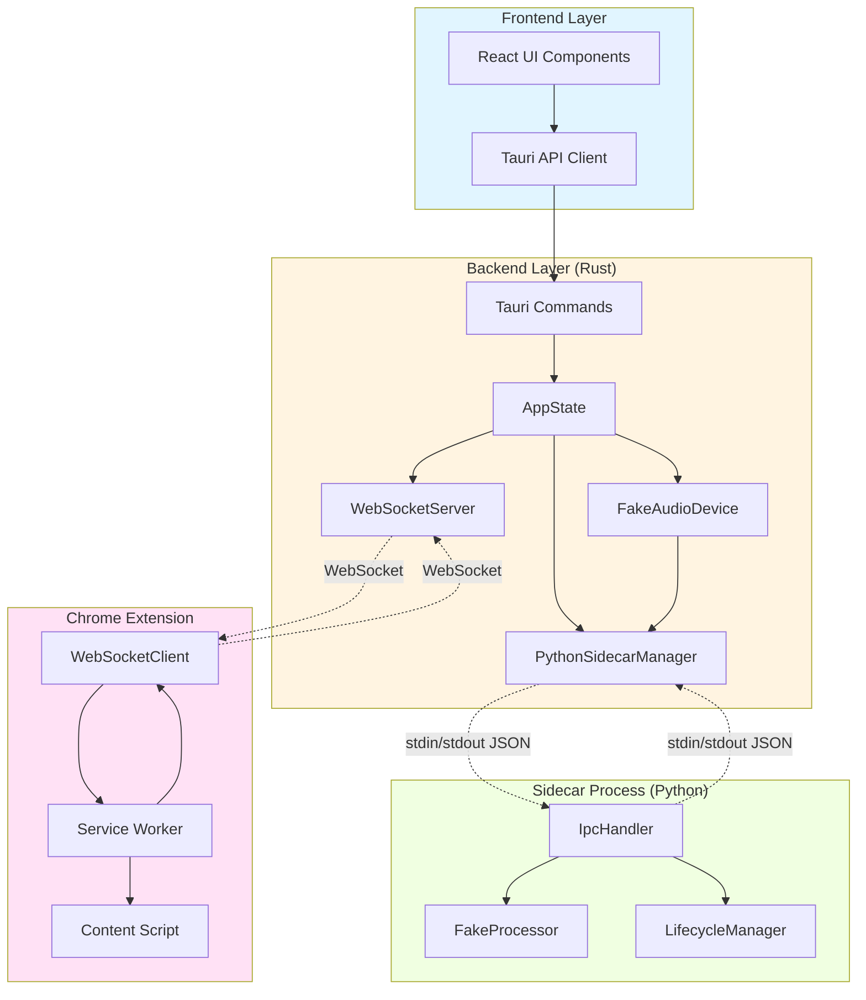

**コンポーネント間の通信パターン**:

- **Frontend ↔ Backend**: Tauri IPC（`invoke()` API）
- **Backend ↔ Sidecar**: stdin/stdout JSON IPC（プロセス間通信）
- **Backend ↔ Extension**: WebSocket（`ws://localhost:9001-9100`）
- **Extension Internal**: Chrome Message Passing（Service Worker ↔ Content Script）

---

### Detailed Sequence Diagram: Class-Level Interactions

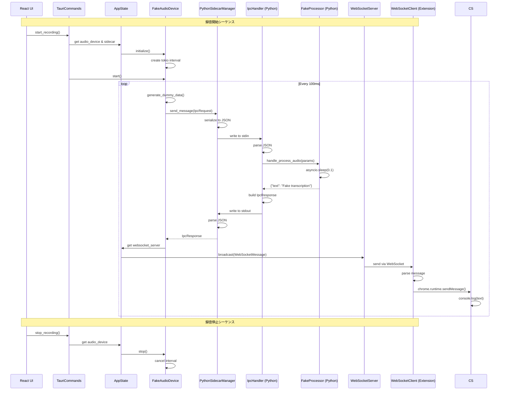

**シーケンスのポイント**:

- **非同期処理**: tokio::Interval（Rust）とasyncio（Python）による非同期ダミーデータ生成
- **IPC通信**: 各メッセージに一意のIDを付与し、リクエスト-レスポンス対応付け
- **WebSocketブロードキャスト**: 全接続クライアントに同時配信
- **エラーハンドリング**: 各層でResult/Optionによる明示的エラー処理

---

### Module Dependency Graph

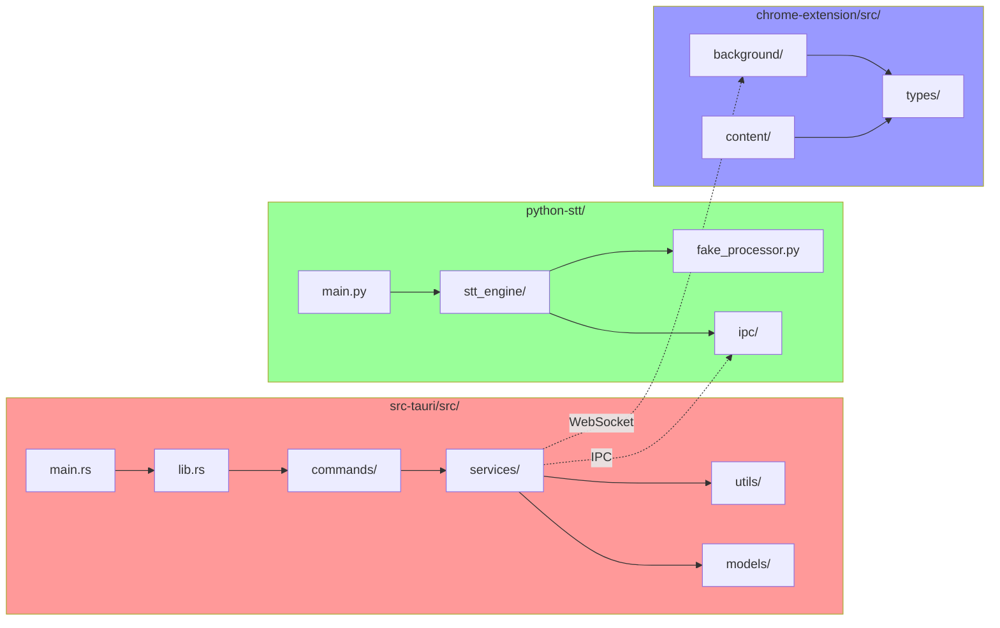

**モジュール依存関係のルール**:

- **Rust**: `main.rs` → `lib.rs` → `commands/` → `services/` → `models/utils/`（レイヤード依存）
- **Python**: `main.py` → `stt_engine/` → `ipc/` + `fake_processor.py`（モジュール分離）
- **Chrome Extension**: `background/` + `content/` → `types/`（型定義共有）
- **プロセス間**: 疎結合（IPC/WebSocketのみで通信）

---

## Technology Stack and Design Decisions

### Tauri Frontend

**選定技術**:
- **Framework**: Tauri 2.0
- **Frontend**: React 18 + TypeScript 5
- **State Management**: 状態管理ライブラリは使用しない（Walking Skeleton段階では不要）
- **UI Library**: 標準HTML/CSSのみ（録音開始/停止ボタンのみの最小UI）

**選定理由**:
- Tauri 2.0のRaw Payloads対応により、後続MVPでの大容量音声データ転送が効率化
- Reactは umbrella spec で定義された標準フロントエンドフレームワーク
- Walking Skeleton段階では複雑な状態管理は不要

**代替案**:
- Electron: メモリ使用量とセキュリティの課題により却下
- Vanilla JS: TypeScriptによる型安全性を優先し却下

---

### Rust Backend (Tauri Core)

**選定技術**:
- **Runtime**: Tauri 2.0 Core
- **Dependencies**:
  ```toml
  [dependencies]
  tauri = { version = "2.0", features = ["window-create", "notification"] }
  tokio = { version = "1.0", features = ["full"] }
  serde = { version = "1.0", features = ["derive"] }
  serde_json = "1.0"
  uuid = { version = "1.0", features = ["v4"] }
  tokio-tungstenite = "0.20"  # WebSocketサーバー
  base64 = "0.21"             # 音声データエンコーディング
  ```

**選定理由**:
- Tauri 2.0のセキュリティモデル（最小権限の原則）に準拠
- tokioの非同期ランタイムで複数プロセス管理を効率化
- tokio-tungsten iteはTauri公式推奨のWebSocket実装

**代替案**:
- async-std: tokioエコシステムの成熟度を優先し却下
- ws-rs: メンテナンス状況を考慮し却下

---

### Python Sidecar

**選定技術**:
- **Python Version**: 3.9以降
- **Dependencies**:
  ```txt
  # requirements.txt (Walking Skeleton段階)
  # 注: 外部ライブラリは使用しない（標準ライブラリのみ）
  ```

**選定理由**:
- 標準ライブラリ（`json`, `sys`, `asyncio`）のみでIPC通信を実装し、依存関係を最小化
- MVP1でfaster-whisper導入時のセットアップ簡易化

**代替案**:
- PyO3/Rust統合: IPC境界の明確化とプロセス独立性を優先し却下
- WebSocket IPC: stdin/stdoutの軽量性とシンプルさを優先し却下

---

### Chrome Extension

**選定技術**:
- **Manifest Version**: V3 (Chrome 116以降)
- **Backend**: Service Worker (JavaScript)
- **Dependencies**:
  ```json
  {
    "dependencies": {}  // 外部ライブラリ不使用
  }
  ```

**選定理由**:
- Manifest V3はChrome 116以降の必須要件
- Walking Skeleton段階ではReactビルドは不要（Vanilla JSで十分）

**代替案**:
- Firefox WebExtension: Chrome優先で開発し後で移植する方針により却下

---

## Key Design Decisions

### 決定1: Pythonサイドカーパターン vs PyO3統合

**Context**: 音声処理をRustバイナリに統合するか、独立したPythonプロセスとして起動するかの選択

**Alternatives**:
1. **PyO3/Pyo3統合**: RustからPythonライブラリを直接呼び出し
2. **Pythonサイドカープロセス**: stdin/stdout IPC経由で独立プロセスとして起動
3. **WebSocket IPC**: Python HTTPサーバーを起動しWebSocketで通信

**Selected Approach**: Pythonサイドカーパターン（stdin/stdout IPC）

**Rationale**:
- **プロセス境界の明確化**: Pythonプロセスのクラッシュがタウリアプリに波及しない
- **開発効率**: Python側の開発・テストがRustビルドから独立
- **リソース管理**: Pythonプロセスの異常終了時に明確な検知・回復シーケンスを実装可能
- **エコシステム活用**: faster-whisper等のPythonエコシステムを素直に利用

**Trade-offs**:
- **獲得**: プロセス独立性、エラー隔離、開発効率
- **犠牲**: IPC通信オーバーヘッド（~10-50ms）、プロセス管理の複雑性

---

### 決定2: stdin/stdout IPC vs WebSocket IPC

**Context**: Tauri-Python間の通信メカニズムの選択

**Alternatives**:
1. **stdin/stdout JSON IPC**: 標準入出力経由のJSON通信
2. **WebSocket IPC**: PythonでHTTPサーバーを起動しWebSocket通信
3. **Unix Domain Socket**: ファイルシステムベースのソケット通信

**Selected Approach**: stdin/stdout JSON IPC

**Rationale**:
- **シンプルさ**: プロセス起動時にstdin/stdoutが自動接続、ポート管理不要
- **クロスプラットフォーム**: Windows/macOS/Linuxで統一的に動作
- **セキュリティ**: ネットワークスタック不要、外部アクセス不可
- **軽量性**: HTTPサーバー起動オーバーヘッド不要

**Trade-offs**:
- **獲得**: シンプルさ、セキュリティ、クロスプラットフォーム互換性
- **犠牲**: 双方向通信の同期性（リクエスト-レスポンスパターンのみ）

---

### 決定3: WebSocketサーバーのポート割り当て戦略

**Context**: Chrome拡張がTauriアプリに接続するWebSocketポートの決定方法

**Alternatives**:
1. **固定ポート（9001）**: 常にポート9001を使用
2. **動的ポート割り当て + ファイル共有**: 利用可能ポートを割り当て、ポート番号をファイルに記録
3. **ポート範囲スキャン（9001-9100）**: 利用可能なポートを範囲内で探索し、固定範囲で再試行

**Selected Approach**: ポート範囲スキャン（9001-9100）

**Rationale**:
- **ポート競合回避**: 他アプリケーションが9001を使用中でも自動フォールバック
- **ファイル共有不要**: Chrome拡張がポート範囲を順次試行するだけで接続可能
- **デバッグ容易性**: ログに実際のポート番号を記録

**Trade-offs**:
- **獲得**: ポート競合の自動解決、実装シンプルさ
- **犠牲**: Chrome拡張の接続試行回数増加（最大100回）

---

## System Flows

### E2E疎通確認フロー

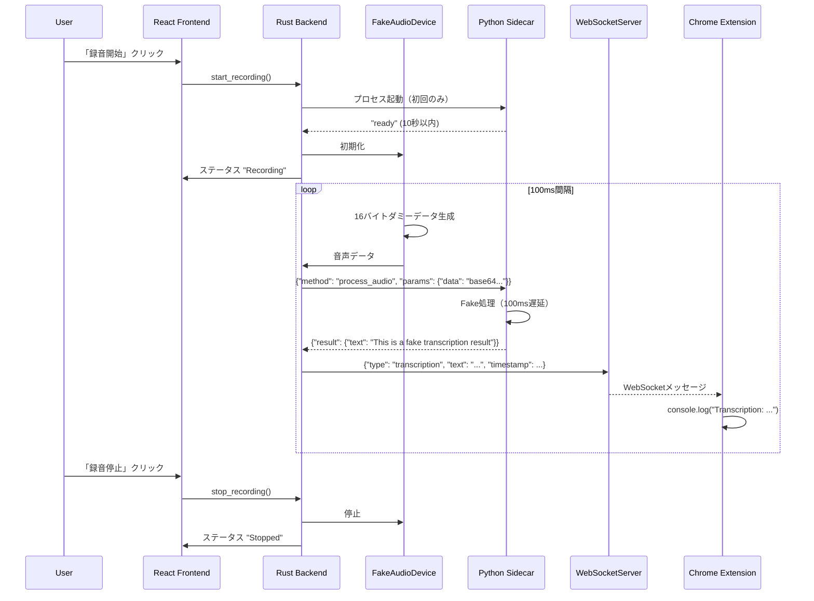

---

### Pythonサイドカー起動/終了フロー

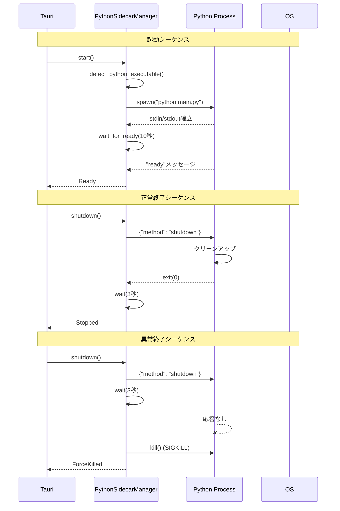

---

### WebSocket再接続フロー

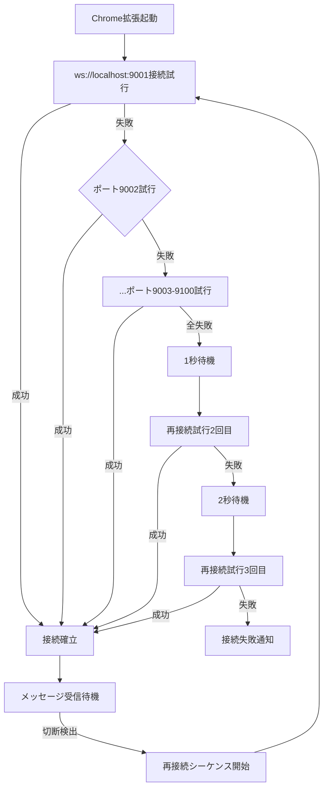

---

## Requirements Traceability

| Requirement | 要件概要 | Components | Interfaces | Flows |
|-------------|---------|------------|------------|-------|
| 1.1-1.6 | Tauriアプリスケルトン | React Frontend, Rust Backend | `start_recording()`, `stop_recording()` | E2E疎通確認フロー |
| 2.1-2.4 | Fake音声録音 | FakeAudioDevice | `initialize()`, `generate_dummy_data()`, `stop()` | E2E疎通確認フロー |
| 3.1-3.7 | Pythonサイドカー管理 | PythonSidecarManager | `start()`, `shutdown()`, `health_check()` | Pythonサイドカー起動/終了フロー |
| 4.1-4.7 | JSON IPC通信 | IPC Handler (Python), PythonSidecarManager | `send_message()`, `receive_response()` | E2E疎通確認フロー |
| 5.1-5.4 | Fake音声処理 | Fake Processor (Python) | `handle_process_audio()` | E2E疎通確認フロー |
| 6.1-6.6 | WebSocketサーバー | WebSocketServer | `start()`, `broadcast()` | E2E疎通確認フロー |
| 7.1-7.7 | Chrome拡張スケルトン | Service Worker, Content Script | `connect()`, `on_message()` | WebSocket再接続フロー |
| 8.1-8.4 | E2E疎通確認 | 全コンポーネント | 全インターフェース | E2E疎通確認フロー |

---

## Components and Interfaces

### Tauri Frontend Layer

#### React Frontend

**Responsibility & Boundaries**:
- **Primary Responsibility**: 録音開始/停止ボタンを表示し、ユーザー操作をRustバックエンドコマンドに変換
- **Domain Boundary**: UI層のみ（ビジネスロジックなし）
- **Data Ownership**: 録音ステータス（"Recording", "Stopped"）の表示状態のみ
- **Transaction Boundary**: なし（ステートレス）

**Dependencies**:
- **Inbound**: なし（ユーザー操作のみ）
- **Outbound**: Rust Backend (Tauri Commands)
- **External**: Tauri API (`invoke`)

**Contract Definition**:

```typescript
// Tauri Command呼び出しインターフェース
interface RecordingCommands {
  startRecording(): Promise<void>;
  stopRecording(): Promise<void>;
}

// ステータス更新イベント
interface RecordingStatusEvent {
  status: "Recording" | "Stopped";
  timestamp: number;
}
```

- **Preconditions**: Tauriアプリが起動済み
- **Postconditions**: コマンド呼び出し成功後、ステータスイベントを受信
- **Invariants**: ステータスは"Recording"または"Stopped"のいずれか

---

### Rust Backend Layer

#### FakeAudioDevice

**Responsibility & Boundaries**:
- **Primary Responsibility**: 100ms間隔で16バイトのダミー音声データを生成し、Pythonサイドカーに送信
- **Domain Boundary**: 音声デバイス抽象化層
- **Data Ownership**: ダミー音声データ（メモリ内保持のみ）
- **Transaction Boundary**: なし（ステートレス）

**Dependencies**:
- **Inbound**: Rust Backend (start_recording/stop_recording)
- **Outbound**: PythonSidecarManager
- **External**: tokio interval timer

**Contract Definition**:

```rust
pub trait AudioDevice: Send + Sync {
    async fn initialize(&mut self) -> Result<()>;
    async fn start(&mut self) -> Result<()>;
    async fn stop(&mut self) -> Result<()>;
}

pub struct FakeAudioDevice {
    interval: Option<tokio::time::Interval>,
    sidecar: Arc<PythonSidecarManager>,
}

impl FakeAudioDevice {
    /// 100ms間隔でダミー音声データを生成
    /// - データ: [0u8; 16] (16バイトのゼロ配列)
    /// - エンコーディング: Base64
    async fn generate_dummy_data(&self) -> Vec<u8> {
        vec![0u8; 16]
    }
}
```

- **Preconditions**: `initialize()`が呼び出し済み
- **Postconditions**: `start()`後、100ms間隔でPythonサイドカーに音声データ送信
- **Invariants**: 録音中は必ず100ms間隔でデータ生成

---

#### PythonSidecarManager

**Responsibility & Boundaries**:
- **Primary Responsibility**: Pythonプロセスのライフサイクル管理（起動/終了/ヘルスチェック/異常時回復）
- **Domain Boundary**: プロセス管理層
- **Data Ownership**: Pythonプロセスハンドル、stdin/stdoutストリーム
- **Transaction Boundary**: プロセス起動/終了のアトミック性保証

**Dependencies**:
- **Inbound**: FakeAudioDevice, Rust Backend
- **Outbound**: Python Process (stdin/stdout)
- **External**: tokio Process, OS

**Contract Definition**:

```rust
pub struct PythonSidecarManager {
    process: Option<Child>,
    stdin: Option<ChildStdin>,
    stdout: Option<BufReader<ChildStdout>>,
}

impl PythonSidecarManager {
    /// Pythonプロセスを起動し、"ready"メッセージ待機（10秒タイムアウト）
    pub async fn start() -> Result<Self, SidecarError>;

    /// JSON IPC メッセージ送信
    /// - タイムアウト: 5秒
    /// - リトライ: なし
    pub async fn send_message(&mut self, message: IpcRequest) -> Result<IpcResponse, IpcError>;

    /// ヘルスチェック（3回連続失敗で異常検知）
    pub async fn health_check(&mut self) -> Result<(), HealthCheckError>;

    /// Graceful shutdown（3秒タイムアウト後に強制終了）
    pub async fn shutdown(&mut self) -> Result<(), ShutdownError>;
}

// エラー型定義
#[derive(Debug, thiserror::Error)]
pub enum SidecarError {
    #[error("Python executable not found")]
    PythonNotFound,
    #[error("Process spawn failed: {0}")]
    SpawnFailed(String),
    #[error("Ready timeout (10s exceeded)")]
    ReadyTimeout,
}
```

- **Preconditions**: Python 3.9以降がシステムにインストール済み
- **Postconditions**: `start()`成功後、Pythonプロセスが"Ready"状態
- **Invariants**: プロセスハンドルがSome()の間、stdin/stdoutストリームは有効

#### Python Interpreter Detection Policy

**目的**: クロスプラットフォーム環境で適切なPythonインタープリタを自動検出し、プロセス起動失敗を最小化する。

**サポート対象バージョン**: `3.9 ≤ version < 3.13`
- Walking Skeleton段階では Python 3.9-3.12 を検証対象とする
- 将来的なPython 3.13以降への拡張を考慮した設計

**検出ポリシーの基本方針**:

1. **対象バージョンの明示**: Python 3.9以上、3.13未満をサポート対象とし、未検証バージョンによる予期せぬ動作を防止
2. **ネイティブアーキテクチャ優先**: 64bit環境では64bitインタープリタを優先
3. **ユーザー設定の尊重**: 明示的に設定されたパスや環境変数を最優先
4. **仮想環境の優先使用**: アクティブな仮想環境のインタープリタを自動的に使用
5. **py.exeランチャー活用（Windows）**: Windowsでは`py.exe`ランチャーによる自動検出を利用

**検出アルゴリズム（優先順位順）**:

##### 1. 明示設定または環境変数
- 設定ファイル（`config.json`）または環境変数（`APP_PYTHON`）にインタープリタパスが明示されている場合、そのパスを検証して使用
- 該当パスが存在しないか、バージョン範囲外の場合はエラーを返し、ユーザーに設定修正を促す

##### 2. アクティブな仮想環境の検出
- `VIRTUAL_ENV`または`CONDA_PREFIX`が設定されている場合、そのパスの`python`実行ファイルを検証
- バージョン範囲内（`3.9 ≤ version < 3.13`）であれば、そのインタープリタを利用

##### 3. Windows環境: py.exeによる検出
1. `py.exe`が存在する場合、`py -0p`を実行してインストール済みPythonのバージョンと実体パスを取得
2. 出力リストから、サポート範囲（`3.9 ≤ version < 3.13`）かつ64bitアーキテクチャのものを抽出
3. 最も新しいマイナーバージョンを選択（例: 3.12 > 3.11 > 3.10 > 3.9）
4. 該当バージョンが存在しない場合は次の手順へ

##### 4. POSIX系OS: PATHのスキャン
1. `which python3.12`, `python3.11`, `python3.10`, `python3.9`の順で検索
2. 見つかったインタープリタに対して`python -c "import sys; print(sys.version_info)"`を実行し、バージョンを確認
3. バージョンが範囲内かつ64bitであることを確認（`platform.machine()`でアーキテクチャ検証）
4. 条件を満たすものがあれば採用

##### 5. 最終手段: グローバルなpython3/pythonの使用
- 上記手順で検出できない場合、`python3`や`python`コマンドを試行し、バージョン確認
- サポート範囲外ならエラー報告し、ユーザーに環境整備を案内

##### 6. バージョン検証とキャッシュ
- 候補のバージョンは`3.9 ≤ version < 3.13`であること、ネイティブアーキテクチャ（64bit）であることをチェック
- 採用したインタープリタは24時間キャッシュし、次回起動時に再検証するまで使用
- 検証コマンド: `python -c "import sys, platform; print(sys.version_info, platform.machine())"`

**プラットフォーム固有の注意点**:

**Windows**:
- **Microsoft Store版Python**: `py.exe`はStore版を検出するが、従来のインストーラ版を優先。Store版は権限制約がありサイドカー用途に不適な場合がある
- **環境変数PY_PYTHON**: `PY_PYTHON=3.10`等でデフォルトバージョンを強制指定可能
- **32bit/64bit共存**: `py.exe`は常に64bitを優先。逆転させる場合は`-32`/`-64`サフィックスを使用

**macOS/Linux**:
- **pythonとpython3の違い**: `python`コマンドが2.x系を指す場合があるため、必ず`python3.X`を優先検索
- **Apple Silicon**: `platform.machine()`が`arm64`であることを確認し、Intelバイナリではなくネイティブ版を選択

**エラーコード体系**:

```rust
#[derive(Debug, thiserror::Error)]
pub enum PythonDetectionError {
    #[error("Python interpreter not found in PATH or standard locations")]
    PythonNotFound,

    #[error("Python version {found} is outside supported range (3.9 <= version < 3.13)")]
    VersionMismatch { found: String },

    #[error("Python architecture {found} does not match system (expected 64-bit)")]
    ArchitectureMismatch { found: String },

    #[error("Configured Python path does not exist: {path}")]
    ConfiguredPathInvalid { path: PathBuf },

    #[error("Python validation command failed: {0}")]
    ValidationFailed(String),
}
```

**実装例**:

```rust
impl PythonSidecarManager {
    async fn detect_python_executable() -> Result<PathBuf, PythonDetectionError> {
        let supported_versions = vec![
            (3, 9), (3, 10), (3, 11), (3, 12)
        ];

        // 1. 明示設定
        if let Ok(configured_path) = env::var("APP_PYTHON") {
            if Self::validate_python(&configured_path, &supported_versions).await? {
                return Ok(PathBuf::from(configured_path));
            }
        }

        // 2. 仮想環境
        if let Ok(venv_path) = env::var("VIRTUAL_ENV")
            .or_else(|_| env::var("CONDA_PREFIX"))
        {
            let python_path = if cfg!(windows) {
                PathBuf::from(&venv_path).join("Scripts").join("python.exe")
            } else {
                PathBuf::from(&venv_path).join("bin").join("python")
            };

            if Self::validate_python(&python_path, &supported_versions).await? {
                return Ok(python_path);
            }
        }

        // 3. Windows: py.exe
        #[cfg(target_os = "windows")]
        {
            if let Ok(candidates) = Self::query_py_launcher(&supported_versions).await {
                if let Some(best) = candidates.into_iter().max_by_key(|(ver, _)| *ver) {
                    return Ok(best.1);
                }
            }
        }

        // 4. PATH スキャン
        for name in &["python3.12", "python3.11", "python3.10", "python3.9", "python3", "python"] {
            if let Ok(path) = which::which(name) {
                if Self::validate_python(&path, &supported_versions).await? {
                    return Ok(path);
                }
            }
        }

        Err(PythonDetectionError::PythonNotFound)
    }

    async fn validate_python(
        path: &Path,
        supported_versions: &[(u32, u32)]
    ) -> Result<bool, PythonDetectionError> {
        let output = Command::new(path)
            .arg("-c")
            .arg("import sys, platform; print(f'{sys.version_info.major}.{sys.version_info.minor}', platform.machine())")
            .output()
            .await
            .map_err(|e| PythonDetectionError::ValidationFailed(e.to_string()))?;

        let stdout = String::from_utf8_lossy(&output.stdout);
        let parts: Vec<&str> = stdout.trim().split_whitespace().collect();

        if parts.len() != 2 {
            return Ok(false);
        }

        // バージョン検証
        let version_parts: Vec<u32> = parts[0]
            .split('.')
            .filter_map(|s| s.parse().ok())
            .collect();

        if version_parts.len() != 2 {
            return Ok(false);
        }

        let version = (version_parts[0], version_parts[1]);
        if !supported_versions.contains(&version) {
            return Err(PythonDetectionError::VersionMismatch {
                found: parts[0].to_string(),
            });
        }

        // アーキテクチャ検証（64bit推奨）
        let arch = parts[1];
        if !arch.contains("64") && !arch.contains("x86_64") && !arch.contains("arm64") {
            log::warn!("Python architecture {} is not 64-bit (may cause issues)", arch);
        }

        Ok(true)
    }

    #[cfg(target_os = "windows")]
    async fn query_py_launcher(
        supported_versions: &[(u32, u32)]
    ) -> Result<Vec<((u32, u32), PathBuf)>, PythonDetectionError> {
        let output = Command::new("py")
            .arg("-0p")
            .output()
            .await
            .map_err(|e| PythonDetectionError::ValidationFailed(e.to_string()))?;

        let stdout = String::from_utf8_lossy(&output.stdout);
        let mut candidates = Vec::new();

        for line in stdout.lines() {
            // Parse output like: " -3.10-64        C:\Python310\python.exe"
            if let Some((ver_part, path_part)) = line.split_once(' ') {
                let ver_str = ver_part.trim().trim_start_matches('-');
                if let Some(version) = parse_version(ver_str) {
                    if supported_versions.contains(&version) && ver_part.contains("64") {
                        candidates.push((version, PathBuf::from(path_part.trim())));
                    }
                }
            }
        }

        Ok(candidates)
    }
}
```

**ユーザーへのエラーメッセージ**:

検出失敗時のエラー通知（UI表示）:

```
❌ Python 3.9以降が見つかりません

以下のいずれかの方法で問題を解決してください：

1. Python 3.9-3.12 をインストール
   - Windows: https://www.python.org/downloads/
   - macOS: brew install python@3.10
   - Linux: sudo apt install python3.10

2. 環境変数で明示的にパスを指定
   APP_PYTHON=/path/to/python3.10

3. 設定ファイルでパスを指定
   config.json に "python_path": "/path/to/python" を追加

詳細: [ログファイルへのパス]
```

---

#### WebSocketServer

**Responsibility & Boundaries**:
- **Primary Responsibility**: Chrome拡張とのWebSocket接続を確立し、文字起こし結果をブロードキャスト
- **Domain Boundary**: 通信層（WebSocket）
- **Data Ownership**: WebSocket接続リスト
- **Transaction Boundary**: メッセージブロードキャストのアトミック性保証

**Dependencies**:
- **Inbound**: Rust Backend, PythonSidecarManager
- **Outbound**: Chrome Extension
- **External**: tokio-tungstenite

**Contract Definition**:

```rust
pub struct WebSocketServer {
    addr: SocketAddr,
    connections: Arc<Mutex<Vec<WebSocketConnection>>>,
}

impl WebSocketServer {
    /// ポート9001-9100範囲で利用可能なポートを探索して起動
    pub async fn start() -> Result<Self, WebSocketError>;

    /// 全接続クライアントにメッセージブロードキャスト
    pub async fn broadcast(&self, message: WebSocketMessage) -> Result<(), BroadcastError>;

    /// 新規接続受け入れ
    pub async fn accept_connection(&mut self) -> Result<(), ConnectionError>;

    /// Origin検証実装（開発環境と本番環境で切り替え）
    fn verify_origin(&self, origin: &str) -> bool {
        // 基本的な許可リスト
        if origin.starts_with("http://127.0.0.1")
           || origin.starts_with("http://localhost") {
            return true;
        }

        // Chrome拡張のOrigin検証
        if origin.starts_with("chrome-extension://") {
            // 開発環境: すべての拡張IDを許可
            #[cfg(debug_assertions)]
            return true;

            // 本番環境: 設定ファイルの拡張IDリストと照合
            #[cfg(not(debug_assertions))]
            return self.allowed_extension_ids.contains(&extract_extension_id(origin));
        }

        false
    }
}

// WebSocketメッセージ型（Tagged Union形式）
#[derive(Debug, Serialize, Deserialize)]
#[serde(tag = "type", rename_all = "camelCase")]
pub enum WebSocketMessage {
    Connected {
        #[serde(rename = "messageId")]
        message_id: u64,
        #[serde(rename = "sessionId")]
        session_id: String,
        timestamp: u64,
    },
    Transcription {
        #[serde(rename = "messageId")]
        message_id: u64,
        #[serde(rename = "sessionId")]
        session_id: String,
        timestamp: u64,
        #[serde(rename = "isPartial")]
        is_partial: bool,
        text: String,
        confidence: f32,
        #[serde(rename = "speakerSegment")]
        speaker_segment: u32,
    },
    Error {
        #[serde(rename = "messageId")]
        message_id: u64,
        #[serde(rename = "sessionId")]
        session_id: String,
        timestamp: u64,
        #[serde(rename = "errorCode")]
        error_code: String,
        #[serde(rename = "errorMessage")]
        error_message: String,
        recoverable: bool,
    },
}
```

- **Preconditions**: ポート9001-9100範囲が部分的に利用可能
- **Postconditions**: `start()`成功後、Chrome拡張が接続可能
- **Invariants**: 接続リストは常に最新状態（切断時に自動削除）

---

### Python Sidecar Layer

#### IPC Handler

**Responsibility & Boundaries**:
- **Primary Responsibility**: stdin/stdout JSON通信の受信・応答処理、メッセージディスパッチ
- **Domain Boundary**: IPC通信層
- **Data Ownership**: メッセージキュー（stdin/stdoutバッファ）
- **Transaction Boundary**: メッセージ単位のアトミック性保証

**Dependencies**:
- **Inbound**: PythonSidecarManager (stdin)
- **Outbound**: Fake Processor, PythonSidecarManager (stdout)
- **External**: Python標準ライブラリ (json, sys, asyncio)

**Contract Definition**:

```python
# IPC メッセージ型定義（umbrella spec準拠）
class IpcRequest(TypedDict):
    id: str              # UUID v4
    type: str            # "request"
    method: str          # "process_audio" | "health_check" | "shutdown"
    params: Dict[str, Any]
    timestamp: int

class IpcResponse(TypedDict):
    id: str              # 対応するリクエストのID
    type: str            # "response"
    result: Optional[Dict[str, Any]]
    error: Optional[Dict[str, str]]
    timestamp: int

class IpcHandler:
    async def listen(self) -> None:
        """stdinからメッセージを受信し、メソッドディスパッチ"""
        pass

    async def handle_message(self, message: IpcRequest) -> IpcResponse:
        """メッセージタイプに基づいてハンドラ呼び出し"""
        pass

    async def send_response(self, response: IpcResponse) -> None:
        """stdoutにJSON応答を出力"""
        pass
```

- **Preconditions**: Pythonプロセスが起動済み
- **Postconditions**: メッセージ受信後、対応するhandlerを呼び出しレスポンス送信
- **Invariants**: stdinから読み取ったメッセージは必ずパース成功またはエラーレスポンス送信

---

#### Fake Processor

**Responsibility & Boundaries**:
- **Primary Responsibility**: `process_audio`メッセージを受信し、固定文字列"This is a fake transcription result"を返却
- **Domain Boundary**: 音声処理ロジック層
- **Data Ownership**: なし（ステートレス）
- **Transaction Boundary**: なし

**Dependencies**:
- **Inbound**: IPC Handler
- **Outbound**: IPC Handler
- **External**: asyncio (100ms遅延シミュレーション)

**Contract Definition**:

```python
class FakeProcessor:
    async def handle_process_audio(self, params: Dict[str, Any]) -> Dict[str, Any]:
        """
        音声データを受信し、Fake文字起こし結果を返却

        Args:
            params: {"data": "base64-encoded-audio"}

        Returns:
            {"text": "This is a fake transcription result"}

        Processing:
            1. Base64デコード（実際には使用しない）
            2. 100ms遅延（asyncio.sleep(0.1)）
            3. 固定文字列返却
        """
        await asyncio.sleep(0.1)  # Fake処理時間シミュレーション
        return {"text": "This is a fake transcription result"}
```

- **Preconditions**: `params`に`data`フィールドが存在
- **Postconditions**: 100ms後に固定文字列を含む結果を返却
- **Invariants**: 常に同じ文字列を返却

---

### Chrome Extension Layer

#### Service Worker

**Responsibility & Boundaries**:
- **Primary Responsibility**: WebSocket接続確立・維持、メッセージ受信・Content Scriptへの転送
- **Domain Boundary**: Chrome拡張バックグラウンド処理層
- **Data Ownership**: WebSocket接続状態、最終受信メッセージID
- **Transaction Boundary**: メッセージ受信からContent Script転送までのアトミック性保証

**Dependencies**:
- **Inbound**: Tauri WebSocketServer
- **Outbound**: Content Script
- **External**: Chrome Extension API (chrome.storage.local, chrome.runtime)

**Contract Definition**:

```typescript
// Service Worker WebSocketクライアント
class WebSocketClient {
  private ws: WebSocket | null = null;
  private reconnectAttempts: number = 0;

  async connect(): Promise<void> {
    // ポート9001-9100を順次試行
    for (let port = 9001; port <= 9100; port++) {
      try {
        this.ws = new WebSocket(`ws://localhost:${port}`);
        await this.waitForConnection();
        break;
      } catch (error) {
        // 次のポートを試行
      }
    }
  }

  private async waitForConnection(): Promise<void> {
    // 接続確立待機（1秒タイムアウト）
  }

  onMessage(handler: (message: WebSocketMessage) => void): void {
    this.ws.onmessage = (event) => {
      const message = JSON.parse(event.data);
      handler(message);
    };
  }

  // 再接続シーケンス（Requirement 7.4準拠）
  async reconnect(): Promise<void> {
    const backoffDelays = [0, 1000, 2000, 4000, 8000];  // 0秒、1秒、2秒、4秒、8秒
    if (this.reconnectAttempts >= 5) {
      // 5回連続失敗で接続失敗通知
      chrome.notifications.create({
        type: 'basic',
        title: '接続エラー',
        message: 'Tauriアプリへの接続に失敗しました。'
      });
      return;
    }
    await new Promise(resolve => setTimeout(resolve, backoffDelays[this.reconnectAttempts]));
    this.reconnectAttempts++;
    await this.connect();
  }
}
```

- **Preconditions**: Chrome 116以降、Manifest V3準拠
- **Postconditions**: WebSocket接続確立後、メッセージ受信可能
- **Invariants**: 接続状態が`chrome.storage.local`に永続化

---

#### Content Script

**Responsibility & Boundaries**:
- **Primary Responsibility**: Service Workerから受信したメッセージをコンソールに表示
- **Domain Boundary**: Chrome拡張コンテンツスクリプト層
- **Data Ownership**: なし（表示のみ）
- **Transaction Boundary**: なし

**Dependencies**:
- **Inbound**: Service Worker
- **Outbound**: Browser Console
- **External**: console API

**Contract Definition**:

```typescript
// Content Script メッセージハンドラ
chrome.runtime.onMessage.addListener((message: WebSocketMessage) => {
  if (message.msg_type === 'Transcription') {
    console.log(`Transcription: ${message.payload.text}`);
  }
});
```

- **Preconditions**: Service Workerが起動済み
- **Postconditions**: メッセージ受信後、コンソールに表示
- **Invariants**: なし（ステートレス）

---

## Data Models

Walking Skeleton段階では、データ永続化を行わないため、メモリ内データ構造のみを定義します。

### Domain Model

**Core Concepts**:
- **RecordingSession**: 録音セッションの状態管理（"Recording", "Stopped"）
- **AudioChunk**: ダミー音声データの単位（16バイト）
- **FakeTranscription**: Fake処理結果の文字列

**Business Rules**:
- 録音セッションは同時に1つのみ存在
- 音声データは100ms間隔で生成
- 文字起こし結果は常に固定文字列

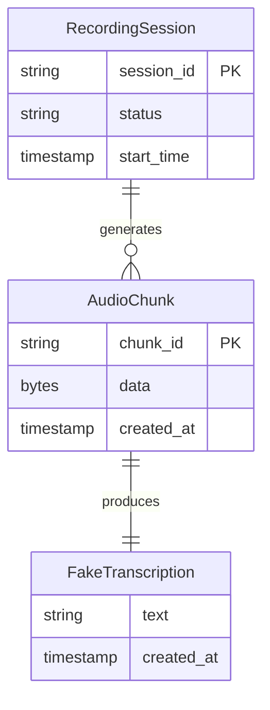

### Data Contracts & Integration

**IPC Request/Response** (`.kiro/specs/meeting-minutes-automator/design.md#IPC-JSON-Protocol`準拠):

```typescript
// Tauri → Python リクエスト
interface IpcRequest {
  id: string;                  // UUID v4
  type: 'request';
  method: 'process_audio' | 'health_check' | 'shutdown';
  params: Record<string, unknown>;
  timestamp: number;
}

// Python → Tauri レスポンス
interface IpcResponse {
  id: string;                  // 対応するリクエストのID
  type: 'response';
  result?: unknown;
  error?: {
    code: string;
    message: string;
  };
  timestamp: number;
}
```

**WebSocket Message** (Tagged Union形式):

```typescript
// TypeScript型定義（Chrome拡張側）
type WebSocketMessage =
  | {
      type: 'connected';
      messageId: number;
      sessionId: string;
      timestamp: number;
    }
  | {
      type: 'transcription';
      messageId: number;
      sessionId: string;
      timestamp: number;
      isPartial: boolean;          // Walking Skeleton段階では常にfalse
      text: string;
      confidence: number;          // Walking Skeleton段階では常に1.0
      speakerSegment: number;      // Walking Skeleton段階では常に0
    }
  | {
      type: 'error';
      messageId: number;
      sessionId: string;
      timestamp: number;
      errorCode: string;
      errorMessage: string;
      recoverable: boolean;
    };
```

**JSON出力例**:

```json
// Connected メッセージ
{
  "type": "connected",
  "messageId": 1,
  "sessionId": "550e8400-e29b-41d4-a716-446655440000",
  "timestamp": 1709481600000
}

// Transcription メッセージ
{
  "type": "transcription",
  "messageId": 2,
  "sessionId": "550e8400-e29b-41d4-a716-446655440000",
  "timestamp": 1709481600100,
  "isPartial": false,
  "text": "This is a fake transcription result",
  "confidence": 1.0,
  "speakerSegment": 0
}

// Error メッセージ
{
  "type": "error",
  "messageId": 3,
  "sessionId": "550e8400-e29b-41d4-a716-446655440000",
  "timestamp": 1709481600200,
  "errorCode": "PYTHON_PROCESS_FAILED",
  "errorMessage": "Python sidecar process exited unexpectedly",
  "recoverable": true
}
```

---

## Error Handling

### Error Strategy

Walking Skeleton段階では、基本的なエラー検知と通知のみを実装します。リトライロジックは最小限に留め、後続MVPで段階的に強化します。

### Error Categories and Responses

**User Errors** (操作エラー):
- **録音開始時にPythonプロセス起動失敗**: ユーザー通知「Pythonが見つかりません。Python 3.9以降をインストールしてください。」
- **Chrome拡張接続失敗**: コンソールエラー表示「Tauriアプリへの接続に失敗しました。」

**System Errors** (プロセス/通信エラー):
- **Pythonプロセス異常終了**: ログ記録 + ユーザー通知「音声処理プロセスが異常終了しました。」
- **WebSocket接続切断**: 自動再接続試行（最大5回）
- **JSON IPCパースエラー**: エラーログ記録 + メッセージスキップ（5回連続失敗でユーザー通知）

**Process Flow Visualization**:

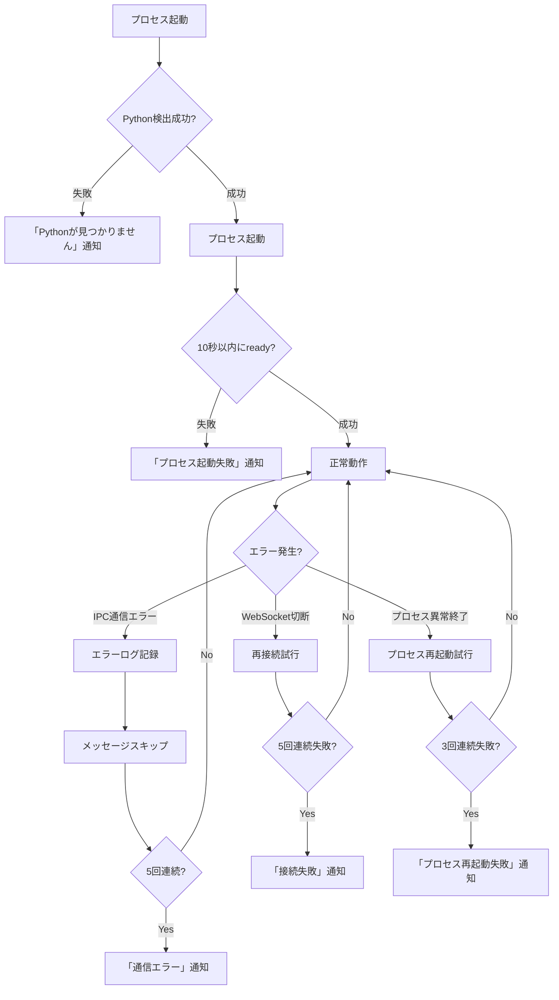

### Monitoring

**エラーログ記録**:
- **フォーマット**: 構造化JSON（`{"level": "ERROR", "component": "...", "event": "...", "error": "..."}`）
- **出力先**: `logs/app.log`（Walking Skeleton段階では標準エラー出力のみ）
- **ログレベル**: ERROR（重要なエラーのみ）

**ヘルスモニタリング**:
- **Pythonプロセスヘルスチェック**: 5秒間隔で`health_check`メッセージ送信
- **WebSocket接続状態**: Service Workerが接続状態を`chrome.storage.local`に記録

---

## Testing Strategy

### Unit Tests

**Rust Backend**:
- **UT-1.1**: `FakeAudioDevice::generate_dummy_data()` - 16バイトダミーデータ生成検証
- **UT-1.2**: `PythonSidecarManager::send_message()` - JSON IPC メッセージ送信検証
- **UT-1.3**: `WebSocketServer::broadcast()` - メッセージブロードキャスト検証
- **UT-1.4**: `detect_python_executable()` - Python検出パス検証（macOS/Windows/Linux）

**Python Sidecar**:
- **UT-2.1**: `IpcHandler::handle_message()` - メッセージディスパッチ検証
- **UT-2.2**: `FakeProcessor::handle_process_audio()` - Fake処理結果検証
- **UT-2.3**: JSON パースエラー時のエラーレスポンス検証

**Chrome Extension**:
- **UT-3.1**: `WebSocketClient::connect()` - ポート範囲スキャン検証
- **UT-3.2**: `WebSocketClient::reconnect()` - バックオフ戦略検証

### Integration Tests

**プロセス間通信**:
- **IT-1.1**: Tauri → Python IPC通信の双方向動作検証
- **IT-1.2**: Pythonプロセス起動/終了シーケンス検証
- **IT-1.3**: Pythonプロセス異常終了時の検知・回復検証

**WebSocket通信**:
- **IT-2.1**: Tauri ← → Chrome拡張 WebSocket接続確立検証
- **IT-2.2**: メッセージブロードキャスト検証
- **IT-2.3**: 接続切断時の再接続シーケンス検証

**クロスプラットフォーム**:
- **IT-3.1**: macOS/Windows/Linuxでのプロセス起動検証
- **IT-3.2**: macOS/Windows/Linuxでのポート割り当て検証

### E2E Tests

**Success Criteria準拠**:
- **E2E-1**: 全コンポーネント起動シーケンステスト（Tauri起動 → Python起動 → WebSocket起動 → Chrome拡張接続）
- **E2E-2**: 録音開始 → Fake処理 → WebSocket → Chrome拡張コンソール表示の全フローテスト
- **E2E-3**: クリーンアップシーケンステスト（録音停止 → Pythonプロセス終了 → WebSocket終了 → ゾンビプロセスなし）

**テストフレームワーク**:
- **Rust**: `cargo test` + `rstest`
- **Python**: `pytest`
- **Chrome Extension**: `vitest` + Playwright
- **E2E**: `tauri-driver` + WebDriver

---

### E2E Test Automation Strategy

Walking Skeleton実装の最重要Success Criteria「E2E疎通確認」を自動検証するための包括的なテスト戦略を定義します。

#### Test Execution Environments

| 環境 | 実行方法 | Chrome起動方式 | 備考 |
|------|---------|---------------|------|
| ローカル開発 | `pnpm run e2e` | 開発者のChrome拡張を使用 | デバッグ用途 |
| CI/CD (macOS) | GitHub Actions | Xcode付属Chromium | `macos-latest` |
| CI/CD (Windows) | GitHub Actions | Chocolatey経由Chrome | `windows-latest` |
| CI/CD (Linux) | GitHub Actions + Xvfb | ヘッドレスChrome | `ubuntu-latest` |

#### Chrome Extension Automated Installation

**オプションB（推奨）: Chrome起動フラグによる自動インストール**

```bash
# Chrome起動コマンド（E2Eテスト用）
chrome \
  --load-extension=./chrome-extension/build \
  --disable-extensions-except=./chrome-extension/build \
  --user-data-dir=/tmp/chrome-test-profile-$$ \
  --no-first-run \
  --no-default-browser-check \
  --remote-debugging-port=9222
```

**利点**:
- WebDriver APIの複雑な操作不要
- 拡張が確実にロードされる
- CI/CD環境でも安定動作

**実装例（Rust + WebDriver統合）**:

```rust
// tests/e2e/chrome_launcher.rs
use std::process::{Command, Stdio};
use std::path::PathBuf;

pub struct ChromeLauncher {
    process: Option<Child>,
    debugging_port: u16,
}

impl ChromeLauncher {
    pub async fn launch_with_extension() -> Result<Self> {
        let extension_path = PathBuf::from(env!("CARGO_MANIFEST_DIR"))
            .join("../chrome-extension/build");

        let temp_profile = format!("/tmp/chrome-test-profile-{}", std::process::id());

        let chrome_binary = Self::detect_chrome_binary()?;

        let mut process = Command::new(chrome_binary)
            .arg(format!("--load-extension={}", extension_path.display()))
            .arg(format!("--disable-extensions-except={}", extension_path.display()))
            .arg(format!("--user-data-dir={}", temp_profile))
            .arg("--no-first-run")
            .arg("--no-default-browser-check")
            .arg("--remote-debugging-port=9222")
            .stdout(Stdio::null())
            .stderr(Stdio::piped())
            .spawn()?;

        // Chrome起動待機（デバッグポートが応答するまで）
        tokio::time::sleep(Duration::from_secs(3)).await;

        Ok(Self {
            process: Some(process),
            debugging_port: 9222,
        })
    }

    fn detect_chrome_binary() -> Result<String> {
        #[cfg(target_os = "macos")]
        {
            let candidates = vec![
                "/Applications/Google Chrome.app/Contents/MacOS/Google Chrome",
                "/Applications/Chromium.app/Contents/MacOS/Chromium",
            ];
            candidates.into_iter()
                .find(|path| Path::new(path).exists())
                .ok_or_else(|| anyhow!("Chrome not found"))
                .map(String::from)
        }

        #[cfg(target_os = "windows")]
        {
            let candidates = vec![
                r"C:\Program Files\Google\Chrome\Application\chrome.exe",
                r"C:\Program Files (x86)\Google\Chrome\Application\chrome.exe",
            ];
            candidates.into_iter()
                .find(|path| Path::new(path).exists())
                .ok_or_else(|| anyhow!("Chrome not found"))
                .map(String::from)
        }

        #[cfg(target_os = "linux")]
        {
            which::which("google-chrome")
                .or_else(|_| which::which("chromium-browser"))
                .map(|p| p.display().to_string())
                .map_err(|e| anyhow!("Chrome not found: {}", e))
        }
    }
}

impl Drop for ChromeLauncher {
    fn drop(&mut self) {
        if let Some(mut process) = self.process.take() {
            let _ = process.kill();
            let _ = process.wait();
        }
    }
}
```

#### E2E Test Code Structure

```rust
// tests/e2e/mod.rs
mod chrome_launcher;
mod setup;
mod test_full_flow;

// tests/e2e/setup.rs
pub struct E2ETestContext {
    tauri_app: tauri::AppHandle,
    chrome_launcher: ChromeLauncher,
    webdriver: WebDriver,
}

impl E2ETestContext {
    pub async fn setup() -> Result<Self> {
        // 1. Tauri app起動（テストモード）
        let tauri_app = setup_tauri_app().await?;

        // 2. Chrome起動 + 拡張自動インストール
        let chrome = ChromeLauncher::launch_with_extension().await?;

        // 3. WebDriverでChrome接続
        let webdriver = WebDriver::new(
            "http://localhost:9222",
            DesiredCapabilities::chrome()
        ).await?;

        // 4. WebSocket接続確立待機（最大10秒）
        wait_for_websocket_connection(&webdriver, Duration::from_secs(10)).await?;

        Ok(Self {
            tauri_app,
            chrome_launcher: chrome,
            webdriver,
        })
    }

    pub async fn python_sidecar_is_ready(&self) -> bool {
        // Tauri appのステートを確認
        self.tauri_app.state::<PythonSidecarManager>()
            .is_ready()
    }

    pub async fn websocket_server_is_running(&self) -> bool {
        // WebSocketサーバーのヘルスチェック
        TcpStream::connect("127.0.0.1:9001").await.is_ok()
    }

    pub async fn chrome_extension_is_connected(&self) -> Result<bool> {
        // Chrome DevTools Protocolでchrome.storage.localを確認
        let script = r#"
            return new Promise((resolve) => {
                chrome.storage.local.get(['connectionState'], (result) => {
                    resolve(result.connectionState === 'Connected');
                });
            });
        "#;

        let result = self.webdriver.execute_script(script, vec![]).await?;
        Ok(result.as_bool().unwrap_or(false))
    }

    pub async fn get_console_logs(&self) -> Result<Vec<String>> {
        let logs = self.webdriver.get_log_entries(LogType::Browser).await?;
        Ok(logs.into_iter()
            .map(|entry| entry.message)
            .collect())
    }
}

// tests/e2e/test_full_flow.rs
#[tokio::test]
async fn e2e_01_全コンポーネント起動確認() -> Result<()> {
    let ctx = E2ETestContext::setup().await?;

    // E2E-1: 全コンポーネント起動確認
    assert!(ctx.python_sidecar_is_ready().await, "Python sidecar not ready");
    assert!(ctx.websocket_server_is_running().await, "WebSocket server not running");
    assert!(ctx.chrome_extension_is_connected().await?, "Chrome extension not connected");

    Ok(())
}

#[tokio::test]
async fn e2e_02_録音から chrome表示までの全フロー() -> Result<()> {
    let ctx = E2ETestContext::setup().await?;

    // E2E-2: 録音 → Fake処理 → Chrome表示
    // Tauri commandを呼び出し（テストモード経由）
    ctx.tauri_app.emit_all("start-recording", ()).unwrap();

    // Fake音声データ生成とPython処理待機（300ms）
    tokio::time::sleep(Duration::from_millis(300)).await;

    // Chromeコンソールログ確認
    let console_logs = ctx.get_console_logs().await?;
    assert!(
        console_logs.iter().any(|log| log.contains("Transcription: This is a fake")),
        "Expected transcription log not found in Chrome console"
    );

    // 録音停止
    ctx.tauri_app.emit_all("stop-recording", ()).unwrap();
    tokio::time::sleep(Duration::from_millis(100)).await;

    Ok(())
}

#[tokio::test]
async fn e2e_03_クリーンアップシーケンス() -> Result<()> {
    let ctx = E2ETestContext::setup().await?;

    // 録音開始・停止
    ctx.tauri_app.emit_all("start-recording", ()).unwrap();
    tokio::time::sleep(Duration::from_millis(200)).await;
    ctx.tauri_app.emit_all("stop-recording", ()).unwrap();

    // Context drop時にクリーンアップが実行される
    drop(ctx);

    // ゾンビプロセスチェック（psコマンド経由）
    tokio::time::sleep(Duration::from_secs(5)).await;
    assert_no_zombie_processes()?;

    Ok(())
}

fn assert_no_zombie_processes() -> Result<()> {
    #[cfg(not(target_os = "windows"))]
    {
        let output = std::process::Command::new("ps")
            .arg("aux")
            .output()?;

        let stdout = String::from_utf8_lossy(&output.stdout);
        let python_zombie_count = stdout.lines()
            .filter(|line| line.contains("python") && line.contains("<defunct>"))
            .count();

        assert_eq!(python_zombie_count, 0, "Found {} zombie Python processes", python_zombie_count);
    }

    Ok(())
}

#### Test Execution Commands

**ローカル開発環境**:

```bash
# E2Eテスト実行（全テストケース）
pnpm run e2e

# 個別テストケース実行
cargo test --test e2e e2e_01_全コンポーネント起動確認 -- --nocapture

# デバッグモード実行（Chrome UIを表示）
E2E_HEADLESS=false cargo test --test e2e -- --nocapture
```

**CI/CD環境**:

```bash
# Linux（ヘッドレスChrome）
xvfb-run --auto-servernum cargo test --test e2e -- --nocapture

# macOS/Windows
cargo test --test e2e -- --nocapture
```

#### Test Coverage Goals

| Test Level | Target Coverage | 実装状況 |
|------------|----------------|---------|
| E2E-1: 全コンポーネント起動 | 100% | Walking Skeleton必須 |
| E2E-2: 録音→Chrome表示 | 100% | Walking Skeleton必須 |
| E2E-3: クリーンアップ | 100% | Walking Skeleton必須 |
| エラーシナリオ（Python起動失敗等） | 主要シナリオのみ | MVP1以降で拡充 |

#### Troubleshooting Guide

**Chrome拡張がロードされない場合**:
```bash
# 拡張ビルド確認
ls -la chrome-extension/build/manifest.json

# Chrome起動ログ確認
chrome --enable-logging --v=1 --load-extension=./chrome-extension/build
```

**WebSocket接続が確立しない場合**:
```bash
# ポート使用状況確認
lsof -i :9001  # macOS/Linux
netstat -ano | findstr :9001  # Windows

# Tauri appログ確認
tail -f logs/app.log
```

**E2Eテストがタイムアウトする場合**:
- Chrome起動待機時間を延長: `tokio::time::sleep(Duration::from_secs(5))`
- Pythonサイドカー起動タイムアウトを確認: `wait_for_ready(Duration::from_secs(15))`

---

## Security Considerations

### Threat Modeling

**Walking Skeleton段階での脅威**:
- **T1**: WebSocketサーバーへの外部ネットワークアクセス（localhostバインディングで防御）
- **T2**: 不正なChrome拡張からのWebSocket接続（Originヘッダー検証で防御）
- **T3**: JSON IPC メッセージの不正なペイロード（入力バリデーションで防御）

### Security Controls

**WebSocketサーバー**:
- **C1**: `127.0.0.1:9001`にバインド（`0.0.0.0`禁止）
- **C2**: Originヘッダー検証（`chrome-extension://[extension-id]`, `tauri://localhost`のみ許可）
- **C3**: メッセージサイズ上限1MB

**IPC通信**:
- **C4**: JSON必須フィールド検証（`id`, `type`, `method`）
- **C5**: フィールド型検証（`id` is string, `type` is enum）

**Chrome拡張**:
- **C6**: Manifest V3 Content Security Policy準拠
- **C7**: `chrome.storage.local`への機密情報保存禁止（Walking Skeleton段階）

**将来拡張**:
- TLS/WSSサポート（MVP2以降で検討）
- トークン認証（MVP2以降で実装）

---

## Performance & Scalability

### Target Metrics

Walking Skeleton段階では、以下の性能目標を設定します:

| メトリクス | 目標値 | 測定方法 |
|-----------|-------|---------|
| Pythonプロセス起動時間 | 10秒以内 | タイムスタンプログ |
| IPC応答時間 | 500ms以内 | 処理時間メトリクス記録 |
| WebSocketブロードキャスト遅延 | 100ms以内 | タイムスタンプ差分計算 |
| メモリ使用量 | 500MB以下 | OS メモリモニタ |

### Measurement and Reporting

**パフォーマンスメトリクス記録** (requirements.md Performance Measurement準拠):

```rust
// メトリクス記録例
log::info!(
    "{{\"metric\": \"ipc_latency_ms\", \"value\": {}, \"timestamp\": {}, \"session_id\": \"{}\"}}",
    latency_ms, timestamp, session_id
);
```

**レポート生成**:
- **フォーマット**: JSON + Markdown
- **出力先**: `target/performance_reports/`
- **比較対象**: 後続MVP（特にMVP1 meeting-minutes-stt）の性能ベースライン

---

## Deployment and Operations

### Build and Deployment

**Tauri App**:
```bash
# 開発ビルド
cargo tauri dev

# プロダクションビルド（クロスプラットフォーム）
cargo tauri build --target x86_64-apple-darwin       # macOS Intel
cargo tauri build --target aarch64-apple-darwin      # macOS Apple Silicon
cargo tauri build --target x86_64-pc-windows-msvc    # Windows
cargo tauri build --target x86_64-unknown-linux-gnu  # Linux
```

**Chrome Extension**:
```bash
# 拡張パッケージング（開発モード）
cd chrome-extension
zip -r extension.zip manifest.json src/
```

### Operational Monitoring

Walking Skeleton段階では最小限のモニタリングを実装:

- **ログ出力**: 標準エラー出力への構造化JSON
- **プロセス監視**: Pythonプロセスヘルスチェック（5秒間隔）
- **接続状態**: WebSocket接続数のログ記録

---

## Migration Strategy

Walking Skeleton段階では既存システムからの移行はありませんが、後続MVPへの移行パスを定義します:

### MVP1 (meeting-minutes-stt) への移行

**Phase 1**: `FakeAudioDevice` → `RealAudioDevice` 置き換え
- Fake実装を`trait AudioDevice`インターフェースに準拠させ、Real実装への置き換えを容易化
- E2Eテストを維持し、動作保証

**Phase 2**: Fake Processor → faster-whisper統合
- IPC Handler を維持し、Fake Processor のみを faster-whisper実装に置き換え
- IPC通信プロトコルは変更なし

**Phase 3**: WebSocketメッセージ拡張
- `TranscriptionMessage`に`speakerSegment`, `confidence`等のフィールドを追加
- バージョニング戦略: メッセージ型に`version`フィールド追加

### Rollback Triggers

- E2Eテスト失敗率が20%を超えた場合
- プロセス起動失敗率が10%を超えた場合
- クロスプラットフォーム動作確認で1環境以上失敗した場合

---

## References

### Steering Documents
- `.kiro/steering/tech.md`: 技術スタック定義
- `.kiro/steering/structure.md`: プロジェクト構造
- `.kiro/steering/principles.md`: 設計原則

### Umbrella Spec
- `.kiro/specs/meeting-minutes-automator/design.md`: 全体アーキテクチャと共通インターフェース仕様
  - Sub-Spec依存関係マトリクス: L1716-1727
  - 共通インターフェース: L1819-2033
  - WebSocket Message Protocol: L1823-1866
  - IPC JSON Protocol: L1870-1907
  - Error Handling Strategy: L1911-1960
  - Shared Data Models: L1964-2012

### Related Sub-Specs
- **meeting-minutes-stt** (MVP1): Real STT実装（予定）
- **meeting-minutes-docs-sync** (MVP2): Google Docs連携（予定）
- **meeting-minutes-llm** (MVP3): LLM要約（予定）

---

## Revision History

| Date | Version | Author | Changes |
|------|---------|--------|---------|
| 2025-10-02 | 1.0 | Claude Code | 初版作成（Walking Skeleton技術設計） |
