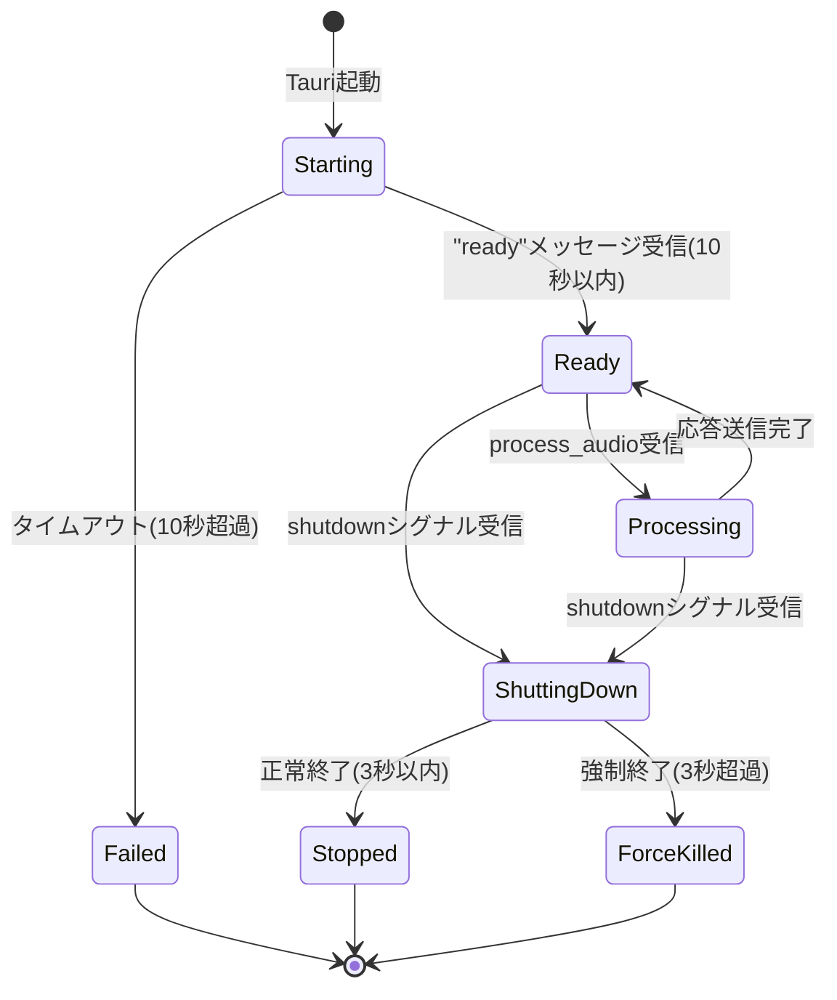
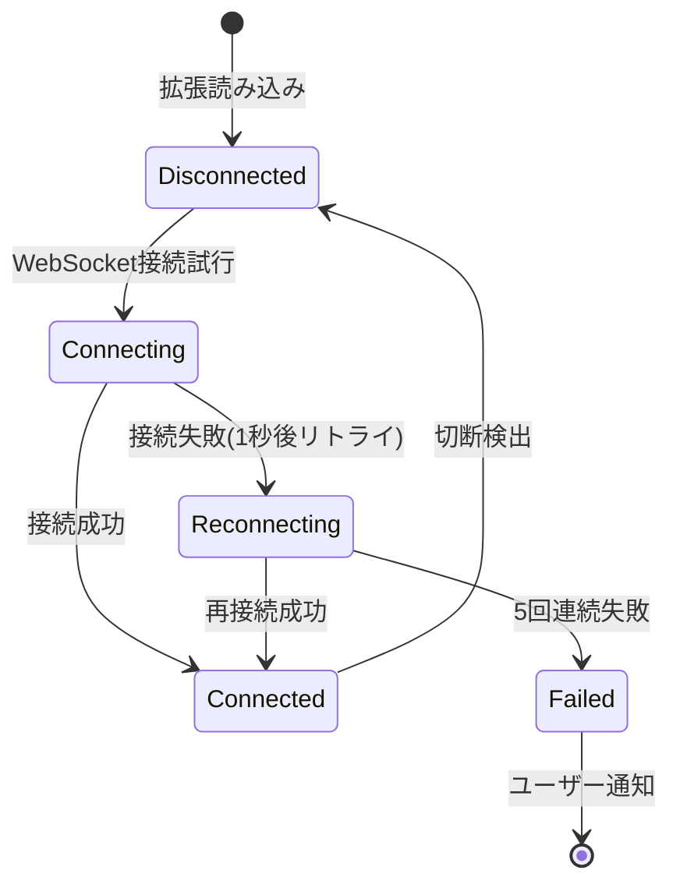

# Requirements Document

## Project Description (Input)

meeting-minutes-core: Tauri+Python+Chrome拡張のWalking Skeleton。全コンポーネントの最小疎通確認。音声録音インターフェース（Fake実装）、Pythonサイドカー起動/終了管理、WebSocketサーバー、Chrome拡張スケルトン(WebSocket接続のみ)。成果物: 録音→Fake処理→WebSocket→Chrome拡張コンソール表示のE2E疎通

## Introduction

meeting-minutes-coreは、Meeting Minutes Automatorプロジェクト全体の基盤となるWalking Skeleton実装です。このspecでは、Tauri+Python+Chrome拡張の3プロセスアーキテクチャにおける最小限の疎通確認を実現します。

**ビジネス価値**:
- 全体アーキテクチャのリスク検証を早期に実施
- 各プロセス境界とIPC通信の実装パターンを確立
- 後続MVP（STT、Docs同期、LLM要約）の実装基盤を構築

**スコープ制限（Walking Skeletonの原則）**:
- 実際の音声処理は行わない（Fake実装で代替）
- ユーザー向けUIは最小限（録音開始/停止ボタンのみ）
- データ永続化は行わない（メモリ内保持）
- エラーハンドリングは基本的なもののみ

## Glossary

| 用語 | 英語表記 | 定義 |
|-----|---------|------|
| **Walking Skeleton** | Walking Skeleton | システム全体の最小限の実装。全コンポーネントが疎通し、E2Eで動作する最小構成。 |
| **Fake実装** | Fake Implementation | 本番ロジックの代わりに固定値や単純なロジックを返すスタブ実装。テスト目的で使用。 |
| **プロセス境界** | Process Boundary | 独立したプロセス間の通信インターフェース。Tauri/Python/Chrome拡張の3プロセス間の境界。 |
| **IPC** | Inter-Process Communication | プロセス間通信。stdin/stdout、WebSocketなどのメカニズム。 |
| **サイドカープロセス** | Sidecar Process | メインプロセス（Tauri）から起動・管理される独立したプロセス（Python音声処理）。 |
| **E2E疎通** | End-to-End Connectivity | システムの入口（録音開始）から出口（Chrome拡張表示）まで、全コンポーネントが連携して動作すること。 |

## Requirements

### Requirement 1: Tauriアプリケーションスケルトン

**ID**: CORE-REQ-001

**Objective**: ソフトウェアエンジニアとして、Tauriデスクトップアプリの基本構造を確立したい。これにより、音声録音制御とプロセス管理の土台が完成する。

#### Acceptance Criteria

1. **AC-001.1**: WHEN Tauriアプリを起動 THEN Tauriアプリ SHALL メインウィンドウを表示する
2. **AC-001.2**: WHEN メインウィンドウが表示される THEN Tauriアプリ SHALL 「録音開始」ボタンと「録音停止」ボタンを含むUI を表示する
3. **AC-001.3**: WHEN ユーザーが「録音開始」ボタンをクリック THEN Tauriアプリ SHALL Rustバックエンドの`start_recording`コマンドを呼び出す
4. **AC-001.4**: WHEN ユーザーが「録音停止」ボタンをクリック THEN Tauriアプリ SHALL Rustバックエンドの`stop_recording`コマンドを呼び出す
5. **AC-001.5**: WHEN `start_recording`コマンドが呼び出される THEN Rustバックエンド SHALL ステータスを"Recording"に更新し、フロントエンドに通知する
6. **AC-001.6**: WHEN `stop_recording`コマンドが呼び出される THEN Rustバックエンド SHALL ステータスを"Stopped"に更新し、フロントエンドに通知する

---

### Requirement 2: Fake音声録音インターフェース

**ID**: CORE-REQ-002

**Objective**: ソフトウェアエンジニアとして、音声録音のインターフェースをFake実装で定義したい。これにより、実際の音声処理実装前にプロセス間データフローを検証できる。

#### Acceptance Criteria

1. **AC-002.1**: WHEN Rustバックエンドが`start_recording`を受信 THEN Rustバックエンド SHALL `FakeAudioDevice`を初期化する
2. **AC-002.2**: WHEN `FakeAudioDevice`が初期化される THEN `FakeAudioDevice` SHALL 100ms間隔で16バイトのダミー音声データを生成する
3. **AC-002.3**: WHEN ダミー音声データが生成される THEN `FakeAudioDevice` SHALL 音声データをPythonサイドカープロセスに送信する
4. **AC-002.4**: WHEN 録音が停止される THEN `FakeAudioDevice` SHALL ダミー音声データの生成を停止する

---

### Requirement 3: Pythonサイドカープロセス管理

**ID**: CORE-REQ-003

**Objective**: ソフトウェアエンジニアとして、Pythonサイドカープロセスのライフサイクルを確実に管理したい。これにより、ゾンビプロセスやリソースリークを防止できる。

#### Acceptance Criteria

1. **AC-003.1**: WHEN Tauriアプリが起動 THEN Tauriアプリ SHALL Pythonサイドカープロセスを起動する
2. **AC-003.2**: WHEN Pythonサイドカープロセスが起動 THEN Pythonサイドカープロセス SHALL 10秒以内に"ready"メッセージをstdoutに出力する
3. **AC-003.3**: IF Pythonサイドカープロセスが10秒以内に"ready"を返さない THEN Tauriアプリ SHALL プロセス起動失敗エラーをユーザーに通知する
4. **AC-003.4**: WHEN Tauriアプリが終了 THEN Tauriアプリ SHALL Pythonサイドカープロセスにshutdownシグナルを送信する
5. **AC-003.5**: WHEN Pythonサイドカープロセスがshutdownシグナルを受信 THEN Pythonサイドカープロセス SHALL 3秒以内に正常終了する
6. **AC-003.6**: IF Pythonサイドカープロセスが3秒以内に終了しない THEN Tauriアプリ SHALL プロセスを強制終了(SIGKILL)する
7. **AC-003.7**: WHEN Tauriアプリが異常終了 THEN OS SHALL Pythonサイドカープロセスを孤児プロセスとして検出し、自動クリーンアップする

---

### Requirement 4: stdin/stdout JSON IPC通信

**ID**: CORE-REQ-004

**Objective**: ソフトウェアエンジニアとして、Tauri-Python間のIPC通信プロトコルを確立したい。これにより、音声データと処理結果の双方向通信が可能になる。

#### Acceptance Criteria

1. **AC-004.1**: WHEN Rustバックエンドが音声データを送信 THEN Rustバックエンド SHALL JSON形式のメッセージをPythonプロセスのstdinに書き込む
2. **AC-004.2**: WHEN JSONメッセージがstdinに書き込まれる THEN JSONメッセージ SHALL `{"id": "unique-id", "type": "request", "method": "process_audio", "params": {"data": "base64-encoded-audio"}}` の形式に従う
3. **AC-004.3**: WHEN Pythonプロセスがstdinからメッセージを受信 THEN Pythonプロセス SHALL メッセージをパースし、`method`フィールドに基づいてハンドラを呼び出す
4. **AC-004.4**: WHEN Pythonプロセスが処理を完了 THEN Pythonプロセス SHALL `{"id": "same-id", "type": "response", "result": {"text": "Fake transcription"}}` 形式の応答をstdoutに出力する
5. **AC-004.5**: WHEN Rustバックエンドがstdoutから応答を読み取る THEN Rustバックエンド SHALL 応答をパースし、`id`フィールドでリクエストと対応付ける
6. **AC-004.6**: IF JSON パースエラーが発生 THEN 受信側プロセス SHALL 以下のアクションを実行する:
   a. エラーログ記録: `{"level": "ERROR", "component": "ipc", "event": "json_parse_error", "message_id": "...", "raw_message": "...", "error": "..."}`
   b. エラー応答送信（可能な場合）: `{"type": "error", "errorCode": "PARSE_ERROR", "errorMessage": "Invalid JSON format"}`
   c. メッセージスキップ: 次のメッセージ処理を継続
   d. ユーザー通知（5回連続失敗時のみ）: "通信エラーが発生しました。ログを確認してください。"
7. **AC-004.7**: IF Pythonプロセスが3回連続でhealth_checkに応答しない THEN Tauriアプリ SHALL 以下のリトライシーケンスを実行する:
   a. 1回目失敗: 5秒待機後に再試行
   b. 2回目失敗: 10秒待機後に再試行
   c. 3回目失敗: プロセス再起動を試行

---

### Requirement 5: Fake音声処理（Python側）

**ID**: CORE-REQ-005

**Objective**: ソフトウェアエンジニアとして、Python側のFake音声処理ロジックを実装したい。これにより、実際のSTT実装前にE2Eフローを検証できる。

#### Acceptance Criteria

1. **AC-005.1**: WHEN Pythonプロセスが`process_audio`メッセージを受信 THEN Pythonプロセス SHALL Base64エンコードされた音声データをデコードする
2. **AC-005.2**: WHEN 音声データがデコードされる THEN Pythonプロセス SHALL 固定文字列"This is a fake transcription result"を生成する
3. **AC-005.3**: WHEN Fake文字起こし結果が生成される THEN Pythonプロセス SHALL 100msの遅延をシミュレートする（実際のSTT処理時間を模倣）
4. **AC-005.4**: WHEN 遅延が完了 THEN Pythonプロセス SHALL 文字起こし結果をJSON応答としてstdoutに出力する

---

### Requirement 6: WebSocketサーバー（Tauri側）

**ID**: CORE-REQ-006

**Objective**: ソフトウェアエンジニアとして、Chrome拡張との通信用WebSocketサーバーを起動したい。これにより、リアルタイムデータ配信の基盤が完成する。

#### Acceptance Criteria

1. **AC-006.1**: WHEN Tauriアプリが起動 THEN Tauriアプリ SHALL ポート9001でWebSocketサーバーを起動する
2. **AC-006.2**: IF ポート9001が使用中 THEN Tauriアプリ SHALL ポート9002〜9100の範囲で利用可能なポートを探索する
3. **AC-006.3**: WHEN WebSocketサーバーが起動 THEN Tauriアプリ SHALL 起動成功ログとポート番号を記録する
4. **AC-006.4**: WHEN Chrome拡張がWebSocket接続を試行 THEN WebSocketサーバー SHALL 接続を受け入れる
5. **AC-006.5**: WHEN WebSocket接続が確立 THEN WebSocketサーバー SHALL 接続成功メッセージ`{"type": "connected", "sessionId": "unique-session-id"}`をクライアントに送信する
6. **AC-006.6**: WHEN Rustバックエンドが文字起こし結果を受信 THEN Rustバックエンド SHALL `{"type": "transcription", "text": "...", "timestamp": 123456789}`形式のメッセージを全接続クライアントにブロードキャストする

---

### Requirement 7: Chrome拡張スケルトン

**ID**: CORE-REQ-007

**Objective**: Chromeユーザーとして、拡張機能をインストールし、Tauriアプリと接続したい。これにより、ブラウザ環境でのリアルタイム文字起こし表示が可能になる。

#### Acceptance Criteria

1. **AC-007.1**: WHEN ユーザーがChrome拡張をインストール THEN Chrome拡張 SHALL Manifest V3の仕様に準拠する
2. **AC-007.2**: WHEN Chrome拡張が読み込まれる THEN Chrome拡張 SHALL Service Workerを起動する
3. **AC-007.3**: WHEN Service Workerが起動 THEN Service Worker SHALL `ws://localhost:9001`へのWebSocket接続を試行する
4. **AC-007.4**: IF WebSocket接続が失敗 THEN Service Worker SHALL 1秒後に再接続を試行する（最大5回）
5. **AC-007.5**: WHEN WebSocket接続が確立 THEN Service Worker SHALL 接続状態を`chrome.storage.local`に保存する
6. **AC-007.6**: WHEN Service WorkerがWebSocketメッセージを受信 THEN Service Worker SHALL メッセージタイプに基づいてハンドラを呼び出す
7. **AC-007.7**: WHEN `transcription`タイプのメッセージを受信 THEN Service Worker SHALL `console.log("Transcription: " + message.text)`を実行する

---

### Requirement 8: E2E疎通確認

**ID**: CORE-REQ-008

**Objective**: QAエンジニアとして、全コンポーネントが連携して動作することを検証したい。これにより、Walking Skeletonの完成を確認できる。

#### Acceptance Criteria

1. **AC-008.1**: WHEN Tauriアプリを起動し、Chrome拡張を読み込む THEN システム SHALL 以下のログを出力する:
   - Tauri: "WebSocket server started on port 9001"
   - Python: "Sidecar ready"
   - Chrome: "WebSocket connected"

2. **AC-008.2**: WHEN ユーザーが「録音開始」ボタンをクリック THEN システム SHALL 以下のシーケンスを実行する:
   1. Tauri: `FakeAudioDevice`が100ms間隔でダミー音声データを生成
   2. Python: 音声データを受信し、"This is a fake transcription result"を返す
   3. Tauri: 文字起こし結果をWebSocket経由でブロードキャスト
   4. Chrome: コンソールに"Transcription: This is a fake transcription result"を表示

3. **AC-008.3**: WHEN ユーザーが「録音停止」ボタンをクリック THEN システム SHALL ダミー音声データの生成を停止する

4. **AC-008.4**: WHEN Tauriアプリを終了 THEN システム SHALL 以下のクリーンアップを実行する:
   - Pythonプロセスが3秒以内に正常終了
   - WebSocketサーバーが正常にシャットダウン
   - ゾンビプロセスが残らない

---

## Non-Functional Requirements

### Performance

**ID**: CORE-NFR-PERF

1. **AC-NFR-PERF.1**: WHEN Pythonサイドカープロセスを起動 THEN Pythonサイドカープロセス SHALL 10秒以内に"ready"状態になる
2. **AC-NFR-PERF.2**: WHEN Fake音声データを送信 THEN Python側の応答 SHALL 500ms以内に返る
3. **AC-NFR-PERF.3**: WHEN WebSocketメッセージをブロードキャスト THEN Chrome拡張 SHALL 100ms以内にメッセージを受信する

#### Performance Measurement and Reporting

4. **AC-NFR-PERF.4**: WHEN プロセス間通信が発生 THEN システム SHALL 処理時間をメトリクスとして記録する:
   - メトリクス項目: `ipc_latency_ms`, `websocket_broadcast_ms`, `python_response_ms`
   - ログフォーマット: `{"metric": "ipc_latency_ms", "value": 45, "timestamp": 1234567890, "session_id": "..."}`

5. **AC-NFR-PERF.5**: WHEN パフォーマンステストを実行 THEN テストランナー SHALL メトリクスを集約してレポート生成する:
   - レポート形式: JSON + Markdown
   - 比較対象: 後続MVPの実STT実装時の性能ベースライン
   - 出力先: `target/performance_reports/`

6. **AC-NFR-PERF.6**: パフォーマンス指標の可視化（オプション）:
   - ログファイルから`jq`コマンドで抽出: `jq 'select(.metric)' logs/app.log`
   - 簡易レポート生成スクリプト: `scripts/performance_report.py`

### Reliability

**ID**: CORE-NFR-REL

1. **AC-NFR-REL.1**: WHEN Pythonプロセスが異常終了 THEN Tauriアプリ SHALL エラーログを記録し、ユーザーに通知する
2. **AC-NFR-REL.2**: WHEN WebSocket接続が切断 THEN Chrome拡張 SHALL 自動再接続を試行する
3. **AC-NFR-REL.3**: WHEN Tauriアプリが異常終了 THEN OS SHALL Pythonプロセスを孤児プロセスとして自動クリーンアップする

### Compatibility

**ID**: CORE-NFR-COMP

1. **AC-NFR-COMP.1**: Tauriアプリ SHALL macOS 11以降、Windows 10以降、Ubuntu 20.04以降で動作する
2. **AC-NFR-COMP.2**: Chrome拡張 SHALL Google Chrome 116以降で動作する
3. **AC-NFR-COMP.3**: Pythonサイドカー SHALL Python 3.9以降で動作する

### Security

**ID**: CORE-NFR-SEC

1. **AC-NFR-SEC.1**: WebSocketサーバー SHALL localhostのみからの接続を許可する（外部ネットワークからのアクセス禁止）
   - 実装: `bind("127.0.0.1:9001")`（`0.0.0.0`は禁止）

2. **AC-NFR-SEC.2**: WHEN WebSocket接続を確立 THEN WebSocketサーバー SHALL Originヘッダーを検証する:
   - 許可リスト: `["chrome-extension://[extension-id]", "tauri://localhost"]`
   - 不正なOriginは即座に切断

3. **AC-NFR-SEC.3**: WHEN JSON IPCメッセージを処理 THEN 受信側プロセス SHALL 基本的な入力バリデーションを実行する:
   - 必須フィールド存在確認（`id`, `type`, `method`）
   - フィールド型検証（`id` is string, `type` is enum）
   - メッセージサイズ上限: 1MB

4. **AC-NFR-SEC.4**: Chrome拡張のService Worker SHALL 接続状態を`chrome.storage.local`に保存する際、暗号化は行わない（Walking Skeleton段階）
   - 注: MVP2以降でOAuthトークン保存時に暗号化を実装

5. **AC-NFR-SEC.5**: （将来拡張）TLS/WSSサポート:
   - Walking Skeleton段階では平文WebSocket（ws://）を使用
   - MVP2以降で自己署名証明書によるWSS（wss://）への移行を検討

### Logging

**ID**: CORE-NFR-LOG

1. **AC-NFR-LOG.1**: WHEN プロセス間通信が発生 THEN 送信側プロセス SHALL メッセージID、タイムスタンプ、メソッド名をINFOレベルでログに記録する
2. **AC-NFR-LOG.2**: WHEN エラーが発生 THEN エラー発生プロセス SHALL エラーメッセージ、スタックトレース、コンテキストをERRORレベルでログに記録する
3. **AC-NFR-LOG.3**: WHEN プロセスが起動/終了 THEN プロセス SHALL 起動/終了イベント、プロセスID、タイムスタンプをINFOレベルでログに記録する

---

## Out of Scope (明確な非スコープ)

以下の機能は、本Walking Skeleton実装には**含まれません**。後続のMVPで実装されます:

### MVP1 (meeting-minutes-stt) で実装予定
- 実際の音声録音（マイク/ループバックデバイス）
- webrtcvadによる音声活動検出
- faster-whisperによる実音声文字起こし
- ローカルストレージへの録音ファイル保存

### MVP2 (meeting-minutes-docs-sync) で実装予定
- OAuth 2.0認証フロー
- Google Docs API統合
- Named Range管理
- リアルタイムDocs同期

### MVP3 (meeting-minutes-llm) で実装予定
- LLM API統合
- セグメント要約/ローリングサマリー
- Tauri UI洗練（設定画面、履歴表示）
- リソース管理3段階閾値

---

## Cross-Platform Considerations

### Platform-Specific Validation

1. **macOS** (macOS 11+):
   - Python検出: `/usr/bin/python3`、Homebrew `/opt/homebrew/bin/python3`
   - FakeAudioDevice: 標準ライブラリのみ使用（OS固有依存なし）
   - 動作確認: Intel & Apple Silicon

2. **Windows** (Windows 10+):
   - Python検出: `py.exe -3`、`python.exe`（PATH検索）
   - FakeAudioDevice: 標準ライブラリのみ使用
   - 特記事項: パス区切り文字（バックスラッシュ）の考慮

3. **Linux** (Ubuntu 20.04+):
   - Python検出: `/usr/bin/python3`
   - FakeAudioDevice: 標準ライブラリのみ使用
   - 依存パッケージ: `python3-venv`（仮想環境用）

### Platform Validation Criteria

WHEN クロスプラットフォームテストを実行 THEN テストスイート SHALL 以下を検証する:
1. Pythonサイドカープロセスが10秒以内に起動（全OS）
2. WebSocketサーバーがポート9001で起動（全OS）
3. Chrome拡張がWebSocket接続確立（全OS）
4. E2E疎通確認が成功（全OS）

### Platform-Specific Test Commands

```bash
# macOS
cargo tauri dev --target x86_64-apple-darwin
cargo tauri dev --target aarch64-apple-darwin

# Windows
cargo tauri dev --target x86_64-pc-windows-msvc

# Linux
cargo tauri dev --target x86_64-unknown-linux-gnu
```

---

## Testing Strategy

### Test Framework Selection

- **Rust**: `cargo test` (単体テスト), `rstest` (パラメタライズドテスト)
- **Python**: `pytest` (単体/統合テスト)
- **TypeScript (Chrome拡張)**: `vitest` (単体テスト), Playwright (E2Eテスト)
- **E2E**: `tauri-driver` + WebDriver (全コンポーネント統合テスト)

### Test Coverage Goals

| Test Level | Target Coverage | Description |
|------------|----------------|-------------|
| Unit Tests | 80%以上 | 各モジュールの単体機能 |
| Integration Tests | 主要シナリオ100% | プロセス間通信、WebSocket通信 |
| E2E Tests | Success Criteria 100% | 録音開始→Chrome拡張表示の全フロー |

### Test Cases Mapped to Requirements

**Requirement 1 (Tauriアプリスケルトン)**:
- UT-1.1: `start_recording`コマンド呼び出しテスト
- UT-1.2: ステータス更新通知テスト
- IT-1.1: フロントエンド-バックエンド連携テスト

**Requirement 3 (Pythonサイドカープロセス管理)**:
- UT-3.1: プロセス起動タイムアウトテスト
- UT-3.2: Graceful shutdownテスト
- UT-3.3: 強制終了テスト
- IT-3.1: ゾンビプロセス検出テスト

**Requirement 8 (E2E疎通確認)**:
- E2E-8.1: 全コンポーネント起動シーケンステスト
- E2E-8.2: 録音→Fake処理→WebSocket→Chrome拡張フローテスト
- E2E-8.3: クリーンアップシーケンステスト

### Test Execution in CI/CD

```yaml
# .github/workflows/test.yml
test:
  strategy:
    matrix:
      os: [macos-latest, windows-latest, ubuntu-latest]
  steps:
    - name: Unit Tests (Rust)
      run: cargo test
    - name: Unit Tests (Python)
      run: pytest tests/unit
    - name: Integration Tests
      run: cargo test --test integration
    - name: E2E Tests
      run: pnpm test:e2e
```

---

## State Machine Specifications

### Pythonサイドカープロセス状態遷移



**状態遷移表**:

| 現在の状態 | イベント | 次の状態 | アクション |
|-----------|---------|---------|-----------|
| Starting | "ready"受信 | Ready | ログ記録: "Python sidecar ready" |
| Starting | 10秒タイムアウト | Failed | エラー通知、プロセス強制終了 |
| Ready | process_audio | Processing | 音声データ処理開始 |
| Processing | 応答完了 | Ready | 応答送信、待機状態へ |
| Ready/Processing | shutdown | ShuttingDown | Graceful shutdown開始 |
| ShuttingDown | 3秒以内終了 | Stopped | クリーンアップ成功 |
| ShuttingDown | 3秒超過 | ForceKilled | SIGKILL送信 |

---

### Chrome拡張WebSocket接続状態遷移



**再接続バックオフ戦略**:

| 試行回数 | 待機時間 | アクション |
|---------|---------|-----------|
| 1回目 | 即座 | WebSocket接続試行 |
| 2回目 | 1秒 | 再接続試行 |
| 3回目 | 2秒 | 再接続試行 |
| 4回目 | 4秒 | 再接続試行 |
| 5回目 | 8秒 | 再接続試行 |
| 6回目以降 | - | 接続失敗、ユーザー通知 |

---

## Success Criteria

本Walking Skeleton実装は、以下の条件を全て満たした場合に成功とみなされます:

1. ✅ **E2E疎通成功**: 録音開始 → Fake音声生成 → Python処理 → WebSocket配信 → Chrome拡張コンソール表示が一連で動作
2. ✅ **プロセス管理**: Pythonサイドカーが正常に起動・終了し、ゾンビプロセスが残らない
3. ✅ **IPC通信**: Tauri-Python間のstdin/stdout JSON通信が双方向で機能する
4. ✅ **WebSocket通信**: Tauri-Chrome拡張間のWebSocket通信が確立し、メッセージ送受信が動作する
5. ✅ **クロスプラットフォーム**: macOS、Windows、Linuxの3環境で動作確認が取れる
6. ✅ **テスト可能性**: 各コンポーネントの単体テストと統合テストが実装されている

---

## Dependencies

### External Dependencies
- **Tauri 2.0**: デスクトップアプリフレームワーク
- **Rust 1.70+**: Tauriバックエンド言語
- **Python 3.9+**: サイドカープロセス
- **Node.js 18+**: Chrome拡張ビルド
- **Google Chrome 116+**: 拡張実行環境

### Internal Dependencies
- **Umbrella Spec**: `.kiro/specs/meeting-minutes-automator` - 全体アーキテクチャリファレンス
- **Steering Documents**:
  - `tech.md`: 技術スタックとPythonサイドカー管理仕様
  - `structure.md`: プロジェクト構造とファイル命名規則
  - `principles.md`: プロセス境界の明確化原則

---

## Requirement Traceability Matrix

本セクションは、meeting-minutes-core 要件と tasks.md、および Umbrella Spec (meeting-minutes-automator) との対応関係を明示します。

### Functional Requirements Traceability

| Requirement ID | Requirement Title | Acceptance Criteria IDs | Related Tasks | Umbrella Spec Reference |
|----------------|-------------------|-------------------------|---------------|-------------------------|
| CORE-REQ-001 | Tauriアプリケーションスケルトン | AC-001.1 ~ AC-001.6 | 1.1, 1.2 | - |
| CORE-REQ-002 | Fake音声録音インターフェース | AC-002.1 ~ AC-002.4 | 2.1 | - |
| CORE-REQ-003 | Pythonサイドカープロセス管理 | AC-003.1 ~ AC-003.7 | 3.1, 3.2, 3.3 | - |
| CORE-REQ-004 | stdin/stdout JSON IPC通信 | AC-004.1 ~ AC-004.7 | 4.1, 4.2, 4.3 | - |
| CORE-REQ-005 | Fake音声処理（Python側） | AC-005.1 ~ AC-005.4 | 5.1, 5.2, 5.3 | - |
| CORE-REQ-006 | WebSocketサーバー（Tauri側） | AC-006.1 ~ AC-006.6 | 6.1, 6.2, 6.3 | - |
| CORE-REQ-007 | Chrome拡張スケルトン | AC-007.1 ~ AC-007.7 | 7.1, 7.2, 7.3 | - |
| CORE-REQ-008 | E2E疎通確認 | AC-008.1 ~ AC-008.4 | 8.1, 8.2, 8.3 | - |

### Non-Functional Requirements Traceability

| Requirement ID | Category | Acceptance Criteria IDs | Related Tasks | Umbrella Spec Reference |
|----------------|----------|-------------------------|---------------|-------------------------|
| CORE-NFR-PERF | Performance | AC-NFR-PERF.1 ~ AC-NFR-PERF.6 | 9.1 | - |
| CORE-NFR-REL | Reliability | AC-NFR-REL.1 ~ AC-NFR-REL.3 | 3.3, 7.2, 8.3 | - |
| CORE-NFR-COMP | Compatibility | AC-NFR-COMP.1 ~ AC-NFR-COMP.3 | 9.3 | - |
| CORE-NFR-SEC | Security | AC-NFR-SEC.1 ~ AC-NFR-SEC.5 | 9.2 | - |
| CORE-NFR-LOG | Logging | AC-NFR-LOG.1 ~ AC-NFR-LOG.3 | 9.4 | - |

### Test Cases Traceability

| Test Case ID | Test Type | Related Requirements | Task | Test Location | Status |
|--------------|-----------|----------------------|------|---------------|--------|
| **Skeleton Tests** |
| E2E-8.1 | E2E | CORE-REQ-008 | 1.3 | `tests/integration/e2e_test.rs` | Pending |
| E2E-8.2 | E2E | CORE-REQ-008 | 1.3 | `tests/integration/e2e_test.rs` | Pending |
| E2E-8.3 | E2E | CORE-REQ-008 | 1.3 | `tests/integration/e2e_test.rs` | Pending |
| **Fake Audio Device (Task 2)** |
| UT-2.1.1 | Unit | CORE-REQ-002 | 2.1 | `tests/unit/audio/test_fake_device.rs` | Pending |
| UT-2.1.2 | Unit | CORE-REQ-002 | 2.1 | `tests/unit/audio/test_fake_device.rs` | Pending |
| UT-2.1.3 | Unit | CORE-REQ-002 | 2.1 | `tests/unit/audio/test_fake_device.rs` | Pending |
| UT-2.1.4 | Unit | CORE-REQ-002 | 2.1 | `tests/unit/audio/test_fake_device.rs` | Pending |
| **Python Sidecar Management (Task 3)** |
| UT-3.1.1 | Unit | CORE-REQ-003 | 3.1 | `tests/unit/sidecar/test_python_detection.rs` | Pending |
| UT-3.1.2 | Unit | CORE-REQ-003 | 3.1 | `tests/unit/sidecar/test_python_detection.rs` | Pending |
| UT-3.1.3 | Unit | CORE-REQ-003 | 3.1 | `tests/unit/sidecar/test_python_detection.rs` | Pending |
| UT-3.1.4 | Unit | CORE-REQ-003 | 3.1 | `tests/unit/sidecar/test_python_detection.rs` | Pending |
| UT-3.2.1 | Unit | CORE-REQ-003 | 3.2 | `tests/unit/sidecar/test_manager.rs` | Pending |
| UT-3.2.2 | Unit | CORE-REQ-003 | 3.2 | `tests/unit/sidecar/test_manager.rs` | Pending |
| IT-3.2.1 | Integration | CORE-REQ-003 | 3.2 | `tests/integration/test_sidecar_ipc.rs` | Pending |
| UT-3.3.1 | Unit | CORE-REQ-003 | 3.3 | `tests/unit/sidecar/test_shutdown.rs` | Pending |
| UT-3.3.2 | Unit | CORE-REQ-003 | 3.3 | `tests/unit/sidecar/test_shutdown.rs` | Pending |
| IT-3.3.1 | Integration | CORE-REQ-003 | 3.3 | `tests/integration/test_zombie_processes.rs` | Pending |
| **IPC Communication (Task 4)** |
| UT-4.1.1 | Unit | CORE-REQ-004 | 4.1 | `tests/unit/ipc/test_serialization.rs` | Pending |
| UT-4.1.2 | Unit | CORE-REQ-004 | 4.1 | `tests/unit/ipc/test_serialization.rs` | Pending |
| IT-4.1.1 | Integration | CORE-REQ-004 | 4.1 | `tests/integration/test_ipc.rs` | Pending |
| UT-4.2.1 | Unit | CORE-REQ-004 | 4.2 | `tests/unit/ipc/test_error_handling.rs` | Pending |
| UT-4.2.2 | Unit | CORE-REQ-004 | 4.2 | `tests/unit/ipc/test_health_check.rs` | Pending |
| IT-4.2.1 | Integration | CORE-REQ-004 | 4.2 | `tests/integration/test_ipc_retry.rs` | Pending |
| IT-4.3.1 | Integration | CORE-REQ-004 | 4.3 | `tests/integration/test_ipc.rs` | Pending |
| IT-4.3.2 | Integration | CORE-REQ-004 | 4.3 | `tests/integration/test_ipc.rs` | Pending |
| IT-4.3.3 | Integration | CORE-REQ-004 | 4.3 | `tests/integration/test_ipc.rs` | Pending |
| **Python Fake Processor (Task 5)** |
| UT-5.1.1 | Unit | CORE-REQ-005 | 5.1 | `python-stt/tests/test_ipc_handler.py` | Pending |
| UT-5.1.2 | Unit | CORE-REQ-005 | 5.1 | `python-stt/tests/test_ipc_handler.py` | Pending |
| UT-5.2.1 | Unit | CORE-REQ-005 | 5.2 | `python-stt/tests/test_fake_processor.py` | Pending |
| UT-5.2.2 | Unit | CORE-REQ-005 | 5.2 | `python-stt/tests/test_fake_processor.py` | Pending |
| UT-5.2.3 | Unit | CORE-REQ-005 | 5.2 | `python-stt/tests/test_fake_processor.py` | Pending |
| UT-5.3.1 | Unit | CORE-REQ-005 | 5.3 | `python-stt/tests/test_lifecycle.py` | Pending |
| UT-5.3.2 | Unit | CORE-REQ-005 | 5.3 | `python-stt/tests/test_lifecycle.py` | Pending |
| IT-5.3.1 | Integration | CORE-REQ-005 | 5.3 | `python-stt/tests/test_integration.py` | Pending |
| **WebSocket Server (Task 6)** |
| UT-6.1.1 | Unit | CORE-REQ-006 | 6.1 | `tests/unit/websocket/test_server.rs` | Pending |
| UT-6.1.2 | Unit | CORE-REQ-006 | 6.1 | `tests/unit/websocket/test_server.rs` | Pending |
| IT-6.1.1 | Integration | CORE-REQ-006 | 6.1 | `tests/integration/test_websocket.rs` | Pending |
| UT-6.2.1 | Unit | CORE-REQ-006 | 6.2 | `tests/unit/websocket/test_connection.rs` | Pending |
| UT-6.2.2 | Unit | CORE-REQ-006 | 6.2 | `tests/unit/websocket/test_origin.rs` | Pending |
| IT-6.2.1 | Integration | CORE-REQ-006 | 6.2 | `tests/integration/test_websocket_broadcast.rs` | Pending |
| UT-6.3.1 | Unit | CORE-REQ-006 | 6.3 | `tests/unit/websocket/test_messages.rs` | Pending |
| UT-6.3.2 | Unit | CORE-REQ-006 | 6.3 | `tests/unit/websocket/test_messages.rs` | Pending |
| UT-6.3.3 | Unit | CORE-REQ-006 | 6.3 | `tests/unit/websocket/test_messages.rs` | Pending |
| **Chrome Extension (Task 7)** |
| UT-7.1.1 | Unit | CORE-REQ-007 | 7.1 | `chrome-extension/tests/test_manifest.spec.ts` | Pending |
| E2E-7.1.1 | E2E | CORE-REQ-007 | 7.1 | Manual (Chrome loading verification) | Pending |
| UT-7.2.1 | Unit | CORE-REQ-007 | 7.2 | `chrome-extension/tests/test_websocket_client.spec.ts` | Pending |
| UT-7.2.2 | Unit | CORE-REQ-007 | 7.2 | `chrome-extension/tests/test_websocket_client.spec.ts` | Pending |
| IT-7.2.1 | Integration | CORE-REQ-007 | 7.2 | `chrome-extension/tests/test_connection.spec.ts` | Pending |
| UT-7.3.1 | Unit | CORE-REQ-007 | 7.3 | `chrome-extension/tests/test_message_handler.spec.ts` | Pending |
| UT-7.3.2 | Unit | CORE-REQ-007 | 7.3 | `chrome-extension/tests/test_message_handler.spec.ts` | Pending |
| UT-7.3.3 | Unit | CORE-REQ-007 | 7.3 | `chrome-extension/tests/test_message_handler.spec.ts` | Pending |
| UT-7.3.4 | Unit | CORE-REQ-007 | 7.3 | `chrome-extension/tests/test_message_handler.spec.ts` | Pending |
| **E2E Integration (Task 8)** |
| E2E-8.1.1 | E2E | CORE-REQ-008 | 8.1 | `tests/e2e/test_startup.rs` | Pending |
| E2E-8.1.2 | E2E | CORE-REQ-008 | 8.1 | `tests/e2e/test_startup.rs` | Pending |
| E2E-8.1.3 | E2E | CORE-REQ-008 | 8.1 | `tests/e2e/test_startup.rs` | Pending |
| E2E-8.1.4 | E2E | CORE-REQ-008 | 8.1 | `tests/e2e/test_startup.rs` | Pending |
| E2E-8.2.1 | E2E | CORE-REQ-008 | 8.2 | Manual (Full flow test) | Pending |
| E2E-8.2.2 | E2E | CORE-REQ-008 | 8.2 | Manual (Full flow test) | Pending |
| E2E-8.2.3 | E2E | CORE-REQ-008 | 8.2 | Manual (Full flow test) | Pending |
| E2E-8.2.4 | E2E | CORE-REQ-008 | 8.2 | Manual (Full flow test) | Pending |
| E2E-8.2.5 | E2E | CORE-REQ-008 | 8.2 | Manual (Full flow test) | Pending |
| E2E-8.3.1 | E2E | CORE-REQ-008 | 8.3 | `tests/e2e/test_cleanup.rs` | Pending |
| E2E-8.3.2 | E2E | CORE-REQ-008 | 8.3 | `tests/e2e/test_cleanup.rs` | Pending |
| E2E-8.3.3 | E2E | CORE-REQ-008 | 8.3 | `tests/e2e/test_cleanup.rs` | Pending |
| E2E-8.3.4 | E2E | CORE-REQ-008 | 8.3 | `tests/e2e/test_cleanup.rs` | Pending |
| **Non-Functional Requirements (Task 9)** |
| IT-9.1.1 | Integration | CORE-NFR-PERF | 9.1 | `tests/integration/test_metrics.rs` | Pending |
| IT-9.1.2 | Integration | CORE-NFR-PERF | 9.1 | `tests/integration/test_performance.rs` | Pending |
| IT-9.2.1 | Integration | CORE-NFR-SEC | 9.2 | `tests/integration/test_security.rs` | Pending |
| IT-9.2.2 | Integration | CORE-NFR-SEC | 9.2 | `tests/integration/test_security.rs` | Pending |
| IT-9.2.3 | Integration | CORE-NFR-SEC | 9.2 | `tests/integration/test_security.rs` | Pending |
| IT-9.2.4 | Integration | CORE-NFR-SEC | 9.2 | `tests/integration/test_security.rs` | Pending |
| E2E-9.3.1 | E2E | CORE-NFR-COMP | 9.3 | Manual (macOS testing) | Pending |
| E2E-9.3.2 | E2E | CORE-NFR-COMP | 9.3 | Manual (Windows testing) | Pending |
| E2E-9.3.3 | E2E | CORE-NFR-COMP | 9.3 | Manual (Linux testing) | Pending |
| UT-9.4.1 | Unit | CORE-NFR-LOG | 9.4 | `tests/unit/logging/test_format.rs` | Pending |
| IT-9.4.1 | Integration | CORE-NFR-LOG | 9.4 | `tests/integration/test_logging.rs` | Pending |
| IT-9.4.2 | Integration | CORE-NFR-LOG | 9.4 | `tests/integration/test_logging.rs` | Pending |

### Notes on Umbrella Spec Alignment

meeting-minutes-core は Walking Skeleton として実装されるため、Umbrella Spec (meeting-minutes-automator) の要件を直接実装するのではなく、アーキテクチャパターンの検証を目的としています。後続の MVP1 (meeting-minutes-stt)、MVP2 (meeting-minutes-docs-sync)、MVP3 (meeting-minutes-llm) で Umbrella Spec の要件を段階的に実装します。

**Umbrella Spec との関連性**:
- **IPC プロトコル**: CORE-REQ-004 は Umbrella Spec の `IpcRequest`/`IpcResponse` 型定義に準拠
- **WebSocket メッセージ**: CORE-REQ-006 は Umbrella Spec の `WebSocketMessage` Tagged Union に準拠
- **プロセス管理**: CORE-REQ-003 は Steering Document (`tech.md`) の Python サイドカー管理仕様に準拠

### Traceability Update Policy

- 要件追加/変更時: 本表を更新し、対応する tasks.md のタスク番号を追記
- タスク実装完了時: Status 列を "Completed" に更新
- テストケース追加時: Test Cases Traceability 表に行を追加

---

## Revision History

| Date | Version | Author | Changes |
|------|---------|--------|---------|
| 2025-10-02 | 1.0 | Claude Code | 初版作成（Walking Skeleton要件定義） |
| 2025-10-02 | 1.1 | Claude Code | レビュー指摘事項反映: エラーハンドリング詳細化、パフォーマンス測定方針、セキュリティ強化、クロスプラットフォーム考慮、テスト戦略、状態遷移図追加 |
| 2025-10-03 | 1.2 | Claude Code | 要件ID採番とTraceability Matrix追加 (CORE-REQ-001 ~ CORE-REQ-008, CORE-NFR-*) |
