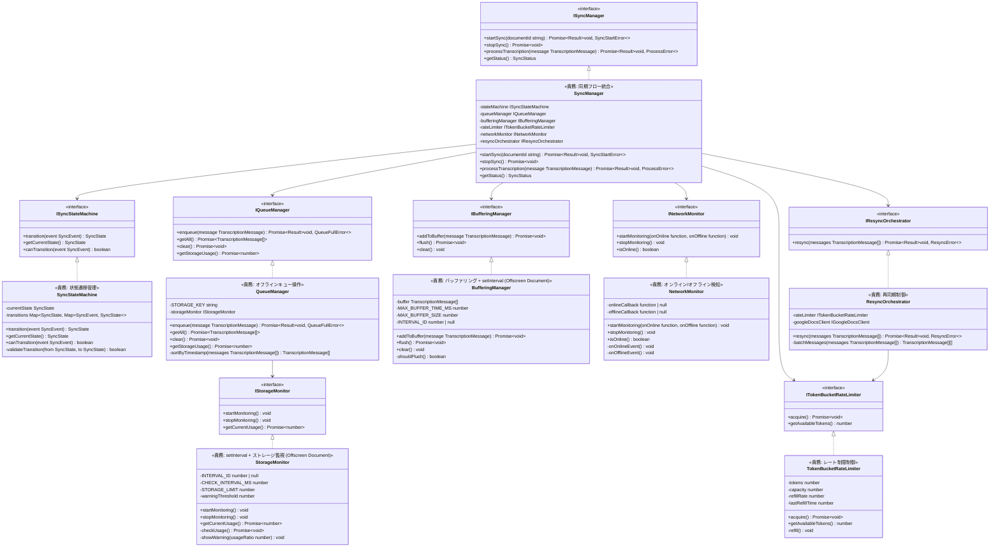

# Sync Domain - Class Diagram

> **親ドキュメント**: [phase-0-design-validation.md](../../task-details/phase-0-design-validation.md)
> **関連設計**: [design-components.md#Sync Domain](../../design-modules/design-components.md)
> **Requirements**: DOCS-REQ-004.1-9, DOCS-REQ-005.1-12, DOCS-NFR-001.1-4

## Class Diagram

## Metrics

| クラス | 公開メソッド数 | プライベートメソッド数 | 依存先数 | テスト容易性 |
|--------|---------------|-------------------|---------|-------------|
| SyncManager | 4 | 0 | 6 | ⭐⭐⭐⭐ |
| SyncStateMachine | 3 | 1 | 0 | ⭐⭐⭐⭐⭐ |
| QueueManager | 4 | 1 | 1 | ⭐⭐⭐⭐ |
| StorageMonitor | 3 | 2 | 0 | ⭐⭐⭐⭐ |
| BufferingManager | 3 | 1 | 0 | ⭐⭐⭐⭐⭐ |
| TokenBucketRateLimiter | 2 | 1 | 0 | ⭐⭐⭐⭐⭐ |
| NetworkMonitor | 3 | 2 | 0 | ⭐⭐⭐⭐ |
| ResyncOrchestrator | 1 | 1 | 2 | ⭐⭐⭐⭐ |

**Total Classes**: 8
**Average Public Methods**: 2.9
**Test Ease ⭐4+**: 100% (8/8 classes)
