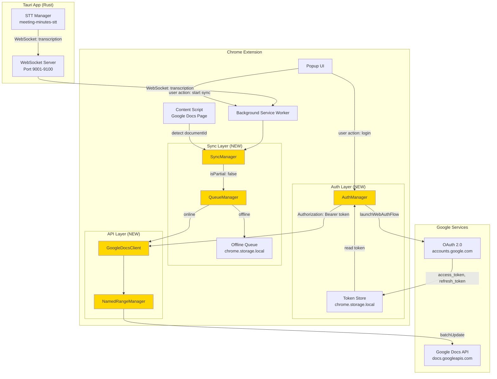

# Technical Design - meeting-minutes-docs-sync: Architecture

> **プロジェクト**: OAuth 2.0 + Google Docs API統合でGoogle Meetから議事録を自動同期（MVP2）
> **親ドキュメント**: [design.md](../design.md)
> **関連**: [Requirements](../requirements.md) | [Tasks](../tasks.md) | [他のモジュール](README.md)

## Architecture

### Existing Architecture Analysis

meeting-minutes-docs-syncは、既存の基盤の上に構築されます:

**meeting-minutes-core (MVP0) からの継承**:
- WebSocketサーバー（ポート9001-9100動的割り当て）
- Chrome拡張スケルトン（WebSocket接続機能）
- プロセス境界の明確化（Tauri/Python/Chrome拡張の3プロセス分離）

**meeting-minutes-stt (MVP1) からの継承**:
- WebSocketメッセージ形式（`transcription` type、`isPartial`、`confidence`、`language`フィールド）
- 確定テキスト配信フロー（`isPartial: false`）
- セッション管理（`sessionId`、`messageId`）

**既存パターンの尊重**:
- WebSocketメッセージ形式を拡張し、`docsSync`フィールドを追加
- Chrome拡張の`chrome.storage.local`による設定管理パターンを踏襲
- エラーログ形式（INFO/DEBUG/ERRORレベル）の一貫性維持

**新規コンポーネントの追加理由**:
- **AuthManager**: OAuth 2.0フローの複雑さを抽象化し、トークンライフサイクル管理を一元化
- **GoogleDocsClient**: Google Docs API呼び出しを抽象化し、レート制限対応とエラーハンドリングをカプセル化
- **SyncManager**: オフライン/オンライン状態の管理、キューイング、自動再同期を統合管理
- **QueueManager**: オフラインキューの永続化、優先度管理、ストレージ使用量監視

### High-Level Architecture



**アーキテクチャの特徴**:
- **レイヤー分離**: 認証（Auth Layer）、同期制御（Sync Layer）、API通信（API Layer）を明確に分離
- **オフラインファースト**: オフライン時はローカルキューに保存し、オンライン復帰時に自動同期
- **トークンライフサイクル管理**: アクセストークンの期限切れ時の自動リフレッシュとエラーハンドリング
- **レート制限対応**: バッファリング（最大3秒）とバッチ処理により、Google Docs APIレート制限（60リクエスト/分）を遵守
- **MV3 Service Worker対応**: `chrome.alarms` API使用、Offscreen Document（WebSocket維持用）

### WebSocket維持戦略（MV3対応）

**課題**: MV3 Service Workerは5分でタイムアウトし、WebSocket接続が切断される。

**解決策**: **Offscreen Document**を使用してWebSocket接続を維持する。

```typescript
// manifest.json
{
  "permissions": ["offscreen", "alarms"],
  "background": {
    "service_worker": "background.js"
  }
}

// background.js (Service Worker)
/**
 * Offscreen Documentライフサイクル管理
 *
 * Chrome再起動、拡張SW再読み込み、Offscreenクラッシュ時に確実に再生成するため、
 * 接続要求ごとに存在確認→未生成なら作成する "ensure" パターンを採用
 */
async function ensureOffscreenDocument(): Promise<void> {
  // Chrome 116+ API: 存在確認
  const hasDocument = await chrome.offscreen.hasDocument();

  if (!hasDocument) {
    await chrome.offscreen.createDocument({
      url: 'offscreen.html',
      reasons: [chrome.offscreen.Reason.WEBSOCKET],
      justification: 'Maintain WebSocket connection for real-time transcription sync'
    });
    console.log('Offscreen Document created');
  }
}

// (1) ブラウザ再起動時
chrome.runtime.onStartup.addListener(async () => {
  await ensureOffscreenDocument();
});

// (2) 拡張インストール/更新時
chrome.runtime.onInstalled.addListener(async () => {
  await ensureOffscreenDocument();
});

// (3) WebSocket接続開始時（後述のメッセージハンドラーから呼び出し）
chrome.runtime.onMessage.addListener(async (message, sender, sendResponse) => {
  if (message.type === 'start_sync') {
    await ensureOffscreenDocument();
    // Offscreenへ接続指示
    chrome.runtime.sendMessage({ type: 'ws_connect' });
  }

  // Offscreen側からのWS切断通知
  if (message.type === 'ws_disconnected') {
    console.warn('WebSocket disconnected, attempting recovery...');
    await ensureOffscreenDocument();
    // 再接続指示
    chrome.runtime.sendMessage({ type: 'ws_reconnect' });
  }
});

// offscreen.js (持続文脈でWebSocket維持)
/**
 * WebSocketポート動的検出
 *
 * meeting-minutes-coreの仕様（9001-9100の動的割り当て）に準拠し、
 * ポートスキャンで実際のポートを検出する
 */
async function connectToTauriWebSocket(): Promise<WebSocket> {
  const portRange = Array.from({ length: 100 }, (_, i) => 9001 + i);
  let lastSuccessfulPort: number | null = null;

  // 直近の成功ポートを優先試行（再接続時の最適化）
  if (lastSuccessfulPort) {
    try {
      const ws = await tryConnect(lastSuccessfulPort);
      console.log(`WebSocket reconnected on port ${lastSuccessfulPort}`);
      return ws;
    } catch (error) {
      console.warn(`Last port ${lastSuccessfulPort} failed, scanning all ports...`);
    }
  }

  // 10ポートずつチャンク実行（CPU配慮）
  for (let i = 0; i < portRange.length; i += 10) {
    const chunk = portRange.slice(i, i + 10);
    const promises = chunk.map(port => tryConnect(port));

    try {
      const ws = await Promise.any(promises);
      const connectedPort = parseInt(ws.url.split(':')[2]);
      lastSuccessfulPort = connectedPort;
      console.log(`WebSocket connected on port ${connectedPort}`);
      return ws;
    } catch (error) {
      // 次のチャンクへ
    }
  }

  throw new Error('Failed to connect to Tauri WebSocket server (ports 9001-9100)');
}

async function tryConnect(port: number): Promise<WebSocket> {
  return new Promise((resolve, reject) => {
    const ws = new WebSocket(`ws://localhost:${port}`);
    const timeout = setTimeout(() => {
      ws.close();
      reject(new Error(`Port ${port} timeout`));
    }, 500); // 短タイムアウト

    ws.onopen = () => {
      clearTimeout(timeout);
      resolve(ws);
    };
    ws.onerror = () => {
      clearTimeout(timeout);
      reject(new Error(`Port ${port} connection failed`));
    };
  });
}

// WebSocket接続開始
let ws: WebSocket | null = null;

chrome.runtime.onMessage.addListener(async (message) => {
  if (message.type === 'ws_connect' || message.type === 'ws_reconnect') {
    try {
      ws = await connectToTauriWebSocket();

      ws.onmessage = (event) => {
        // Service Workerへメッセージ転送
        chrome.runtime.sendMessage({
          type: 'transcription',
          data: JSON.parse(event.data)
        });
      };

      ws.onerror = (error) => {
        console.error('WebSocket error:', error);
      };

      ws.onclose = () => {
        console.warn('WebSocket closed, notifying Service Worker...');
        // Service Workerへ切断通知
        chrome.runtime.sendMessage({ type: 'ws_disconnected' });
      };

    } catch (error) {
      console.error('Failed to connect:', error);
      // Service Workerへエラー通知
      chrome.runtime.sendMessage({ type: 'ws_connect_failed', error: error.message });
    }
  }

  // Service Workerからのメッセージを受信
  if (message.type === 'send_to_tauri' && ws) {
    ws.send(JSON.stringify(message.data));
  }
});
```

**利点**:
- WebSocket接続がService Workerのタイムアウトに影響されない
- Offscreen DocumentはManifest V2のbackground pageと同等の持続性を持つ
- Chrome 109+で利用可能

---

