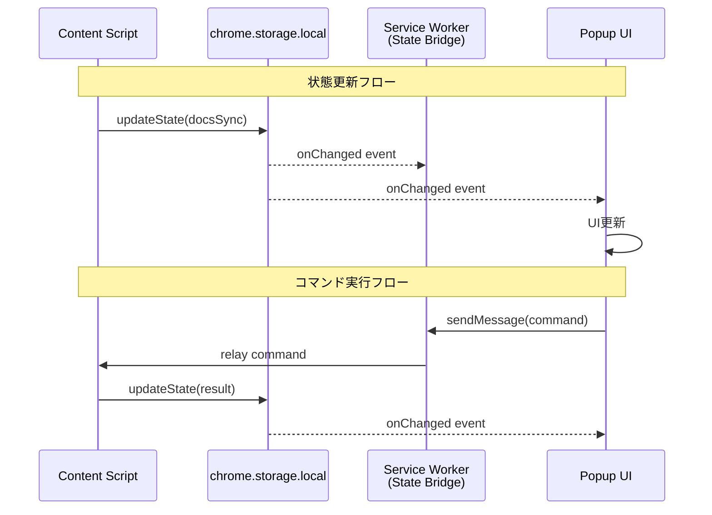

# Technical Design - meeting-minutes-docs-sync: Data Models

> **プロジェクト**: OAuth 2.0 + Google Docs API統合でGoogle Meetから議事録を自動同期（MVP2）
> **親ドキュメント**: [design.md](../design.md)
> **関連**: [Requirements](../requirements.md) | [Tasks](../tasks.md) | [他のモジュール](README.md)

## Data Models

### Logical Data Model

本機能では、Chrome拡張内で以下のデータエンティティを管理します。

#### AuthTokens (認証トークン)

```typescript
type AuthTokens = {
  accessToken: string;        // アクセストークン（有効期限: 3600秒）
  refreshToken: string;       // リフレッシュトークン（有効期限なし）
  expiresAt: number;          // 有効期限（Unix timestamp）
  scope: string;              // OAuth 2.0スコープ（"drive.file"）
  tokenType: 'Bearer';        // トークンタイプ
};
```

**Attributes**:
- `accessToken`: Google Docs API呼び出しに使用するトークン
- `refreshToken`: アクセストークン期限切れ時に新しいアクセストークンを取得するためのトークン
- `expiresAt`: トークンの有効期限（Unix timestamp）。60秒のバッファを設けて期限切れ前にリフレッシュ
- `scope`: OAuth 2.0スコープ。本機能では`drive.file`（Non-sensitive）を使用
- `tokenType`: 常に`Bearer`（HTTP Authorizationヘッダーで使用）

**Business Rules & Invariants**:
- アクセストークンは有効期限切れ前にリフレッシュ必須
- リフレッシュトークンは無効化されるまで有効（ユーザーが「Google連携解除」を実行するまで）
- トークンはログアウト時に`chrome.storage.local`から削除

---

#### SyncStatus (同期ステータス)

```typescript
type SyncStatus = {
  mode: 'online' | 'offline' | 'stopped'; // 同期モード
  documentId: string | null;              // Google DocsドキュメントID
  documentTitle: string | null;           // ドキュメントタイトル
  queuedMessages: number;                 // オフラインキュー内のメッセージ数
  lastSyncedAt: number | null;            // 最終同期時刻（Unix timestamp）
};
```

**Attributes**:
- `mode`: 現在の同期モード。オンライン時は即座にAPI送信、オフライン時はキューに保存
- `documentId`: 現在同期中のGoogle DocsドキュメントID。`null`の場合は同期停止中
- `documentTitle`: ドキュメントのタイトル（UI表示用）
- `queuedMessages`: オフラインキュー内の未送信メッセージ数
- `lastSyncedAt`: 最後に成功した同期の時刻

**Business Rules & Invariants**:
- `mode === 'stopped'`の場合、`documentId`は`null`
- `mode === 'offline'`の場合、`queuedMessages > 0`
- オンライン復帰時は`mode`を`online`に変更し、`queuedMessages`を0にクリア

---

#### OfflineQueue (オフラインキュー)

```typescript
type OfflineQueue = {
  messages: QueueItem[];  // キューアイテムのリスト
};

type QueueItem = {
  id: string;                       // 一意なID（UUID）
  message: TranscriptionMessage;    // 文字起こしメッセージ
  retryCount: number;               // リトライ回数
  enqueuedAt: number;               // キューに追加された時刻（Unix timestamp）
  lastAttemptedAt: number | null;   // 最後の送信試行時刻
  error: string | null;             // 最後のエラーメッセージ
};
```

**Attributes**:
- `id`: キューアイテムの一意なID（削除時の特定に使用）
- `message`: Tauriアプリから受信した文字起こしメッセージ
- `retryCount`: リトライ回数（最大3回）
- `enqueuedAt`: キューに追加された時刻（時系列順ソートに使用）
- `lastAttemptedAt`: 最後の送信試行時刻（リトライ間隔計算に使用）
- `error`: 最後の送信失敗時のエラーメッセージ（デバッグ用）

**Business Rules & Invariants**:
- `retryCount <= 3`（3回失敗後は手動再試行を促す）
- メッセージは`enqueuedAt`昇順でソートされる
- ストレージ使用量が100%到達時は新規メッセージを受け付けない

---

### State Management Architecture

#### 統合状態スキーマ (ADR-007/CORE-ADR-005準拠)

本機能は、`.kiro/specs/meeting-minutes-core/adrs/ADR-005-state-management-mechanism.md`で定義された統合状態管理アーキテクチャに準拠します。

```typescript
// DocsExtensionState: CORE-ADR-005のExtensionStateを継承、オフラインキュー管理はADR-007に基づく
interface DocsExtensionState extends ExtensionState {
  // === Core States (継承) ===
  connection: {
    connected: boolean;
    port: number | null;
    lastConnectedAt: number;
    reconnectCount: number;
  };

  recording: {
    isActive: boolean;
    startedAt: number | null;
    tabId: string | null;
    meetingId: string | null;
  };

  transcription: {
    lastSegment: string | null;
    totalSegments: number;
    language: string;
    confidence: number;
  };

  error: {
    hasError: boolean;
    message: string | null;
    code: string | null;
    timestamp: number | null;
  };

  // === Docs Sync Specific States ===
  docsSync: {
    // Authentication & document
    authenticated: boolean;
    documentId: string | null;
    documentTitle: string | null;

    // Sync status
    syncStatus: 'idle' | 'syncing' | 'offline' | 'error';
    lastSyncAt: number;
    syncErrorMessage: string | null;

    // Offline queue
    offlineQueue: {
      segments: TranscriptSegment[];
      sizeBytes: number;
      maxSizeBytes: number; // 5MB default
      oldestSegmentAt: number;
    };

    // Named range tracking
    namedRanges: {
      transcriptCursor: string | null;
      summarySection: string | null;
      lastUpdatedAt: number;
    };
  };

  // OAuth token management
  auth: {
    accessToken: string | null;
    refreshToken: string | null;
    expiresAt: number;
    scope: string[];
    isRefreshing: boolean;
  };
}
```

#### Popup UI データフロー



#### 状態管理レイヤーの責務

| Layer | Component | 責務 | 状態の読み書き |
|-------|-----------|------|--------------|
| **Writer** | Content Script | WebSocket状態、録音状態 | Write Only |
| **Writer** | AuthManager | OAuth認証状態、トークン | Write Only |
| **Writer** | SyncManager | 同期状態、オフラインキュー | Write Only |
| **Reader** | Popup UI | 全状態の表示 | Read Only |
| **Bridge** | Service Worker | コマンドリレー、状態集約 | Read/Write |
| **Storage** | chrome.storage.local | 永続化層 | - |

#### パフォーマンス考慮事項

> **重要**: chrome.storage.localはドット記法による部分更新をサポートしません。
> 必ずトップレベルのキー単位でオブジェクト全体を更新してください。

```javascript
// 正しい実装パターン
class DocsSyncStateManager {
  // 同期状態の更新（オブジェクト全体を更新）
  static async updateSyncStatus(status: 'idle' | 'syncing' | 'offline' | 'error') {
    // 1. 既存の状態を取得
    const { docsSync = {} } = await chrome.storage.local.get(['docsSync']);

    // 2. イミュータブルに更新
    const updated = {
      ...docsSync,
      syncStatus: status,
      lastSyncAt: Date.now()
    };

    // 3. オブジェクト全体を保存
    await chrome.storage.local.set({ docsSync: updated });
  }

  // オフラインキューへの追加
  static async updateOfflineQueue(segment: TranscriptSegment) {
    // 既存の docsSync 状態全体を取得
    const { docsSync = {} } = await chrome.storage.local.get(['docsSync']);

    const queue = docsSync.offlineQueue || {
      segments: [],
      sizeBytes: 0,
      maxSizeBytes: 5 * 1024 * 1024,
      oldestSegmentAt: null
    };

    const segmentSize = JSON.stringify(segment).length;

    // サイズチェック
    if (queue.sizeBytes + segmentSize > queue.maxSizeBytes) {
      throw new Error('OFFLINE_QUEUE_FULL');
    }

    // イミュータブルに更新
    const updatedQueue = {
      segments: [...queue.segments, segment],
      sizeBytes: queue.sizeBytes + segmentSize,
      maxSizeBytes: queue.maxSizeBytes,
      oldestSegmentAt: queue.oldestSegmentAt || Date.now()
    };

    // docsSync 全体を更新
    const updatedDocsSync = {
      ...docsSync,
      offlineQueue: updatedQueue
    };

    await chrome.storage.local.set({ docsSync: updatedDocsSync });
  }

  // 複数プロパティの一括更新
  static async batchUpdate(updates: Partial<DocsSyncState>) {
    const { docsSync = {} } = await chrome.storage.local.get(['docsSync']);
    const updated = { ...docsSync, ...updates };
    await chrome.storage.local.set({ docsSync: updated });
  }
}
```

#### イベント通知パターン

```javascript
// Popup UIでの状態監視
class PopupStateObserver {
  constructor() {
    this.subscribeToStateChanges();
  }

  subscribeToStateChanges() {
    chrome.storage.onChanged.addListener((changes, namespace) => {
      if (namespace !== 'local') return;

      // docsSyncオブジェクト全体の変更を検知
      if (changes['docsSync']) {
        const docsSync = changes['docsSync'].newValue;
        if (!docsSync) return;

        // 同期状態の更新
        if (docsSync.syncStatus) {
          this.updateSyncStatusUI(docsSync.syncStatus);
        }

        // オフラインキューの更新
        if (docsSync.offlineQueue) {
          const queue = docsSync.offlineQueue;
          this.updateQueueStatusUI(queue);

          // 容量警告
          const usagePercent = (queue.sizeBytes / queue.maxSizeBytes) * 100;
          if (usagePercent > 80) {
            this.showWarning(`オフラインキューが${Math.floor(usagePercent)}%に達しています`);
          }
        }
      }

      // authオブジェクトの変更を検知
      if (changes['auth']) {
        const auth = changes['auth'].newValue;
        if (auth) {
          this.updateAuthStatusUI(auth.accessToken !== null);
        }
      }
    });
  }

  async getCurrentState() {
    // 初期状態の取得
    const state = await chrome.storage.local.get([
      'connection',
      'recording',
      'docsSync',
      'auth'
    ]);
    return state as DocsExtensionState;
  }
}
```

---

### Physical Data Model

#### Chrome Storage (`chrome.storage.local`)

本機能では、`chrome.storage.local`に以下のキーでデータを保存します。

**ストレージ制限**:
- デフォルト: 10 MB
- `unlimitedStorage`パーミッション使用時: 無制限（本機能では使用せず、10 MBで運用）

**データスキーマ**:

```typescript
type ChromeStorageSchema = {
  // 認証トークン (DOCS-REQ-001.5)
  'auth_tokens': AuthTokens | null;

  // 同期ステータス (DOCS-REQ-007)
  'sync_status': SyncStatus;

  // オフラインキュー (DOCS-REQ-005.4)
  'offline_queue': OfflineQueue;

  // 認証待ちキュー (DOCS-REQ-001.10)
  'auth_pending_queue': OfflineQueue;

  // ユーザー設定 (DOCS-REQ-008)
  'settings': Settings;
};

type Settings = {
  autoSync: boolean;              // Google Docs自動同期の有効/無効
  showTimestamp: boolean;         // タイムスタンプ表示の有効/無効
  bufferingTime: number;          // バッファリング時間（1〜5秒）
  maxQueueSize: number;           // オフラインキューの最大サイズ（100〜1000メッセージ）
};
```

**ストレージ操作のベストプラクティス**:
```typescript
// 読み取り
const tokens = await chrome.storage.local.get('auth_tokens');

// 書き込み（原子性保証）
await chrome.storage.local.set({ 'auth_tokens': newTokens });

// 削除
await chrome.storage.local.remove('auth_tokens');

// ストレージ使用量の取得
const usage = await chrome.storage.local.getBytesInUse();
const usageRatio = usage / (10 * 1024 * 1024); // 10 MB
```

---

### Data Contracts & Integration

#### WebSocket Message Extension (DOCS-REQ-007)

meeting-minutes-sttから配信されるWebSocketメッセージに`docsSync`フィールドを追加します。

**Existing Message Format** (meeting-minutes-stt):
```typescript
type TranscriptionMessage = {
  messageId: number;
  sessionId: string;
  timestamp: number;
  type: 'transcription';
  isPartial: boolean;
  text: string;
  confidence?: number;
  language?: string;
};
```

**Extended Message Format** (meeting-minutes-docs-sync):
```typescript
type ExtendedTranscriptionMessage = TranscriptionMessage & {
  docsSync?: {
    enabled: boolean;           // Google Docs同期が有効か
    status: 'synced' | 'queued' | 'failed'; // 同期ステータス
    documentId?: string;        // 同期先のドキュメントID
    error?: string;             // エラーメッセージ（失敗時）
  };
};
```

**Integration Strategy**:
- **Backward Compatibility**: `docsSync`はオプショナルフィールド。Chrome拡張が接続されていない場合は省略
- **Forward Compatibility**: 将来的に`docsSync.metadata`（挿入位置、Named Range ID等）を追加可能

---

#### Sync Event Messages (Tauri App ← Chrome Extension)

Chrome拡張からTauriアプリへWebSocket経由で送信するイベントメッセージ。

```typescript
type SyncEvent =
  | {
      type: 'docs_sync_started';
      documentId: string;
      documentTitle: string;
      timestamp: number;
    }
  | {
      type: 'docs_sync_offline';
      queuedMessages: number;
      timestamp: number;
    }
  | {
      type: 'docs_sync_online';
      resyncInProgress: boolean;
      timestamp: number;
    }
  | {
      type: 'docs_sync_success';
      messageId: number;
      insertedAt: string; // ISO 8601 timestamp
    }
  | {
      type: 'docs_sync_error';
      messageId: number;
      error: string;
    };
```

**Message Flow**:
1. **`docs_sync_started`**: ユーザーが「Google Docs同期開始」を実行時
2. **`docs_sync_offline`**: ネットワーク切断検知時
3. **`docs_sync_online`**: ネットワーク復帰時
4. **`docs_sync_success`**: 各文字起こしメッセージの挿入成功時
5. **`docs_sync_error`**: 挿入失敗時（トークンエラー、APIエラー等）

---

