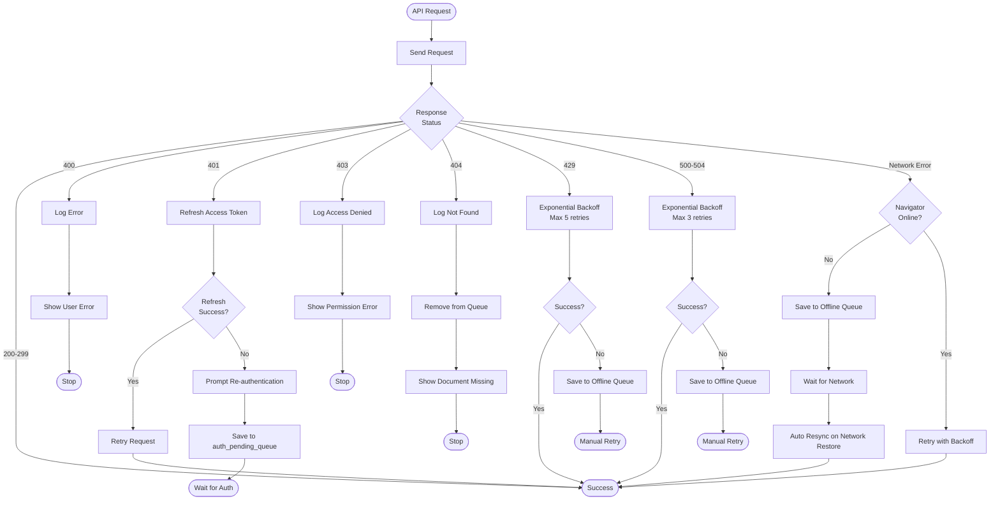

# Technical Design - meeting-minutes-docs-sync: Error Handling

> **プロジェクト**: OAuth 2.0 + Google Docs API統合でGoogle Meetから議事録を自動同期（MVP2）
> **親ドキュメント**: [design.md](../design.md)
> **関連**: [Requirements](../requirements.md) | [Tasks](../tasks.md) | [他のモジュール](README.md)

## Error Handling

### Error Strategy

本機能では、エラーの種類に応じた具体的な回復メカニズムを実装します。

**Error Categories**:
1. **User Errors** (4xx): ユーザー操作起因のエラー
2. **Authentication Errors** (401, 403): トークン関連エラー
3. **Rate Limit Errors** (429): Google Docs APIレート制限
4. **System Errors** (5xx): Google側のエラー
5. **Network Errors**: ネットワーク接続エラー

---

### Error Categories and Responses

#### User Errors (4xx)

**400 Bad Request** (リクエスト形式エラー):
- **Response**: エラーログ記録 + ユーザーへのエラーメッセージ表示
- **Example**: 無効なドキュメントIDを指定した場合
- **Handling**:
  ```typescript
  if (error.status === 400) {
    logger.error('Invalid request format', { documentId, error });
    showError('リクエストが無効です。ドキュメントIDを確認してください');
  }
  ```

**404 Not Found** (ドキュメント不在):
- **Response**: リトライせず、キューから削除 + ユーザー通知
- **Example**: ドキュメントが削除された場合
- **Handling**:
  ```typescript
  if (error.status === 404) {
    logger.error('Document not found', { documentId });
    await queueManager.removeMessage(messageId);
    showError('ドキュメントが見つかりません。削除された可能性があります');
  }
  ```

---

#### Authentication Errors (401, 403)

**401 Unauthorized** (トークン無効):
- **Response**: 自動トークンリフレッシュ → リトライ
- **Fallback**: リフレッシュトークンも無効な場合は再認証を促す
- **Handling** (DOCS-REQ-002.7):
  ```typescript
  if (error.status === 401) {
    try {
      await authManager.refreshToken();
      return await retryRequest(); // リトライ
    } catch (refreshError) {
      // リフレッシュトークンも無効
      showError('認証が期限切れです。再度Googleアカウントにログインしてください');
      await authManager.initiateAuth();
    }
  }
  ```

**403 Forbidden** (権限不足):
- **Response**: リトライせず、ユーザーへのエラーメッセージ表示
- **Example**: ドキュメントへの書き込み権限がない場合
- **Handling** (DOCS-REQ-002.8):
  ```typescript
  if (error.status === 403) {
    logger.error('Access denied', { documentId, error });
    showError('ドキュメントへのアクセス権限がありません。オーナーに編集権限を依頼してください');
  }
  ```

---

#### Rate Limit Errors (429)

**429 Too Many Requests** (レート制限超過):
- **Response**: Exponential Backoffでリトライ（最大5回）
- **Handling** (DOCS-REQ-002.9):
  ```typescript
  if (error.status === 429) {
    const retryAfter = error.headers.get('Retry-After') || 1;
    logger.warn('Rate limit exceeded', { retryAfter, documentId });

    await exponentialBackoff(async () => {
      return await retryRequest();
    }, 5); // 最大5回リトライ
  }
  ```

**Exponential Backoff実装**:
```typescript
async function exponentialBackoff<T>(
  fn: () => Promise<T>,
  maxRetries: number = 5
): Promise<T> {
  let delay = 1000; // 初回1秒

  for (let i = 0; i < maxRetries; i++) {
    try {
      return await fn();
    } catch (error) {
      if (i === maxRetries - 1) {
        throw error; // 最後のリトライ失敗
      }

      // Jitter（ランダム遅延）を追加
      const jitter = Math.random() * 1000;
      await sleep(delay + jitter);

      delay *= 2; // 指数バックオフ（1s → 2s → 4s → 8s → 16s）
      delay = Math.min(delay, 60000); // 最大60秒
    }
  }
}
```

---

#### System Errors (5xx)

**500-504 Server Error** (Google側エラー):
- **Response**: Exponential Backoffでリトライ（最大3回）
- **Handling**:
  ```typescript
  if ([500, 502, 503, 504].includes(error.status)) {
    logger.error('Server error', { status: error.status, documentId });

    await exponentialBackoff(async () => {
      return await retryRequest();
    }, 3); // 最大3回リトライ
  }
  ```

---

#### Network Errors

**ネットワーク切断**:
- **Response**: オフラインキューに保存 → ネットワーク復帰時に自動再同期
- **Handling** (DOCS-REQ-005.1-3):
  ```typescript
  if (!navigator.onLine) {
    logger.info('Network offline, saving to queue', { messageId });
    await queueManager.enqueue(message);
    syncManager.setMode('offline');
    showNotification('オフライン（同期待機中）');
  }
  ```

**ネットワーク復帰**:
- **Response**: オフラインキューを自動再同期
- **Handling** (DOCS-REQ-005.5-9):
  ```typescript
  window.addEventListener('online', async () => {
    logger.info('Network restored, resyncing queue');
    syncManager.setMode('online');
    await syncManager.resyncOfflineQueue();
    showNotification('同期完了');
  });
  ```

---

### Process Flow: Error Handling Decision Tree



---

### Monitoring

**Error Tracking**:
- **ログレベル**: INFO（正常）、WARN（リトライ可能）、ERROR（リトライ不可）
- **ログ形式**: JSON構造化ログ（Chrome DevTools Consoleで確認可能）
- **ログ内容**:
  ```typescript
  logger.error('API request failed', {
    type: 'GoogleDocsApiError',
    status: error.status,
    documentId: documentId,
    messageId: message.messageId,
    timestamp: Date.now(),
    stackTrace: error.stack,
  });
  ```

**Health Monitoring**:
- **オフラインキューサイズ**: ストレージ使用量を定期監視（5秒間隔）
- **同期成功率**: 過去100メッセージの成功率を記録（デバッグ用）
- **トークン有効期限**: 期限切れ60秒前に自動リフレッシュ（クロックスキュー対策）

---

