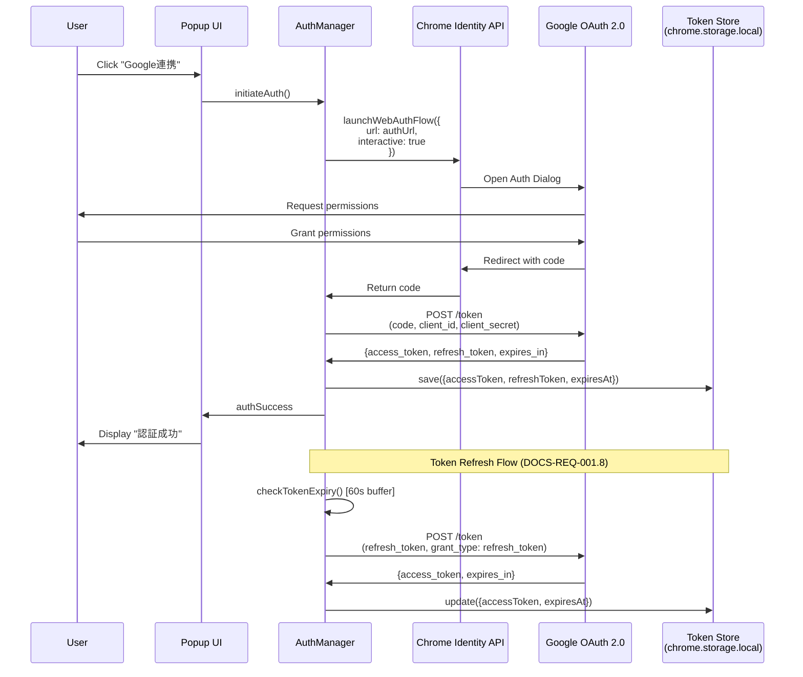
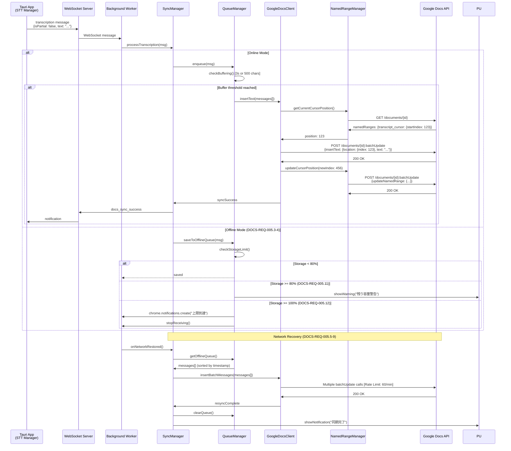

# Technical Design - meeting-minutes-docs-sync: System Flows

> **プロジェクト**: OAuth 2.0 + Google Docs API統合でGoogle Meetから議事録を自動同期（MVP2）
> **親ドキュメント**: [design.md](../design.md)
> **関連**: [Requirements](../requirements.md) | [Tasks](../tasks.md) | [他のモジュール](README.md)

## System Flows

### Sequence: OAuth 2.0 Authentication Flow



**フロー詳細**:
1. **認証開始** (DOCS-REQ-001.1-2): ユーザーが「Google連携」ボタンをクリックし、`chrome.identity.launchWebAuthFlow()`が認証ダイアログを開く
2. **権限許可** (DOCS-REQ-001.3): ユーザーがGoogleアカウントを選択し、`drive.file`スコープの権限を許可
3. **トークン交換** (DOCS-REQ-001.4-5): 認証コードをアクセストークンとリフレッシュトークンに交換し、`chrome.storage.local`に保存
4. **トークンリフレッシュ** (DOCS-REQ-001.8): アクセストークン期限切れの60秒前に自動リフレッシュ（クロックスキュー対策）

---

### Sequence: Real-Time Text Insertion Flow



**フロー詳細**:
1. **文字起こし受信** (DOCS-REQ-004.1-2): Tauriアプリから確定テキスト（`isPartial: false`）をWebSocket経由で受信
2. **バッファリング** (DOCS-REQ-004.6-7): 最大3秒間または500文字までバッファリングし、1回の`batchUpdate`リクエストにまとめる
3. **挿入位置取得** (DOCS-REQ-003.3-4): `transcript_cursor` Named Rangeの現在位置を取得
4. **テキスト挿入** (DOCS-REQ-002.3-6): `insertText`リクエストでテキストを挿入し、Named Rangeの位置を更新
5. **オフライン処理** (DOCS-REQ-005.3-4): ネットワーク切断時は`chrome.storage.local`の`offline_queue`に保存
6. **自動再同期** (DOCS-REQ-005.5-9): ネットワーク復帰時にキュー内のメッセージを時系列順に再送信

---

### Process Flow: Named Range Recovery Logic

```mermaid
flowchart TD
    Start([Named Range消失検知]) --> GetDoc[GET documents API<br/>namedRanges確認]
    GetDoc --> CheckExists{transcript_cursor<br/>存在?}

    CheckExists -->|Yes| GetPosition[startIndexを取得]
    GetPosition --> Success([正常挿入位置取得])

    CheckExists -->|No| Priority1[Priority 1:<br/>見出し検索]
    Priority1 --> SearchHeading[ドキュメント内を検索<br/>"## 文字起こし"]
    SearchHeading --> HeadingFound{見出し発見?}

    HeadingFound -->|Yes| InsertAfterHeading[見出し直後の位置を計算<br/>headingIndex + 1]
    InsertAfterHeading --> CreateNR1[Named Range再作成<br/>createNamedRange API]
    CreateNR1 --> LogWarn1[ERRORログ記録:<br/>"Named Range消失 - 見出し後に再作成"]
    LogWarn1 --> NotifyUser1[UI通知:<br/>"挿入位置が再設定されました"]
    NotifyUser1 --> Success

    HeadingFound -->|No| Priority2[Priority 2:<br/>ドキュメント末尾]
    Priority2 --> GetEndIndex[endIndex取得<br/>body.content最終要素]
    GetEndIndex --> CheckEmpty{ドキュメント<br/>空?}

    CheckEmpty -->|No| CreateNR2[Named Range再作成<br/>position: endIndex - 1]
    CreateNR2 --> LogWarn2[ERRORログ記録:<br/>"Named Range消失 - 末尾に再作成"]
    LogWarn2 --> NotifyUser2[UI通知:<br/>"挿入位置が再設定されました"]
    NotifyUser2 --> Success

    CheckEmpty -->|Yes| Priority3[Priority 3:<br/>先頭位置]
    Priority3 --> CreateNR3[Named Range再作成<br/>position: 1]
    CreateNR3 --> LogWarn3[ERRORログ記録:<br/>"Named Range消失 - 先頭に再作成"]
    LogWarn3 --> NotifyUser3[UI通知:<br/>"挿入位置が再設定されました"]
    NotifyUser3 --> Success
```

**フロー詳細** (DOCS-REQ-003.7-8):
1. **検出**: `documents.get` APIで`transcript_cursor` Named Rangeが存在しないことを検出
2. **Priority 1**: ドキュメント内のテキストを検索し、「## 文字起こし」見出しを検出。見つかった場合は見出し直後にNamed Rangeを再作成
3. **Priority 2**: 見出しが見つからない場合、ドキュメントの`endIndex`（末尾）にNamed Rangeを再作成
4. **Priority 3**: ドキュメントが空の場合、index=1（先頭）にNamed Rangeを再作成
5. **ログと通知**: ERRORレベルログ + ポップアップUI通知により、ユーザーに異常を認識させる

---

