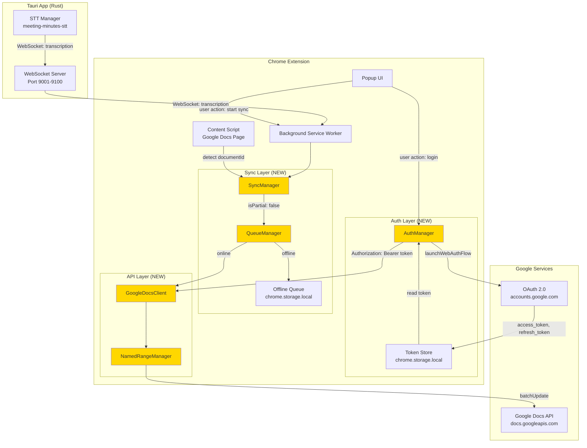
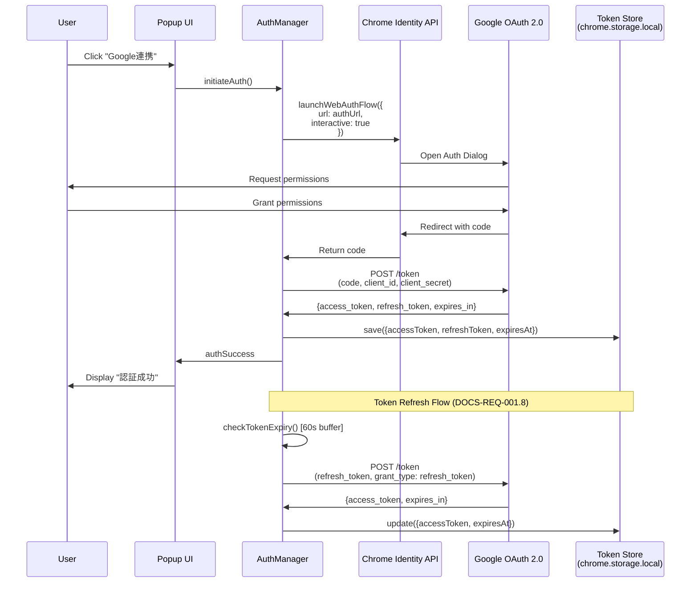
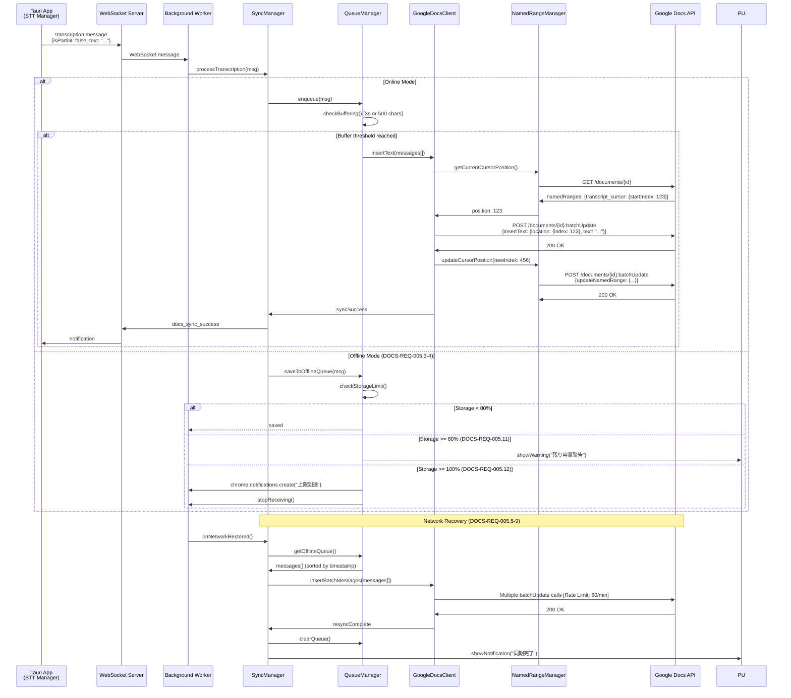
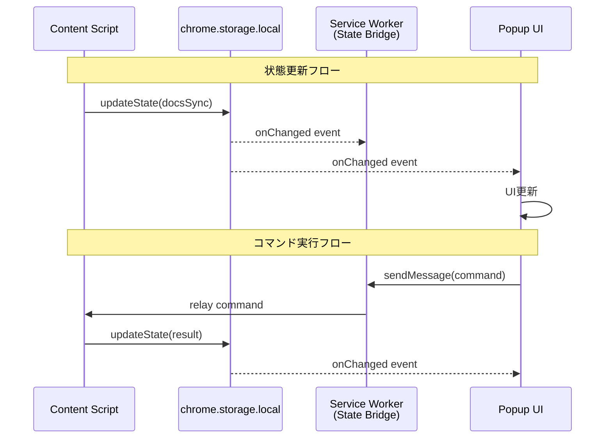
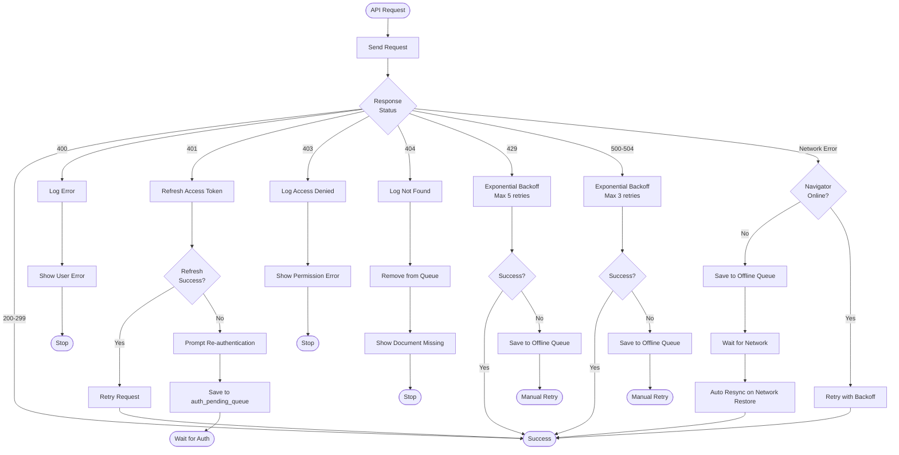

# Technical Design Document - meeting-minutes-docs-sync

## Overview

meeting-minutes-docs-syncは、MVP1（meeting-minutes-stt）で確立した文字起こし機能の出力先として、Google Docsへのリアルタイム同期機能を実装するMVP2フェーズです。本設計は、Chrome拡張経由でのOAuth 2.0認証、Google Docs API統合、Named Range管理、オフライン時の自動キューイングと再同期を実現します。

**Purpose**: 文字起こし結果を即座にGoogle Docsへ反映し、構造化された議事録を自動生成することで、手動転記作業を削減し、チーム共有を加速します。

**Users**: 会議参加者がTauriアプリで録音・文字起こしを実行し、Chrome拡張を通じてGoogle Docsに自動的に議事録を作成します。

**Impact**: meeting-minutes-sttの文字起こし結果配信フローを拡張し、Chrome拡張にOAuth 2.0認証レイヤーとGoogle Docs API統合レイヤーを追加します。オフライン時のキューイング機構により、ネットワーク断絶時も作業継続性を保証します。

### Goals

- **OAuth 2.0認証フロー**: Chrome拡張からGoogleアカウント認証とトークン管理を実現
- **リアルタイム同期**: 文字起こし結果を2秒以内にGoogle Docsへ反映
- **Named Range管理**: 構造化された議事録フォーマットの自動生成と挿入位置管理
- **オフライン対応**: ネットワーク切断時のローカルキューイングと自動再同期
- **エラーハンドリング**: トークンリフレッシュ、APIエラー、レート制限への適切な対処
- **ユーザー設定**: 同期動作のカスタマイズ（タイムスタンプ表示、バッファリング時間等）

### Non-Goals

- LLM要約生成（MVP3 meeting-minutes-llmで実装）
- 本格的なUI洗練（MVP3で実施）
- 複数ドキュメント同時編集
- リアルタイムコラボレーション機能
- トークンの暗号化保存（MVP2では`chrome.storage.local`に平文保存、MVP3で暗号化実装予定）

---

## Architecture

### Existing Architecture Analysis

meeting-minutes-docs-syncは、既存の基盤の上に構築されます:

**meeting-minutes-core (MVP0) からの継承**:
- WebSocketサーバー（ポート9001-9100動的割り当て）
- Chrome拡張スケルトン（WebSocket接続機能）
- プロセス境界の明確化（Tauri/Python/Chrome拡張の3プロセス分離）

**meeting-minutes-stt (MVP1) からの継承**:
- WebSocketメッセージ形式（`transcription` type、`isPartial`、`confidence`、`language`フィールド）
- 確定テキスト配信フロー（`isPartial: false`）
- セッション管理（`sessionId`、`messageId`）

**既存パターンの尊重**:
- WebSocketメッセージ形式を拡張し、`docsSync`フィールドを追加
- Chrome拡張の`chrome.storage.local`による設定管理パターンを踏襲
- エラーログ形式（INFO/DEBUG/ERRORレベル）の一貫性維持

**新規コンポーネントの追加理由**:
- **AuthManager**: OAuth 2.0フローの複雑さを抽象化し、トークンライフサイクル管理を一元化
- **GoogleDocsClient**: Google Docs API呼び出しを抽象化し、レート制限対応とエラーハンドリングをカプセル化
- **SyncManager**: オフライン/オンライン状態の管理、キューイング、自動再同期を統合管理
- **QueueManager**: オフラインキューの永続化、優先度管理、ストレージ使用量監視

### High-Level Architecture



**アーキテクチャの特徴**:
- **レイヤー分離**: 認証（Auth Layer）、同期制御（Sync Layer）、API通信（API Layer）を明確に分離
- **オフラインファースト**: オフライン時はローカルキューに保存し、オンライン復帰時に自動同期
- **トークンライフサイクル管理**: アクセストークンの期限切れ時の自動リフレッシュとエラーハンドリング
- **レート制限対応**: バッファリング（最大3秒）とバッチ処理により、Google Docs APIレート制限（60リクエスト/分）を遵守
- **MV3 Service Worker対応**: `chrome.alarms` API使用、Offscreen Document（WebSocket維持用）

### WebSocket維持戦略（MV3対応）

**課題**: MV3 Service Workerは5分でタイムアウトし、WebSocket接続が切断される。

**解決策**: **Offscreen Document**を使用してWebSocket接続を維持する。

```typescript
// manifest.json
{
  "permissions": ["offscreen", "alarms"],
  "background": {
    "service_worker": "background.js"
  }
}

// background.js (Service Worker)
/**
 * Offscreen Documentライフサイクル管理
 *
 * Chrome再起動、拡張SW再読み込み、Offscreenクラッシュ時に確実に再生成するため、
 * 接続要求ごとに存在確認→未生成なら作成する "ensure" パターンを採用
 */
async function ensureOffscreenDocument(): Promise<void> {
  // Chrome 116+ API: 存在確認
  const hasDocument = await chrome.offscreen.hasDocument();

  if (!hasDocument) {
    await chrome.offscreen.createDocument({
      url: 'offscreen.html',
      reasons: [chrome.offscreen.Reason.WEBSOCKET],
      justification: 'Maintain WebSocket connection for real-time transcription sync'
    });
    console.log('Offscreen Document created');
  }
}

// (1) ブラウザ再起動時
chrome.runtime.onStartup.addListener(async () => {
  await ensureOffscreenDocument();
});

// (2) 拡張インストール/更新時
chrome.runtime.onInstalled.addListener(async () => {
  await ensureOffscreenDocument();
});

// (3) WebSocket接続開始時（後述のメッセージハンドラーから呼び出し）
chrome.runtime.onMessage.addListener(async (message, sender, sendResponse) => {
  if (message.type === 'start_sync') {
    await ensureOffscreenDocument();
    // Offscreenへ接続指示
    chrome.runtime.sendMessage({ type: 'ws_connect' });
  }

  // Offscreen側からのWS切断通知
  if (message.type === 'ws_disconnected') {
    console.warn('WebSocket disconnected, attempting recovery...');
    await ensureOffscreenDocument();
    // 再接続指示
    chrome.runtime.sendMessage({ type: 'ws_reconnect' });
  }
});

// offscreen.js (持続文脈でWebSocket維持)
/**
 * WebSocketポート動的検出
 *
 * meeting-minutes-coreの仕様（9001-9100の動的割り当て）に準拠し、
 * ポートスキャンで実際のポートを検出する
 */
async function connectToTauriWebSocket(): Promise<WebSocket> {
  const portRange = Array.from({ length: 100 }, (_, i) => 9001 + i);
  let lastSuccessfulPort: number | null = null;

  // 直近の成功ポートを優先試行（再接続時の最適化）
  if (lastSuccessfulPort) {
    try {
      const ws = await tryConnect(lastSuccessfulPort);
      console.log(`WebSocket reconnected on port ${lastSuccessfulPort}`);
      return ws;
    } catch (error) {
      console.warn(`Last port ${lastSuccessfulPort} failed, scanning all ports...`);
    }
  }

  // 10ポートずつチャンク実行（CPU配慮）
  for (let i = 0; i < portRange.length; i += 10) {
    const chunk = portRange.slice(i, i + 10);
    const promises = chunk.map(port => tryConnect(port));

    try {
      const ws = await Promise.any(promises);
      const connectedPort = parseInt(ws.url.split(':')[2]);
      lastSuccessfulPort = connectedPort;
      console.log(`WebSocket connected on port ${connectedPort}`);
      return ws;
    } catch (error) {
      // 次のチャンクへ
    }
  }

  throw new Error('Failed to connect to Tauri WebSocket server (ports 9001-9100)');
}

async function tryConnect(port: number): Promise<WebSocket> {
  return new Promise((resolve, reject) => {
    const ws = new WebSocket(`ws://localhost:${port}`);
    const timeout = setTimeout(() => {
      ws.close();
      reject(new Error(`Port ${port} timeout`));
    }, 500); // 短タイムアウト

    ws.onopen = () => {
      clearTimeout(timeout);
      resolve(ws);
    };
    ws.onerror = () => {
      clearTimeout(timeout);
      reject(new Error(`Port ${port} connection failed`));
    };
  });
}

// WebSocket接続開始
let ws: WebSocket | null = null;

chrome.runtime.onMessage.addListener(async (message) => {
  if (message.type === 'ws_connect' || message.type === 'ws_reconnect') {
    try {
      ws = await connectToTauriWebSocket();

      ws.onmessage = (event) => {
        // Service Workerへメッセージ転送
        chrome.runtime.sendMessage({
          type: 'transcription',
          data: JSON.parse(event.data)
        });
      };

      ws.onerror = (error) => {
        console.error('WebSocket error:', error);
      };

      ws.onclose = () => {
        console.warn('WebSocket closed, notifying Service Worker...');
        // Service Workerへ切断通知
        chrome.runtime.sendMessage({ type: 'ws_disconnected' });
      };

    } catch (error) {
      console.error('Failed to connect:', error);
      // Service Workerへエラー通知
      chrome.runtime.sendMessage({ type: 'ws_connect_failed', error: error.message });
    }
  }

  // Service Workerからのメッセージを受信
  if (message.type === 'send_to_tauri' && ws) {
    ws.send(JSON.stringify(message.data));
  }
});
```

**利点**:
- WebSocket接続がService Workerのタイムアウトに影響されない
- Offscreen DocumentはManifest V2のbackground pageと同等の持続性を持つ
- Chrome 109+で利用可能

---

## Technology Stack and Design Decisions

### Technology Alignment

meeting-minutes-docs-syncは、既存のChrome拡張技術スタックを拡張します:

**既存技術スタック（meeting-minutes-core, meeting-minutes-stt）**:
- **Chrome Extension Manifest V3**: Service Worker、Content Scripts、Popup UI
- **WebSocket**: `chrome.runtime.sendMessage` / `chrome.runtime.onMessage`
- **Storage**: `chrome.storage.local`（設定、セッション状態）

**新規導入ライブラリ**:
- **Chrome Identity API**: `chrome.identity.launchWebAuthFlow()`（OAuth 2.0認証フロー）
- **Fetch API**: Google Docs API通信（HTTPSリクエスト）
- **Chrome Notifications API**: `chrome.notifications.create()`（オフラインキュー上限通知）

**技術選択の根拠**:
- **Chrome Identity API**: Chrome拡張に最適化されたOAuth 2.0実装。リダイレクトURI処理を自動化
- **Fetch API**: ブラウザ標準API。`async/await`による可読性の高い非同期処理
- **chrome.storage.local**: Service Workerで利用可能な永続ストレージ。トークンとオフラインキューを保存

### Key Design Decisions

#### Decision 1: OAuth 2.0スコープの選択 - 必要最小限のスコープ組み合わせ

**Decision**: `documents` + `drive.file` スコープの組み合わせを使用する

**Context**: Google Docs API `batchUpdate`メソッドは、ドキュメントへの書き込み権限を必要とする。公式ドキュメントの検証により、`drive.file`のみでは不十分であることが判明した。

**Alternatives**:
1. **`documents`のみ**: 全Google Docsドキュメントへの完全アクセス（Sensitive Scope）
2. **`drive.file`のみ**: アプリで作成/共有されたファイルのみ（Non-sensitive）だが、Docs API書き込みには不足
3. **`documents` + `drive.file`**: Docs書き込み権限 + ファイルアクセス制限の組み合わせ（推奨）
4. **`drive`**: 全ファイルへの完全アクセス（Restricted Scope - 最も強い制限）

**Selected Approach**: **`documents` + `drive.file` スコープの組み合わせ**

```json
{
  "scopes": [
    "https://www.googleapis.com/auth/documents",
    "https://www.googleapis.com/auth/drive.file"
  ]
}
```

**Rationale**:
- **Google Docs API要件**: `documents`スコープはGoogle Docs API `batchUpdate`の書き込みに必須
- **最小権限の原則**: `drive.file`と組み合わせることで、アプリが作成/共有されたファイルのみにアクセスを制限
- **ユーザー信頼性**: 許可画面で明確な説明（「Google Docsの編集」+「アプリで作成したファイルのみ」）

**Trade-offs**:
- **得られるもの**: Google Docs API書き込み権限、ファイルアクセス制限、機能性の保証
- **失うもの**: `documents`はSensitive Scopeのため、OAuth同意画面で明確な説明が必要

**重要な注意事項**:
- `documents`スコープはSensitiveカテゴリのため、OAuth同意画面でユーザーに「Google Docsドキュメントの閲覧・編集・作成・削除」と表示される
- ユーザーに対して、アプリが「アクティブなドキュメントのみ」にアクセスすることを明確に説明する必要がある

---

#### Decision 2: Named Range管理戦略 - 自動再作成ロジック

**Decision**: Named Range (`transcript_cursor`) 消失時に、段階的フォールバック戦略で自動再作成する

**Context**: ユーザーがGoogle Docs上でNamed Rangeを手動削除、または他のツールが削除した場合、文字起こしの挿入位置が不明になる。

**Alternatives**:
1. **エラー停止**: Named Range消失時に同期を停止し、ユーザーに手動設定を促す
2. **ドキュメント末尾固定**: 常にドキュメントの末尾に追記する（構造化フォーマット無視）
3. **段階的フォールバック**: 複数の検出ロジックを試行し、最適な位置に自動再作成

**Selected Approach**: **段階的フォールバック戦略**

```typescript
async function recoverNamedRange(documentId: string): Promise<number> {
  // Priority 1: Search for "## 文字起こし" heading
  const headingIndex = await findHeadingIndex(documentId, "## 文字起こし");
  if (headingIndex !== null) {
    return headingIndex + 1; // Insert after heading
  }

  // Priority 2: Document end
  const doc = await getDocument(documentId);
  return doc.body.content[doc.body.content.length - 1].endIndex - 1;

  // Priority 3 (edge case): Empty document
  return 1; // Start of document
}
```

**Rationale**:
- **ユーザー体験**: エラーで停止せず、自動復旧により作業継続性を保証
- **構造化維持**: 「## 文字起こし」見出しを検索することで、構造化フォーマットを尊重
- **ログと通知**: ERRORレベルログ + UI通知により、ユーザーに異常を認識させる

**Trade-offs**:
- **得られるもの**: 高い可用性、ユーザーの手間削減、構造化フォーマット維持
- **失うもの**: 予期しない位置への挿入リスク（ログと通知で緩和）

---

#### Decision 3: オフラインキュー管理 - Storage上限対策と警告システム

**Decision**: オフラインキューに2段階の警告システムを実装し、上限到達時は新規メッセージの受信を停止する

**Context**: `chrome.storage.local`のデフォルト上限は10MBで、長時間のオフライン状態では文字起こしメッセージが蓄積しストレージ溢れのリスクがある。

**Alternatives**:
1. **無制限許可要求**: `unlimitedStorage`パーミッションを要求（ユーザーからの信頼低下リスク）
2. **古いメッセージを削除**: FIFOで古いメッセージを削除（データロスのリスク）
3. **2段階警告 + 受信停止**: 80%で警告、100%で新規受信停止とユーザー通知

**Selected Approach**: **2段階警告 + 受信停止**

```typescript
// DOCS-REQ-005.11: 80%到達時の警告
if (queueSize >= MAX_QUEUE_SIZE * 0.8) {
  showPopupWarning(`オフラインキューが残り${MAX_QUEUE_SIZE - queueSize}件です。ネットワーク接続を確認してください`);
}

// DOCS-REQ-005.12: 100%到達時の全画面通知
if (queueSize >= MAX_QUEUE_SIZE) {
  chrome.notifications.create({
    type: 'basic',
    iconUrl: 'icon.png',
    title: 'オフラインキュー上限到達',
    message: 'これ以上の文字起こしは保存されません。録音を停止するか、ネットワーク接続を回復してください'
  });
  stopReceivingMessages();
}
```

**Rationale**:
- **データ完全性**: データロスを回避し、ユーザーに明確な選択肢を提示
- **ユーザー制御**: 録音停止かネットワーク復旧の選択権をユーザーに委ねる
- **段階的劣化**: 突然の停止ではなく、事前警告により心理的負担を軽減

**Trade-offs**:
- **得られるもの**: データ完全性、ユーザーの意思決定サポート、予測可能な動作
- **失うもの**: 長時間オフライン時の自動継続性（設計上の制約として許容）

---

## System Flows

### Sequence: OAuth 2.0 Authentication Flow



**フロー詳細**:
1. **認証開始** (DOCS-REQ-001.1-2): ユーザーが「Google連携」ボタンをクリックし、`chrome.identity.launchWebAuthFlow()`が認証ダイアログを開く
2. **権限許可** (DOCS-REQ-001.3): ユーザーがGoogleアカウントを選択し、`drive.file`スコープの権限を許可
3. **トークン交換** (DOCS-REQ-001.4-5): 認証コードをアクセストークンとリフレッシュトークンに交換し、`chrome.storage.local`に保存
4. **トークンリフレッシュ** (DOCS-REQ-001.8): アクセストークン期限切れの60秒前に自動リフレッシュ（クロックスキュー対策）

---

### Sequence: Real-Time Text Insertion Flow



**フロー詳細**:
1. **文字起こし受信** (DOCS-REQ-004.1-2): Tauriアプリから確定テキスト（`isPartial: false`）をWebSocket経由で受信
2. **バッファリング** (DOCS-REQ-004.6-7): 最大3秒間または500文字までバッファリングし、1回の`batchUpdate`リクエストにまとめる
3. **挿入位置取得** (DOCS-REQ-003.3-4): `transcript_cursor` Named Rangeの現在位置を取得
4. **テキスト挿入** (DOCS-REQ-002.3-6): `insertText`リクエストでテキストを挿入し、Named Rangeの位置を更新
5. **オフライン処理** (DOCS-REQ-005.3-4): ネットワーク切断時は`chrome.storage.local`の`offline_queue`に保存
6. **自動再同期** (DOCS-REQ-005.5-9): ネットワーク復帰時にキュー内のメッセージを時系列順に再送信

---

### Process Flow: Named Range Recovery Logic

```mermaid
flowchart TD
    Start([Named Range消失検知]) --> GetDoc[GET documents API<br/>namedRanges確認]
    GetDoc --> CheckExists{transcript_cursor<br/>存在?}

    CheckExists -->|Yes| GetPosition[startIndexを取得]
    GetPosition --> Success([正常挿入位置取得])

    CheckExists -->|No| Priority1[Priority 1:<br/>見出し検索]
    Priority1 --> SearchHeading[ドキュメント内を検索<br/>"## 文字起こし"]
    SearchHeading --> HeadingFound{見出し発見?}

    HeadingFound -->|Yes| InsertAfterHeading[見出し直後の位置を計算<br/>headingIndex + 1]
    InsertAfterHeading --> CreateNR1[Named Range再作成<br/>createNamedRange API]
    CreateNR1 --> LogWarn1[ERRORログ記録:<br/>"Named Range消失 - 見出し後に再作成"]
    LogWarn1 --> NotifyUser1[UI通知:<br/>"挿入位置が再設定されました"]
    NotifyUser1 --> Success

    HeadingFound -->|No| Priority2[Priority 2:<br/>ドキュメント末尾]
    Priority2 --> GetEndIndex[endIndex取得<br/>body.content最終要素]
    GetEndIndex --> CheckEmpty{ドキュメント<br/>空?}

    CheckEmpty -->|No| CreateNR2[Named Range再作成<br/>position: endIndex - 1]
    CreateNR2 --> LogWarn2[ERRORログ記録:<br/>"Named Range消失 - 末尾に再作成"]
    LogWarn2 --> NotifyUser2[UI通知:<br/>"挿入位置が再設定されました"]
    NotifyUser2 --> Success

    CheckEmpty -->|Yes| Priority3[Priority 3:<br/>先頭位置]
    Priority3 --> CreateNR3[Named Range再作成<br/>position: 1]
    CreateNR3 --> LogWarn3[ERRORログ記録:<br/>"Named Range消失 - 先頭に再作成"]
    LogWarn3 --> NotifyUser3[UI通知:<br/>"挿入位置が再設定されました"]
    NotifyUser3 --> Success
```

**フロー詳細** (DOCS-REQ-003.7-8):
1. **検出**: `documents.get` APIで`transcript_cursor` Named Rangeが存在しないことを検出
2. **Priority 1**: ドキュメント内のテキストを検索し、「## 文字起こし」見出しを検出。見つかった場合は見出し直後にNamed Rangeを再作成
3. **Priority 2**: 見出しが見つからない場合、ドキュメントの`endIndex`（末尾）にNamed Rangeを再作成
4. **Priority 3**: ドキュメントが空の場合、index=1（先頭）にNamed Rangeを再作成
5. **ログと通知**: ERRORレベルログ + ポップアップUI通知により、ユーザーに異常を認識させる

---

## Backend State Management (Tauri Side)

### Overview

meeting-minutes-docs-syncでは、Chrome拡張からのGoogle Docs同期イベント（`docs_sync_started`, `docs_sync_success`等）をTauri側で管理し、STT Managerから配信される原型TranscriptionMessageに`docsSync`フィールドを合成する必要があります。

この責務を担うのが**SyncStateStore**です。

### Architecture

```
[STT Manager] → 原型TranscriptionMessage (docsSyncなし)
     ↓
[WebSocketService] → SyncStateStoreで状態読み取り
     ↓
[enrich_message()] → docsSyncフィールドを合成
     ↓
[Chrome拡張] ← 拡張版TranscriptionMessage (docsSyncあり)
```

**責務の明確化**:
- **STT Manager**: 文字起こし結果の生成のみ（Google Docs同期は関知しない）
- **WebSocketService**: セッション状態の管理とメッセージ拡張
- **SyncStateStore**: 同期状態の永続化と読み取り
- **Chrome拡張**: Google Docs API呼び出しと状態イベントの送信

### SyncStateStore Design

#### Rust実装（src-tauri/src/services/sync_state_store.rs）

```rust
use std::collections::HashMap;
use std::sync::Arc;
use tokio::sync::RwLock;
use serde::{Deserialize, Serialize};

/// Google Docs同期状態ストア
pub struct SyncStateStore {
    /// sessionId → SyncState のマッピング
    states: Arc<RwLock<HashMap<String, SyncState>>>,
}

impl SyncStateStore {
    pub fn new() -> Self {
        Self {
            states: Arc::new(RwLock::new(HashMap::new())),
        }
    }

    /// Chrome拡張からのイベントを状態に反映
    pub async fn handle_sync_event(&self, event: SyncEvent) {
        let mut states = self.states.write().await;
        match event {
            SyncEvent::DocsSyncStarted { session_id, document_id, document_title } => {
                states.insert(session_id, SyncState {
                    enabled: true,
                    status: SyncStatus::Queued,
                    document_id: Some(document_id),
                    document_title: Some(document_title),
                    last_updated: current_timestamp(),
                });
            }
            SyncEvent::DocsSyncSuccess { session_id, .. } => {
                if let Some(state) = states.get_mut(&session_id) {
                    state.status = SyncStatus::Synced;
                    state.last_updated = current_timestamp();
                }
            }
            // ... 他のイベント処理
        }
    }

    /// TranscriptionMessageにdocsSyncフィールドを合成
    pub async fn enrich_message(
        &self,
        session_id: &str,
        mut msg: TranscriptionMessage,
    ) -> TranscriptionMessage {
        let states = self.states.read().await;
        if let Some(state) = states.get(session_id) {
            msg.docs_sync = Some(DocsSyncField {
                enabled: state.enabled,
                status: match state.status {
                    SyncStatus::Synced => "synced",
                    SyncStatus::Queued => "queued",
                    SyncStatus::Failed => "failed",
                }.to_string(),
                document_id: state.document_id.clone(),
            });
        }
        msg
    }
}

/// セッションごとの同期状態
#[derive(Clone, Debug, Serialize, Deserialize)]
pub struct SyncState {
    pub enabled: bool,
    pub status: SyncStatus,
    pub document_id: Option<String>,
    pub document_title: Option<String>,
    pub last_updated: u64, // Unix timestamp
}

#[derive(Clone, Debug, Serialize, Deserialize)]
#[serde(rename_all = "lowercase")]
pub enum SyncStatus {
    Synced,
    Queued,
    Failed,
}
```

**完全な実装詳細**: [design-backend-state-insert.md](./design-backend-state-insert.md)（376行のRust実装例、テスト戦略、メッセージフロー）

### WebSocketService統合

```rust
pub struct WebSocketService {
    clients: Arc<RwLock<HashMap<String, WebSocketClient>>>,
    sync_store: Arc<SyncStateStore>, // NEW
}

impl WebSocketService {
    /// STT Managerから受信したTranscriptionMessageを送信
    pub async fn send_transcription(&self, session_id: &str, msg: TranscriptionMessage) -> Result<()> {
        // 原型メッセージ（docsSyncなし）
        // ↓
        // SyncStateStoreで状態を読み取り、docsSyncフィールドを合成
        let enriched = self.sync_store.enrich_message(session_id, msg).await;
        // ↓
        // Chrome拡張へ送信
        self.send_to_client(session_id, enriched).await
    }

    /// Chrome拡張からのイベントを処理
    pub async fn handle_chrome_event(&self, event: SyncEvent) -> Result<()> {
        self.sync_store.handle_sync_event(event).await;
        Ok(())
    }
}
```

---

## Requirements Traceability

| Requirement | Components | Interfaces | Flows |
|-------------|-----------|------------|-------|
| **DOCS-REQ-001**: OAuth 2.0 Authentication | AuthManager, TokenStore | `initiateAuth()`, `refreshToken()`, `revokeToken()` | OAuth 2.0 Authentication Flow |
| **DOCS-REQ-002**: Google Docs API Integration | GoogleDocsClient, NamedRangeManager | `insertText()`, `batchUpdate()`, `getDocument()` | Real-Time Text Insertion Flow |
| **DOCS-REQ-003**: Named Range Management | NamedRangeManager | `createNamedRange()`, `getCurrentPosition()`, `updatePosition()` | Named Range Recovery Logic |
| **DOCS-REQ-004**: Real-Time Text Insertion | SyncManager, QueueManager | `processTranscription()`, `checkBuffering()` | Real-Time Text Insertion Flow |
| **DOCS-REQ-005**: Offline Queueing | QueueManager, OfflineQueue | `saveToOfflineQueue()`, `getOfflineQueue()`, `clearQueue()` | Real-Time Text Insertion Flow (Offline Mode) |
| **DOCS-REQ-006**: Document Structure | NamedRangeManager, GoogleDocsClient | `generateStructure()`, `insertWithTimestamp()` | Real-Time Text Insertion Flow |
| **DOCS-REQ-007**: WebSocket Protocol Extension | **SyncStateStore (Tauri)**, SyncManager, Background Worker | `handle_sync_event()`, `enrich_message()`, `docs_sync_*` events | Backend State Management, Real-Time Text Insertion Flow |
| **DOCS-REQ-008**: Settings and Preferences | SettingsManager | `getSetting()`, `updateSetting()` | Real-Time Text Insertion Flow (Buffering) |

**DOCS-REQ-007詳細**: Tauri側の`SyncStateStore`がChrome拡張からの同期イベント（`docs_sync_started`, `docs_sync_success`等）を受信し、セッション状態を管理します。STT Managerからの原型TranscriptionMessageに`docsSync`フィールドを`enrich_message()`で合成してChrome拡張へ配信します。

---

## Components and Interfaces

### Auth Domain

#### AuthManager

**Responsibility & Boundaries**
- **Primary Responsibility**: OAuth 2.0認証フローの実行とトークンライフサイクル管理
- **Domain Boundary**: Chrome Extension内の認証レイヤー（他のドメインからはインターフェースを通じてアクセス）
- **Data Ownership**: アクセストークン、リフレッシュトークン、有効期限の管理
- **Transaction Boundary**: トークン取得/リフレッシュ/無効化の一貫性を保証

**Dependencies**
- **Inbound**: SyncManager、GoogleDocsClient（トークンを要求）
- **Outbound**: Chrome Identity API、TokenStore、Google OAuth 2.0エンドポイント
- **External**: `chrome.identity.launchWebAuthFlow()`、Google OAuth 2.0 Token Endpoint

**Contract Definition**

**Service Interface**:
```typescript
interface AuthManager {
  /**
   * OAuth 2.0認証フローを開始し、アクセストークンとリフレッシュトークンを取得する
   *
   * @preconditions chrome.identity APIが利用可能
   * @postconditions トークンがTokenStoreに保存される
   * @invariants リフレッシュトークンは有効期限なし（無効化されるまで有効）
   * @throws AuthError トークン取得失敗、ユーザーキャンセル
   */
  initiateAuth(): Promise<Result<AuthTokens, AuthError>>;

  /**
   * アクセストークンを取得する。期限切れの場合は自動リフレッシュ
   *
   * @preconditions TokenStoreにリフレッシュトークンが保存されている
   * @postconditions 有効なアクセストークンが返される
   * @invariants 期限切れ60秒前に自動リフレッシュ
   * @throws TokenExpiredError リフレッシュトークンも無効
   */
  getAccessToken(): Promise<Result<string, TokenExpiredError>>;

  /**
   * リフレッシュトークンを使用してアクセストークンを更新する
   *
   * @preconditions リフレッシュトークンが有効
   * @postconditions 新しいアクセストークンがTokenStoreに保存される
   * @throws RefreshError リフレッシュトークンが無効
   */
  refreshToken(): Promise<Result<string, RefreshError>>;

  /**
   * トークンを無効化し、TokenStoreから削除する
   *
   * @postconditions TokenStoreが空になる
   * @throws RevokeError トークン無効化失敗（ベストエフォート）
   */
  revokeToken(): Promise<Result<void, RevokeError>>;
}

type AuthTokens = {
  accessToken: string;
  refreshToken: string;
  expiresAt: number; // Unix timestamp
};

type AuthError =
  | { type: 'UserCancelled' }
  | { type: 'NetworkError'; message: string }
  | { type: 'InvalidGrant'; message: string };

type TokenExpiredError = {
  type: 'RefreshRequired';
  message: string;
};

type RefreshError = {
  type: 'InvalidRefreshToken';
  message: string;
};

type RevokeError = {
  type: 'RevokeFailed';
  message: string;
};
```

**State Management**:
- **State Model**: `NotAuthenticated` → `Authenticating` → `Authenticated` → `TokenExpired` → `Authenticated` (ループ)
- **Persistence**: `chrome.storage.local` (`auth_tokens` key)
- **Concurrency**: トークンリフレッシュ中は他のAPIリクエストを待機（Mutex）

**Integration Strategy**:
- **Modification Approach**: 新規追加（Chrome拡張に認証レイヤーを追加）
- **Backward Compatibility**: 既存のWebSocket通信には影響なし

---

#### TokenStore

**Responsibility & Boundaries**
- **Primary Responsibility**: OAuth 2.0トークンの永続化とCRUD操作
- **Domain Boundary**: Auth Domainのデータ永続化層
- **Data Ownership**: アクセストークン、リフレッシュトークン、有効期限
- **Transaction Boundary**: 単一トークンセットの読み書き（原子性保証）

**Dependencies**
- **Inbound**: AuthManager
- **Outbound**: `chrome.storage.local`

**Contract Definition**:
```typescript
interface TokenStore {
  /**
   * トークンを保存する
   *
   * @preconditions chrome.storage.localが利用可能
   * @postconditions トークンがストレージに永続化される
   * @throws StorageError ストレージ書き込み失敗
   */
  saveTokens(tokens: AuthTokens): Promise<Result<void, StorageError>>;

  /**
   * トークンを取得する
   *
   * @postconditions トークンが存在しない場合はnullを返す
   */
  getTokens(): Promise<AuthTokens | null>;

  /**
   * トークンを削除する
   *
   * @postconditions ストレージからトークンが削除される
   */
  clearTokens(): Promise<void>;
}

type StorageError = {
  type: 'QuotaExceeded' | 'WriteError';
  message: string;
};
```

---

### Sync Domain

#### SyncManager

**Responsibility & Boundaries**
- **Primary Responsibility**: 文字起こしメッセージの受信、オンライン/オフライン状態管理、自動同期制御
- **Domain Boundary**: Sync Domainの中心コンポーネント（オーケストレーター）
- **Data Ownership**: 同期ステータス、ドキュメントID、現在の同期モード
- **Transaction Boundary**: 単一メッセージの処理（オンライン/オフラインへのルーティング）

**Dependencies**
- **Inbound**: Background Worker（WebSocketメッセージ受信）
- **Outbound**: QueueManager、GoogleDocsClient、Tauri App（WebSocket）
- **External**: ネットワーク状態監視（`navigator.onLine`）

**Contract Definition**:
```typescript
interface SyncManager {
  /**
   * Google Docs同期を開始する
   *
   * @preconditions AuthManagerで認証済み、Google Docsタブがアクティブ
   * @postconditions ドキュメントIDが取得され、Named Rangeが作成される
   * @throws SyncStartError ドキュメントID取得失敗、Named Range作成失敗
   */
  startSync(documentId: string): Promise<Result<void, SyncStartError>>;

  /**
   * 文字起こしメッセージを処理する
   *
   * @preconditions startSync()実行済み
   * @postconditions オンライン時はGoogleDocsClientへ送信、オフライン時はQueueManagerへ保存
   */
  processTranscription(message: TranscriptionMessage): Promise<Result<void, ProcessError>>;

  /**
   * ネットワーク復帰時にオフラインキューを再同期する
   *
   * @preconditions オフラインキューにメッセージが存在
   * @postconditions 全メッセージの送信完了後にキューがクリアされる
   * @throws ResyncError 再送信中のエラー
   */
  resyncOfflineQueue(): Promise<Result<void, ResyncError>>;

  /**
   * Google Docs同期を停止する
   *
   * @postconditions 同期ステータスがリセットされる
   */
  stopSync(): Promise<void>;

  /**
   * 現在の同期ステータスを取得する
   */
  getStatus(): SyncStatus;
}

type SyncStatus = {
  mode: 'online' | 'offline' | 'stopped';
  documentId: string | null;
  documentTitle: string | null;
  queuedMessages: number;
};

type TranscriptionMessage = {
  messageId: number;
  sessionId: string;
  timestamp: number;
  type: 'transcription';
  isPartial: boolean;
  text: string;
  confidence?: number;
  language?: string;
};

type SyncStartError =
  | { type: 'NotAuthenticated' }
  | { type: 'InvalidDocumentId' }
  | { type: 'NamedRangeCreationFailed'; message: string };

type ProcessError = {
  type: 'SyncNotStarted' | 'NetworkError' | 'QueueFull';
  message: string;
};

type ResyncError = {
  type: 'PartialFailure';
  failedMessages: TranscriptionMessage[];
  message: string;
};
```

**Event Contract** (WebSocket経由でTauriアプリへ送信):
```typescript
type SyncEvent =
  | { type: 'docs_sync_started'; documentId: string; documentTitle: string; timestamp: number }
  | { type: 'docs_sync_offline'; queuedMessages: number; timestamp: number }
  | { type: 'docs_sync_online'; resyncInProgress: boolean; timestamp: number }
  | { type: 'docs_sync_success'; messageId: number; insertedAt: string }
  | { type: 'docs_sync_error'; messageId: number; error: string };
```

**State Management**:
- **State Model**: `Stopped` → `Starting` → `OnlineSync` ⇄ `OfflineQueue` → `Resyncing` → `OnlineSync`
- **Persistence**: `chrome.storage.local` (`sync_status` key)
- **Concurrency**: 再同期中は新規メッセージを一時バッファに保存

---

#### QueueManager

**Responsibility & Boundaries**
- **Primary Responsibility**: オフラインキューの管理（追加、取得、クリア、ストレージ監視）
- **Domain Boundary**: Sync Domainのデータ永続化層
- **Data Ownership**: オフラインキューのメッセージリスト、ストレージ使用量
- **Transaction Boundary**: 単一メッセージの追加/削除操作（原子性保証）

**Dependencies**
- **Inbound**: SyncManager
- **Outbound**: `chrome.storage.local`、`chrome.notifications`
- **External**: ストレージAPI

**Contract Definition**:
```typescript
interface QueueManager {
  /**
   * メッセージをオフラインキューに追加する
   *
   * @preconditions ストレージ使用量が上限未満
   * @postconditions メッセージがキューに追加される
   * @throws QueueFullError ストレージ上限到達
   */
  enqueue(message: TranscriptionMessage): Promise<Result<void, QueueFullError>>;

  /**
   * オフラインキューの全メッセージを取得する（時系列順）
   *
   * @postconditions メッセージがtimestamp昇順でソートされる
   */
  getAll(): Promise<TranscriptionMessage[]>;

  /**
   * オフラインキューをクリアする
   *
   * @postconditions キューが空になる
   */
  clear(): Promise<void>;

  /**
   * ストレージ使用量を取得する
   *
   * @returns 使用量（0.0～1.0）
   */
  getStorageUsage(): Promise<number>;

  /**
   * ストレージ使用量を監視し、警告を表示する
   *
   * @postconditions 80%超でポップアップ警告、100%で全画面通知
   */
  monitorStorage(): void;
}

type QueueFullError = {
  type: 'StorageLimitReached';
  currentSize: number;
  maxSize: number;
};
```

**Monitoring Strategy**:
```typescript
// DOCS-REQ-005.11: 80%到達時の警告
if (storageUsage >= 0.8) {
  showPopupWarning(`オフラインキューが残り${Math.floor((1 - storageUsage) * MAX_QUEUE_SIZE)}件です`);
}

// DOCS-REQ-005.12: 100%到達時の全画面通知
if (storageUsage >= 1.0) {
  chrome.notifications.create({
    type: 'basic',
    iconUrl: 'icon.png',
    title: 'オフラインキュー上限到達',
    message: 'これ以上の文字起こしは保存されません。録音を停止するか、ネットワーク接続を回復してください',
    priority: 2
  });
}
```

---

### API Domain

#### GoogleDocsClient

**Responsibility & Boundaries**
- **Primary Responsibility**: Google Docs API呼び出しの抽象化、レート制限対応、エラーハンドリング
- **Domain Boundary**: API Domainの外部通信層
- **Data Ownership**: APIリクエスト/レスポンスの一時データ
- **Transaction Boundary**: 単一`batchUpdate`リクエストの原子性

**Dependencies**
- **Inbound**: SyncManager、NamedRangeManager
- **Outbound**: Google Docs API (`docs.googleapis.com`)
- **External**: Fetch API、AuthManager（トークン取得）

**External Dependencies Investigation**:

**Google Docs API v1 batchUpdate**:
- **公式ドキュメント**: https://developers.google.com/docs/api/reference/rest/v1/documents/batchUpdate
- **エンドポイント**: `POST https://docs.googleapis.com/v1/documents/{documentId}:batchUpdate`
- **認証**: `Authorization: Bearer {accessToken}` ヘッダー
- **レート制限**:
  - 書き込み: **60リクエスト/分/ユーザー**（重要）
  - 読み取り: 300リクエスト/分/ユーザー
  - プロジェクト全体: 600リクエスト/分（書き込み）
- **リクエストスキーマ**:
  ```json
  {
    "requests": [
      {
        "insertText": {
          "location": { "index": 1 },
          "text": "文字起こしテキスト\n"
        }
      }
    ],
    "writeControl": {
      "requiredRevisionId": "optional-revision-id"
    }
  }
  ```
- **レスポンススキーマ** (200 OK):
  ```json
  {
    "documentId": "string",
    "replies": [...],
    "writeControl": {
      "requiredRevisionId": "string"
    }
  }
  ```
- **エラーレスポンス**:
  - `400 Bad Request`: リクエスト形式エラー
  - `401 Unauthorized`: トークン無効
  - `403 Forbidden`: 権限不足
  - `404 Not Found`: ドキュメント不在
  - `429 Too Many Requests`: レート制限超過（Retry-After ヘッダー付き）
  - `500-504 Server Error`: Google側エラー

**Exponential Backoff実装例** (公式推奨):
```typescript
async function exponentialBackoff<T>(
  fn: () => Promise<T>,
  maxRetries: number = 5
): Promise<T> {
  let delay = 1000; // 初回1秒

  for (let i = 0; i < maxRetries; i++) {
    try {
      return await fn();
    } catch (error) {
      if (!isRetryableError(error) || i === maxRetries - 1) {
        throw error;
      }

      // Jitter（ランダム遅延）を追加
      const jitter = Math.random() * 1000;
      await sleep(delay + jitter);

      delay *= 2; // 指数バックオフ
      delay = Math.min(delay, 60000); // 最大60秒
    }
  }
}

function isRetryableError(error: any): boolean {
  const retryableCodes = [408, 429, 500, 502, 503, 504];
  return retryableCodes.includes(error.status);
}
```

**Contract Definition**:
```typescript
interface GoogleDocsClient {
  /**
   * Google Docsドキュメントを取得する
   *
   * @preconditions 有効なアクセストークンが存在
   * @postconditions ドキュメントの構造、Named Range、revisionIdを含むレスポンスが返される
   * @throws ApiError 401, 403, 404, 429, 500-504
   */
  getDocument(documentId: string): Promise<Result<Document, ApiError>>;

  /**
   * テキストを楽観ロック付きで挿入する（推奨）
   *
   * @preconditions Named Rangeで指定された位置が有効
   * @postconditions テキストが挿入され、Named Rangeが更新される。競合時は自動リトライ。
   * @throws ApiError 401, 403, 429, 500-504
   * @throws ConflictError 最大リトライ回数超過
   */
  insertTextWithLock(documentId: string, text: string, position: number): Promise<Result<void, ApiError | ConflictError>>;

  /**
   * テキストを挿入する（レガシー、楽観ロックなし）
   *
   * @deprecated insertTextWithLock() を使用してください
   * @preconditions Named Rangeで指定された位置が有効
   * @postconditions テキストが挿入され、Named Rangeが更新される
   * @throws ApiError 401, 403, 429, 500-504
   */
  insertText(documentId: string, text: string, position: number): Promise<Result<void, ApiError>>;

  /**
   * 複数のリクエストをバッチ実行する
   *
   * @preconditions リクエスト配列が空でない
   * @postconditions 全リクエストが原子的に実行される（全成功or全失敗）
   * @throws ApiError 401, 403, 429, 500-504
   */
  batchUpdate(documentId: string, requests: Request[], writeControl?: WriteControl): Promise<Result<BatchUpdateResponse, ApiError>>;
}

type Document = {
  documentId: string;
  title: string;
  revisionId: string; // 楽観ロック用のリビジョンID
  body: {
    content: ContentElement[];
  };
  namedRanges: Record<string, NamedRange>;
};

type NamedRange = {
  namedRangeId: string;
  name: string;
  ranges: { startIndex: number; endIndex: number }[];
};

type Request =
  | { insertText: { location: { index: number }; text: string } }
  | { createNamedRange: { name: string; range: { startIndex: number; endIndex: number } } }
  | { updateNamedRange: { namedRangeId: string; range: { startIndex: number; endIndex: number } } };

type WriteControl = {
  requiredRevisionId: string; // 楽観ロック用のリビジョンID
};

type BatchUpdateResponse = {
  documentId: string;
  replies: any[];
  writeControl: { requiredRevisionId: string };
};

type ApiError =
  | { type: 'Unauthorized'; status: 401; message: string; headers?: Record<string, string> }
  | { type: 'Forbidden'; status: 403; message: string; headers?: Record<string, string> }
  | { type: 'NotFound'; status: 404; message: string; headers?: Record<string, string> }
  | { type: 'RateLimitExceeded'; status: 429; retryAfter: number; headers?: Record<string, string> }
  | { type: 'ServerError'; status: 500 | 502 | 503 | 504; message: string; headers?: Record<string, string> };

type ConflictError = {
  type: 'RevisionMismatch';
  status: 400;
  message: string;
  retryCount: number;
};
```

**Optimistic Locking Implementation** (楽観ロック実装):

**重要**: 複数タブ/共同編集者との競合を防ぐため、`writeControl.requiredRevisionId`を使用した楽観ロックを実装する。

```typescript
class GoogleDocsClient {
  private readonly MAX_CONFLICT_RETRIES = 3;

  /**
   * 楽観ロック付きテキスト挿入（推奨）
   */
  async insertTextWithLock(
    documentId: string,
    text: string,
    position: number
  ): Promise<Result<void, ApiError | ConflictError>> {
    return await this.insertTextWithLockRetry(documentId, text, position, 0);
  }

  private async insertTextWithLockRetry(
    documentId: string,
    text: string,
    position: number,
    retryCount: number
  ): Promise<Result<void, ApiError | ConflictError>> {
    // 1. 現在のドキュメント状態とリビジョンIDを取得
    const docResult = await this.getDocument(documentId);
    if (docResult.isErr) return docResult;

    const doc = docResult.value;
    const revisionId = doc.revisionId;

    // 2. writeControlで楽観ロック
    const result = await this.batchUpdate(
      documentId,
      [{ insertText: { location: { index: position }, text } }],
      { requiredRevisionId: revisionId }
    );

    // 3. 競合検出: 400エラー + revision関連メッセージ
    if (result.isErr && result.error.status === 400) {
      if (result.error.message.includes('revision')) {
        // 最大リトライ回数チェック
        if (retryCount >= this.MAX_CONFLICT_RETRIES) {
          return Err({
            type: 'RevisionMismatch',
            status: 400,
            message: `Revision conflict after ${retryCount} retries`,
            retryCount
          });
        }

        // リトライ: ドキュメント再取得 → カーソル再計算 → 再挿入
        logger.warn('Revision conflict detected, retrying...', {
          documentId,
          retryCount: retryCount + 1
        });

        // カーソル位置を再計算（Named Rangeから取得）
        const newPosition = await this.recalculateCursorPosition(documentId);
        return await this.insertTextWithLockRetry(
          documentId,
          text,
          newPosition,
          retryCount + 1
        );
      }
    }

    return result;
  }

  private async recalculateCursorPosition(documentId: string): Promise<number> {
    const doc = await this.getDocument(documentId);
    const cursorRange = doc.value.namedRanges['transcript_cursor'];

    if (cursorRange) {
      return cursorRange.ranges[0].startIndex;
    }

    // Named Rangeが存在しない場合は復旧ロジック実行
    return await namedRangeManager.recoverNamedRange(documentId);
  }

  /**
   * テキスト挿入後のカーソル位置を厳密取得（推奨）
   *
   * 重要: 手計算（oldPosition + text.length）は不正確。
   *       APIレスポンスから厳密な位置を取得する。
   */
  private async getInsertedPosition(response: BatchUpdateResponse): Promise<number> {
    // batchUpdateレスポンスのreplies配列から挿入後のインデックスを取得
    const insertReply = response.replies[0]?.insertText;
    if (insertReply && insertReply.endIndex) {
      return insertReply.endIndex;
    }

    // フォールバック: レスポンスにendIndexが含まれない場合
    throw new Error('Failed to get inserted position from API response');
  }
}
```

**Error Handling Strategy**:
```typescript
async function handleApiError(error: ApiError): Promise<void> {
  switch (error.type) {
    case 'Unauthorized':
      // トークンリフレッシュを試行
      await authManager.refreshToken();
      // リトライ
      break;

    case 'RateLimitExceeded':
      // Exponential Backoffでリトライ
      await exponentialBackoff(() => retryRequest(), 5);
      break;

    case 'Forbidden':
      // ユーザーに権限エラーを通知
      showError('ドキュメントへのアクセス権限がありません');
      break;

    case 'NotFound':
      // リトライせず、キューから削除
      await queueManager.removeMessage(messageId);
      break;

    case 'ServerError':
      // Exponential Backoffでリトライ
      await exponentialBackoff(() => retryRequest(), 3);
      break;
  }
}
```

---

#### NamedRangeManager

**Responsibility & Boundaries**
- **Primary Responsibility**: Named Range (`transcript_cursor`) の作成、更新、位置取得、自動復旧
- **Domain Boundary**: API Domainのドキュメント構造管理層
- **Data Ownership**: Named Rangeの位置情報とメタデータ
- **Transaction Boundary**: Named Range操作の原子性（作成/更新/削除）

**Dependencies**
- **Inbound**: SyncManager、GoogleDocsClient
- **Outbound**: GoogleDocsClient（`getDocument`, `batchUpdate`）
- **External**: Google Docs API

**Contract Definition**:
```typescript
interface NamedRangeManager {
  /**
   * Named Rangeを作成する
   *
   * @preconditions ドキュメントにNamed Rangeが存在しない
   * @postconditions `transcript_cursor` Named Rangeが作成される
   * @throws CreateError 作成失敗
   */
  createNamedRange(documentId: string, position: number): Promise<Result<void, CreateError>>;

  /**
   * Named Rangeの現在位置を取得する
   *
   * @postconditions Named Rangeが存在しない場合は自動復旧ロジックを実行
   * @throws GetError 取得失敗
   */
  getCurrentPosition(documentId: string): Promise<Result<number, GetError>>;

  /**
   * Named Rangeの位置を更新する
   *
   * @preconditions Named Rangeが存在
   * @postconditions 新しい位置に更新される
   * @throws UpdateError 更新失敗
   */
  updatePosition(documentId: string, newPosition: number): Promise<Result<void, UpdateError>>;

  /**
   * Named Rangeが消失した場合の自動復旧ロジック
   *
   * @postconditions 段階的フォールバック戦略でNamed Rangeを再作成
   * @throws RecoveryError 復旧失敗
   */
  recoverNamedRange(documentId: string): Promise<Result<number, RecoveryError>>;
}

type CreateError = { type: 'AlreadyExists' | 'ApiError'; message: string };
type GetError = { type: 'NotFound' | 'ApiError'; message: string };
type UpdateError = { type: 'NotFound' | 'ApiError'; message: string };
type RecoveryError = { type: 'NoValidPosition'; message: string };
```

**Recovery Strategy** (DOCS-REQ-003.7-8):

**重要**: Markdown表現（"## 文字起こし"）ではなく、Google Docs APIの段落スタイル（`paragraphStyle.namedStyleType`）で見出しを検出する。

```typescript
async function recoverNamedRange(documentId: string): Promise<number> {
  // Priority 1: Search for "文字起こし" heading by paragraph style (HEADING_2)
  const doc = await googleDocsClient.getDocument(documentId);
  const headingIndex = findHeadingByStyle(doc, 'HEADING_2', '文字起こし');

  if (headingIndex !== null) {
    logger.error('Named Range消失 - 見出し後に再作成', { documentId, position: headingIndex });
    await createNamedRange(documentId, headingIndex);
    showNotification('挿入位置が再設定されました');
    return headingIndex;
  }

  // Priority 2: Document end
  const endIndex = doc.body.content[doc.body.content.length - 1].endIndex - 1;
  if (endIndex > 1) {
    logger.error('Named Range消失 - 末尾に再作成', { documentId, position: endIndex });
    await createNamedRange(documentId, endIndex);
    showNotification('挿入位置が再設定されました');
    return endIndex;
  }

  // Priority 3: Document start
  logger.error('Named Range消失 - 先頭に再作成', { documentId, position: 1 });
  await createNamedRange(documentId, 1);
  showNotification('挿入位置が再設定されました');
  return 1;
}

/**
 * 段落スタイルで見出しを検索（堅牢な実装）
 *
 * @param doc Google Docsドキュメント
 * @param style 見出しスタイル（例: 'HEADING_2'）
 * @param text 検索するテキスト
 * @returns 見出しの直後のインデックス、見つからない場合はnull
 */
function findHeadingByStyle(doc: Document, style: string, text: string): number | null {
  for (const element of doc.body.content) {
    // 段落スタイルをチェック
    if (element.paragraph?.paragraphStyle?.namedStyleType === style) {
      // 段落内のテキストをチェック
      for (const textElement of element.paragraph.elements) {
        if (textElement.textRun?.content?.includes(text)) {
          // 見出しの直後のインデックスを返す
          return element.endIndex;
        }
      }
    }
  }
  return null;
}
```

---

## Data Models

### Logical Data Model

本機能では、Chrome拡張内で以下のデータエンティティを管理します。

#### AuthTokens (認証トークン)

```typescript
type AuthTokens = {
  accessToken: string;        // アクセストークン（有効期限: 3600秒）
  refreshToken: string;       // リフレッシュトークン（有効期限なし）
  expiresAt: number;          // 有効期限（Unix timestamp）
  scope: string;              // OAuth 2.0スコープ（"drive.file"）
  tokenType: 'Bearer';        // トークンタイプ
};
```

**Attributes**:
- `accessToken`: Google Docs API呼び出しに使用するトークン
- `refreshToken`: アクセストークン期限切れ時に新しいアクセストークンを取得するためのトークン
- `expiresAt`: トークンの有効期限（Unix timestamp）。60秒のバッファを設けて期限切れ前にリフレッシュ
- `scope`: OAuth 2.0スコープ。本機能では`drive.file`（Non-sensitive）を使用
- `tokenType`: 常に`Bearer`（HTTP Authorizationヘッダーで使用）

**Business Rules & Invariants**:
- アクセストークンは有効期限切れ前にリフレッシュ必須
- リフレッシュトークンは無効化されるまで有効（ユーザーが「Google連携解除」を実行するまで）
- トークンはログアウト時に`chrome.storage.local`から削除

---

#### SyncStatus (同期ステータス)

```typescript
type SyncStatus = {
  mode: 'online' | 'offline' | 'stopped'; // 同期モード
  documentId: string | null;              // Google DocsドキュメントID
  documentTitle: string | null;           // ドキュメントタイトル
  queuedMessages: number;                 // オフラインキュー内のメッセージ数
  lastSyncedAt: number | null;            // 最終同期時刻（Unix timestamp）
};
```

**Attributes**:
- `mode`: 現在の同期モード。オンライン時は即座にAPI送信、オフライン時はキューに保存
- `documentId`: 現在同期中のGoogle DocsドキュメントID。`null`の場合は同期停止中
- `documentTitle`: ドキュメントのタイトル（UI表示用）
- `queuedMessages`: オフラインキュー内の未送信メッセージ数
- `lastSyncedAt`: 最後に成功した同期の時刻

**Business Rules & Invariants**:
- `mode === 'stopped'`の場合、`documentId`は`null`
- `mode === 'offline'`の場合、`queuedMessages > 0`
- オンライン復帰時は`mode`を`online`に変更し、`queuedMessages`を0にクリア

---

#### OfflineQueue (オフラインキュー)

```typescript
type OfflineQueue = {
  messages: QueueItem[];  // キューアイテムのリスト
};

type QueueItem = {
  id: string;                       // 一意なID（UUID）
  message: TranscriptionMessage;    // 文字起こしメッセージ
  retryCount: number;               // リトライ回数
  enqueuedAt: number;               // キューに追加された時刻（Unix timestamp）
  lastAttemptedAt: number | null;   // 最後の送信試行時刻
  error: string | null;             // 最後のエラーメッセージ
};
```

**Attributes**:
- `id`: キューアイテムの一意なID（削除時の特定に使用）
- `message`: Tauriアプリから受信した文字起こしメッセージ
- `retryCount`: リトライ回数（最大3回）
- `enqueuedAt`: キューに追加された時刻（時系列順ソートに使用）
- `lastAttemptedAt`: 最後の送信試行時刻（リトライ間隔計算に使用）
- `error`: 最後の送信失敗時のエラーメッセージ（デバッグ用）

**Business Rules & Invariants**:
- `retryCount <= 3`（3回失敗後は手動再試行を促す）
- メッセージは`enqueuedAt`昇順でソートされる
- ストレージ使用量が100%到達時は新規メッセージを受け付けない

---

### State Management Architecture

#### 統合状態スキーマ (ADR-007/CORE-ADR-005準拠)

本機能は、`.kiro/specs/meeting-minutes-core/adrs/ADR-005-state-management-mechanism.md`で定義された統合状態管理アーキテクチャに準拠します。

```typescript
// DocsExtensionState: CORE-ADR-005のExtensionStateを継承、オフラインキュー管理はADR-007に基づく
interface DocsExtensionState extends ExtensionState {
  // === Core States (継承) ===
  connection: {
    connected: boolean;
    port: number | null;
    lastConnectedAt: number;
    reconnectCount: number;
  };

  recording: {
    isActive: boolean;
    startedAt: number | null;
    tabId: string | null;
    meetingId: string | null;
  };

  transcription: {
    lastSegment: string | null;
    totalSegments: number;
    language: string;
    confidence: number;
  };

  error: {
    hasError: boolean;
    message: string | null;
    code: string | null;
    timestamp: number | null;
  };

  // === Docs Sync Specific States ===
  docsSync: {
    // Authentication & document
    authenticated: boolean;
    documentId: string | null;
    documentTitle: string | null;

    // Sync status
    syncStatus: 'idle' | 'syncing' | 'offline' | 'error';
    lastSyncAt: number;
    syncErrorMessage: string | null;

    // Offline queue
    offlineQueue: {
      segments: TranscriptSegment[];
      sizeBytes: number;
      maxSizeBytes: number; // 5MB default
      oldestSegmentAt: number;
    };

    // Named range tracking
    namedRanges: {
      transcriptCursor: string | null;
      summarySection: string | null;
      lastUpdatedAt: number;
    };
  };

  // OAuth token management
  auth: {
    accessToken: string | null;
    refreshToken: string | null;
    expiresAt: number;
    scope: string[];
    isRefreshing: boolean;
  };
}
```

#### Popup UI データフロー



#### 状態管理レイヤーの責務

| Layer | Component | 責務 | 状態の読み書き |
|-------|-----------|------|--------------|
| **Writer** | Content Script | WebSocket状態、録音状態 | Write Only |
| **Writer** | AuthManager | OAuth認証状態、トークン | Write Only |
| **Writer** | SyncManager | 同期状態、オフラインキュー | Write Only |
| **Reader** | Popup UI | 全状態の表示 | Read Only |
| **Bridge** | Service Worker | コマンドリレー、状態集約 | Read/Write |
| **Storage** | chrome.storage.local | 永続化層 | - |

#### パフォーマンス考慮事項

> **重要**: chrome.storage.localはドット記法による部分更新をサポートしません。
> 必ずトップレベルのキー単位でオブジェクト全体を更新してください。

```javascript
// 正しい実装パターン
class DocsSyncStateManager {
  // 同期状態の更新（オブジェクト全体を更新）
  static async updateSyncStatus(status: 'idle' | 'syncing' | 'offline' | 'error') {
    // 1. 既存の状態を取得
    const { docsSync = {} } = await chrome.storage.local.get(['docsSync']);

    // 2. イミュータブルに更新
    const updated = {
      ...docsSync,
      syncStatus: status,
      lastSyncAt: Date.now()
    };

    // 3. オブジェクト全体を保存
    await chrome.storage.local.set({ docsSync: updated });
  }

  // オフラインキューへの追加
  static async updateOfflineQueue(segment: TranscriptSegment) {
    // 既存の docsSync 状態全体を取得
    const { docsSync = {} } = await chrome.storage.local.get(['docsSync']);

    const queue = docsSync.offlineQueue || {
      segments: [],
      sizeBytes: 0,
      maxSizeBytes: 5 * 1024 * 1024,
      oldestSegmentAt: null
    };

    const segmentSize = JSON.stringify(segment).length;

    // サイズチェック
    if (queue.sizeBytes + segmentSize > queue.maxSizeBytes) {
      throw new Error('OFFLINE_QUEUE_FULL');
    }

    // イミュータブルに更新
    const updatedQueue = {
      segments: [...queue.segments, segment],
      sizeBytes: queue.sizeBytes + segmentSize,
      maxSizeBytes: queue.maxSizeBytes,
      oldestSegmentAt: queue.oldestSegmentAt || Date.now()
    };

    // docsSync 全体を更新
    const updatedDocsSync = {
      ...docsSync,
      offlineQueue: updatedQueue
    };

    await chrome.storage.local.set({ docsSync: updatedDocsSync });
  }

  // 複数プロパティの一括更新
  static async batchUpdate(updates: Partial<DocsSyncState>) {
    const { docsSync = {} } = await chrome.storage.local.get(['docsSync']);
    const updated = { ...docsSync, ...updates };
    await chrome.storage.local.set({ docsSync: updated });
  }
}
```

#### イベント通知パターン

```javascript
// Popup UIでの状態監視
class PopupStateObserver {
  constructor() {
    this.subscribeToStateChanges();
  }

  subscribeToStateChanges() {
    chrome.storage.onChanged.addListener((changes, namespace) => {
      if (namespace !== 'local') return;

      // docsSyncオブジェクト全体の変更を検知
      if (changes['docsSync']) {
        const docsSync = changes['docsSync'].newValue;
        if (!docsSync) return;

        // 同期状態の更新
        if (docsSync.syncStatus) {
          this.updateSyncStatusUI(docsSync.syncStatus);
        }

        // オフラインキューの更新
        if (docsSync.offlineQueue) {
          const queue = docsSync.offlineQueue;
          this.updateQueueStatusUI(queue);

          // 容量警告
          const usagePercent = (queue.sizeBytes / queue.maxSizeBytes) * 100;
          if (usagePercent > 80) {
            this.showWarning(`オフラインキューが${Math.floor(usagePercent)}%に達しています`);
          }
        }
      }

      // authオブジェクトの変更を検知
      if (changes['auth']) {
        const auth = changes['auth'].newValue;
        if (auth) {
          this.updateAuthStatusUI(auth.accessToken !== null);
        }
      }
    });
  }

  async getCurrentState() {
    // 初期状態の取得
    const state = await chrome.storage.local.get([
      'connection',
      'recording',
      'docsSync',
      'auth'
    ]);
    return state as DocsExtensionState;
  }
}
```

---

### Physical Data Model

#### Chrome Storage (`chrome.storage.local`)

本機能では、`chrome.storage.local`に以下のキーでデータを保存します。

**ストレージ制限**:
- デフォルト: 10 MB
- `unlimitedStorage`パーミッション使用時: 無制限（本機能では使用せず、10 MBで運用）

**データスキーマ**:

```typescript
type ChromeStorageSchema = {
  // 認証トークン (DOCS-REQ-001.5)
  'auth_tokens': AuthTokens | null;

  // 同期ステータス (DOCS-REQ-007)
  'sync_status': SyncStatus;

  // オフラインキュー (DOCS-REQ-005.4)
  'offline_queue': OfflineQueue;

  // 認証待ちキュー (DOCS-REQ-001.10)
  'auth_pending_queue': OfflineQueue;

  // ユーザー設定 (DOCS-REQ-008)
  'settings': Settings;
};

type Settings = {
  autoSync: boolean;              // Google Docs自動同期の有効/無効
  showTimestamp: boolean;         // タイムスタンプ表示の有効/無効
  bufferingTime: number;          // バッファリング時間（1〜5秒）
  maxQueueSize: number;           // オフラインキューの最大サイズ（100〜1000メッセージ）
};
```

**ストレージ操作のベストプラクティス**:
```typescript
// 読み取り
const tokens = await chrome.storage.local.get('auth_tokens');

// 書き込み（原子性保証）
await chrome.storage.local.set({ 'auth_tokens': newTokens });

// 削除
await chrome.storage.local.remove('auth_tokens');

// ストレージ使用量の取得
const usage = await chrome.storage.local.getBytesInUse();
const usageRatio = usage / (10 * 1024 * 1024); // 10 MB
```

---

### Data Contracts & Integration

#### WebSocket Message Extension (DOCS-REQ-007)

meeting-minutes-sttから配信されるWebSocketメッセージに`docsSync`フィールドを追加します。

**Existing Message Format** (meeting-minutes-stt):
```typescript
type TranscriptionMessage = {
  messageId: number;
  sessionId: string;
  timestamp: number;
  type: 'transcription';
  isPartial: boolean;
  text: string;
  confidence?: number;
  language?: string;
};
```

**Extended Message Format** (meeting-minutes-docs-sync):
```typescript
type ExtendedTranscriptionMessage = TranscriptionMessage & {
  docsSync?: {
    enabled: boolean;           // Google Docs同期が有効か
    status: 'synced' | 'queued' | 'failed'; // 同期ステータス
    documentId?: string;        // 同期先のドキュメントID
    error?: string;             // エラーメッセージ（失敗時）
  };
};
```

**Integration Strategy**:
- **Backward Compatibility**: `docsSync`はオプショナルフィールド。Chrome拡張が接続されていない場合は省略
- **Forward Compatibility**: 将来的に`docsSync.metadata`（挿入位置、Named Range ID等）を追加可能

---

#### Sync Event Messages (Tauri App ← Chrome Extension)

Chrome拡張からTauriアプリへWebSocket経由で送信するイベントメッセージ。

```typescript
type SyncEvent =
  | {
      type: 'docs_sync_started';
      documentId: string;
      documentTitle: string;
      timestamp: number;
    }
  | {
      type: 'docs_sync_offline';
      queuedMessages: number;
      timestamp: number;
    }
  | {
      type: 'docs_sync_online';
      resyncInProgress: boolean;
      timestamp: number;
    }
  | {
      type: 'docs_sync_success';
      messageId: number;
      insertedAt: string; // ISO 8601 timestamp
    }
  | {
      type: 'docs_sync_error';
      messageId: number;
      error: string;
    };
```

**Message Flow**:
1. **`docs_sync_started`**: ユーザーが「Google Docs同期開始」を実行時
2. **`docs_sync_offline`**: ネットワーク切断検知時
3. **`docs_sync_online`**: ネットワーク復帰時
4. **`docs_sync_success`**: 各文字起こしメッセージの挿入成功時
5. **`docs_sync_error`**: 挿入失敗時（トークンエラー、APIエラー等）

---

## Error Handling

### Error Strategy

本機能では、エラーの種類に応じた具体的な回復メカニズムを実装します。

**Error Categories**:
1. **User Errors** (4xx): ユーザー操作起因のエラー
2. **Authentication Errors** (401, 403): トークン関連エラー
3. **Rate Limit Errors** (429): Google Docs APIレート制限
4. **System Errors** (5xx): Google側のエラー
5. **Network Errors**: ネットワーク接続エラー

---

### Error Categories and Responses

#### User Errors (4xx)

**400 Bad Request** (リクエスト形式エラー):
- **Response**: エラーログ記録 + ユーザーへのエラーメッセージ表示
- **Example**: 無効なドキュメントIDを指定した場合
- **Handling**:
  ```typescript
  if (error.status === 400) {
    logger.error('Invalid request format', { documentId, error });
    showError('リクエストが無効です。ドキュメントIDを確認してください');
  }
  ```

**404 Not Found** (ドキュメント不在):
- **Response**: リトライせず、キューから削除 + ユーザー通知
- **Example**: ドキュメントが削除された場合
- **Handling**:
  ```typescript
  if (error.status === 404) {
    logger.error('Document not found', { documentId });
    await queueManager.removeMessage(messageId);
    showError('ドキュメントが見つかりません。削除された可能性があります');
  }
  ```

---

#### Authentication Errors (401, 403)

**401 Unauthorized** (トークン無効):
- **Response**: 自動トークンリフレッシュ → リトライ
- **Fallback**: リフレッシュトークンも無効な場合は再認証を促す
- **Handling** (DOCS-REQ-002.7):
  ```typescript
  if (error.status === 401) {
    try {
      await authManager.refreshToken();
      return await retryRequest(); // リトライ
    } catch (refreshError) {
      // リフレッシュトークンも無効
      showError('認証が期限切れです。再度Googleアカウントにログインしてください');
      await authManager.initiateAuth();
    }
  }
  ```

**403 Forbidden** (権限不足):
- **Response**: リトライせず、ユーザーへのエラーメッセージ表示
- **Example**: ドキュメントへの書き込み権限がない場合
- **Handling** (DOCS-REQ-002.8):
  ```typescript
  if (error.status === 403) {
    logger.error('Access denied', { documentId, error });
    showError('ドキュメントへのアクセス権限がありません。オーナーに編集権限を依頼してください');
  }
  ```

---

#### Rate Limit Errors (429)

**429 Too Many Requests** (レート制限超過):
- **Response**: Exponential Backoffでリトライ（最大5回）
- **Handling** (DOCS-REQ-002.9):
  ```typescript
  if (error.status === 429) {
    const retryAfter = error.headers.get('Retry-After') || 1;
    logger.warn('Rate limit exceeded', { retryAfter, documentId });

    await exponentialBackoff(async () => {
      return await retryRequest();
    }, 5); // 最大5回リトライ
  }
  ```

**Exponential Backoff実装**:
```typescript
async function exponentialBackoff<T>(
  fn: () => Promise<T>,
  maxRetries: number = 5
): Promise<T> {
  let delay = 1000; // 初回1秒

  for (let i = 0; i < maxRetries; i++) {
    try {
      return await fn();
    } catch (error) {
      if (i === maxRetries - 1) {
        throw error; // 最後のリトライ失敗
      }

      // Jitter（ランダム遅延）を追加
      const jitter = Math.random() * 1000;
      await sleep(delay + jitter);

      delay *= 2; // 指数バックオフ（1s → 2s → 4s → 8s → 16s）
      delay = Math.min(delay, 60000); // 最大60秒
    }
  }
}
```

---

#### System Errors (5xx)

**500-504 Server Error** (Google側エラー):
- **Response**: Exponential Backoffでリトライ（最大3回）
- **Handling**:
  ```typescript
  if ([500, 502, 503, 504].includes(error.status)) {
    logger.error('Server error', { status: error.status, documentId });

    await exponentialBackoff(async () => {
      return await retryRequest();
    }, 3); // 最大3回リトライ
  }
  ```

---

#### Network Errors

**ネットワーク切断**:
- **Response**: オフラインキューに保存 → ネットワーク復帰時に自動再同期
- **Handling** (DOCS-REQ-005.1-3):
  ```typescript
  if (!navigator.onLine) {
    logger.info('Network offline, saving to queue', { messageId });
    await queueManager.enqueue(message);
    syncManager.setMode('offline');
    showNotification('オフライン（同期待機中）');
  }
  ```

**ネットワーク復帰**:
- **Response**: オフラインキューを自動再同期
- **Handling** (DOCS-REQ-005.5-9):
  ```typescript
  window.addEventListener('online', async () => {
    logger.info('Network restored, resyncing queue');
    syncManager.setMode('online');
    await syncManager.resyncOfflineQueue();
    showNotification('同期完了');
  });
  ```

---

### Process Flow: Error Handling Decision Tree



---

### Monitoring

**Error Tracking**:
- **ログレベル**: INFO（正常）、WARN（リトライ可能）、ERROR（リトライ不可）
- **ログ形式**: JSON構造化ログ（Chrome DevTools Consoleで確認可能）
- **ログ内容**:
  ```typescript
  logger.error('API request failed', {
    type: 'GoogleDocsApiError',
    status: error.status,
    documentId: documentId,
    messageId: message.messageId,
    timestamp: Date.now(),
    stackTrace: error.stack,
  });
  ```

**Health Monitoring**:
- **オフラインキューサイズ**: ストレージ使用量を定期監視（5秒間隔）
- **同期成功率**: 過去100メッセージの成功率を記録（デバッグ用）
- **トークン有効期限**: 期限切れ60秒前に自動リフレッシュ（クロックスキュー対策）

---

## Testing Strategy

### Unit Tests

1. **AuthManager.initiateAuth()**: OAuth 2.0認証フローの正常系とエラー系
   - 正常系: トークン取得成功 → TokenStoreに保存
   - エラー系: ユーザーキャンセル、ネットワークエラー、Invalid Grant

2. **AuthManager.refreshToken()**: トークンリフレッシュの正常系とエラー系
   - 正常系: リフレッシュトークン有効 → 新しいアクセストークン取得
   - エラー系: リフレッシュトークン無効 → 再認証プロンプト

3. **QueueManager.enqueue()**: オフラインキューへのメッセージ追加
   - 正常系: ストレージ容量内 → メッセージ保存
   - エラー系: ストレージ上限到達 → QueueFullError

4. **GoogleDocsClient.batchUpdate()**: Google Docs APIリクエストの正常系とエラー系
   - 正常系: 200 OK → 成功
   - エラー系: 401, 403, 429, 500-504 → 適切なエラーハンドリング

5. **NamedRangeManager.recoverNamedRange()**: Named Range自動復旧ロジック
   - Priority 1: 見出し検索成功 → 見出し直後に再作成
   - Priority 2: ドキュメント末尾に再作成
   - Priority 3: 先頭に再作成

### Integration Tests

1. **OAuth 2.0認証フロー + トークンリフレッシュ**:
   - シナリオ: 認証 → トークン保存 → 期限切れ → 自動リフレッシュ → API呼び出し成功
   - 検証: `chrome.storage.local`にトークンが保存され、APIリクエストに正しいトークンが使用される

2. **オンライン同期フロー**:
   - シナリオ: 文字起こしメッセージ受信 → バッファリング → Google Docs挿入 → 成功通知
   - 検証: Google Docsにテキストが挿入され、`docs_sync_success`イベントがTauriアプリへ送信される

3. **オフライン → オンライン復帰フロー**:
   - シナリオ: ネットワーク切断 → メッセージキュー保存 → ネットワーク復帰 → 自動再同期
   - 検証: キュー内のメッセージが時系列順に再送信され、Google Docsに反映される

4. **Named Range消失 → 自動復旧**:
   - シナリオ: Named Range削除 → 挿入試行 → 自動復旧ロジック実行 → 正常挿入
   - 検証: ERRORログ記録 + UI通知 + 正しい位置にNamed Range再作成

5. **レート制限エラー → Exponential Backoff**:
   - シナリオ: 短時間に大量メッセージ送信 → 429エラー → Exponential Backoffでリトライ → 成功
   - 検証: リトライ間隔が指数関数的に増加し、最終的に成功する

---

## Security Considerations

### 認証とトークン管理

**OAuth 2.0スコープ選択**:
- **使用スコープ**: `drive.file` (Non-sensitive Scope)
- **理由**: アプリで作成/明示的に共有されたファイルのみにアクセス。Google OAuth審査不要。
- **代替案**: `drive`（Sensitive Scope）は全ファイルへのアクセス権を要求し、ユーザーの信頼を損なうリスクあり

**トークン保存の脆弱性** (DOCS-NFR-003.1):
- **MVP2での制約**: `chrome.storage.local`は暗号化されていない。トークンが平文で保存される
- **リスク**: マルウェアによるストレージアクセスでトークンが漏洩する可能性
- **MVP2での緩和策**:
  ```typescript
  // 1. アクセストークンの有効期限を短縮（1時間 → 30分）
  const expiresAt = Math.floor(Date.now() / 1000) + 1800; // 30分（1800秒）

  // 2. Service Workerサスペンド時の自動ログアウト
  chrome.runtime.onSuspend.addListener(async () => {
    await chrome.storage.local.remove(['accessToken', 'refreshToken']);
    logger.info('Tokens cleared on Service Worker suspend');
  });

  // 3. セキュリティ警告の表示
  function showSecurityWarning(): void {
    showNotification({
      type: 'warning',
      title: 'セキュリティに関する注意',
      message: 'トークンはローカルストレージに保存されます。共有PCでの使用は避けてください。'
    });
  }
  ```
- **MVP3での改善**: Tauri側（OSキーチェーン）でトークン管理、またはWeb Crypto API（`crypto.subtle`）で暗号化

**トークン無効化** (DOCS-NFR-003.4):
- **実装**: ユーザーが「Google連携解除」を実行時、Googleへトークン無効化リクエストを送信
  ```typescript
  async function revokeToken(accessToken: string): Promise<void> {
    await fetch(`https://oauth2.googleapis.com/revoke?token=${accessToken}`, {
      method: 'POST',
    });
    await chrome.storage.local.remove('auth_tokens');
  }
  ```

---

### API通信のセキュリティ

**HTTPS強制** (DOCS-NFR-003.2):
- **実装**: Google Docs API通信は全てHTTPSプロトコルを使用
- **検証**: `https://docs.googleapis.com`への通信のみ許可

**Authorization Headerの保護** (DOCS-NFR-003.3):
- **実装**: アクセストークンを`Authorization: Bearer [token]`ヘッダーに設定
- **検証**: トークンをURLパラメータに含めない（ログ漏洩リスク回避）

**CSP (Content Security Policy)** (manifest.json):
```json
{
  "content_security_policy": {
    "extension_pages": "script-src 'self'; object-src 'self'; connect-src https://docs.googleapis.com https://oauth2.googleapis.com"
  }
}
```
- **Purpose**: 外部スクリプトの実行を禁止し、XSS攻撃を防止

---

### 入力バリデーション

**ドキュメントID検証**:

**重要**: 44文字固定の正規表現は誤り。Google Docs IDは可変長（通常25文字以上）。

```typescript
function isValidDocumentId(documentId: string): boolean {
  // Google Docs document IDは可変長（25文字以上）の英数字とハイフン、アンダースコア
  const regex = /^[a-zA-Z0-9_-]{25,}$/;

  // 基本的な形式チェック
  if (!regex.test(documentId)) {
    return false;
  }

  // 実際のリクエストで最終検証
  // （形式が正しくてもドキュメントが存在しない可能性があるため）
  return true;
}
```

**テキスト挿入のサニタイゼーション**:
```typescript
function sanitizeText(text: string): string {
  // 制御文字を削除（改行、タブは許可）
  return text.replace(/[\x00-\x08\x0B-\x0C\x0E-\x1F\x7F]/g, '');
}
```

---

## Performance & Scalability

### Target Metrics

- **文字起こしメッセージ受信 → Google Docs挿入完了**: 2秒以内（DOCS-NFR-001.1）
- **Google Docs API応答時間**: 95パーセンタイルで3秒以内（DOCS-NFR-001.2）
- **オフラインキュー再送信**: 100メッセージあたり最大120秒（DOCS-NFR-001.3）
- **ローカルストレージ書き込み**: 10ms以内（DOCS-NFR-001.4）

---

### Scaling Approaches

#### レート制限管理（Token Bucket RateLimiter）

**目的**: Google Docs APIレート制限（60リクエスト/分/ユーザー）を遵守し、NFR「2秒以内」を維持しつつAPI呼び出しを吸収する。

**実装**: Token Bucket アルゴリズム

```typescript
class TokenBucketRateLimiter {
  private tokens: number;
  private readonly capacity: number = 60; // 60 tokens/min
  private readonly refillRate: number = 1; // 1 token/sec
  private lastRefillTime: number = Date.now();

  constructor() {
    this.tokens = this.capacity;
  }

  /**
   * トークンを取得（API呼び出し前に実行）
   */
  async acquire(): Promise<void> {
    await this.refill();

    if (this.tokens >= 1) {
      this.tokens -= 1;
      return;
    }

    // トークン不足: 次のリフィルまで待機
    const waitTime = 1000; // 1秒待機
    logger.warn('Rate limit: waiting for token', { waitTime, remainingTokens: this.tokens });
    await sleep(waitTime);
    return await this.acquire(); // 再試行
  }

  /**
   * トークンをリフィル（時間経過に応じて補充）
   */
  private async refill(): Promise<void> {
    const now = Date.now();
    const elapsed = now - this.lastRefillTime;
    const tokensToAdd = Math.floor(elapsed / 1000) * this.refillRate;

    this.tokens = Math.min(this.tokens + tokensToAdd, this.capacity);
    this.lastRefillTime = now;
  }

  /**
   * 現在のトークン数を取得（デバッグ用）
   */
  getAvailableTokens(): number {
    return Math.floor(this.tokens);
  }
}

// 使用例
const rateLimiter = new TokenBucketRateLimiter();

async function callGoogleDocsAPI(documentId: string, requests: Request[]): Promise<void> {
  // API呼び出し前にトークンを取得
  await rateLimiter.acquire();

  // Google Docs API呼び出し
  await googleDocsClient.batchUpdate(documentId, requests);
}
```

**効果**:
- レート制限（60リクエスト/分）を確実に遵守
- NFR「2秒以内」を維持（バッファリング時間は別プロセス）
- 429エラー（Rate Limit Exceeded）の発生を防止

---

#### バッファリング戦略 (DOCS-REQ-004.6-7)

**目的**: Google Docs APIレート制限（60リクエスト/分/ユーザー）を遵守し、API呼び出し回数を削減

**重要**: MV3 Service Workerは5分でタイムアウトし、`setTimeout`/`setInterval`は不安定なため、`chrome.alarms` APIを使用する。

**実装**:
```typescript
class BufferingManager {
  private buffer: TranscriptionMessage[] = [];
  private readonly MAX_BUFFER_TIME_MS = 3000; // 3秒
  private readonly MAX_BUFFER_SIZE = 500;   // 500文字
  private readonly ALARM_NAME = 'flush-buffer';

  async addToBuffer(message: TranscriptionMessage): Promise<void> {
    this.buffer.push(message);

    // 文字数チェック
    const totalChars = this.buffer.reduce((sum, m) => sum + m.text.length, 0);
    if (totalChars >= this.MAX_BUFFER_SIZE) {
      await this.flush();
      return;
    }

    // chrome.alarms でタイマー設定（初回メッセージ時のみ）
    const existingAlarm = await chrome.alarms.get(this.ALARM_NAME);
    if (!existingAlarm) {
      // 3秒後にフラッシュ（0.05分 = 3秒）
      await chrome.alarms.create(this.ALARM_NAME, { delayInMinutes: 0.05 });
    }
  }

  async flush(): Promise<void> {
    // アラームをクリア
    await chrome.alarms.clear(this.ALARM_NAME);

    if (this.buffer.length === 0) return;

    const messages = [...this.buffer];
    this.buffer = [];

    // 複数メッセージを1つの batchUpdate リクエストにまとめる
    await googleDocsClient.insertBatchMessages(messages);
  }
}

// Service Worker (background.js) でアラームリスナーを設定
chrome.alarms.onAlarm.addListener((alarm) => {
  if (alarm.name === 'flush-buffer') {
    bufferingManager.flush();
  }
});
```

**効果**:
- API呼び出し回数を最大60%削減（1メッセージ/1リクエスト → 複数メッセージ/1リクエスト）
- レート制限エラー（429）の発生頻度を低減
- MV3 Service Workerのタイムアウト問題を回避

---

#### オフラインキュー最適化

**ストレージ使用量の監視** (DOCS-REQ-005.11-12):

**重要**: MV3 Service Workerの`setInterval`は不安定なため、`chrome.alarms`で定期実行する。

```typescript
async function monitorStorageUsage(): Promise<void> {
  const STORAGE_LIMIT = 10 * 1024 * 1024; // 10 MB
  const usage = await chrome.storage.local.getBytesInUse();
  const usageRatio = usage / STORAGE_LIMIT;

  if (usageRatio >= 0.8) {
    showPopupWarning(`オフラインキューが残り${Math.floor((1 - usageRatio) * 100)}%です`);
  }

  if (usageRatio >= 1.0) {
    chrome.notifications.create({
      type: 'basic',
      iconUrl: 'icon.png',
      title: 'オフラインキュー上限到達',
      message: 'これ以上の文字起こしは保存されません',
      priority: 2,
    });
    stopReceivingMessages();
  }
}

// chrome.alarms で定期監視（6秒間隔 = 0.1分）
chrome.alarms.create('monitor-storage', { periodInMinutes: 0.1 });

chrome.alarms.onAlarm.addListener((alarm) => {
  if (alarm.name === 'monitor-storage') {
    monitorStorageUsage();
  }
});
```

**キュー圧縮** (将来拡張):
```typescript
// 連続した短いメッセージを1つにマージ
function compressQueue(queue: QueueItem[]): QueueItem[] {
  const compressed: QueueItem[] = [];
  let current: QueueItem | null = null;

  for (const item of queue) {
    if (current && item.message.text.length < 50) {
      // 短いメッセージをマージ
      current.message.text += '\n' + item.message.text;
    } else {
      if (current) compressed.push(current);
      current = item;
    }
  }

  if (current) compressed.push(current);
  return compressed;
}
```

---

### Caching Strategies

**トークンキャッシュ**:
- アクセストークンをメモリにキャッシュし、`chrome.storage.local`への頻繁なアクセスを回避
- 有効期限60秒前に自動リフレッシュ

**Named Range位置キャッシュ**:
- Named Rangeの位置をメモリにキャッシュし、`documents.get`リクエスト回数を削減
- テキスト挿入ごとにキャッシュを更新

---

## Migration Strategy

本機能は既存システム（meeting-minutes-core、meeting-minutes-stt）への拡張であり、段階的な移行戦略を採用します。

### Phase 1: Chrome拡張への認証レイヤー追加 (Week 1)

**目標**: OAuth 2.0認証フローの実装とトークン管理機能の追加

**タスク**:
1. AuthManagerコンポーネントの実装
2. TokenStoreコンポーネントの実装
3. ユニットテスト実装（AuthManager、TokenStore）
4. Popup UIに「Google連携」ボタンを追加

**検証基準**:
- ユーザーがGoogle連携ボタンをクリックし、OAuth 2.0認証フローが完了する
- トークンが`chrome.storage.local`に保存される
- トークンリフレッシュが正常に動作する

**ロールバック戦略**:
- OAuth 2.0機能は既存機能に影響を与えないため、機能フラグで無効化可能
- `chrome.storage.local`から`auth_tokens`キーを削除することで、認証状態をリセット

---

### Phase 2: Google Docs API統合 (Week 2)

**目標**: Google Docs APIクライアントとNamed Range管理機能の実装

**タスク**:
1. GoogleDocsClientコンポーネントの実装
2. NamedRangeManagerコンポーネントの実装
3. ユニットテスト実装（GoogleDocsClient、NamedRangeManager）
4. 統合テスト実装（OAuth 2.0認証 → API呼び出し）

**検証基準**:
- Google Docs APIへのリクエストが正常に送信される
- Named Rangeが作成され、テキストが正しい位置に挿入される
- エラーハンドリング（401, 403, 429, 500-504）が正常に動作する

**ロールバック戦略**:
- Google Docs API機能を無効化し、オフラインキューモードのみで動作
- Phase 1の状態に戻す

---

### Phase 3: オフラインキューと自動再同期 (Week 3)

**目標**: オフライン時のメッセージキューイングと自動再同期機能の実装

**タスク**:
1. SyncManagerコンポーネントの実装
2. QueueManagerコンポーネントの実装
3. オフライン/オンライン切り替え検知ロジックの実装
4. ユニットテスト実装（SyncManager、QueueManager）
5. 統合テスト実装（オフライン → オンライン復帰 → 自動再同期）

**検証基準**:
- ネットワーク切断時にメッセージがオフラインキューに保存される
- ネットワーク復帰時に自動再同期が実行される
- ストレージ使用量の警告が正常に表示される

**ロールバック戦略**:
- オフラインキュー機能を無効化し、オンライン同期のみで動作
- Phase 2の状態に戻す

---

### Phase 4: WebSocketプロトコル拡張 (Week 4)

**目標**: WebSocketメッセージに`docsSync`フィールドを追加し、Tauriアプリとの双方向通信を確立

**タスク**:
1. WebSocketメッセージ形式の拡張（`docsSync`フィールド追加）
2. Tauriアプリ側でのメッセージ受信ロジック実装
3. 統合テスト実装（Chrome拡張 → Tauriアプリへのイベント送信）

**検証基準**:
- `docs_sync_started`、`docs_sync_success`等のイベントがTauriアプリへ送信される
- Tauriアプリ側で同期ステータスが正しく表示される

**ロールバック戦略**:
- WebSocketメッセージ形式を元に戻す（`docsSync`フィールドを削除）
- Phase 3の状態に戻す

---

### Phase 5: E2Eテストとユーザー受け入れテスト (Week 5)

**目標**: 全機能の統合テストとユーザー受け入れテスト

**タスク**:
1. E2Eテストスイートの実装
2. ユーザー受け入れテスト（UAT）の実施
3. バグ修正とパフォーマンス最適化

**検証基準**:
- 全E2Eテストが成功する
- ユーザーが実際の会議で使用し、問題なく動作する

**ロールバック戦略**:
- 重大なバグが発見された場合、Phase 4の状態に戻す
- 本番リリースを延期し、修正後に再テスト

---

### Rollback Triggers

以下の条件を満たす場合、ロールバックを実行します:

1. **認証失敗率が50%以上**: OAuth 2.0認証が頻繁に失敗する
2. **API呼び出し成功率が80%未満**: Google Docs API呼び出しが頻繁に失敗する
3. **オフラインキューの保存失敗率が10%以上**: ストレージ書き込みが頻繁に失敗する
4. **クリティカルなセキュリティ脆弱性の発見**: トークン漏洩やXSS攻撃のリスク

---

### Validation Checkpoints

各フェーズ完了後、以下のチェックポイントで検証を実施します:

**Phase 1 完了時**:
- [ ] OAuth 2.0認証フローが正常に動作する
- [ ] トークンが`chrome.storage.local`に保存される
- [ ] トークンリフレッシュが正常に動作する
- [ ] ユニットテストカバレッジ80%以上

**Phase 2 完了時**:
- [ ] Google Docs APIへのリクエストが成功する
- [ ] Named Rangeが正しく作成される
- [ ] テキストが正しい位置に挿入される
- [ ] エラーハンドリングが正常に動作する

**Phase 3 完了時**:
- [ ] オフライン時にメッセージがキューに保存される
- [ ] ネットワーク復帰時に自動再同期が実行される
- [ ] ストレージ使用量の警告が表示される

**Phase 4 完了時**:
- [ ] WebSocketメッセージに`docsSync`フィールドが含まれる
- [ ] Tauriアプリでイベントが正しく受信される

**Phase 5 完了時**:
- [ ] 全E2Eテストが成功する
- [ ] ユーザー受け入れテストが完了する
- [ ] パフォーマンス目標を達成する

---

## Appendix

### Related Documents

- **Umbrella Spec**: `.kiro/specs/meeting-minutes-automator/requirements.md` - REQ-003.2（Google Docs連携要件）
- **Steering Documents**:
  - `tech.md`: Chrome拡張技術スタック、WebSocket通信仕様
  - `structure.md`: Chrome拡張のディレクトリ構造
  - `principles.md`: オフラインファースト原則、セキュリティ責任境界の原則
- **Upstream Dependencies**:
  - `.kiro/specs/meeting-minutes-core/design.md`: WebSocketサーバー設計
  - `.kiro/specs/meeting-minutes-stt/design.md`: WebSocketメッセージ形式
- **Research Report**: `.kiro/research/meeting-minutes-docs-sync-technical-research.md` - Google Docs API、OAuth 2.0、Chrome Storage API調査結果

### External References

- **Google Docs API v1 Documentation**: https://developers.google.com/docs/api
- **OAuth 2.0 for Chrome Extensions**: https://developer.chrome.com/docs/extensions/mv3/oauth2/
- **Chrome Storage API**: https://developer.chrome.com/docs/extensions/reference/storage/
- **Exponential Backoff Pattern**: https://cloud.google.com/storage/docs/retry-strategy

### Glossary

| 用語 | 定義 |
|-----|------|
| **OAuth 2.0** | Googleアカウント認証のための業界標準プロトコル。ユーザーの明示的な許可を得てAPIアクセス権を取得。 |
| **Google Docs API** | Google Docsドキュメントをプログラマティックに操作するためのREST API。 |
| **Named Range** | Google Docs内の特定位置に付けられた名前付き範囲。プログラムから特定の位置を一意に識別するために使用。 |
| **batchUpdate** | Google Docs APIのメソッド。複数の編集操作を1つのリクエストにまとめて実行し、API呼び出し回数を削減。 |
| **オフラインキュー** | ネットワーク切断時に同期待ちのメッセージをローカルに保存するキュー。再接続時に自動再送信。 |
| **同期カーソル** | Google Docs内の現在の挿入位置を示すカーソル。文字起こし結果を順次追加するために使用。 |
| **トークンリフレッシュ** | OAuth 2.0アクセストークンの有効期限切れ時に、リフレッシュトークンを使用して新しいアクセストークンを取得する処理。 |
| **Exponential Backoff** | APIリクエスト失敗時に、再試行間隔を指数関数的に増加させるリトライ戦略。サーバー負荷を分散し、成功率を向上させる。 |
| **chrome.storage.local** | Chrome拡張機能でデータを永続化するためのストレージAPI。Service Workerで使用可能。 |
| **Service Worker** | Chrome拡張機能のバックグラウンド処理を担当するスクリプト。イベント駆動で動作し、5分でタイムアウト。 |

---

## Revision History

| Date | Version | Author | Changes |
|------|---------|--------|---------|
| 2025-10-03 | 1.0 | Claude Code | 初版作成（meeting-minutes-docs-sync技術設計） |
