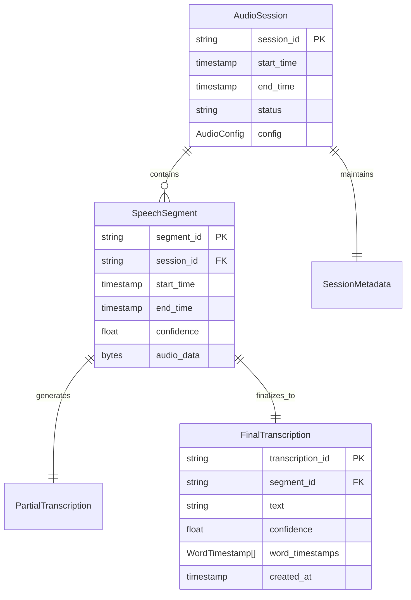

## Data Models

### Domain Model

**音声処理ドメイン**の核心概念:

- **AudioSession**: 録音セッションの集約ルート、ライフサイクル管理
- **SpeechSegment**: 発話境界で区切られたエンティティ、一意識別子
- **Transcription**: 文字起こし結果のバリューオブジェクト、不変性
- **AudioDevice**: 音声デバイス情報のバリューオブジェクト

**ビジネスルール**:
- 音声セッションは一意のUUID v4識別子を持つ
- 部分テキストは確定テキストに収束し、不整合状態を持たない
- 録音ファイルはセッション終了後も永続化される

### Logical Data Model



### Physical Data Model

**ローカルストレージ (ファイルシステム)**:

```
[app_data_dir]/recordings/[session_id]/
├── audio.wav               # 音声データ (16kHz mono 16bit PCM)
├── transcription.jsonl     # 文字起こし結果 (JSON Lines形式)
└── session.json           # セッションメタデータ
```

**session.json スキーマ**:

```json
{
  "session_id": "550e8400-e29b-41d4-a716-446655440000",
  "start_time": "2025-10-02T10:00:00Z",
  "end_time": "2025-10-02T11:30:00Z",
  "duration_seconds": 5400,
  "audio_device": "MacBook Pro Microphone",
  "model_size": "small",
  "total_segments": 150,
  "total_characters": 12000
}
```

**transcription.jsonl 各行スキーマ**:

```json
{
  "segment_id": "seg-001",
  "text": "こんにちは",
  "is_partial": false,
  "confidence": 0.95,
  "timestamp": 1696234567890,
  "language": "ja",
  "word_timestamps": [
    {"word": "こんにちは", "start": 0.0, "end": 1.2}
  ]
}
```

### Data Contracts & Integration

**IPC拡張フィールド** (Rust → Python):  
> ℹ️ 詳細設計は `.kiro/specs/meeting-minutes-stt/adrs/ADR-013-sidecar-full-duplex-final-design.md` を参照。  
> ℹ️ 実装後のクリティカル修正は `ADR-013-P0-bug-fixes.md` に記録。

```typescript
interface IpcRequest {
  id: string;                  // UUID v4
  type: "request";
  method: "process_audio";
  params: {
    audio_data: string;        // Base64エンコード
  };
  version: "1.0";              // 新規フィールド (後方互換性)
}

interface IpcResponse {
  id: string;
  type: "response";
  version: "1.0";              // 新規フィールド
  result: {
    text: string;
    is_final: boolean;
    confidence: number;        // 新規フィールド
    language: string;          // 新規フィールド
    processing_time_ms: number; // 新規フィールド
    model_size: string;        // 新規フィールド
  };
}
```

**WebSocket拡張フィールド** (Tauri → Chrome拡張):

```typescript
interface TranscriptionMessage {
  messageId: number;
  sessionId: string;
  timestamp: number;
  type: "transcription";
  isPartial: boolean;
  text: string;
  confidence: number;          // 新規フィールド
  language: string;            // 新規フィールド
  speakerSegment: number;      // 新規フィールド (MVP1ではダミー値0)
  processingTimeMs: number;    // 新規フィールド
}
```

**後方互換性保証**:
- meeting-minutes-core (Fake実装) は未知のフィールドを無視し、`text` / `isPartial` フィールドのみを使用
- バージョンフィールド `"version": "1.0"` により将来的なプロトコル変更時の互換性確認が可能

---

#### IPCバージョニング戦略

**バージョンネゴシエーションプロトコル** (オプショナル):

```rust
// Rust側: 起動時バージョン確認 (オプション)
pub async fn negotiate_protocol_version(&mut self) -> Result<String> {
    let request = json!({
        "id": Uuid::new_v4().to_string(),
        "type": "request",
        "method": "protocol_version_check",
        "params": {
            "rust_version": "1.0",
            "supported_versions": ["1.0"],
        }
    });

    // タイムアウト3秒でバージョンチェック
    match timeout(Duration::from_secs(3), self.send_and_receive(request)).await {
        Ok(Ok(response)) => {
            let python_version = response["result"]["version"].as_str()
                .unwrap_or("1.0");  // デフォルト "1.0" と仮定

            // バージョン互換性チェック（STT-REQ-007.6）
            let (python_major, python_minor) = parse_version(&python_version);
            let (rust_major, rust_minor) = parse_version("1.0");

            if python_major != rust_major {
                // メジャーバージョン不一致: エラー応答を返し、通信を拒否
                log::error!("Major version mismatch: Rust 1.0 vs Python {}", python_version);
                return Err(AppError::IncompatibleProtocolVersion {
                    rust: "1.0".to_string(),
                    python: python_version.to_string(),
                });
            } else if python_minor != rust_minor {
                // マイナーバージョン不一致: 警告ログを記録し、後方互換モードで処理継続
                log::warn!("Minor version mismatch: Rust 1.0 vs Python {}, continuing in backward compatibility mode", python_version);
            } else {
                // パッチバージョン不一致: 情報ログのみ記録
                log::info!("Protocol version check passed: Rust 1.0 vs Python {}", python_version);
            }

            Ok(python_version.to_string())
        }
        Ok(Err(_)) | Err(_) => {
            // バージョンチェック失敗時、デフォルト "1.0" と仮定
            log::warn!("Protocol version check failed, assuming version 1.0");
            Ok("1.0".to_string())
        }
    }
}

fn is_compatible(version1: &str, version2: &str) -> bool {
    // メジャーバージョンが一致すれば互換性あり
    let major1 = version1.split('.').next().unwrap_or("1");
    let major2 = version2.split('.').next().unwrap_or("1");
    major1 == major2
}
```

**後方互換性ポリシー** (STT-REQ-007.6準拠):
- **versionフィールド省略時**: デフォルトで "1.0" と仮定 (meeting-minutes-core Fake実装との互換性保証)
- **メジャーバージョン不一致** (例: 1.x → 2.x): エラー応答を返し、通信を拒否
- **マイナーバージョン不一致** (例: 1.0 → 1.1): 警告ログを記録し、後方互換モードで処理継続（ADR-003に基づく）
- **パッチバージョン不一致** (例: 1.0.1 → 1.0.2): 情報ログのみ記録し、通常処理継続

**Schema定義** (JSON Schema):

```json
{
  "$schema": "http://json-schema.org/draft-07/schema#",
  "title": "IPC Request",
  "type": "object",
  "required": ["id", "type", "method"],
  "properties": {
    "id": { "type": "string", "format": "uuid" },
    "type": { "enum": ["request"] },
    "method": { "type": "string" },
    "version": { "type": "string", "default": "1.0" },
    "params": { "type": "object" }
  }
}
```

**CI/CD互換性テスト**:
- Rust 1.0 ↔ Python 1.0: 正常動作
- Rust 1.0 ↔ Python 1.1: 正常動作 (下位互換性)
- Rust 1.0 ↔ Python 2.0: エラー (メジャーバージョン不一致)
- Rust 1.0 ↔ Python (versionフィールドなし): 正常動作 (デフォルト "1.0" 仮定)

**参照**: `.kiro/specs/meeting-minutes-stt/adrs/ADR-003-ipc-versioning.md`

---
