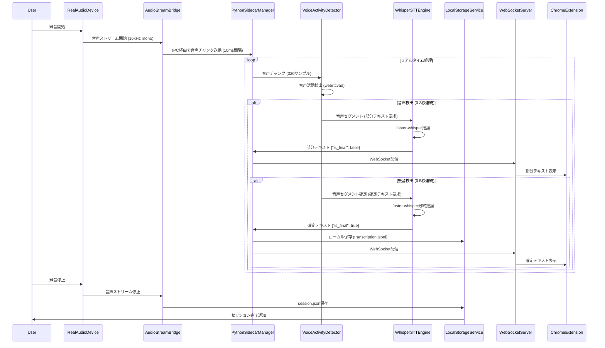
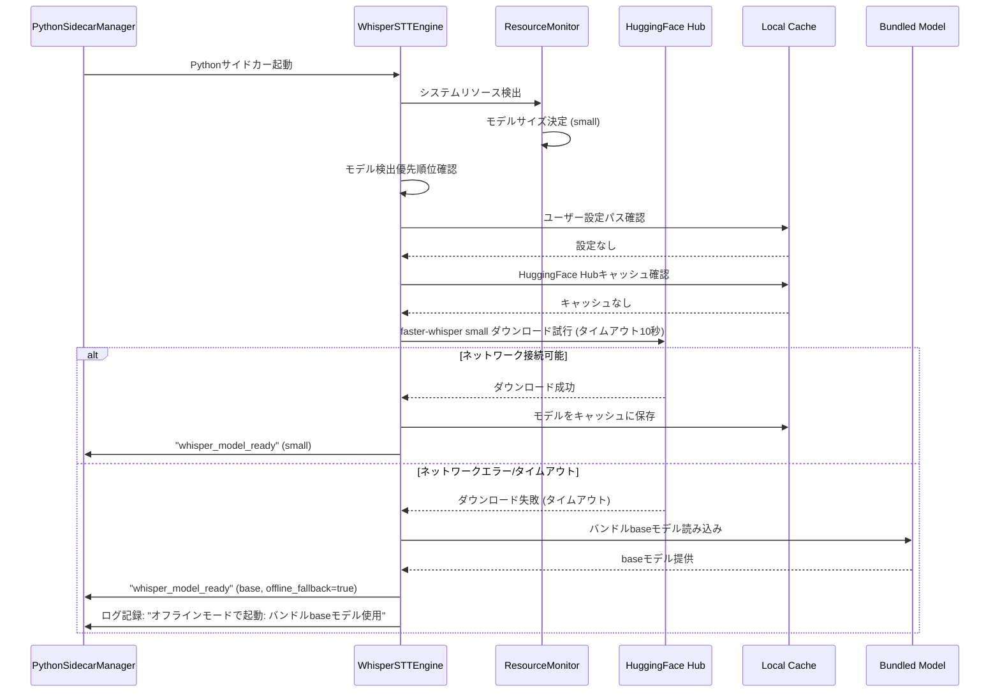
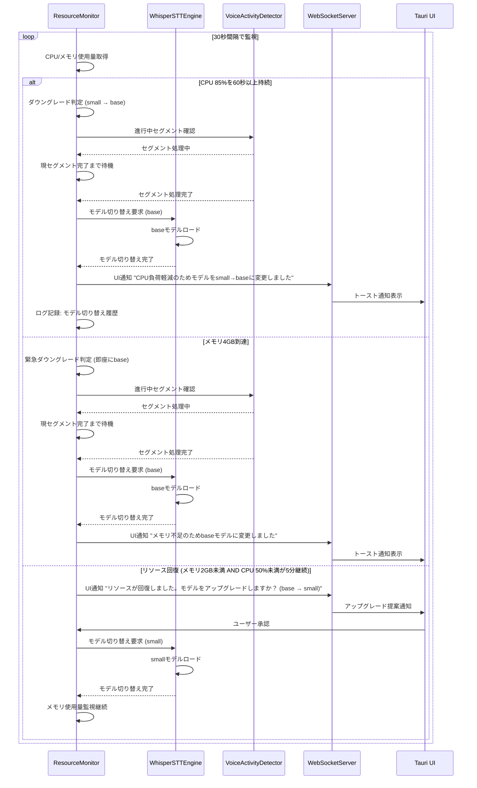

## System Flows

### 音声処理パイプライン全体フロー



**主要処理ステップ**:
1. **音声録音開始**: `RealAudioDevice` が OS固有音声APIから16kHz mono PCMストリームを開始
2. **IPC転送**: `AudioStreamBridge` が10ms間隔 (320サンプル) で音声チャンクをPythonサイドカーに送信
3. **VAD処理**: `VoiceActivityDetector` (webrtcvad) が発話/無音を判定
4. **部分テキスト生成**: 発話継続中は1秒間隔でfaster-whisperに累積音声データを送信し、部分テキストを生成
5. **確定テキスト生成**: 無音検出後、発話セグメント全体をfaster-whisperに送信し、確定テキストを生成
6. **ローカル保存**: `LocalStorageService` が `transcription.jsonl` に確定テキストを追記
7. **WebSocket配信**: `WebSocketServer` がChrome拡張に部分/確定テキストを配信

**参照**: `docs/uml/meeting-minutes-stt/seq/SEQ-001_Audio-Recording-to-Transcription.puml`

---

### オフラインモデルフォールバックフロー



**主要ステップ**:
1. **モデル検出優先順位**: ユーザー設定 → HuggingFace Hubキャッシュ → インストーラーバンドルモデル (STT-REQ-002.1)
2. **HuggingFace Hub接続**: 10秒タイムアウトでダウンロード試行 (STT-REQ-002.3)
3. **オフラインフォールバック**: ダウンロード失敗時、バンドルbaseモデルにフォールバック (STT-REQ-002.4)
4. **プロキシ環境対応**: 環境変数 `HTTPS_PROXY` / `HTTP_PROXY` を認識 (STT-REQ-002.7)
5. **オフラインモード強制**: ユーザー設定でHuggingFace Hub接続を完全スキップ可能 (STT-REQ-002.6)

**エラーハンドリング**:
- バンドルモデルも存在しない場合: 起動失敗エラー「faster-whisperモデルが見つかりません」(STT-REQ-002.5)

**参照**: `docs/uml/meeting-minutes-stt/seq/SEQ-002_Offline-Model-Fallback.puml`

---

### 動的モデルダウングレードフロー



**主要ステップ**:
1. **リソース監視**: 30秒間隔でCPU/メモリ使用量を取得 (STT-NFR-001.6)
2. **ダウングレードトリガー**:
   - CPU 85%を60秒以上持続 → 1段階ダウングレード (STT-REQ-006.7)
   - メモリ4GB到達 → 即座にbaseモデル (STT-REQ-006.8)
3. **音声セグメント境界での切り替え**:
   - 現在処理中の音声セグメントは既存モデルで完了
   - 次のセグメントから新モデルを適用
   - 処理中断時間: 0秒（シームレス切り替え）(STT-REQ-006.9)
4. **UI通知**: トースト通知で「モデル変更: {old} → {new}」を表示 (STT-REQ-006.9)
5. **アップグレード提案**: リソース回復時 (メモリ2GB未満 AND CPU 50%未満が5分継続) に自動アップグレード提案 (STT-REQ-006.10)
6. **最終手段**: tinyモデルでもリソース不足が継続する場合、録音一時停止 (STT-REQ-006.11)

**ダウングレード順序**:
large-v3 → medium → small → base → tiny

**参照**: `docs/uml/meeting-minutes-stt/seq/SEQ-003_Dynamic-Model-Downgrade.puml`

---

### デバイス切断/再接続フロー

```mermaid
flowchart TD
    A[音声録音中] --> B{デバイス切断検出}
    B -->|Yes| C[デバイス切断イベント記録]
    C --> D[エラーログ記録]
    D --> E[ユーザー通知: 「音声デバイスが切断されました」]
    E --> F[録音停止]
    F --> G[5秒待機]

    G --> H{自動再接続試行 (1回目)}
    H -->|成功| I[録音再開]
    H -->|失敗| J{自動再接続試行 (2回目)}
    J -->|成功| I
    J -->|失敗| K{自動再接続試行 (3回目)}
    K -->|成功| I
    K -->|失敗| L[再接続失敗: ユーザーに手動再接続を促す]

    B -->|No| M[通常処理継続]
```

**主要ステップ**:
1. **デバイス切断検出**: `RealAudioDevice` が音声デバイス切断イベントを検出 (STT-REQ-004.9)
2. **エラーログ記録**: デバイス切断イベントとコンテキストをERRORレベルでログ記録 (STT-REQ-004.9)
3. **ユーザー通知**: 「音声デバイスが切断されました」通知を表示 (STT-REQ-004.10)
4. **録音停止**: 音声ストリームを安全に停止 (STT-REQ-004.10)
5. **自動再接続**: 5秒間隔で最大3回まで自動再接続を試行 (STT-REQ-004.11)
6. **手動再接続**: 3回失敗後、ユーザーに手動再接続を促す

**信頼性要件**:
- デバイス切断検出から5秒以内に録音を安全に停止 (STT-NFR-002.2)

#### Task 2.5 実装詳細: イベント駆動デバイス監視アーキテクチャ

**設計判断の背景**:

当初の単純なアプローチ（cpalエラーコールバックのみ）には以下の問題がありました：

1. **StreamError::DeviceNotAvailable依存の危険性**: CoreAudio/PulseAudioは無音になるだけでエラーコールバックを呼ばない場合がある
2. **Arc<Mutex<bool>>では回復不能**: `std::thread::park()`でブロックされたストリームスレッドは、フラグ変更では終了しない
3. **トレイトAPI変更の破壊的影響**: 戻り値型変更はMVP0との互換性を失う
4. **MVP1仕様違反**: ログ出力だけではSTT-REQ-004.10（ユーザー通知）を満たさない

**採用アーキテクチャ: 3層検出メカニズム**

```rust
// イベント定義
pub enum AudioDeviceEvent {
    StreamError(String),           // cpalエラーコールバック
    Stalled { elapsed_ms: u64 },   // Liveness watchdog検出
    DeviceGone { device_id: String }, // デバイスポーリング検出
}
```

**検出メカニズム詳細**:

1. **Stream Error Callback** (cpalネイティブ)
   - cpalのエラーコールバックで`StreamError`イベント送信
   - 即座に検出できる場合に有効

2. **Liveness Watchdog** (250ms間隔チェック)
   - チェック間隔: 250ms
   - ストール閾値: 1200ms（最後の音声コールバックからの経過時間）
   - `last_callback: Arc<Mutex<Instant>>`を監視
   - 音声コールバックが呼ばれなくなったら`Stalled`イベント送信
   - **無音になるケースを確実に検出**

3. **Device Polling** (3秒間隔)
   - ポーリング間隔: 3秒
   - `cpal::Host::input_devices()`でデバイス存在確認
   - デバイスが消えたら`DeviceGone`イベント送信
   - **物理切断を確実に検出**

**信頼性の高いクリーンアップ**:

```rust
pub struct CoreAudioAdapter {
    stream_thread: Option<JoinHandle<()>>,      // ストリームスレッド
    watchdog_handle: Option<JoinHandle<()>>,    // Watchdogスレッド
    polling_handle: Option<JoinHandle<()>>,     // ポーリングスレッド

    stream_shutdown_tx: Option<mpsc::Sender<()>>,   // 各スレッド用
    watchdog_shutdown_tx: Option<mpsc::Sender<()>>, // shutdownチャネル
    polling_shutdown_tx: Option<mpsc::Sender<()>>,

    last_callback: Arc<Mutex<Instant>>,  // Liveness監視用
    event_tx: Option<AudioEventSender>,  // イベント送信用
}
```

**重要なポイント**:
- **Streamはスレッドローカルに保持**: `Arc<Mutex<Stream>>`によるSync制約を回避
- **3つの独立したshutdownチャネル**: 各スレッドを確実に終了
- **std::thread::park()を使わない**: `shutdown_rx.recv()`でブロック、確実にクリーンアップ

**Tauri UI統合**:

```rust
// commands.rs
async fn monitor_audio_events(app: AppHandle) {
    let rx = state.take_audio_event_rx().unwrap();

    while let Ok(event) = rx.recv() {
        match event {
            AudioDeviceEvent::DeviceGone { device_id } => {
                app.emit("audio-device-error", json!({
                    "type": "device_gone",
                    "message": "音声デバイスが切断されました",
                })).ok();
            }
            // ... other events
        }
    }
}
```

**クロスプラットフォーム一貫性**:
- CoreAudioAdapter (macOS)
- WasapiAdapter (Windows)
- AlsaAdapter (Linux)

すべて同じイベント駆動パターンを採用。

**Phase外として延期**:
- **STT-REQ-004.11（自動再接続ロジック）**: 現在の実装はイベント検出・通知基盤のみ提供
- 5秒タイマー、最大3回リトライは将来のタスクで実装予定

**参照**: `serena/memories/task_2_5_device_monitoring_design.md`

---

