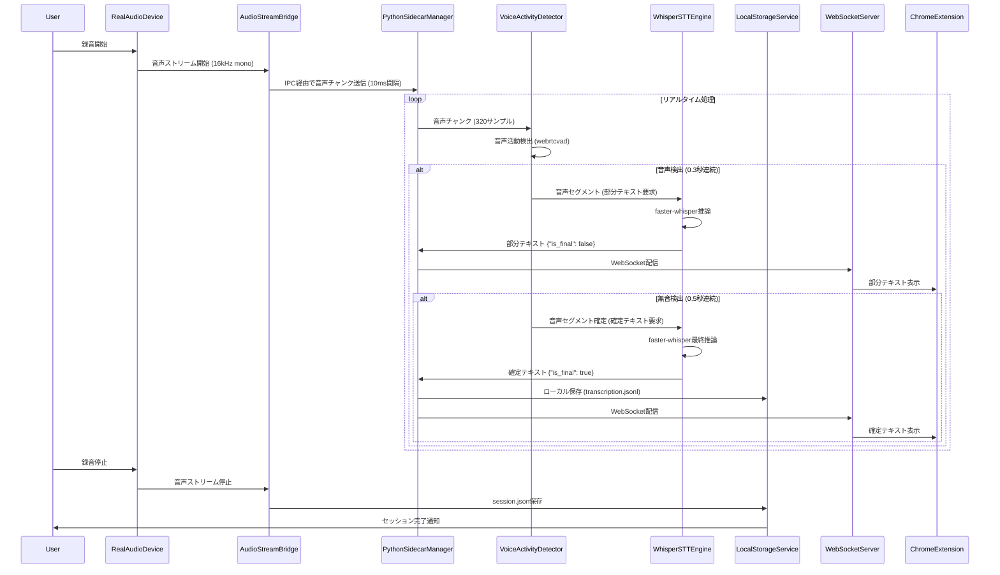
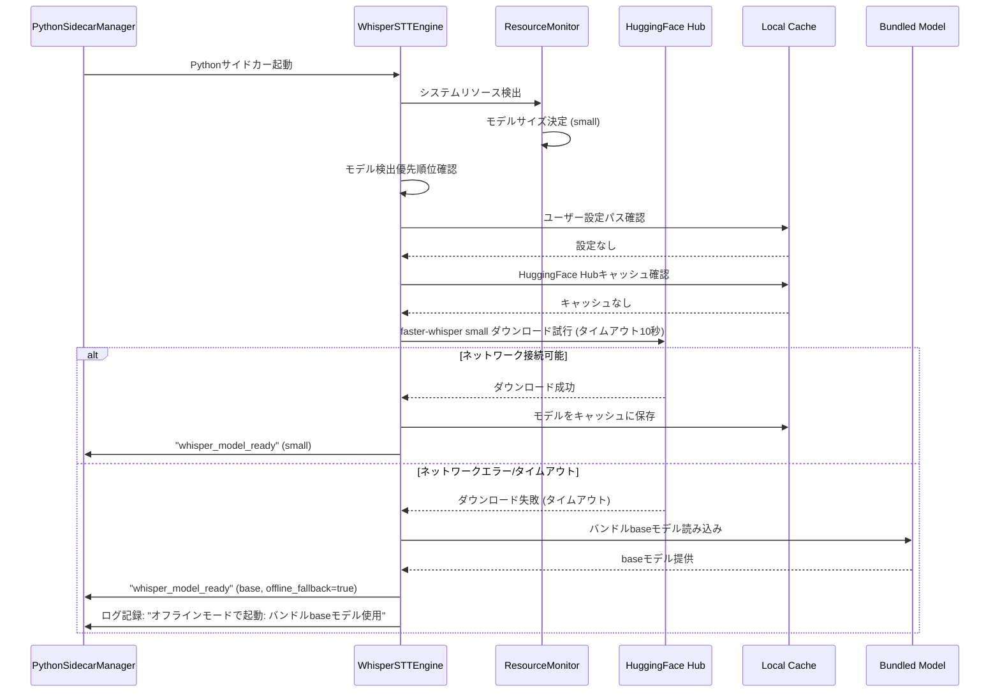
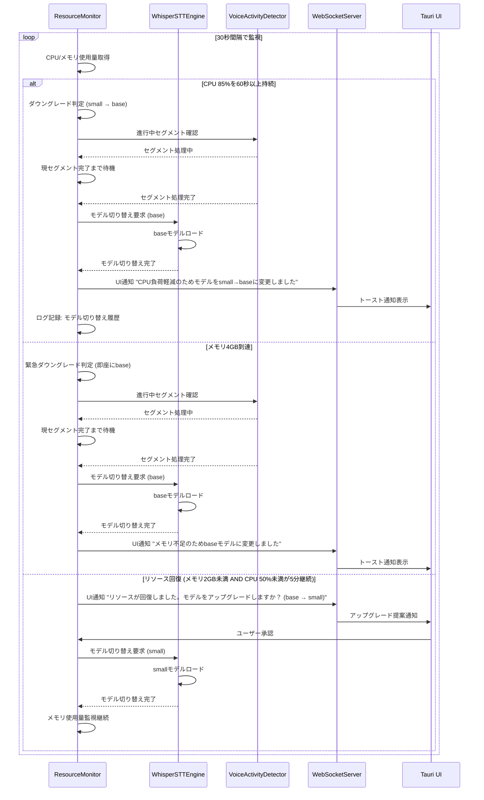
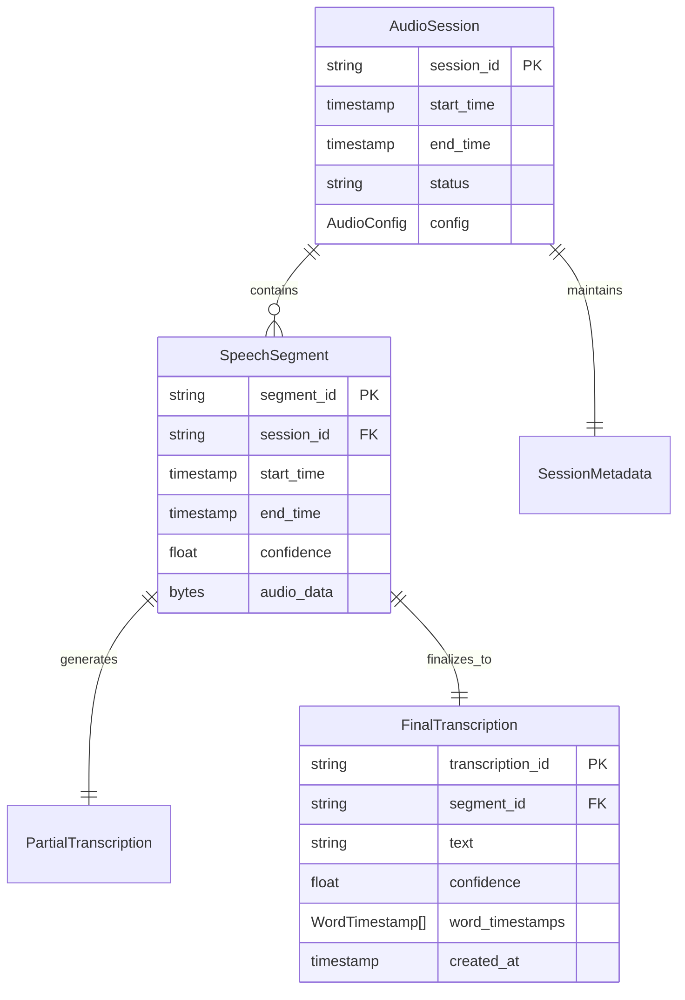

# Technical Design Document

## Overview

**目的**: meeting-minutes-stt (MVP1) は、meeting-minutes-core (Walking Skeleton) で確立した3プロセスアーキテクチャ上に実際の音声処理機能を実装します。Fake実装を実音声処理に置き換え、faster-whisperによる高精度文字起こしとwebrtcvadによる音声活動検出を実現します。

**ユーザー**: 会議参加者やファシリテーターが、実用可能なローカル音声文字起こし機能を活用します。

**インパクト**: Fakeデータから実音声処理への移行により、プロダクション環境で使用可能な文字起こし機能が実現されます。

### Goals

- ローカル環境での高精度リアルタイム音声認識 (faster-whisper統合)
- **オフラインファースト**: ネットワーク接続なしでの完全動作保証
- リソースベースモデル選択と動的ダウングレードによる安定性確保
- クロスプラットフォーム音声デバイス対応 (macOS、Windows、Linux)
- meeting-minutes-coreとの完全な後方互換性維持

### Non-Goals

- Google Docs連携 (MVP2 meeting-minutes-docs-syncで実装)
- LLM要約生成 (MVP3 meeting-minutes-llmで実装)
- UIの本格的洗練 (MVP3で実施)
- 話者分離 (speaker diarization) - 将来検討事項
- リアルタイム翻訳機能 - 将来検討事項

---

## Diagram Checklist

本MVP1実装では、以下の図版を作成し `docs/uml/meeting-minutes-stt/` に配置します:

- ✅ `cmp/CMP-001_STT-Audio-Processing-Pipeline.puml`: コンポーネント図（RealAudioDevice, VoiceActivityDetector, WhisperSTTEngine, ResourceMonitor, LocalStorageService）
- ✅ `seq/SEQ-001_Audio-Recording-to-Transcription.puml`: 音声録音→VAD→STT→保存の完全シーケンス
- ✅ `seq/SEQ-002_Offline-Model-Fallback.puml`: オフラインモデルフォールバックフロー
- ✅ `seq/SEQ-003_Dynamic-Model-Downgrade.puml`: 動的モデルダウングレードフロー
- ✅ `cls/CLS-001_Audio-Device-Adapter.puml`: AudioDeviceAdapter trait と OS別実装

全図版は `#[[file:docs/uml/meeting-minutes-stt/<カテゴリ>/ID_Title.puml]]` 形式で参照されます。

---

## Non-Functional Requirements

### ログ運用方針

**目的**: STT処理のトラブルシューティングとパフォーマンス分析を迅速化するため、詳細メタデータを含む構造化ログを収集します。

**方針** (`.kiro/steering/principles.md` の非機能ベースライン原則に準拠):
- INFO/DEBUG/ERROR レベル運用と構造化JSON出力
- 全ログレコードに `session_id` / `component` / `event` / `duration_ms` を付与
- PIIマスク: 音声データのバイナリ内容はログに記録しない (メタデータのみ)
- DEBUGレベルは開発環境のみで有効化

**STT固有のログ要件** (STT-NFR-005):
1. **faster-whisperモデルロード中**: ダウンロード進捗を5秒間隔でINFOレベル記録
2. **音声処理エラー**: エラーメッセージ、スタックトレース、コンテキストをERRORレベル記録
3. **VAD処理**: 発話開始/終了イベントをINFOレベル記録
4. **リソース監視**: メモリ使用量、CPU使用率を30秒間隔でDEBUGレベル記録

**実装タスク**:
- `python-stt/stt_engine/logging.py`: `structlog` 構成で非同期ファイルハンドラ追加
- Rust側: `tracing`/`tracing-subscriber` で JSON フォーマッタ実装 (meeting-minutes-core継承)

---

## Architecture

### High-Level Architecture

meeting-minutes-coreのWalking Skeletonアーキテクチャを継承し、Fake実装を実コンポーネントに置き換えます。

```
┌─────────────────────────────────────────────────────────┐
│             Tauri Desktop Application (Rust)            │
├─────────────────────────────────────────────────────────┤
│                                                         │
│  ┌─────────────────┐      ┌──────────────────┐        │
│  │ RealAudioDevice │──────│ AudioStreamBridge│        │
│  │ (OS Audio API)  │      │ (IPC通信層)       │        │
│  └─────────────────┘      └──────────┬───────┘        │
│                                      │                 │
│                            ┌─────────▼────────┐        │
│                            │ PythonSidecar    │        │
│                            │ Manager          │        │
│                            └─────────┬────────┘        │
│                                      │                 │
│  ┌───────────────────────────────────▼─────────────┐  │
│  │     Python Sidecar Process (音声処理)           │  │
│  │  ┌──────────────────┐  ┌─────────────────────┐ │  │
│  │  │ VoiceActivity    │──│ WhisperSTTEngine    │ │  │
│  │  │ Detector         │  │ (faster-whisper)    │ │  │
│  │  │ (webrtcvad)      │  └─────────────────────┘ │  │
│  │  └──────────────────┘                          │  │
│  │  ┌──────────────────┐                          │  │
│  │  │ ResourceMonitor  │ (起動時選択+動的ダウン   │  │
│  │  │                  │  グレード)               │  │
│  │  └──────────────────┘                          │  │
│  └───────────────────────────────────────────────┘  │
│                                                     │
│  ┌─────────────────┐      ┌──────────────────┐    │
│  │ WebSocketServer │──────│ LocalStorage     │    │
│  │ (ポート9001-9100)│      │ Service          │    │
│  └────────┬────────┘      └──────────────────┘    │
└───────────┼─────────────────────────────────────────┘
            │
            │ WebSocket (JSON)
            ▼
┌─────────────────────────────────────────────────────────┐
│         Chrome Extension (Manifest V3)                  │
│  ┌───────────────┐      ┌────────────────┐            │
│  │ Content Script│      │ Service Worker │            │
│  │ (WebSocket管理)│─────│ (メッセージ中継)│            │
│  │ (chrome.storage)│    │                │            │
│  └───────────────┘      └────────────────┘            │
│       ↓                          ↓                      │
│  ┌──────────────────────────────────────┐              │
│  │     chrome.storage.local             │              │
│  │    (録音状態・接続状態の共有)         │              │
│  └──────────────────────────────────────┘              │
└─────────────────────────────────────────────────────────┘
```

**主要な変更点** (meeting-minutes-core からの移行):
- `FakeAudioDevice` → `RealAudioDevice` (OS固有音声API統合)
- `FakeProcessor` → `VoiceActivityDetector` + `WhisperSTTEngine` (実音声処理)
- IPC通信プロトコルは維持 (後方互換性保証)
- WebSocketメッセージフォーマットを拡張 (confidence, language等の追加フィールド)
- **Chrome拡張アーキテクチャ**: Content ScriptがWebSocket管理を担当（**ADR-004採用**）
  - **WebSocket接続の永続化**: タブ存続期間中はContent Scriptが接続を維持（MV3の30秒制限回避）
  - **状態共有**: chrome.storage.local経由でPopup UI・複数タブ間の状態を同期（ADR-005パターン）
  - **Service Workerの役割**: 軽量メッセージ中継のみ（録音開始/停止コマンドのルーティング）
  - **参照**: `.kiro/specs/meeting-minutes-core/adrs/ADR-004-chrome-extension-websocket-management.md`、`.kiro/specs/meeting-minutes-core/adrs/ADR-005-state-management-mechanism.md`

### Technology Stack and Design Decisions

#### 音声処理層

**選定技術**:
- **音声認識**: faster-whisper ≥0.10.0 (CTranslate2最適化版)
- **音声活動検出**: webrtcvad ≥2.0.0
- **音声デバイスアクセス**: cpal (Rust crate) - クロスプラットフォーム対応
- **数値処理**: numpy ≥1.24.0 (Python)

**選定理由**:
- faster-whisperは2025年時点で最もCPU効率的なWhisper実装 (OpenAI Whisperと比較してCPU使用量50%削減)
- webrtcvadは16-bit mono PCMで低遅延VAD処理を実現
- cpalはmacOS/Windows/Linuxで統一的な音声デバイスアクセスを提供

**代替案考慮**:
- OpenAI Whisper (除外: CPU使用量が高い)
- SimulStreaming (2025年新技術、将来検討)

#### Rust音声処理層

**選定技術**:
- **音声デバイス**: cpal 0.15.x (クロスプラットフォーム音声I/O)
- **非同期処理**: tokio 1.x (meeting-minutes-core継承)
- **IPC通信**: stdin/stdout JSON (meeting-minutes-core継承)

#### 重要な設計決定

**決定1: 録音責務の一元化 (プロセス境界の明確化原則)**
- **決定**: 音声録音はRust側 `RealAudioDevice` のみが担当
- **背景**: Pythonサイドカーとの録音競合を防止し、レース条件を回避
- **制約**: Pythonサイドカーは録音を行わず、Rustから送信されたバイナリストリームの受信とSTT処理のみを実施
- **根拠**: `.kiro/steering/principles.md` プロセス境界の明確化原則 - 各プロセスは独立した責務を持ち、録音はRustプロセスに一元化

**録音責務の一元化の技術的実現**:

**静的解析による検証**:
- CI/CD パイプラインに Python コード静的解析を追加
- 禁止パッケージ検出: `sounddevice`, `pyaudio`, `portaudio`, `soundcard`, `PySndHdr`
- `flake8-forbidden-imports` プラグインで自動検証
- pre-commit フックでの自動チェック

**依存関係ロック**:
- `pip-compile` による許可リスト (allowlist) 方式
- `requirements.txt` に録音関連パッケージを含めない
- `requirements-lock.txt` で依存関係を固定

**実装例** (`.pre-commit-config.yaml`):
```yaml
- repo: local
  hooks:
    - id: check-python-audio-imports
      name: Check forbidden audio recording imports
      entry: python scripts/check_forbidden_imports.py
      language: system
      files: ^python-stt/.*\.py$
```

**違反時のエラーメッセージ**:
```
❌ Forbidden import detected: 'sounddevice' in python-stt/stt_engine/audio/capture.py
📖 Recording responsibility is exclusively handled by Rust AudioDeviceAdapter.
📄 See: .kiro/specs/meeting-minutes-stt/adrs/ADR-001-recording-responsibility.md
```

**参照**: `.kiro/specs/meeting-minutes-stt/adrs/ADR-001-recording-responsibility.md`

**決定2: オフラインファーストアーキテクチャ (オフラインファースト原則)**
- **決定**: ネットワーク依存機能を全てオプショナル化し、ローカル完結モードで動作保証
- **背景**: 企業ネットワークやネットワーク切断時でも実用可能なSTT機能が求められる
- **実装戦略**:
  1. モデル検出優先順位: ユーザー設定 → HuggingFace Hubキャッシュ → インストーラーバンドルモデル
  2. HuggingFace Hub接続タイムアウト: 10秒
  3. ダウンロード失敗時の自動フォールバック: バンドルbaseモデル使用
  4. プロキシ環境対応: `HTTPS_PROXY` / `HTTP_PROXY` 環境変数認識
- **トレードオフ**: インストーラーサイズ増加 (バンドルbaseモデル: 39MB) vs オフライン動作保証
- **根拠**: `.kiro/steering/principles.md` オフラインファースト原則 - Tier 1機能はネットワーク接続不要で完全動作

**決定3: リソースベースモデル選択と動的ダウングレード (段階的リソース管理原則)**
- **決定**: 起動時にシステムリソースを検出してWhisperモデルを自動選択し、実行中のリソース制約時に動的ダウングレード
- **背景**: リソース制約下でも安定動作を保証し、システムのフリーズを防止
- **実装戦略**:
  - **起動時モデル選択**: GPU利用可能+メモリ8GB以上 → large-v3、CPU+メモリ4GB以上 → small、etc.
  - **動的ダウングレード**: CPU 85%/60秒持続 → 1段階ダウングレード、メモリ4GB到達 → 即座にbaseモデル
  - **UI通知**: トースト通知で「モデル変更: {old} → {new}」を表示
- **トレードオフ**: 実装複雑性増加 vs リソース制約下での安定性向上
- **根拠**: `.kiro/steering/principles.md` 段階的リソース管理原則 - 警告閾値（黄色）、制限閾値（赤色）、強制停止閾値の3段階

**決定4: IPC通信プロトコルの後方互換性維持 (依存関係のベンダーロックイン回避原則)**
- **決定**: meeting-minutes-coreで確立したIPC通信プロトコルv1.0を維持し、新フィールドを追加拡張
- **背景**: Walking Skeleton実装との互換性を保ちつつ、実音声処理の追加情報を伝達
- **実装戦略**:
  - 既存メッセージ形式を維持: `{ id, type, result: { text, is_final } }`
  - 新フィールド追加: `confidence`, `language`, `processing_time_ms`, `model_size`
  - バージョンフィールド追加: `"version": "1.0"`
- **後方互換性保証**: meeting-minutes-core (Fake実装) は未知のフィールドを無視し、`text`フィールドのみを使用
- **根拠**: `.kiro/steering/principles.md` 依存関係のベンダーロックイン回避原則 - 外部サービスは全てAdapterパターンで抽象化

---

## System Flows

### 音声処理パイプライン全体フロー



**主要処理ステップ**:
1. **音声録音開始**: `RealAudioDevice` が OS固有音声APIから16kHz mono PCMストリームを開始
2. **IPC転送**: `AudioStreamBridge` が10ms間隔 (320サンプル) で音声チャンクをPythonサイドカーに送信
3. **VAD処理**: `VoiceActivityDetector` (webrtcvad) が発話/無音を判定
4. **部分テキスト生成**: 発話継続中は1秒間隔でfaster-whisperに累積音声データを送信し、部分テキストを生成
5. **確定テキスト生成**: 無音検出後、発話セグメント全体をfaster-whisperに送信し、確定テキストを生成
6. **ローカル保存**: `LocalStorageService` が `transcription.jsonl` に確定テキストを追記
7. **WebSocket配信**: `WebSocketServer` がChrome拡張に部分/確定テキストを配信

**参照**: `docs/uml/meeting-minutes-stt/seq/SEQ-001_Audio-Recording-to-Transcription.puml`

---

### オフラインモデルフォールバックフロー



**主要ステップ**:
1. **モデル検出優先順位**: ユーザー設定 → HuggingFace Hubキャッシュ → インストーラーバンドルモデル (STT-REQ-002.1)
2. **HuggingFace Hub接続**: 10秒タイムアウトでダウンロード試行 (STT-REQ-002.3)
3. **オフラインフォールバック**: ダウンロード失敗時、バンドルbaseモデルにフォールバック (STT-REQ-002.4)
4. **プロキシ環境対応**: 環境変数 `HTTPS_PROXY` / `HTTP_PROXY` を認識 (STT-REQ-002.7)
5. **オフラインモード強制**: ユーザー設定でHuggingFace Hub接続を完全スキップ可能 (STT-REQ-002.6)

**エラーハンドリング**:
- バンドルモデルも存在しない場合: 起動失敗エラー「faster-whisperモデルが見つかりません」(STT-REQ-002.5)

**参照**: `docs/uml/meeting-minutes-stt/seq/SEQ-002_Offline-Model-Fallback.puml`

---

### 動的モデルダウングレードフロー



**主要ステップ**:
1. **リソース監視**: 30秒間隔でCPU/メモリ使用量を取得 (STT-NFR-001.6)
2. **ダウングレードトリガー**:
   - CPU 85%を60秒以上持続 → 1段階ダウングレード (STT-REQ-006.7)
   - メモリ4GB到達 → 即座にbaseモデル (STT-REQ-006.8)
3. **音声セグメント境界での切り替え**:
   - 現在処理中の音声セグメントは既存モデルで完了
   - 次のセグメントから新モデルを適用
   - 処理中断時間: 0秒（シームレス切り替え）(STT-REQ-006.9)
4. **UI通知**: トースト通知で「モデル変更: {old} → {new}」を表示 (STT-REQ-006.9)
5. **アップグレード提案**: リソース回復時 (メモリ2GB未満 AND CPU 50%未満が5分継続) に自動アップグレード提案 (STT-REQ-006.10)
6. **最終手段**: tinyモデルでもリソース不足が継続する場合、録音一時停止 (STT-REQ-006.11)

**ダウングレード順序**:
large-v3 → medium → small → base → tiny

**参照**: `docs/uml/meeting-minutes-stt/seq/SEQ-003_Dynamic-Model-Downgrade.puml`

---

### デバイス切断/再接続フロー

```mermaid
flowchart TD
    A[音声録音中] --> B{デバイス切断検出}
    B -->|Yes| C[デバイス切断イベント記録]
    C --> D[エラーログ記録]
    D --> E[ユーザー通知: 「音声デバイスが切断されました」]
    E --> F[録音停止]
    F --> G[5秒待機]

    G --> H{自動再接続試行 (1回目)}
    H -->|成功| I[録音再開]
    H -->|失敗| J{自動再接続試行 (2回目)}
    J -->|成功| I
    J -->|失敗| K{自動再接続試行 (3回目)}
    K -->|成功| I
    K -->|失敗| L[再接続失敗: ユーザーに手動再接続を促す]

    B -->|No| M[通常処理継続]
```

**主要ステップ**:
1. **デバイス切断検出**: `RealAudioDevice` が音声デバイス切断イベントを検出 (STT-REQ-004.9)
2. **エラーログ記録**: デバイス切断イベントとコンテキストをERRORレベルでログ記録 (STT-REQ-004.9)
3. **ユーザー通知**: 「音声デバイスが切断されました」通知を表示 (STT-REQ-004.10)
4. **録音停止**: 音声ストリームを安全に停止 (STT-REQ-004.10)
5. **自動再接続**: 5秒間隔で最大3回まで自動再接続を試行 (STT-REQ-004.11)
6. **手動再接続**: 3回失敗後、ユーザーに手動再接続を促す

**信頼性要件**:
- デバイス切断検出から5秒以内に録音を安全に停止 (STT-NFR-002.2)

#### Task 2.5 実装詳細: イベント駆動デバイス監視アーキテクチャ

**設計判断の背景**:

当初の単純なアプローチ（cpalエラーコールバックのみ）には以下の問題がありました：

1. **StreamError::DeviceNotAvailable依存の危険性**: CoreAudio/PulseAudioは無音になるだけでエラーコールバックを呼ばない場合がある
2. **Arc<Mutex<bool>>では回復不能**: `std::thread::park()`でブロックされたストリームスレッドは、フラグ変更では終了しない
3. **トレイトAPI変更の破壊的影響**: 戻り値型変更はMVP0との互換性を失う
4. **MVP1仕様違反**: ログ出力だけではSTT-REQ-004.10（ユーザー通知）を満たさない

**採用アーキテクチャ: 3層検出メカニズム**

```rust
// イベント定義
pub enum AudioDeviceEvent {
    StreamError(String),           // cpalエラーコールバック
    Stalled { elapsed_ms: u64 },   // Liveness watchdog検出
    DeviceGone { device_id: String }, // デバイスポーリング検出
}
```

**検出メカニズム詳細**:

1. **Stream Error Callback** (cpalネイティブ)
   - cpalのエラーコールバックで`StreamError`イベント送信
   - 即座に検出できる場合に有効

2. **Liveness Watchdog** (250ms間隔チェック)
   - チェック間隔: 250ms
   - ストール閾値: 1200ms（最後の音声コールバックからの経過時間）
   - `last_callback: Arc<Mutex<Instant>>`を監視
   - 音声コールバックが呼ばれなくなったら`Stalled`イベント送信
   - **無音になるケースを確実に検出**

3. **Device Polling** (3秒間隔)
   - ポーリング間隔: 3秒
   - `cpal::Host::input_devices()`でデバイス存在確認
   - デバイスが消えたら`DeviceGone`イベント送信
   - **物理切断を確実に検出**

**信頼性の高いクリーンアップ**:

```rust
pub struct CoreAudioAdapter {
    stream_thread: Option<JoinHandle<()>>,      // ストリームスレッド
    watchdog_handle: Option<JoinHandle<()>>,    // Watchdogスレッド
    polling_handle: Option<JoinHandle<()>>,     // ポーリングスレッド

    stream_shutdown_tx: Option<mpsc::Sender<()>>,   // 各スレッド用
    watchdog_shutdown_tx: Option<mpsc::Sender<()>>, // shutdownチャネル
    polling_shutdown_tx: Option<mpsc::Sender<()>>,

    last_callback: Arc<Mutex<Instant>>,  // Liveness監視用
    event_tx: Option<AudioEventSender>,  // イベント送信用
}
```

**重要なポイント**:
- **Streamはスレッドローカルに保持**: `Arc<Mutex<Stream>>`によるSync制約を回避
- **3つの独立したshutdownチャネル**: 各スレッドを確実に終了
- **std::thread::park()を使わない**: `shutdown_rx.recv()`でブロック、確実にクリーンアップ

**Tauri UI統合**:

```rust
// commands.rs
async fn monitor_audio_events(app: AppHandle) {
    let rx = state.take_audio_event_rx().unwrap();

    while let Ok(event) = rx.recv() {
        match event {
            AudioDeviceEvent::DeviceGone { device_id } => {
                app.emit("audio-device-error", json!({
                    "type": "device_gone",
                    "message": "音声デバイスが切断されました",
                })).ok();
            }
            // ... other events
        }
    }
}
```

**クロスプラットフォーム一貫性**:
- CoreAudioAdapter (macOS)
- WasapiAdapter (Windows)
- AlsaAdapter (Linux)

すべて同じイベント駆動パターンを採用。

**Phase外として延期**:
- **STT-REQ-004.11（自動再接続ロジック）**: 現在の実装はイベント検出・通知基盤のみ提供
- 5秒タイマー、最大3回リトライは将来のタスクで実装予定

**参照**: `serena/memories/task_2_5_device_monitoring_design.md`

---

## Components and Interfaces

### 音声処理ドメイン

#### RealAudioDevice (Rust)

**責任と境界**
- **主要責任**: OS固有の音声APIからの音声データ取得とフォーマット変換 (**システム唯一の録音責任者**)
- **ドメイン境界**: 音声デバイス抽象化レイヤー
- **データ所有**: 音声デバイス設定、音声バッファ
- **トランザクション境界**: 単一音声セッションスコープ

**重要な設計決定**:
- **録音責務の一元化（ADR-001準拠）**: 音声録音はRust側AudioDeviceAdapterのみが担当、Python側での録音は静的解析により禁止
- **Python側の制約**: Pythonサイドカーは録音を行わず、Rustから送信されたバイナリストリームの受信とSTT処理のみを実施
- **レース条件の防止**: 複数箇所での録音開始を防ぎ、単一の音声ソースを保証

**依存関係**
- **インバウンド**: AudioStreamBridge、UI設定コンポーネント
- **アウトバウンド**: なし (リーフノード)
- **外部依存**: OS音声API (WASAPI、CoreAudio、ALSA)

**契約定義**

```rust
pub trait AudioDeviceAdapter: Send + Sync {
    async fn list_devices(&self) -> Result<Vec<AudioDevice>>;
    async fn start_capture(&mut self, device_id: &str, config: AudioConfig) -> Result<AudioStream>;
    async fn stop_capture(&mut self) -> Result<()>;
}

// OS別実装
pub struct WasapiAdapter { /* Windows WASAPI実装 */ }
pub struct CoreAudioAdapter { /* macOS CoreAudio実装 */ }
pub struct AlsaAdapter { /* Linux ALSA実装 */ }

impl AudioDeviceAdapter for WasapiAdapter {
    async fn list_devices(&self) -> Result<Vec<AudioDevice>> {
        // WASAPI経由でデバイス列挙
    }
    async fn start_capture(&mut self, device_id: &str, config: AudioConfig) -> Result<AudioStream> {
        // WASAPI loopback modeでシステム音声キャプチャ
    }
    async fn stop_capture(&mut self) -> Result<()> {
        // デバイスリソース解放
    }
}

// 以下、CoreAudioAdapter、AlsaAdapterも同様に実装
```

**AudioDevice型定義**:

```rust
#[derive(Debug, Clone, Serialize, Deserialize)]
pub struct AudioDevice {
    pub id: String,
    pub name: String,
    pub sample_rate: u32,
    pub channels: u8,
    pub is_loopback: bool,  // ループバックデバイスフラグ
}

#[derive(Debug, Clone, Serialize, Deserialize)]
pub struct AudioConfig {
    pub sample_rate: u32,  // 16000 Hz固定
    pub channels: u8,      // 1 (mono)固定
    pub chunk_size: usize, // 320サンプル (10ms @ 16kHz)
}
```

**クロスプラットフォーム対応**:
- **macOS**: Core Audioフレームワーク経由、BlackHole等の仮想デバイス認識 (STT-REQ-004.3, STT-REQ-004.6)
- **Windows**: WASAPI経由、WASAPI loopback modeでシステム音声キャプチャ (STT-REQ-004.4, STT-REQ-004.7)
- **Linux**: ALSA/PulseAudio経由、PulseAudio monitorデバイスでシステム音声キャプチャ (STT-REQ-004.5, STT-REQ-004.8)

**OS許可ダイアログ**: 録音開始前にOSのマイクアクセス許可を確認し、許可されていない場合は明示的な許可ダイアログを表示 (STT-REQ-004.1, STT-NFR-004.4)

**エラーハンドリング**:
- デバイス初期化失敗: 3秒間隔で最大3回まで再試行 (STT-REQ-001.9)
- デバイス切断: 5秒後に自動再接続を試行 (最大3回) (STT-REQ-004.11)

**参照**: `docs/uml/meeting-minutes-stt/cls/CLS-001_Audio-Device-Adapter.puml`

---

#### AudioStreamBridge (Rust)

**責任と境界**
- **主要責任**: Rust→Python間の音声データIPC転送
- **ドメイン境界**: プロセス間通信層
- **データ所有**: 音声バッファキュー、IPC接続状態
- **トランザクション境界**: 音声チャンク単位

**依存関係**
- **インバウンド**: オーディオ録音コントローラー
- **アウトバウンド**: PythonSidecarManager、RealAudioDevice
- **外部依存**: なし (Rustプロセス内完結)

**契約定義**

```rust
pub struct AudioStreamBridge {
    device_adapter: Box<dyn AudioDeviceAdapter>,
    sidecar_manager: Arc<PythonSidecarManager>,
    buffer_queue: Arc<Mutex<VecDeque<AudioChunk>>>,
}

impl AudioStreamBridge {
    pub async fn start_streaming(&mut self, device_id: &str) -> Result<()> {
        // 1. デバイスアダプターから音声ストリーム取得
        let mut stream = self.device_adapter.start_capture(device_id, default_config()).await?;

        // 2. 音声チャンクをバッファキューに追加
        while let Some(chunk) = stream.next().await {
            self.buffer_queue.lock().await.push_back(chunk);
        }

        // 3. 別タスクでPythonへ非同期送信
        self.flush_to_python().await?;

        Ok(())
    }

    async fn flush_to_python(&self) -> Result<()> {
        while let Some(chunk) = self.buffer_queue.lock().await.pop_front() {
            self.sidecar_manager.send_audio_chunk(&chunk).await?;
        }
        Ok(())
    }
}
```

**バッファ管理戦略**:
- **キューサイズ上限**: 10秒分 (1000チャンク @ 10ms/chunk)
- **オーバーフロー時**: 古いチャンクをドロップ (警告ログ)
- **バックプレッシャー**: Python処理遅延時にサンプルレート削減

**依存関係図**:

```
┌─────────────────────────────┐
│  Audio Recording Controller │
└────────────┬────────────────┘
             │
             ▼
      ┌──────────────────┐
      │ AudioStreamBridge │
      └─────┬────────┬────┘
            │        │
            ▼        ▼
   ┌──────────────┐  ┌───────────────────┐
   │ RealAudio    │  │ PythonSidecar     │
   │ Device       │  │ Manager           │
   └──────┬───────┘  └─────────┬─────────┘
          │                    │
          ▼                    ▼
   ┌──────────────┐     ┌──────────────┐
   │ OS Audio API │     │ Python STT   │
   │ (WASAPI/     │     │ Process      │
   │  CoreAudio)  │     │              │
   └──────────────┘     └──────────────┘
```

---

#### VoiceActivityDetector (Python)

**責任と境界**
- **主要責任**: リアルタイム音声活動検出と発話セグメンテーション
- **ドメイン境界**: 音声解析と発話境界検出
- **データ所有**: VAD設定パラメータと検出履歴
- **トランザクション境界**: 音声チャンク単位の処理

**依存関係**
- **インバウンド**: AudioStreamBridge (IPC経由)
- **アウトバウンド**: WhisperSTTEngine
- **外部依存**: webrtcvad ≥2.0.0、NumPy ≥1.24.0

**契約定義**

```python
class VoiceActivityDetector:
    def __init__(self, aggressiveness: int = 2):
        """
        Args:
            aggressiveness: webrtcvadの積極性 (0-3、デフォルト2=中程度)
        """
        self.vad = webrtcvad.Vad(aggressiveness)
        self.speech_threshold = 0.3  # 発話開始: 0.3秒連続音声
        self.silence_threshold = 0.5  # 発話終了: 0.5秒無音

    async def detect_activity(self, chunk: AudioChunk) -> VadResult:
        """
        音声活動検出を実行

        Args:
            chunk: 10msの音声チャンク (320サンプル @ 16kHz mono)

        Returns:
            VadResult: 音声/無音判定結果
        """
        # 音声データを10ms単位のフレームに分割
        frames = self._split_to_frames(chunk.data, frame_duration_ms=10)

        # 各フレームでVAD判定
        is_speech = self.vad.is_speech(frames[0], sample_rate=16000)

        return VadResult(
            is_speech=is_speech,
            confidence=self._calculate_confidence(frames),
            segment_id=self._get_current_segment_id() if is_speech else None
        )

    async def on_speech_start(self, segment_id: str) -> None:
        """発話開始イベント (0.3秒連続音声検出時)"""
        logger.info(f"Speech started: segment_id={segment_id}")

    async def on_speech_end(self, segment: SpeechSegment) -> None:
        """発話終了イベント (0.5秒無音検出時)"""
        logger.info(f"Speech ended: segment_id={segment.segment_id}, duration={segment.duration}s")
        # WhisperSTTEngineに確定テキスト生成を要求
        await self.stt_engine.transcribe_final(segment)
```

**VadResult型定義**:

```python
from dataclasses import dataclass
from typing import Optional

@dataclass
class VadResult:
    is_speech: bool
    confidence: float
    segment_id: Optional[str]

@dataclass
class SpeechSegment:
    segment_id: str
    start_time: float
    end_time: float
    audio_data: bytes  # 16-bit PCM
```

**発話境界検出ロジック**:
- **発話開始**: 音声フレームが連続して0.3秒以上検出される (STT-REQ-003.4)
- **発話終了**: 無音フレームが連続して0.5秒以上検出される (STT-REQ-003.5)
- **部分テキスト生成**: 発話継続中、1秒間隔でWhisperSTTEngineに累積音声データを送信 (STT-REQ-003.7)

**パフォーマンス要件**:
- 10msフレームごとの判定を1ms以内に完了 (STT-NFR-001.3)

---

#### WhisperSTTEngine (Python)

**責任と境界**
- **主要責任**: 音声セグメントの文字起こしと部分結果生成
- **ドメイン境界**: 音声認識とテキスト変換
- **データ所有**: faster-whisperモデルとトランスクリプション履歴
- **トランザクション境界**: 発話セグメント単位

**依存関係**
- **インバウンド**: VoiceActivityDetector
- **アウトバウンド**: LocalStorageService、WebSocketServer (IPC経由)
- **外部依存**: faster-whisper ≥0.10.0、torch、CTranslate2 ≥3.0

**契約定義**

```python
from faster_whisper import WhisperModel
from typing import Literal

ModelSize = Literal["tiny", "base", "small", "medium", "large-v3"]

class WhisperSTTEngine:
    def __init__(self, model_size: ModelSize = "small"):
        self.model_size = model_size
        self.model: Optional[WhisperModel] = None

    async def initialize(self) -> None:
        """
        faster-whisperモデルのロード (オフラインファースト)

        モデル検出優先順位:
        1. ユーザー設定パス (~/.config/meeting-minutes-automator/whisper_model_path)
        2. HuggingFace Hubキャッシュ (~/.cache/huggingface/hub/models--Systran--faster-whisper-*)
        3. インストーラーバンドルモデル ([app_resources]/models/faster-whisper/base)
        """
        # 1. ユーザー設定確認
        user_model_path = self._get_user_model_path()
        if user_model_path and os.path.exists(user_model_path):
            self.model = WhisperModel(user_model_path, device="cpu")
            logger.info(f"Loaded model from user config: {user_model_path}")
            return

        # 2. HuggingFace Hubキャッシュ確認
        cache_path = self._get_hf_cache_path(self.model_size)
        if cache_path and os.path.exists(cache_path):
            self.model = WhisperModel(cache_path, device="cpu")
            logger.info(f"Loaded model from HuggingFace cache: {cache_path}")
            return

        # 3. HuggingFace Hubからダウンロード試行 (タイムアウト10秒)
        try:
            self.model = await asyncio.wait_for(
                self._download_from_hf_hub(self.model_size),
                timeout=10.0
            )
            logger.info(f"Downloaded model from HuggingFace Hub: {self.model_size}")
            return
        except (asyncio.TimeoutError, NetworkError, ProxyAuthError) as e:
            logger.warning(f"HuggingFace Hub download failed: {e}")

        # 4. バンドルbaseモデルにフォールバック
        bundled_path = self._get_bundled_model_path()
        if bundled_path and os.path.exists(bundled_path):
            self.model = WhisperModel(bundled_path, device="cpu")
            logger.info(f"Loaded bundled base model (offline fallback): {bundled_path}")
            return

        # 5. すべて失敗
        raise ModelLoadError("faster-whisperモデルが見つかりません。インストールを確認してください。")

    async def transcribe_partial(self, segment: SpeechSegment) -> PartialTranscription:
        """部分テキスト生成 (発話継続中、1秒間隔)"""
        segments, info = self.model.transcribe(
            segment.audio_data,
            language="ja",
            beam_size=1,  # 高速化のためビームサイズ削減
        )

        text = " ".join([s.text for s in segments])

        return PartialTranscription(
            segment_id=segment.segment_id,
            text=text,
            confidence=info.language_probability,
            timestamp=time.time(),
            is_partial=True,
        )

    async def transcribe_final(self, segment: SpeechSegment) -> FinalTranscription:
        """確定テキスト生成 (発話終了後)"""
        segments, info = self.model.transcribe(
            segment.audio_data,
            language="ja",
            beam_size=5,  # 精度重視のためビームサイズ拡大
            word_timestamps=True,
        )

        text = " ".join([s.text for s in segments])
        word_timestamps = [
            {"word": w.word, "start": w.start, "end": w.end}
            for s in segments for w in s.words
        ]

        return FinalTranscription(
            segment_id=segment.segment_id,
            text=text,
            confidence=info.language_probability,
            timestamp=time.time(),
            is_partial=False,
            word_timestamps=word_timestamps,
        )
```

**Transcription型定義**:

```python
from dataclasses import dataclass
from typing import List, Optional

@dataclass
class PartialTranscription:
    segment_id: str
    text: str
    confidence: float
    timestamp: float
    is_partial: bool = True

@dataclass
class FinalTranscription:
    segment_id: str
    text: str
    confidence: float
    timestamp: float
    is_partial: bool = False
    word_timestamps: Optional[List[dict]] = None
```

**オフラインファースト実装詳細**:
- **モデル検出優先順位**: ユーザー設定 → HuggingFace Hubキャッシュ → インストーラーバンドルモデル (STT-REQ-002.1)
- **HuggingFace Hubタイムアウト**: 10秒 (STT-REQ-002.3)
- **オフラインフォールバック**: ダウンロード失敗時、バンドルbaseモデル使用 (STT-REQ-002.4)
- **プロキシ環境対応**: 環境変数 `HTTPS_PROXY` / `HTTP_PROXY` を認識 (STT-REQ-002.7)
- **オフラインモード強制**: ユーザー設定で HuggingFace Hub接続を完全スキップ (STT-REQ-002.6)

---

#### モデル配布戦略

**ハイブリッド戦略**: オンデマンドダウンロード + ローカルモデル優先

**初回起動時のモデル検出フロー**:

```
1. ユーザー設定パス (~/.config/meeting-minutes-automator/whisper_model_path)
   ↓ 存在しない
2. システム共有パス
   - macOS: /usr/local/share/faster-whisper/
   - Windows: C:\ProgramData\faster-whisper\
   - Linux: /usr/share/faster-whisper/
   ↓ 存在しない
3. HuggingFace Hubキャッシュ (~/.cache/huggingface/hub/models--Systran--faster-whisper-*)
   ↓ 存在しない
4. ユーザー選択肢提示:
   a. 「今すぐダウンロード (39MB)」→ HuggingFace Hub接続 (タイムアウト10秒)
   b. 「後でダウンロード」→ オフライン機能無効化、UI通知表示
   c. 「ローカルモデルを指定」→ ファイル選択ダイアログ
   ↓ ユーザー選択
5. バックグラウンドダウンロード (非ブロッキング)
   - ダウンロード進捗UI表示 (進捗バー + 残り時間)
   - 一時停止/再開機能
   - ダウンロード失敗時: 自動リトライ (3回、指数バックオフ)
```

**インストーラーサイズ制約**:
- **目標**: 50MB以下 (モデルバンドルなし)
- **Full版オプション**: 企業向けに baseモデル同梱版を提供 (89MB)

**システム共有パス活用**:
- 企業環境での事前配布: IT部門がシステムパスにモデルを配置
- 複数ユーザー間でのモデル共有: ディスク容量節約

**量子化モデル検討** (将来拡張):
- int8量子化: サイズ25%削減 (39MB → 10MB)
- 精度低下: 5%以内 (許容範囲)

**参照**: `.kiro/specs/meeting-minutes-stt/adrs/ADR-002-model-distribution-strategy.md`

---

**パフォーマンス目標** (STT-NFR-001.1):
- tiny/base: 0.2秒以内 (1秒の音声データに対して)
- small: 0.5秒以内
- medium: 1秒以内
- large: 2秒以内 (GPU使用時)

**エラーハンドリング**:
- モデルロード失敗: tinyモデルへのフォールバック試行 (STT-REQ-002.13, STT-NFR-002.1)
- 音声データ不正: エラー応答 `{"type": "error", "errorCode": "INVALID_AUDIO"}` (STT-REQ-002.14)

---

#### ResourceMonitor (Python)

**責任と境界**
- **主要責任**: システムリソース監視と動的モデル選択/ダウングレード
- **ドメイン境界**: リソース管理とモデルライフサイクル制御
- **データ所有**: リソース使用履歴、モデル切り替え履歴
- **トランザクション境界**: リソース監視サイクル (30秒間隔)

**依存関係**
- **インバウンド**: PythonSidecarManager (起動時)
- **アウトバウンド**: WhisperSTTEngine、WebSocketServer (UI通知)
- **外部依存**: psutil (システムリソース取得)

**契約定義**

```python
import psutil
from typing import Optional

class ResourceMonitor:
    def __init__(self, stt_engine: WhisperSTTEngine):
        self.stt_engine = stt_engine
        self.cpu_threshold = 85  # CPU使用率閾値 (%)
        self.memory_threshold = 4 * 1024 * 1024 * 1024  # メモリ閾値 (4GB)
        self.monitoring_interval = 30  # 監視間隔 (秒)

    async def detect_startup_model(self) -> ModelSize:
        """
        起動時のシステムリソース検出とモデル選択

        Returns:
            ModelSize: 選択されたモデルサイズ
        """
        cpu_count = psutil.cpu_count()
        memory_total = psutil.virtual_memory().total
        gpu_available = self._check_gpu_availability()

        if gpu_available:
            gpu_memory = self._get_gpu_memory()
            if memory_total >= 8 * 1024**3 and gpu_memory >= 10 * 1024**3:
                return "large-v3"  # 最高精度優先
            elif memory_total >= 4 * 1024**3 and gpu_memory >= 5 * 1024**3:
                return "medium"  # 精度とリソースのバランス

        if memory_total >= 4 * 1024**3:
            return "small"  # CPU推論の現実的な上限
        elif memory_total >= 2 * 1024**3:
            return "base"  # 低リソース環境対応
        else:
            return "tiny"  # 最低限動作保証

    async def request_model_downgrade(self, new_model: ModelSize) -> None:
        """
        音声セグメント境界でのモデル切り替えを要求

        Args:
            new_model: 切り替え先のモデルサイズ

        Note:
            STT-REQ-006.9準拠: 現在処理中の音声セグメントは既存モデルで完了し、
            次のセグメントから新モデルを適用（処理中断時間0秒）
        """
        # VADで現在処理中のセグメントがあるか確認
        if self.stt_engine.is_processing_segment():
            # 現在のセグメント処理完了を待機
            await self.stt_engine.wait_for_segment_completion()

        # 次のセグメントから新モデルを適用
        await self.stt_engine.switch_model(new_model)

        # UI通知
        self._notify_model_change(self.current_model, new_model)

        # 切り替え履歴をログに記録
        log.info(f"Model switched at segment boundary: {self.current_model} → {new_model}")
        self.current_model = new_model

    async def start_monitoring(self) -> None:
        """
        リソース監視開始 (30秒間隔)
        """
        while True:
            await asyncio.sleep(self.monitoring_interval)

            cpu_usage = psutil.cpu_percent(interval=1)
            memory_usage = psutil.virtual_memory().used

            # DEBUG: メモリ/CPU使用量をログ記録
            logger.debug(f"Resource usage: CPU={cpu_usage}%, Memory={memory_usage / 1024**3:.2f}GB")

            # CPU 85%を60秒以上持続 → ダウングレード
            if self._is_cpu_high_sustained(cpu_usage, duration_sec=60):
                await self._downgrade_model(reason="CPU負荷軽減")

            # メモリ4GB到達 → 即座にbaseモデル
            if memory_usage >= self.memory_threshold:
                await self._emergency_downgrade(reason="メモリ不足")

            # リソース回復 → アップグレード提案
            if self._is_resource_recovered(cpu_usage, memory_usage):
                await self._suggest_upgrade()

    async def _downgrade_model(self, reason: str) -> None:
        """
        1段階モデルダウングレード

        ダウングレード順序: large-v3 → medium → small → base → tiny
        """
        current_model = self.stt_engine.model_size
        downgrade_order = ["large-v3", "medium", "small", "base", "tiny"]

        current_index = downgrade_order.index(current_model)
        if current_index >= len(downgrade_order) - 1:
            # tinyモデルでもリソース不足 → 録音一時停止
            await self._pause_recording(reason="システムリソース不足")
            return

        new_model = downgrade_order[current_index + 1]

        # 進行中セグメント完了まで待機
        await self._wait_for_segment_completion()

        # モデル切り替え
        await self.stt_engine.set_model(new_model)

        # UI通知
        await self._notify_ui(f"{reason}のためモデルを{current_model}→{new_model}に変更しました")

        # ログ記録
        logger.info(f"Model downgraded: {current_model} → {new_model} (reason: {reason})")

    async def _emergency_downgrade(self, reason: str) -> None:
        """メモリ不足時の緊急ダウングレード (即座にbaseモデル)"""
        current_model = self.stt_engine.model_size

        if current_model == "base" or current_model == "tiny":
            return  # すでにbase/tinyモデル

        # 進行中セグメント完了まで待機
        await self._wait_for_segment_completion()

        # baseモデルに切り替え
        await self.stt_engine.set_model("base")

        # UI通知
        await self._notify_ui(f"{reason}のためbaseモデルに変更しました")

        # ログ記録
        logger.warning(f"Emergency downgrade: {current_model} → base (reason: {reason})")

    async def _suggest_upgrade(self) -> None:
        """リソース回復時のモデルアップグレード提案"""
        current_model = self.stt_engine.model_size
        upgrade_order = ["tiny", "base", "small", "medium", "large-v3"]

        current_index = upgrade_order.index(current_model)
        if current_index >= len(upgrade_order) - 1:
            return  # すでに最上位モデル

        suggested_model = upgrade_order[current_index + 1]

        # UI通知 (ユーザー承認待機)
        await self._notify_ui(
            f"リソースが回復しました。モデルをアップグレードしますか？ ({current_model} → {suggested_model})",
            action="upgrade_approval"
        )
```

**リソース監視ポリシー**:
- **監視間隔**: 30秒 (STT-NFR-001.6)
- **CPU閾値**: 85% を 60秒以上持続 (STT-REQ-006.7)
- **メモリ閾値**: 4GB 到達 (STT-REQ-006.8)
- **リソース回復条件**: メモリ2GB未満 AND CPU 50%未満が5分継続 (STT-REQ-006.10)

**モデル選択ルール** (STT-REQ-006.2):

| 条件 | 選択モデル | 理由 |
|------|-----------|------|
| GPU利用可能 AND システムメモリ≥8GB AND GPUメモリ≥10GB | large-v3 | 最高精度優先 |
| GPU利用可能 AND システムメモリ≥4GB AND GPUメモリ≥5GB | medium | 精度とリソースのバランス |
| CPU AND メモリ≥4GB | small | CPU推論の現実的な上限 |
| CPU AND メモリ≥2GB | base | 低リソース環境対応 |
| メモリ<2GB | tiny | 最低限動作保証 |

**手動モデル選択**: ユーザーが設定画面で手動モデル選択可能 (自動選択をオーバーライド) (STT-REQ-006.4)

**最終手段**: tinyモデルでもリソース不足が継続する場合、録音一時停止 (STT-REQ-006.11)

---

#### LocalStorageService (Rust)

**責任と境界**
- **主要責任**: 録音セッションのローカルストレージへの永続化
- **ドメイン境界**: データ永続化とセッション管理
- **データ所有**: セッションメタデータ、録音ファイル、文字起こし結果
- **トランザクション境界**: セッション単位

**依存関係**
- **インバウンド**: WhisperSTTEngine (IPC経由)、WebSocketServer
- **アウトバウンド**: ファイルシステム
- **外部依存**: tokio::fs (非同期ファイルI/O)

**契約定義**

```rust
use tokio::fs;
use serde::{Deserialize, Serialize};

pub struct LocalStorageService {
    app_data_dir: PathBuf,
}

impl LocalStorageService {
    pub async fn create_session(&self, session_id: &str) -> Result<()> {
        // セッションディレクトリ作成: [app_data_dir]/recordings/[session_id]/
        let session_dir = self.app_data_dir.join("recordings").join(session_id);
        fs::create_dir_all(&session_dir).await?;

        Ok(())
    }

    pub async fn save_audio(&self, session_id: &str, audio_data: &[u8]) -> Result<()> {
        // audio.wavファイルとして保存 (16kHz, モノラル, 16bit PCM)
        let audio_path = self.get_session_dir(session_id).join("audio.wav");

        // WAVヘッダー追加
        let wav_data = self.create_wav_file(audio_data, sample_rate: 16000, channels: 1)?;

        fs::write(&audio_path, wav_data).await?;

        Ok(())
    }

    pub async fn append_transcription(
        &self,
        session_id: &str,
        transcription: &Transcription,
    ) -> Result<()> {
        // transcription.jsonl に JSON Lines形式で追記
        let transcription_path = self.get_session_dir(session_id).join("transcription.jsonl");

        let mut file = fs::OpenOptions::new()
            .create(true)
            .append(true)
            .open(&transcription_path)
            .await?;

        let json_line = serde_json::to_string(transcription)? + "\n";
        file.write_all(json_line.as_bytes()).await?;

        Ok(())
    }

    pub async fn save_session_metadata(
        &self,
        session_id: &str,
        metadata: SessionMetadata,
    ) -> Result<()> {
        // session.json として保存
        let session_path = self.get_session_dir(session_id).join("session.json");
        let json = serde_json::to_string_pretty(&metadata)?;

        fs::write(&session_path, json).await?;

        Ok(())
    }

    pub async fn list_sessions(&self) -> Result<Vec<SessionMetadata>> {
        // recordings/ ディレクトリ内の全セッションメタデータを読み込み
        let recordings_dir = self.app_data_dir.join("recordings");

        let mut sessions = Vec::new();
        let mut entries = fs::read_dir(&recordings_dir).await?;

        while let Some(entry) = entries.next_entry().await? {
            let session_path = entry.path().join("session.json");
            if session_path.exists() {
                let json = fs::read_to_string(&session_path).await?;
                let metadata: SessionMetadata = serde_json::from_str(&json)?;
                sessions.push(metadata);
            }
        }

        // 日時降順でソート
        sessions.sort_by(|a, b| b.start_time.cmp(&a.start_time));

        Ok(sessions)
    }

    pub async fn check_disk_space(&self) -> Result<DiskSpaceStatus> {
        // ディスク容量確認
        let available = self.get_available_disk_space()?;

        if available < 500 * 1024 * 1024 {  // 500MB未満
            Ok(DiskSpaceStatus::Critical)
        } else if available < 1024 * 1024 * 1024 {  // 1GB未満
            Ok(DiskSpaceStatus::Warning)
        } else {
            Ok(DiskSpaceStatus::Ok)
        }
    }
}
```

**SessionMetadata型定義**:

```rust
#[derive(Debug, Clone, Serialize, Deserialize)]
pub struct SessionMetadata {
    pub session_id: String,
    pub start_time: DateTime<Utc>,
    pub end_time: Option<DateTime<Utc>>,
    pub duration_seconds: u64,
    pub audio_device: String,
    pub model_size: String,
    pub total_segments: usize,
    pub total_characters: usize,
}

#[derive(Debug, Clone, Serialize, Deserialize)]
pub enum DiskSpaceStatus {
    Ok,
    Warning,  // 1GB未満
    Critical, // 500MB未満
}
```

**ディレクトリ構造**:

```
[app_data_dir]/recordings/[session_id]/
├── audio.wav               # 16kHz mono 16bit PCM
├── transcription.jsonl     # JSON Lines形式 (部分+確定テキスト)
└── session.json           # セッションメタデータ
```

**transcription.jsonl形式例**:

```jsonl
{"segment_id": "seg-001", "text": "こんにちは", "is_partial": false, "confidence": 0.95, "timestamp": 1696234567890}
{"segment_id": "seg-002", "text": "今日は会議です", "is_partial": false, "confidence": 0.92, "timestamp": 1696234570000}
```

**ディスク容量管理**:
- **警告閾値** (1GB未満): 警告ログ記録 + ユーザー通知 (STT-REQ-005.7)
- **制限閾値** (500MB未満): 新規録音開始を拒否 (STT-REQ-005.8)

**セキュリティ要件**:
- アプリケーション専用ディレクトリ (ユーザーのホームディレクトリ配下) にのみ書き込む (STT-NFR-004.3)

---

## Data Models

### Domain Model

**音声処理ドメイン**の核心概念:

- **AudioSession**: 録音セッションの集約ルート、ライフサイクル管理
- **SpeechSegment**: 発話境界で区切られたエンティティ、一意識別子
- **Transcription**: 文字起こし結果のバリューオブジェクト、不変性
- **AudioDevice**: 音声デバイス情報のバリューオブジェクト

**ビジネスルール**:
- 音声セッションは一意のUUID v4識別子を持つ
- 部分テキストは確定テキストに収束し、不整合状態を持たない
- 録音ファイルはセッション終了後も永続化される

### Logical Data Model



### Physical Data Model

**ローカルストレージ (ファイルシステム)**:

```
[app_data_dir]/recordings/[session_id]/
├── audio.wav               # 音声データ (16kHz mono 16bit PCM)
├── transcription.jsonl     # 文字起こし結果 (JSON Lines形式)
└── session.json           # セッションメタデータ
```

**session.json スキーマ**:

```json
{
  "session_id": "550e8400-e29b-41d4-a716-446655440000",
  "start_time": "2025-10-02T10:00:00Z",
  "end_time": "2025-10-02T11:30:00Z",
  "duration_seconds": 5400,
  "audio_device": "MacBook Pro Microphone",
  "model_size": "small",
  "total_segments": 150,
  "total_characters": 12000
}
```

**transcription.jsonl 各行スキーマ**:

```json
{
  "segment_id": "seg-001",
  "text": "こんにちは",
  "is_partial": false,
  "confidence": 0.95,
  "timestamp": 1696234567890,
  "language": "ja",
  "word_timestamps": [
    {"word": "こんにちは", "start": 0.0, "end": 1.2}
  ]
}
```

### Data Contracts & Integration

**IPC拡張フィールド** (Rust → Python):

```typescript
interface IpcRequest {
  id: string;                  // UUID v4
  type: "request";
  method: "process_audio";
  params: {
    audio_data: string;        // Base64エンコード
  };
  version: "1.0";              // 新規フィールド (後方互換性)
}

interface IpcResponse {
  id: string;
  type: "response";
  version: "1.0";              // 新規フィールド
  result: {
    text: string;
    is_final: boolean;
    confidence: number;        // 新規フィールド
    language: string;          // 新規フィールド
    processing_time_ms: number; // 新規フィールド
    model_size: string;        // 新規フィールド
  };
}
```

**WebSocket拡張フィールド** (Tauri → Chrome拡張):

```typescript
interface TranscriptionMessage {
  messageId: number;
  sessionId: string;
  timestamp: number;
  type: "transcription";
  isPartial: boolean;
  text: string;
  confidence: number;          // 新規フィールド
  language: string;            // 新規フィールド
  speakerSegment: number;      // 新規フィールド (MVP1ではダミー値0)
  processingTimeMs: number;    // 新規フィールド
}
```

**後方互換性保証**:
- meeting-minutes-core (Fake実装) は未知のフィールドを無視し、`text` / `isPartial` フィールドのみを使用
- バージョンフィールド `"version": "1.0"` により将来的なプロトコル変更時の互換性確認が可能

---

#### IPCバージョニング戦略

**バージョンネゴシエーションプロトコル** (オプショナル):

```rust
// Rust側: 起動時バージョン確認 (オプション)
pub async fn negotiate_protocol_version(&mut self) -> Result<String> {
    let request = json!({
        "id": Uuid::new_v4().to_string(),
        "type": "request",
        "method": "protocol_version_check",
        "params": {
            "rust_version": "1.0",
            "supported_versions": ["1.0"],
        }
    });

    // タイムアウト3秒でバージョンチェック
    match timeout(Duration::from_secs(3), self.send_and_receive(request)).await {
        Ok(Ok(response)) => {
            let python_version = response["result"]["version"].as_str()
                .unwrap_or("1.0");  // デフォルト "1.0" と仮定

            // バージョン互換性チェック（STT-REQ-007.6）
            let (python_major, python_minor) = parse_version(&python_version);
            let (rust_major, rust_minor) = parse_version("1.0");

            if python_major != rust_major {
                // メジャーバージョン不一致: エラー応答を返し、通信を拒否
                log::error!("Major version mismatch: Rust 1.0 vs Python {}", python_version);
                return Err(AppError::IncompatibleProtocolVersion {
                    rust: "1.0".to_string(),
                    python: python_version.to_string(),
                });
            } else if python_minor != rust_minor {
                // マイナーバージョン不一致: 警告ログを記録し、後方互換モードで処理継続
                log::warn!("Minor version mismatch: Rust 1.0 vs Python {}, continuing in backward compatibility mode", python_version);
            } else {
                // パッチバージョン不一致: 情報ログのみ記録
                log::info!("Protocol version check passed: Rust 1.0 vs Python {}", python_version);
            }

            Ok(python_version.to_string())
        }
        Ok(Err(_)) | Err(_) => {
            // バージョンチェック失敗時、デフォルト "1.0" と仮定
            log::warn!("Protocol version check failed, assuming version 1.0");
            Ok("1.0".to_string())
        }
    }
}

fn is_compatible(version1: &str, version2: &str) -> bool {
    // メジャーバージョンが一致すれば互換性あり
    let major1 = version1.split('.').next().unwrap_or("1");
    let major2 = version2.split('.').next().unwrap_or("1");
    major1 == major2
}
```

**後方互換性ポリシー** (STT-REQ-007.6準拠):
- **versionフィールド省略時**: デフォルトで "1.0" と仮定 (meeting-minutes-core Fake実装との互換性保証)
- **メジャーバージョン不一致** (例: 1.x → 2.x): エラー応答を返し、通信を拒否
- **マイナーバージョン不一致** (例: 1.0 → 1.1): 警告ログを記録し、後方互換モードで処理継続（ADR-003に基づく）
- **パッチバージョン不一致** (例: 1.0.1 → 1.0.2): 情報ログのみ記録し、通常処理継続

**Schema定義** (JSON Schema):

```json
{
  "$schema": "http://json-schema.org/draft-07/schema#",
  "title": "IPC Request",
  "type": "object",
  "required": ["id", "type", "method"],
  "properties": {
    "id": { "type": "string", "format": "uuid" },
    "type": { "enum": ["request"] },
    "method": { "type": "string" },
    "version": { "type": "string", "default": "1.0" },
    "params": { "type": "object" }
  }
}
```

**CI/CD互換性テスト**:
- Rust 1.0 ↔ Python 1.0: 正常動作
- Rust 1.0 ↔ Python 1.1: 正常動作 (下位互換性)
- Rust 1.0 ↔ Python 2.0: エラー (メジャーバージョン不一致)
- Rust 1.0 ↔ Python (versionフィールドなし): 正常動作 (デフォルト "1.0" 仮定)

**参照**: `.kiro/specs/meeting-minutes-stt/adrs/ADR-003-ipc-versioning.md`

---

## Error Handling

### Error Strategy

システム全体で統一されたエラー処理パターンを採用し、各レイヤーでの適切な回復メカニズムを実装します。

**エラー分類と対応戦略**:
- **回復可能エラー**: 自動リトライと代替手段の提供 (IPC通信エラー、モデルロード失敗等)
- **設定エラー**: ユーザーガイダンスと修正支援 (デバイス選択エラー、許可拒否等)
- **致命的エラー**: 安全な状態への移行とデータ保護 (ディスク容量不足、バンドルモデル欠落等)

### Error Categories and Responses

#### AudioDeviceError (音声デバイスエラー)

**エラー種別**:
- `DeviceNotFound`: デバイス一覧更新と代替デバイス提案
- `PermissionDenied`: システム設定ガイダンスとアクセス権限の説明
- `DeviceBusy`: 他アプリケーション終了案内と排他制御
- `InvalidConfiguration`: 設定検証とデフォルト値への復帰
- `DeviceDisconnected`: 自動再接続試行 (5秒間隔、最大3回)

**実装例**:

```rust
#[derive(Debug, thiserror::Error)]
pub enum AudioDeviceError {
    #[error("Audio device not found: {0}")]
    DeviceNotFound(String),

    #[error("Microphone access permission denied")]
    PermissionDenied,

    #[error("Audio device is busy (used by another application)")]
    DeviceBusy,

    #[error("Audio device disconnected: {0}")]
    DeviceDisconnected(String),
}

impl AudioDeviceError {
    pub fn is_recoverable(&self) -> bool {
        matches!(
            self,
            AudioDeviceError::DeviceBusy | AudioDeviceError::DeviceDisconnected(_)
        )
    }

    pub fn user_message(&self) -> String {
        match self {
            AudioDeviceError::DeviceNotFound(device) => {
                format!("音声デバイス「{}」が見つかりません。デバイス一覧を更新してください。", device)
            }
            AudioDeviceError::PermissionDenied => {
                "マイクアクセスが拒否されました。システム設定から許可してください。".to_string()
            }
            AudioDeviceError::DeviceBusy => {
                "音声デバイスが他のアプリケーションに使用されています。他のアプリを終了してください。".to_string()
            }
            AudioDeviceError::DeviceDisconnected(device) => {
                format!("音声デバイス「{}」が切断されました。再接続を試行しています...", device)
            }
        }
    }
}
```

**エラー処理フロー**:
1. **デバイス切断検出**: `RealAudioDevice` がデバイス切断イベントを検出 (STT-REQ-004.9)
2. **エラーログ記録**: ERRORレベルでログ記録 (STT-NFR-005.2)
3. **ユーザー通知**: 「音声デバイスが切断されました」通知を表示 (STT-REQ-004.10)
4. **録音停止**: 音声ストリームを安全に停止 (5秒以内) (STT-REQ-004.10, STT-NFR-002.2)
5. **自動再接続**: 5秒間隔で最大3回まで再試行 (STT-REQ-004.11)

---

#### SttProcessingError (音声処理エラー)

**エラー種別**:
- `ModelLoadFailed`: 代替モデルの自動選択 (large → medium → ... → tiny)
- `TranscriptionTimeout`: 部分結果の保存と継続処理
- `InsufficientResources`: 品質レベル調整と負荷軽減 (動的ダウングレード)
- `InvalidAudioData`: エラー応答 `{"type": "error", "errorCode": "INVALID_AUDIO"}`

**実装例**:

```python
class SttProcessingError(Exception):
    """STT処理エラー基底クラス"""
    pass

class ModelLoadError(SttProcessingError):
    """faster-whisperモデルロード失敗"""
    def __init__(self, model_size: str, reason: str):
        self.model_size = model_size
        self.reason = reason
        super().__init__(f"Failed to load {model_size} model: {reason}")

class InvalidAudioDataError(SttProcessingError):
    """音声データ不正エラー"""
    def __init__(self, reason: str):
        self.reason = reason
        super().__init__(f"Invalid audio data: {reason}")
```

**エラー処理フロー**:
1. **モデルロード失敗**: tinyモデルへのフォールバック試行 (STT-REQ-002.13, STT-NFR-002.1)
2. **音声データ不正**: エラー応答 `{"type": "error", "errorCode": "INVALID_AUDIO"}` を返す (STT-REQ-002.14)
3. **リソース不足**: ResourceMonitorが動的ダウングレードを実行 (STT-REQ-006.7, STT-REQ-006.8)

---

#### NetworkError (ネットワークエラー)

**エラー種別**:
- `HuggingFaceHubTimeout`: バンドルbaseモデルにフォールバック (STT-REQ-002.4)
- `ProxyAuthError`: バンドルbaseモデルにフォールバック (STT-REQ-002.4)
- `OfflineMode`: HuggingFace Hub接続をスキップし、ローカルモデルのみ使用 (STT-REQ-002.6)

**実装例**:

```python
class NetworkError(Exception):
    """ネットワーク関連エラー基底クラス"""
    pass

class HuggingFaceHubTimeoutError(NetworkError):
    """HuggingFace Hubタイムアウト"""
    def __init__(self, timeout_sec: int):
        self.timeout_sec = timeout_sec
        super().__init__(f"HuggingFace Hub download timeout ({timeout_sec}s)")

class ProxyAuthError(NetworkError):
    """プロキシ認証エラー"""
    def __init__(self, proxy_url: str):
        self.proxy_url = proxy_url
        super().__init__(f"Proxy authentication failed: {proxy_url}")
```

**エラー処理フロー**:
1. **HuggingFace Hubタイムアウト** (10秒): バンドルbaseモデルにフォールバック (STT-REQ-002.4)
2. **プロキシ認証エラー**: バンドルbaseモデルにフォールバック (STT-REQ-002.4)
3. **オフラインモード強制**: ユーザー設定でHuggingFace Hub接続を完全スキップ (STT-REQ-002.6)
4. **ログ記録**: 「オフラインモードで起動: バンドルbaseモデル使用」をINFOレベルで記録 (STT-REQ-002.4)

---

#### StorageError (ストレージエラー)

**エラー種別**:
- `DiskSpaceWarning`: 警告ログ記録 + ユーザー通知 (1GB未満)
- `DiskSpaceCritical`: 新規録音開始を拒否 (500MB未満)
- `SessionSaveError`: データ保存失敗時のリトライと一時保存

**実装例**:

```rust
#[derive(Debug, thiserror::Error)]
pub enum StorageError {
    #[error("Disk space warning: {available_mb}MB remaining")]
    DiskSpaceWarning { available_mb: u64 },

    #[error("Disk space critical: {available_mb}MB remaining (minimum 500MB required)")]
    DiskSpaceCritical { available_mb: u64 },

    #[error("Failed to save session: {0}")]
    SessionSaveError(String),
}

impl StorageError {
    pub fn user_message(&self) -> String {
        match self {
            StorageError::DiskSpaceWarning { available_mb } => {
                format!("ディスク容量が不足しています (残り{}MB)。不要なファイルを削除してください。", available_mb)
            }
            StorageError::DiskSpaceCritical { available_mb } => {
                format!("ディスク容量が不足しているため録音できません (残り{}MB、最低500MB必要)。", available_mb)
            }
            StorageError::SessionSaveError(reason) => {
                format!("セッションの保存に失敗しました: {}", reason)
            }
        }
    }
}
```

**エラー処理フロー**:
1. **警告閾値** (1GB未満): 警告ログ記録 + ユーザー通知「ディスク容量が不足しています」(STT-REQ-005.7)
2. **制限閾値** (500MB未満): 新規録音開始を拒否 + エラーメッセージ「ディスク容量が不足しているため録音できません」(STT-REQ-005.8)
3. **録音中のディスク容量不足**: 録音を安全に停止し、既存データの破損を防ぐ (STT-NFR-002.4)

---

#### IpcProtocolError (IPC通信エラー)

**エラー種別**:
- `IncompatibleProtocolVersion`: バージョン不一致
- `MessageParseError`: JSON解析失敗
- `MethodNotSupported`: 未サポートメソッド

**実装例**:

```rust
#[derive(Debug, thiserror::Error)]
pub enum IpcProtocolError {
    #[error("Incompatible IPC protocol version: Rust={rust}, Python={python}")]
    IncompatibleProtocolVersion { rust: String, python: String },

    #[error("Failed to parse IPC message: {0}")]
    MessageParseError(String),

    #[error("Method not supported: {0}")]
    MethodNotSupported(String),
}

impl IpcProtocolError {
    pub fn user_message(&self) -> String {
        match self {
            IpcProtocolError::IncompatibleProtocolVersion { rust, python } => {
                format!(
                    "PythonサイドカーとRustアプリのバージョンが一致しません (Rust: {}, Python: {})。アプリを再インストールしてください。",
                    rust, python
                )
            }
            IpcProtocolError::MessageParseError(reason) => {
                format!("IPC通信エラー: メッセージ解析に失敗しました ({})", reason)
            }
            IpcProtocolError::MethodNotSupported(method) => {
                format!("サポートされていない操作です: {}", method)
            }
        }
    }
}
```

**エラー処理フロー**:
1. **バージョン不一致検出**: 起動時またはメッセージ受信時
2. **エラーログ記録**: ERRORレベルでログ記録
3. **ユーザー通知**: トースト通知「バージョン不一致、再インストールが必要」
4. **Graceful Shutdown**: Pythonサイドカーを停止し、録音機能を無効化

---

### Error Handling Flow

```mermaid
flowchart TD
    A[エラー発生] --> B[エラー分類]

    B --> C{回復可能?}
    C -->|Yes| D[自動回復試行]
    C -->|No| E[ユーザー通知]

    D --> F{回復成功?}
    F -->|Yes| G[処理継続]
    F -->|No| H[代替手段実行]

    H --> I{代替手段成功?}
    I -->|Yes| G
    I -->|No| E

    E --> J[エラーログ記録 (ERROR)]
    J --> K[ユーザーガイダンス表示]
    K --> L[安全な状態へ移行]
```

**主要ステップ**:
1. **エラー分類**: AudioDeviceError, SttProcessingError, NetworkError, StorageError, IpcProtocolError
2. **回復可能性判定**: `is_recoverable()` メソッドで判定
3. **自動回復試行**: リトライロジック (最大3回、指数バックオフ)
4. **代替手段実行**: フォールバック処理 (バンドルモデル、tinyモデル等)
5. **ユーザー通知**: トースト通知 + エラーメッセージ表示
6. **エラーログ記録**: 構造化JSON形式でERRORレベル記録 (STT-NFR-005.2)

---

## Testing Strategy

### Unit Tests

**音声処理コアモジュール**:

1. **RealAudioDevice**:
   - デバイス検出: OS固有API経由でデバイス列挙
   - 音声フォーマット変換: 16kHz mono PCM変換精度
   - エラーハンドリング: デバイス切断検出、再接続ロジック

2. **VoiceActivityDetector**:
   - VAD精度検証: Golden Audioサンプルでの発話/無音判定精度
   - セグメンテーション品質: 発話開始 (0.3秒) / 終了 (0.5秒) 閾値検証
   - エッジケース: ノイズ環境、低音量音声、高速発話

3. **WhisperSTTEngine**:
   - モックオーディオでの認識精度: 既知テキストとの一致率
   - レスポンス時間: 処理時間目標検証 (tiny 0.2s, small 0.5s, medium 1s, large 2s)
   - オフラインフォールバック: HuggingFace Hubタイムアウト時のバンドルモデル使用

4. **ResourceMonitor**:
   - モデル選択ロジック: リソース条件ごとの正しいモデル選択
   - ダウングレードトリガー: CPU 85%/60秒、メモリ 4GB閾値検証
   - アップグレード提案: リソース回復条件 (メモリ2GB未満 AND CPU 50%未満が5分継続)

5. **LocalStorageService**:
   - ファイル保存: audio.wav, transcription.jsonl, session.json の正しい形式
   - ディスク容量監視: 1GB警告、500MB制限閾値検証
   - セッションリスト取得: 日時降順ソートの正確性

**テストフレームワーク**:
- Rust: `cargo test` + `cargo nextest`
- Python: `pytest --asyncio`

---

### Integration Tests

**跨コンポーネント連携**:

1. **音声キャプチャ→VAD→STT→保存のエンドツーエンドパイプライン**:
   - Golden Audioサンプルを使用し、録音開始→VAD→STT→ローカル保存までの完全フロー検証
   - 部分テキスト/確定テキストの正しい生成とWebSocket配信

2. **IPC通信の信頼性とメッセージ順序保証**:
   - Rust→Python間のstdin/stdout JSON通信の正確性
   - 音声チャンク送信順序の保証
   - エラー応答の正しい処理

3. **オフラインモデルフォールバック統合テスト**:
   - HuggingFace Hub接続をモック化し、タイムアウト発生時のバンドルモデルフォールバック検証
   - プロキシ環境 (HTTPS_PROXY設定) での動作検証

4. **動的モデルダウングレード統合テスト**:
   - CPU/メモリ使用量をシミュレートし、ダウングレードトリガー検証
   - 進行中セグメント処理の継続性確認

5. **エラー発生時の回復フローとデータ整合性**:
   - デバイス切断→自動再接続シナリオ
   - ディスク容量不足時の安全な録音停止

**テストフレームワーク**:
- Rust: `cargo test --test integration`
- Python: `pytest tests/test_integration.py`

---

### E2E/UI Tests

**重要ユーザーパス**:

1. **新規音声セッション開始から議事録生成までの完全フロー**:
   - ユーザーが録音開始ボタンをクリック
   - RealAudioDeviceが音声ストリーム開始
   - VADが発話セグメントを検出
   - WhisperSTTEngineが文字起こし生成
   - LocalStorageServiceがtranscription.jsonlに保存
   - Chrome拡張コンソールに確定テキスト表示

2. **クロスプラットフォーム音声デバイステスト**:
   - macOS: Core Audio経由でマイク録音、BlackHoleループバックデバイステスト
   - Windows: WASAPI経由でマイク録音、WASAPI loopbackテスト
   - Linux: ALSA/PulseAudio経由でマイク録音、PulseAudio monitorテスト

3. **オフライン動作検証**:
   - ネットワーク接続を切断し、バンドルbaseモデルで文字起こし実行
   - オフラインモード強制設定での動作確認

4. **動的モデルダウングレードシナリオ**:
   - 長時間録音 (2時間以上) でのリソース監視とダウングレード動作
   - UI通知「モデル変更: small → base」の表示確認

5. **デバイス切断/再接続シナリオ**:
   - 録音中にマイクを物理的に切断
   - 自動再接続の成功確認 (5秒間隔、最大3回)

**テストフレームワーク**:
- E2E: Playwright (Chrome拡張連携テスト)
- UI: Tauri UIテスト (Vitest + @testing-library/react)

---

### Performance/Load Tests

**パフォーマンス検証**:

1. **音声処理遅延の測定**:
   - 目標: 部分テキスト0.5秒、確定テキスト2秒 (STT-NFR-001.1)
   - 実測: 各モデルサイズ (tiny/base/small/medium/large) でのレスポンス時間計測

2. **メモリ使用量の時間経過による増加率測定**:
   - 2時間録音でのメモリ使用量推移
   - 目標: 選択モデルサイズに応じた上限を超えない (tiny/base: 500MB、small: 1GB、medium: 2GB、large: 4GB) (STT-NFR-001.4)

3. **VAD処理のリアルタイム性能**:
   - 10msフレームごとの判定を1ms以内に完了 (STT-NFR-001.3)

4. **リソース監視オーバーヘッド**:
   - 30秒間隔でのCPU/メモリ監視によるオーバーヘッドを2%以内に抑える (STT-NFR-001.6)

5. **モデル切り替え時間**:
   - 動的ダウングレード実行時のモデル切り替えを3秒以内に完了 (STT-NFR-001.5)

**テストツール**:
- Rust: `cargo bench` (criterion)
- Python: `pytest-benchmark`
- メモリプロファイリング: `valgrind` (Linux), `Instruments` (macOS)

---

### CI/CD Integration Tests

**IPC互換性テスト**:
1. **バージョンネゴシエーションテスト**:
   - Rust 1.0 ↔ Python 1.0: 正常動作
   - Rust 1.0 ↔ Python 1.1: 正常動作 (下位互換性)
   - Rust 1.0 ↔ Python 2.0: エラー (メジャーバージョン不一致)
   - Rust 1.0 ↔ Python (versionフィールドなし): 正常動作 (デフォルト "1.0" 仮定)

2. **Schema検証テスト**:
   - JSON Schema検証 (各メッセージ型)
   - 必須フィールド欠落時のエラーハンドリング
   - 未知フィールド追加時の無視挙動 (forward compatibility)

3. **Python録音禁止テスト**:
   - 静的解析 (flake8-forbidden-imports)
   - 禁止パッケージ検出 (`sounddevice`, `pyaudio` 等)
   - pre-commit フック実行

**テストツール**:
- Rust: `cargo test --test integration`
- Python: `pytest tests/test_integration.py`
- CI/CD: GitHub Actions / GitLab CI

---

## Dependencies

### Upstream Dependencies (Blocking)

本specの実装開始前に、以下の成果物が完了している必要があります:

- **meeting-minutes-core** (phase: design-validated以降):
  - **CORE-REQ-004**: IPC通信プロトコル v1.0 (stdin/stdout JSON)
  - **CORE-REQ-006**: WebSocketサーバー (ポート9001-9100)
  - **CORE-REQ-007**: Chrome拡張スケルトン (WebSocket接続機能)

**前提**: meeting-minutes-core/design.md で定義されたWebSocketMessage Tagged Union形式を基準とする

---

### External Dependencies

**Python依存関係** (`python-stt/requirements.txt`):

```
faster-whisper>=0.10.0
webrtcvad>=2.0.0
numpy>=1.24.0
psutil>=5.9.0          # システムリソース監視
structlog>=23.1.0      # 構造化ログ
aiofiles>=23.1.0       # 非同期ファイルI/O
```

**Rust依存関係** (`src-tauri/Cargo.toml`):

```toml
[dependencies]
tauri = { version = "2.0", features = [] }
tokio = { version = "1", features = ["full"] }
tokio-tungstenite = "0.20"  # WebSocketサーバー (meeting-minutes-core継承)
serde = { version = "1.0", features = ["derive"] }
serde_json = "1.0"
thiserror = "1.0"
tracing = "0.1"
tracing-subscriber = "0.3"
cpal = "0.15"              # クロスプラットフォーム音声デバイス
```

---

### Internal Dependencies

- **meeting-minutes-core**: Walking Skeleton実装 (IPC通信、WebSocketサーバー、Chrome拡張スケルトン)
- **Umbrella Spec**: `.kiro/specs/meeting-minutes-automator` - 全体アーキテクチャリファレンス
- **Steering Documents**:
  - `principles.md`: プロセス境界の明確化原則、オフラインファースト原則、段階的リソース管理原則
  - `tech.md`: faster-whisper統合、webrtcvad統合の技術詳細
  - `structure.md`: Pythonモジュール構造 (`audio/`, `transcription/`, `ipc/`, `adapters/`)

---

## Requirement Traceability Matrix

本サブスペックとアンブレラ仕様 (meeting-minutes-automator) の要件対応表。

| STT ID | 要件概要 | アンブレラID | 実装コンポーネント | 備考 |
|--------|---------|-------------|-------------------|------|
| STT-REQ-001 | Real Audio Device Management | REQ-001.1 | RealAudioDevice (Rust) | マイク/ループバック録音 |
| STT-REQ-002 | faster-whisper Integration (Offline-First) | ARC-002.a, ARC-002.1 | WhisperSTTEngine (Python) | オフライン対応、モデルバンドル含む |
| STT-REQ-003 | webrtcvad Integration | ARC-002.c | VoiceActivityDetector (Python) | 音声活動検出 |
| STT-REQ-004 | Cross-Platform Audio Device Support | REQ-004, CON-001.c | AudioDeviceAdapter trait (Rust) | OS別音声デバイスアクセス |
| STT-REQ-005 | Local Storage | REQ-001.1.e, REQ-001.1.f | LocalStorageService (Rust) | 録音ファイル保存・ローテーション |
| STT-REQ-006 | Resource-Based Model Selection and Dynamic Downgrade | ARC-002.2, NFR-002.1 | ResourceMonitor (Python) | 起動時選択+動的ダウングレード |
| STT-REQ-007 | IPC Protocol Extension | REQ-005 | AudioStreamBridge (Rust) | Pythonサイドカー通信拡張 |
| STT-REQ-008 | WebSocket Message Extension | REQ-003.1 | WebSocketServer (Rust) | Chrome拡張連携メッセージ拡張 |
| STT-NFR-001 | Performance | NFR-001 | 全コンポーネント | リアルタイム性能要件 |
| STT-NFR-002 | Reliability | NFR-004 | WhisperSTTEngine, RealAudioDevice | 可用性・自動復旧 |
| STT-NFR-003 | Compatibility | REQ-004 | AudioDeviceAdapter (OS別実装) | クロスプラットフォーム動作 |
| STT-NFR-004 | Security | NFR-003 | WhisperSTTEngine, LocalStorageService | ローカル処理優先、改ざん検証 |
| STT-NFR-005 | Logging | - | 全コンポーネント | MVP1固有ログ要件 |

**上流依存**:
- **meeting-minutes-core**: CORE-REQ-004 (IPC通信プロトコルv1.0), CORE-REQ-006 (WebSocketサーバー), CORE-REQ-007 (Chrome拡張スケルトン)

**下流影響**:
- **meeting-minutes-docs-sync**: STT-REQ-008のWebSocketメッセージ形式を利用
- **meeting-minutes-llm**: STT-REQ-005のローカルストレージ (transcription.jsonl) を要約入力として利用

---

## Implementation Plan

### 実装フェーズ

#### Phase 1: 音声デバイス統合 (STT-REQ-001, STT-REQ-004)
**期間**: 2週間
**成果物**:
- `RealAudioDevice` trait実装 (Rust)
- OS別Adapter実装 (WasapiAdapter, CoreAudioAdapter, AlsaAdapter)
- デバイス検出・選択機能
- クロスプラットフォーム音声録音の疎通確認

**タスク**:
1. cpal統合とOS固有音声API抽象化
2. デバイス切断/再接続機構実装
3. クロスプラットフォームテスト (macOS/Windows/Linux)

---

#### Phase 2: VAD統合 (STT-REQ-003)
**期間**: 1週間
**成果物**:
- `VoiceActivityDetector` 実装 (Python)
- webrtcvad統合 (aggressiveness=2)
- 発話開始/終了イベント検出
- Golden Audioでの精度検証

**タスク**:
1. webrtcvad統合とフレーム分割ロジック
2. 発話境界検出ロジック (0.3秒開始、0.5秒終了)
3. 部分テキスト/確定テキスト生成タイミング制御

---

#### Phase 3: faster-whisper統合 (STT-REQ-002)
**期間**: 2週間
**成果物**:
- `WhisperSTTEngine` 実装 (Python)
- オフラインファーストモデルロード戦略
- モデルダウンロード/フォールバック機構
- プロキシ環境対応

**タスク**:
1. faster-whisper統合と推論実装
2. モデル検出優先順位実装 (ユーザー設定→キャッシュ→システム共有パス→バンドル)
3. HuggingFace Hubダウンロードとタイムアウト処理 (10秒)
4. バンドルbaseモデルフォールバック実装
5. プロキシ環境 (HTTPS_PROXY) 対応

---

#### Phase 3.5: モデル配布UI実装 (新規)
**期間**: 0.5週間
**成果物**:
- 初回起動時のモデル選択ダイアログ
- バックグラウンドダウンロードUI (進捗バー + 一時停止/再開)
- システム共有パス検索機能

**タスク**:
1. Tauri UIにモデルダウンロードダイアログ追加
2. ダウンロード進捗表示 (WebSocket経由でPython→Rust→UI)
3. 一時停止/再開/キャンセル機能実装
4. システム共有パス検索ロジック (`/usr/local/share/faster-whisper/` 等)
5. ユーザー選択肢UI: 「今すぐダウンロード」「後でダウンロード」「ローカルモデルを指定」

---

#### Phase 4: リソース管理 (STT-REQ-006)
**期間**: 1.5週間
**成果物**:
- `ResourceMonitor` 実装 (Python)
- 起動時モデル選択ロジック
- 動的ダウングレード機構
- UI通知統合

**タスク**:
1. 起動時システムリソース検出とモデル選択
2. リソース監視ループ (30秒間隔)
3. ダウングレードトリガー実装 (CPU 85%/60s, メモリ 4GB)
4. アップグレード提案ロジック
5. UI通知統合 (WebSocket経由)

---

#### Phase 5: ローカルストレージ (STT-REQ-005)
**期間**: 1週間
**成果物**:
- `LocalStorageService` 実装 (Rust)
- セッション管理機能
- transcription.jsonl形式での保存
- ディスク容量監視

**タスク**:
1. セッションディレクトリ作成とメタデータ保存
2. audio.wav保存 (16kHz mono 16bit PCM)
3. transcription.jsonl保存 (JSON Lines形式)
4. ディスク容量監視とエラーハンドリング (1GB警告、500MB制限)

---

#### Phase 6: IPC/WebSocket拡張 (STT-REQ-007, STT-REQ-008)
**期間**: 1週間
**成果物**:
- IPC通信プロトコル拡張 (version, confidence, language等)
- WebSocketメッセージ拡張
- 後方互換性検証

**タスク**:
1. IPC通信プロトコルv1.0拡張フィールド追加
2. WebSocketメッセージ拡張フィールド追加
3. meeting-minutes-core (Fake実装) との後方互換性テスト

---

#### Phase 7: 統合テスト・E2Eテスト
**期間**: 1.5週間
**成果物**:
- 統合テストスイート
- E2Eテストスイート
- パフォーマンステスト

**タスク**:
1. 音声録音→VAD→STT→保存の完全フロー検証
2. クロスプラットフォーム動作確認 (macOS/Windows/Linux)
3. オフライン動作検証 (バンドルモデル使用)
4. 動的ダウングレードシナリオテスト
5. パフォーマンス目標検証 (処理時間、メモリ使用量)

---

### 総見積もり
- **実装期間**: 約10週間 (2.5ヶ月)
- **並行作業**: Phase 1-2 (音声デバイス + VAD) は並行可能
- **クリティカルパス**: Phase 3 (faster-whisper統合) → Phase 4 (リソース管理) → Phase 7 (統合テスト)

---

## Next Actions

### 直近の実装タスク (優先順位順)

1. **Phase 1開始**: `RealAudioDevice` trait実装とcpal統合 (担当者: Rust開発者、期日: 2週間以内)
2. **バンドルモデル準備**: faster-whisper baseモデルのインストーラーバンドル準備 (担当者: DevOps、期日: Phase 3開始前)
3. **Golden Audio準備**: VAD/STT精度検証用の音声サンプル準備 (担当者: QA、期日: Phase 2開始前)
4. **meeting-minutes-core依存関係確認**: CORE-REQ-004/006/007の完了確認 (担当者: プロジェクトマネージャー、期日: 即座)

---

## Revision History

| Date | Version | Author | Changes |
|------|---------|--------|---------|
| 2025-10-02 | 1.0 | Claude Code | 初版作成 (MVP1 Real STT技術設計) |
