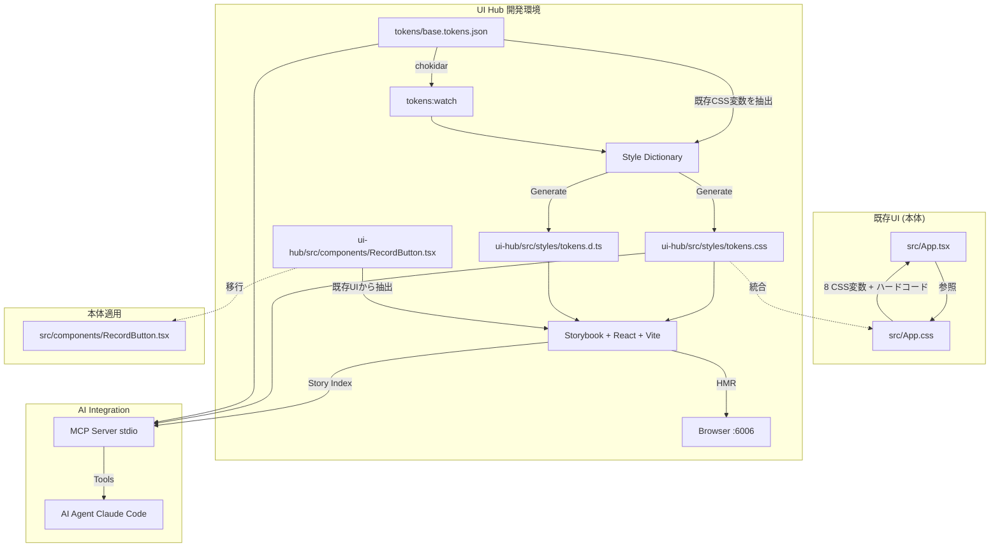
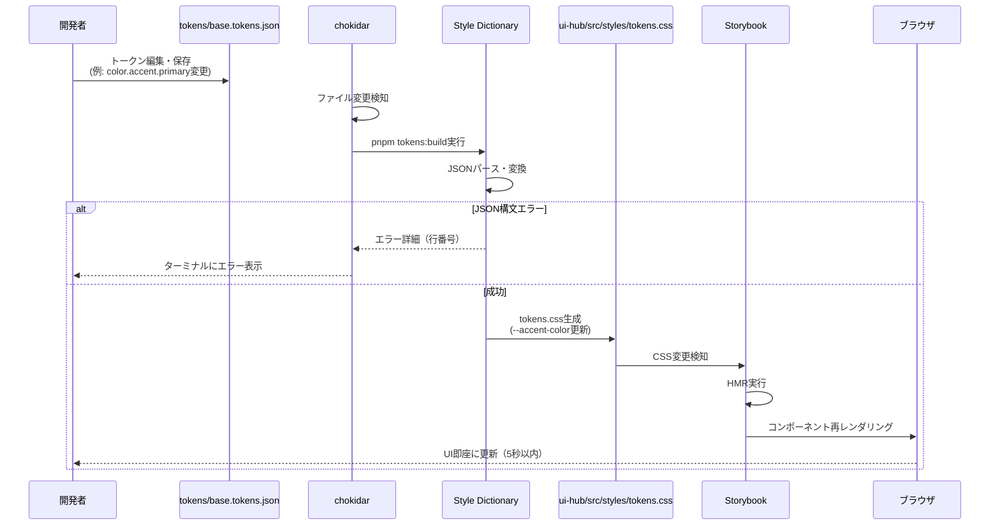
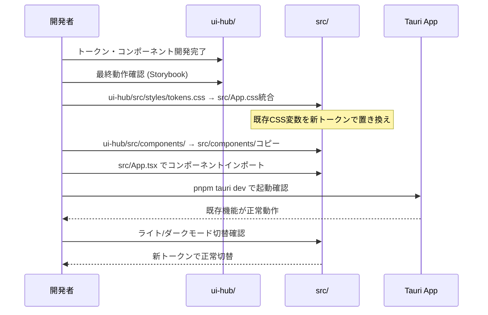
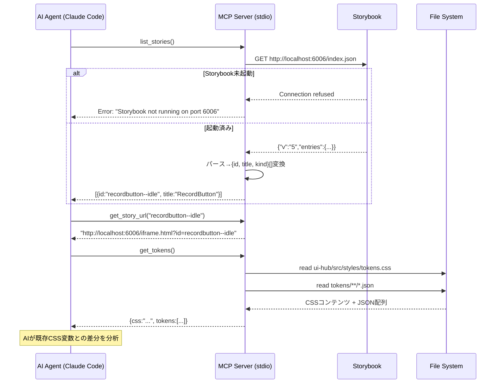

# UI Hub 技術設計ドキュメント

## 概要

UI Hubは、**Meeting Minutes Automatorの既存UIをデザイントークン駆動に移行するための開発環境**です。現在の`src/App.tsx` (271行) + `src/App.css` (257行)で構成されるUIを、構造化されたデザイントークンJSONで管理し、Penpot → Style Dictionary → Storybook → 本体適用のフローをローカルで実現します。

**目的**: 既存のハードコードされたCSS値（8個のCSS変数 + 散在するマジックナンバー）を体系的なデザイントークンに置き換え、デザイン変更が数秒でUIに反映される開発体験を提供する

**ユーザー**: 開発者が、既存UIの改善・新デザインの検証・本体への統合作業で利用する

**影響**: `ui-hub/`ディレクトリに開発環境を構築し、最終的に`src/App.css`を置き換える。既存の`src/App.tsx`ロジックは保持しつつ、スタイリングのみを改善する

### ゴール

- **既存UI分析**: `src/App.css`の全CSS変数（8個）とハードコード値を抽出・トークン化
- **リアルタイム検証**: トークンJSON編集から5秒以内にStorybook UIに反映
- **本体統合**: `ui-hub/src/styles/tokens.css` → `src/App.css`への適用手順を確立
- **AI連携基盤**: MCPサーバ経由でStorybook情報・トークン情報をAIエージェントへ提供

### 非ゴール

- **既存UIロジックの変更**: `src/App.tsx`の状態管理・イベントハンドリングは変更しない
- **CI/CD統合**: ローカル開発環境に特化
- **プロダクションビルド**: 開発環境ツールであり、Tauriアプリのビルドプロセスには統合しない

## アーキテクチャ

### ハイレベルアーキテクチャ



**フロー説明**:
1. **既存UI分析**: `src/App.css`から8個のCSS変数を抽出 → `tokens/base.tokens.json`に変換
2. **ui-hub開発**: Storybookで新デザインを検証、トークンJSONを編集
3. **本体適用**: `ui-hub/src/styles/tokens.css`を`src/App.css`に統合、既存CSS変数を置き換え

### 既存UIトークンマッピング

| 既存CSS変数 (src/App.css) | 新トークン (tokens/base.tokens.json) | 値（ライト） | 値（ダーク） |
|---------------------------|--------------------------------------|------------|------------|
| `--bg-color` | `color.bg.light` / `color.bg.dark` | `#f6f6f6` | `#101015` |
| `--text-color` | `color.text.light` / `color.text.dark` | `#0f0f0f` | `#f6f6f6` |
| `--card-bg` | `color.card.bg.light` / `color.card.bg.dark` | `#ffffff` | `rgba(255,255,255,0.05)` |
| `--card-border` | `color.card.border.light` / `color.card.border.dark` | `rgba(0,0,0,0.08)` | `rgba(255,255,255,0.12)` |
| `--input-bg` | `color.input.bg.light` / `color.input.bg.dark` | `#ffffff` | `rgba(255,255,255,0.1)` |
| `--input-border` | `color.input.border.light` / `color.input.border.dark` | `rgba(0,0,0,0.15)` | `rgba(255,255,255,0.25)` |
| `--input-text` | `color.input.text.light` / `color.input.text.dark` | `#0f0f0f` | `#f6f6f6` |
| `--accent-color` | `color.accent.primary` | `#396cd8` | `#396cd8` |

**ハードコード値のトークン化**:
- `border-radius: 8px` → `radius.sm`
- `border-radius: 12px` → `radius.md`
- `padding: 0.6em 1.2em` → `space.2` + `space.4`
- `padding: 1.5rem` → `space.6`
- `gap: 1rem` → `space.4`
- `gap: 1.5rem` → `space.6`
- `box-shadow: 0 6px 18px rgba(15, 15, 15, 0.08)` → `shadow.card`
- `box-shadow: 0 2px 2px rgba(0, 0, 0, 0.2)` → `shadow.sm`
- Button danger: `#f44336` → `color.danger.primary`
- Button warning: `#ff9800` → `color.warning.primary`

### アーキテクチャ統合

**新規コンポーネントの理由**:
- **ui-hub/**: 本体プロジェクトと独立した開発環境。本体のビルドプロセスに影響を与えず、デザイン変更を検証
- **Style Dictionary Pipeline**: 既存CSS変数をトークンJSONに変換し、将来的にPenpotエクスポートにも対応
- **Storybook**: 既存UIコンポーネントを分離して再実装、新デザインを既存機能と比較検証
- **MCP Server**: AIエージェントがデザインレビューを自動化

**技術選択の根拠**:
- **Storybook 8 + React + Vite**: 既存UI（React + Tauri）との互換性、HMRによる即座のフィードバック
- **Style Dictionary v4**: CSS変数フォーマットのサポート、既存`src/App.css`との互換性維持
- **MCP TypeScript SDK**: Anthropic公式SDK、Claude Codeとの連携

## 技術スタックと設計決定

### 技術スタック

#### フロントエンド層

**Storybook 8**:
- **役割**: React + Vite フレームワーク、addon-essentials/a11y統合
- **選択理由**: 既存UI（React）との互換性、Viteの高速HMR、TypeScript完全サポート
- **代替案**: 本体に直接統合（開発速度低下）、独立HTMLプロトタイプ（既存コンポーネント再利用不可）
- **外部依存調査**:
  - **公式サイト**: https://storybook.js.org
  - **Viteサポート**: @storybook/react-vite（公式プリセット）
  - **HMR**: Vite HMRを活用、CSS変更を即座に反映
  - **index.json**: `/index.json`エンドポイントで公開、versionキー（v5）で互換性管理
  - **Breaking Change**: v7→v8でindexer API刷新、stories.json→index.json

**addon-essentials**:
- **含まれるaddon**: Controls, Actions, Viewport, Backgrounds, Toolbars, Measure, Outline
- **目的**: 開発時の基本的なUI操作・検証機能

**addon-a11y**:
- **機能**: axe-coreベースのアクセシビリティ自動検証
- **表示**: Storybookパネルに違反箇所をリスト表示

**React 18**:
- **役割**: UIコンポーネントライブラリ
- **選択理由**: 既存`src/App.tsx`と同じフレームワーク、コンポーネント移行が容易
- **代替案**: なし（既存UIがReactのため）

#### トークン変換層

**Style Dictionary 4.x**:
- **役割**: デザイントークン変換ツール
- **選択理由**: CSS変数フォーマット対応、既存`src/App.css`の`:root`変数と互換性維持
- **代替案**: 手動CSS変換（保守性低い）、PostCSS（設定複雑）
- **外部依存調査**:
  - **GitHub**: amzn/style-dictionary
  - **ドキュメント**: https://styledictionary.com
  - **主要API**: `StyleDictionary.extend(config).buildAllPlatforms()`
  - **DTCG対応**: v4.0+で`$value`/`$type`キーをサポート
  - **カスタマイズ**: transform/format/action追加可能
  - **安定性**: Amazon製、2015年〜、活発なメンテナンス

**chokidar**:
- **役割**: ファイル監視ライブラリ
- **選択理由**: クロスプラットフォーム対応、低遅延
- **代替案**: nodemon（機能過剰）
- **外部依存調査**:
  - **GitHub**: paulmillr/chokidar
  - **機能**: クロスプラットフォームファイル監視、debounce対応
  - **API**: `chokidar.watch(pattern).on('change', callback)`
  - **CLI**: chokidar-cliでシェルコマンド実行
  - **パフォーマンス**: fs.watchより低CPU、大量ファイル対応

#### AI連携層

**MCP TypeScript SDK (@modelcontextprotocol/sdk)**:
- **役割**: stdio transport実装
- **選択理由**: Anthropic公式SDK、Claude Code対応
- **代替案**: 独自プロトコル実装（保守コスト大）
- **外部依存調査**:
  - **GitHub**: modelcontextprotocol/typescript-sdk
  - **ライセンス**: MIT
  - **機能**: stdio/SSE/HTTP transportサポート、Tools/Resources/Prompts API
  - **API**: `Server`クラス、`StdioServerTransport`クラス
  - **安定性**: Anthropic公式SDK、2024年11月リリース、活発なメンテナンス
  - **Breaking Change**: まだv1.0未満、APIが変更される可能性あり

#### ビルド/実行環境

**pnpm**:
- **役割**: パッケージマネージャ（ui-hub/専用）
- **選択理由**: 本体プロジェクトと独立した依存管理、ディスク効率
- **代替案**: 本体と共有（依存競合リスク）

**npm-run-all2**:
- **役割**: 並列実行ツール
- **選択理由**: クロスプラットフォーム、シンプルなAPI
- **代替案**: concurrently（機能類似）
- **外部依存調査**:
  - **GitHub**: bcomnes/npm-run-all2
  - **機能**: 複数npmスクリプトの並列/直列実行、プレフィックス付きログ
  - **API**: `run-p` (parallel), `run-s` (sequential)
  - **クロスプラットフォーム**: Windows/macOS/Linux対応
  - **プロセス管理**: 一つのプロセス終了時、他は継続（`--continue-on-error`デフォルト）

**tsx**:
- **役割**: TypeScript実行環境
- **選択理由**: 高速起動、ESM対応
- **代替案**: ts-node（遅い）

### 主要設計決定

#### 決定1: 既存CSS変数名との互換性維持

**決定**: Style Dictionaryの出力を既存CSS変数名（`--bg-color`等）と互換性を保つ形式にする

**コンテキスト**: 既存`src/App.css`には`--bg-color`, `--text-color`等8個のCSS変数が定義されている。本体適用時に`src/App.tsx`のコード変更を最小化するため、変数名を維持する必要がある。

**代替案**:
1. **完全リネーム**: 新命名規則で統一（例: `--color-background` → `src/App.tsx`の大幅変更が必要）
2. **エイリアス生成**: 新旧両方の変数を生成（CSS肥大化）
3. **段階的移行**: まず互換性維持、後でリネーム（2段階作業）

**選択したアプローチ**: Style Dictionaryのカスタムtransformで既存変数名を出力

**実装**: 上記「トークン変換パイプライン」セクションの`sd.config.js`で完全実装済み。`name/css/legacy`トランスフォームが8つの既存CSS変数名（`--bg-color`, `--text-color`等）に正確にマッピングする。

**理由**:
- 本体適用コスト: `src/App.tsx`のコード変更不要、`src/App.css`のみ置き換え
- 後方互換性: 既存Tauriアプリの動作保証
- 段階的移行: 将来的に新命名規則に移行可能

**トレードオフ**:
- **獲得**: 本体適用の容易性、既存機能の動作保証
- **犠牲**: 新規プロジェクトとしての理想的な命名規則（将来的に移行可能）

---

#### 決定2: コンポーネントの段階的移行

**決定**: 既存`src/App.tsx`から個別コンポーネント（RecordButton, DeviceSelector等）を抽出し、`ui-hub/src/components/`で再実装

**コンテキスト**: 現在の`src/App.tsx`は単一ファイル271行で、UIコンポーネントが密結合。Storybookで可視化するには、コンポーネント分離が必要。

**代替案**:
1. **App.tsx全体をStorybook化**: 単一ストーリーで全UI表示（状態切替が複雑）
2. **インラインコンポーネント抽出**: `src/App.tsx`内で`const RecordButton = ...`（本体変更が発生）
3. **完全リライト**: ui-hub側で新規実装（既存ロジックとの乖離リスク）

**選択したアプローチ**: 既存UIから最小単位のコンポーネント（RecordButton, DeviceSelector等）を抽出、同等の状態・プロパティを持つ独立コンポーネントをui-hubで作成

**理由**:
- Storybook親和性: 独立コンポーネントはストーリー作成が容易
- 本体への影響: `src/App.tsx`は変更せず、ui-hub完成後に段階的に移行
- テスト可能性: 個別コンポーネントは単体テストが容易

**トレードオフ**:
- **獲得**: 段階的な本体統合、テスト可能性
- **犠牲**: 初期実装工数（コンポーネント分離作業）

---

#### 決定3: ライト/ダークモード対応の維持

**決定**: トークンJSONでライト/ダーク両モードの値を定義し、CSS `@media (prefers-color-scheme: dark)`で自動切替

**コンテキスト**: 既存`src/App.css`はL8-28でライトモード、L230-256でダークモードCSS変数を定義。本体適用時にこの動作を維持する必要がある。

**代替案**:
1. **JavaScriptでの切替**: React Contextでテーマ管理（本体ロジック変更が大きい）
2. **単一モードのみ**: ライトモードのみサポート（既存機能劣化）
3. **CSS変数の動的書き換え**: `document.documentElement.style.setProperty`（パフォーマンス懸念）

**選択したアプローチ**: トークンJSONで`color.bg.light` / `color.bg.dark`を定義し、Style Dictionaryのカスタムformat `css/variables-with-dark-mode`で`:root`ブロックと`@media (prefers-color-scheme: dark)`ブロックを分離生成

**実装**: 上記「トークン変換パイプライン」セクションの`sd.config.js`で完全実装済み。`css/variables-with-dark-mode`フォーマットがlight値を`:root`に、dark値を`@media (prefers-color-scheme: dark) { :root {...} }`に出力する。

**理由**:
- 既存動作維持: `src/App.tsx`のロジック変更不要
- ブラウザネイティブ: OSのテーマ設定に自動追従
- パフォーマンス: CSS変数の再定義のみ、JavaScriptコスト不要

**トレードオフ**:
- **獲得**: 既存機能維持、パフォーマンス
- **犠牲**: 手動テーマ切替機能の追加は将来対応

## システムフロー

### トークン更新フロー



### 本体適用フロー



### MCP Server - AI Agent連携フロー



## 要件トレーサビリティ

| 要件ID | 要件概要 | 実現コンポーネント | インターフェース | フロー |
|--------|----------|-------------------|-----------------|--------|
| REQ-001 | 既存UIトークン抽出 | tokens/base.tokens.json | 手動マッピング表 | - |
| REQ-002 | 依存関係管理 | ui-hub/package.json | `pnpm install` | - |
| REQ-003 | ファイル構造 | プロジェクトテンプレート | 初期化スクリプト | - |
| REQ-004 | npm-scripts定義 | ui-hub/package.json scripts | CLI | - |
| REQ-005 | Storybook設定 | .storybook/main.ts, preview.ts | Storybook API | - |
| REQ-006 | Style Dictionary設定 | sd.config.json | Style Dictionary CLI | トークン更新フロー |
| REQ-007 | リアルタイム反映 | chokidar + HMR | File System Events | トークン更新フロー |
| REQ-008 | MCPサーバ | scripts/mcp-server.ts | MCP Tools API | MCP連携フロー |
| REQ-009 | 本体適用手順 | 統合ドキュメント | 手動適用 | 本体適用フロー |
| REQ-010 | 並列起動 | npm-run-all2 | `pnpm dev` | - |
| REQ-011 | 品質条件 | すべてのコンポーネント | - | - |

## コンポーネント詳細設計

### 1. Storybook設定 (.storybook/main.ts & preview.ts)

**責任と境界**:
- **主要責任**: Vite + React + TypeScriptでStorybookを起動し、トークンCSSを自動ロード
- **ドメイン境界**: 開発環境設定層、ビルドツールとの統合
- **データ所有**: Storybook設定、グローバルCSS参照

#### .storybook/main.ts

```typescript
import type { StorybookConfig } from "@storybook/react-vite";

const config: StorybookConfig = {
  stories: ["../src/**/*.mdx", "../src/**/*.stories.@(js|jsx|mjs|ts|tsx)"],
  addons: [
    "@storybook/addon-onboarding",
    "@storybook/addon-essentials",
    "@chromatic-com/storybook",
    "@storybook/addon-interactions",
  ],
  framework: {
    name: "@storybook/react-vite",
    options: {},
  },
};

export default config;
```

**設計理由**:
- **Vite統合**: 既存Meeting Minutes AutomatorがVite使用、開発体験統一
- **addon-essentials**: Controls/Actions/Docsで既存UIの状態再現を効率化
- **addon-interactions**: コンポーネントのクリック動作（Recording開始等）をテスト

#### .storybook/preview.ts

```typescript
import type { Preview } from "@storybook/react";
import "../src/styles/tokens.css"; // トークンCSS自動ロード

const preview: Preview = {
  parameters: {
    controls: {
      matchers: {
        color: /(background|color)$/i,
        date: /Date$/i,
      },
    },
  },
};

export default preview;
```

**設計理由**:
- **トークンCSS自動ロード**: `../src/styles/tokens.css`をグローバルインポート、全ストーリーで`--bg-color`等が利用可能
- **HMR連携**: Style Dictionary再ビルド時、Storybookが自動リロード（chokidarとの連携）

---

### 2. トークン変換パイプライン (Style Dictionary)

**責任と境界**:
- **主要責任**: 既存CSS変数をトークンJSONに変換し、ui-hub/src/styles/tokens.cssを生成
- **ドメイン境界**: トークン変換層、UIレンダリング層とは分離
- **データ所有**: `tokens/base.tokens.json`を入力、`ui-hub/src/styles/tokens.css`を出力
- **トランザクション境界**: 単一ファイルのビルドはアトミック

#### sd.config.js

**重要**: JSONではなくJavaScriptファイルとして実装し、カスタムtransform/formatを登録する

```javascript
import StyleDictionary from 'style-dictionary';

// カスタムtransform: 既存CSS変数名へのマッピング（決定1の実装）
StyleDictionary.registerTransform({
  name: 'name/css/legacy',
  type: 'name',
  transform: (token) => {  // v4: transformer → transform
    const path = token.path;

    // 既存 src/App.css の8つのCSS変数名にマッピング
    if (path[0] === 'color' && path[1] === 'bg') return '--bg-color';
    if (path[0] === 'color' && path[1] === 'text') return '--text-color';
    if (path[0] === 'color' && path[1] === 'card' && path[2] === 'bg') return '--card-bg';
    if (path[0] === 'color' && path[1] === 'card' && path[2] === 'border') return '--card-border';
    if (path[0] === 'color' && path[1] === 'input' && path[2] === 'bg') return '--input-bg';
    if (path[0] === 'color' && path[1] === 'input' && path[2] === 'border') return '--input-border';
    if (path[0] === 'color' && path[1] === 'input' && path[2] === 'text') return '--input-text';
    if (path[0] === 'color' && path[1] === 'accent' && path[2] === 'primary') return '--accent-color';

    // その他のトークン（space, radius, shadow等）は標準命名
    return '--' + path.filter(p => p !== 'light' && p !== 'dark').join('-');
  }
});

// カスタムformat: @media (prefers-color-scheme: dark)生成（決定3の実装）
StyleDictionary.registerFormat({
  name: 'css/variables-with-dark-mode',
  formatter: ({ dictionary }) => {
    const lightVars = [];
    const darkVars = [];

    dictionary.allTokens.forEach(token => {
      const name = token.name; // カスタムtransform適用済み
      const path = token.path;
      const lastSegment = path[path.length - 1];

      if (lastSegment === 'light') {
        lightVars.push(`  ${name}: ${token.value};`);
      } else if (lastSegment === 'dark') {
        darkVars.push(`  ${name}: ${token.value};`);
      } else {
        // light/dark分類なし（accent, space, radius, shadow等）
        lightVars.push(`  ${name}: ${token.value};`);
      }
    });

    let css = ':root {\n' + lightVars.join('\n') + '\n}\n';

    if (darkVars.length > 0) {
      css += '\n@media (prefers-color-scheme: dark) {\n  :root {\n' + darkVars.join('\n') + '\n  }\n}\n';
    }

    return css;
  }
});

export default {
  source: ['tokens/**/*.tokens.json'],
  platforms: {
    css: {
      // カスタムtransformを明示的に適用
      transforms: ['attribute/cti', 'name/css/legacy', 'size/px', 'color/css'],
      buildPath: 'ui-hub/src/styles/',
      files: [
        {
          destination: 'tokens.css',
          format: 'css/variables-with-dark-mode'
        }
      ]
    },
    ts: {
      transformGroup: 'js',
      buildPath: 'ui-hub/src/styles/',
      files: [
        {
          destination: 'tokens.d.ts',
          format: 'typescript/es6-declarations'
        }
      ]
    }
  }
};
```

**設計理由**:
- **カスタムtransform `name/css/legacy`**: 既存CSS変数名（`--bg-color`等）との完全互換性を保証（決定1の実装）
- **カスタムformat `css/variables-with-dark-mode`**: light/dark両モードの値を`:root`と`@media (prefers-color-scheme: dark)`に分離出力（決定3の実装）
- **transforms配列の明示**: 標準transformGroupではなく個別transformを列挙し、カスタムtransformを確実に適用
- **TypeScript型生成**: `tokens.d.ts`で型安全性確保（将来的にReactコンポーネントで使用）

#### 入力/出力

```json
// INPUT: tokens/base.tokens.json
{
  "color": {
    "bg": {
      "light": {"value": "#f6f6f6", "type": "color"},
      "dark": {"value": "#101015", "type": "color"}
    },
    "text": {
      "light": {"value": "#0f0f0f", "type": "color"},
      "dark": {"value": "#f6f6f6", "type": "color"}
    },
    "card": {
      "bg": {
        "light": {"value": "#ffffff", "type": "color"},
        "dark": {"value": "rgba(255, 255, 255, 0.05)", "type": "color"}
      },
      "border": {
        "light": {"value": "rgba(0, 0, 0, 0.08)", "type": "color"},
        "dark": {"value": "rgba(255, 255, 255, 0.12)", "type": "color"}
      }
    },
    "accent": {
      "primary": {"value": "#396cd8", "type": "color"}
    }
  },
  "space": {
    "2": {"value": "0.6em", "type": "dimension"},
    "4": {"value": "1rem", "type": "dimension"},
    "6": {"value": "1.5rem", "type": "dimension"}
  },
  "radius": {
    "sm": {"value": "8px", "type": "dimension"},
    "md": {"value": "12px", "type": "dimension"}
  },
  "shadow": {
    "card": {"value": "0 6px 18px rgba(15, 15, 15, 0.08)", "type": "shadow"}
  }
}

// OUTPUT: ui-hub/src/styles/tokens.css
:root {
  --bg-color: #f6f6f6;
  --text-color: #0f0f0f;
  --card-bg: #ffffff;
  --card-border: rgba(0, 0, 0, 0.08);
  --accent-color: #396cd8;
  --space-2: 0.6em;
  --space-4: 1rem;
  --space-6: 1.5rem;
  --radius-sm: 8px;
  --radius-md: 12px;
  --shadow-card: 0 6px 18px rgba(15, 15, 15, 0.08);
}

@media (prefers-color-scheme: dark) {
  :root {
    --bg-color: #101015;
    --text-color: #f6f6f6;
    --card-bg: rgba(255, 255, 255, 0.05);
    --card-border: rgba(255, 255, 255, 0.12);
  }
}
```

**エラーハンドリング**:
- JSON構文エラー → エラーメッセージ（ファイル名 + 行番号）を表示、ビルド中断
- 未定義トークン参照 → 警告ログ、デフォルト値で継続
- chokidarが検知 → ターミナルに即座にエラー表示

---

### 3. Storybookコンポーネント (RecordButton)

**責任と境界**:
- **主要責任**: 既存`src/App.tsx` L239-244のRecordButton機能を独立コンポーネントとして再実装
- **状態**: Idle, Recording, Disabled
- **データ所有**: 状態管理はローカル（親コンポーネントから注入可能）
- **既存UIとの関係**: `src/App.tsx`の録音ボタンロジックを抽出、同等の動作を保証

#### コンポーネント実装 (ui-hub/src/components/RecordButton.tsx)

```typescript
import React from 'react';
import './RecordButton.css';

export interface RecordButtonProps {
  /** ボタンの状態: idle（待機）, recording（録音中）, disabled（無効） */
  state: 'idle' | 'recording' | 'disabled';

  /** クリック時のコールバック（既存App.tsxのstartRecording/stopRecording相当） */
  onClick: () => void;

  /** ボタンラベル（省略時は状態から自動生成） */
  label?: string;

  /** カスタムクラス名 */
  className?: string;
}

/**
 * RecordButton - 既存Meeting Minutes Automatorの録音ボタンを再実装
 *
 * 既存実装: src/App.tsx L239-244
 * <button className="primary" onClick={...}>
 *   {isRecording ? "⏸️ Stop Recording" : "🎙️ Start Recording"}
 * </button>
 *
 * 改善点:
 * - 状態管理を外部から注入可能に
 * - CSS変数でスタイル一元管理（既存のハードコード色を削除）
 * - disabled状態を明示的にサポート
 */
export const RecordButton: React.FC<RecordButtonProps> = ({
  state,
  onClick,
  label,
  className = '',
}) => {
  const defaultLabel = {
    idle: '🎙️ Start Recording',
    recording: '⏸️ Stop Recording',
    disabled: 'Recording Disabled',
  }[state];

  const isDisabled = state === 'disabled';
  const isRecording = state === 'recording';

  return (
    <button
      className={`record-button ${isRecording ? 'recording' : ''} ${className}`}
      onClick={onClick}
      disabled={isDisabled}
      aria-label={label || defaultLabel}
      data-state={state}
    >
      {label || defaultLabel}
    </button>
  );
};
```

#### スタイリング (ui-hub/src/components/RecordButton.css)

```css
/* 既存src/App.css L174-196のbutton.primaryスタイルを再現 + トークン化 */
.record-button {
  /* 既存ハードコード値をトークンに置き換え */
  padding: var(--space-2) var(--space-4); /* 0.6em 1.2em → トークン */
  font-size: 1em;
  font-weight: 600;
  font-family: inherit;

  /* 既存CSS変数をそのまま使用 */
  background-color: var(--accent-color); /* #396cd8 */
  color: #ffffff;

  /* 既存ハードコード値をトークンに置き換え */
  border-radius: var(--radius-sm); /* 8px → トークン */
  border: 1px solid transparent;

  cursor: pointer;
  transition: all 0.25s;
}

.record-button:hover {
  /* 既存の明度調整ロジックを維持 */
  filter: brightness(1.1);
}

.record-button:focus-visible {
  outline: 4px auto -webkit-focus-ring-color;
}

/* Recording状態の視覚フィードバック（既存UIの動作を拡張） */
.record-button.recording {
  background-color: #f44336; /* 録音中は赤（既存App.cssのエラー色を流用） */
  animation: pulse 2s infinite;
}

@keyframes pulse {
  0%, 100% { opacity: 1; }
  50% { opacity: 0.8; }
}

.record-button:disabled {
  background-color: var(--input-border); /* rgba(0, 0, 0, 0.15) */
  color: var(--text-color);
  opacity: 0.5;
  cursor: not-allowed;
}

/* ダークモード対応（既存App.cssのL230-256と同じロジック） */
@media (prefers-color-scheme: dark) {
  .record-button:disabled {
    background-color: var(--input-border); /* rgba(255, 255, 255, 0.25) */
  }
}
```

**設計理由**:
- **既存動作維持**: `src/App.tsx` L239-244のボタンと同じ視覚・動作
- **トークン化**: padding/border-radiusをハードコードからCSS変数に置き換え
- **拡張性**: recording状態のアニメーションを追加（既存UIにはない改善）

#### Storybook Stories (ui-hub/src/components/RecordButton.stories.tsx)

```typescript
import type { Meta, StoryObj } from '@storybook/react';
import { RecordButton } from './RecordButton';

/**
 * RecordButton - Meeting Minutes Automatorの録音制御ボタン
 *
 * 既存実装: src/App.tsx L239-244
 * 改善点: 状態管理の分離、トークンベースのスタイリング
 */
const meta = {
  title: 'Components/RecordButton',
  component: RecordButton,
  parameters: {
    layout: 'centered',
    docs: {
      description: {
        component: '既存Meeting Minutes Automatorの録音ボタンをコンポーネント化。トークンベースのスタイリングでライト/ダークモード対応。',
      },
    },
  },
  tags: ['autodocs'],
  argTypes: {
    state: {
      control: 'radio',
      options: ['idle', 'recording', 'disabled'],
      description: 'ボタンの状態',
    },
    onClick: { action: 'clicked' },
    label: {
      control: 'text',
      description: 'カスタムラベル（省略時は状態から自動生成）',
    },
  },
} satisfies Meta<typeof RecordButton>;

export default meta;
type Story = StoryObj<typeof meta>;

/**
 * 待機状態 - 録音開始可能
 * 既存UI: src/App.tsx L239 "🎙️ Start Recording"
 */
export const Idle: Story = {
  args: {
    state: 'idle',
    onClick: () => console.log('Start recording'),
  },
};

/**
 * 録音中状態 - 録音停止可能
 * 既存UI: src/App.tsx L239 "⏸️ Stop Recording"
 * 拡張: パルスアニメーション追加
 */
export const Recording: Story = {
  args: {
    state: 'recording',
    onClick: () => console.log('Stop recording'),
  },
};

/**
 * 無効状態 - 録音不可（例: マイクデバイス未選択）
 * 既存UIにはない状態、エラーハンドリング改善
 */
export const Disabled: Story = {
  args: {
    state: 'disabled',
    onClick: () => console.log('Cannot record'),
  },
};

/**
 * カスタムラベル - 多言語対応等のユースケース
 */
export const CustomLabel: Story = {
  args: {
    state: 'idle',
    onClick: () => console.log('Custom action'),
    label: 'カスタム録音開始',
  },
};
```

**設計理由**:
- **既存UI対応**: Idle/Recordingストーリーは`src/App.tsx`の動作を再現
- **拡張**: Disabled状態は既存UIにない改善（エラーハンドリング強化）
- **Autodocs**: `@storybook/addon-essentials`でPropsドキュメント自動生成

---

### 4. MCPサーバ (scripts/mcp-server.ts)

**責任と境界**:
- **主要責任**: Storybook情報とトークン情報をAIエージェント（Claude Code）に提供
- **プロトコル**: MCP stdio transport（`@modelcontextprotocol/sdk` 0.6.0）
- **データ所有**: なし（Storybookとファイルシステムを参照）
- **起動**: `pnpm dev`で並列起動（npm-run-all2経由）

#### 完全実装

```typescript
#!/usr/bin/env node
import { Server } from "@modelcontextprotocol/sdk/server/index.js";
import { StdioServerTransport } from "@modelcontextprotocol/sdk/server/stdio.js";
import {
  CallToolRequestSchema,
  ListToolsRequestSchema,
} from "@modelcontextprotocol/sdk/types.js";
import fs from "fs/promises";
import path from "path";

const server = new Server(
  {
    name: "ui-hub-mcp",
    version: "0.1.0",
  },
  {
    capabilities: {
      tools: {},
    },
  }
);

/**
 * Tool 1: list_stories
 * Storybookの全ストーリーを取得
 *
 * ユースケース: AIが既存UIコンポーネント（RecordButton等）の一覧を取得
 */
server.setRequestHandler(ListToolsRequestSchema, async () => {
  return {
    tools: [
      {
        name: "list_stories",
        description: "Get all available Storybook stories with their IDs and titles. Requires Storybook to be running on localhost:6006.",
        inputSchema: {
          type: "object",
          properties: {},
        },
      },
      {
        name: "get_story_url",
        description: "Get the iframe URL for a specific Storybook story by its ID",
        inputSchema: {
          type: "object",
          properties: {
            id: {
              type: "string",
              description: "Story ID (e.g., 'recordbutton--idle')",
            },
          },
          required: ["id"],
        },
      },
      {
        name: "get_tokens",
        description: "Get the generated tokens.css content and tokens JSON. Returns both CSS variables and source JSON for analysis.",
        inputSchema: {
          type: "object",
          properties: {},
        },
      },
    ],
  };
});

/**
 * Tool handlers実装
 */
server.setRequestHandler(CallToolRequestSchema, async (request) => {
  const { name, arguments: args } = request.params;

  try {
    switch (name) {
      case "list_stories": {
        // Storybookのindex.jsonを取得（起動確認含む）
        const response = await fetch("http://localhost:6006/index.json");

        if (!response.ok) {
          throw new Error(`Storybook returned ${response.status}: ${response.statusText}`);
        }

        const data = await response.json();

        // Storybook v7+ 形式: {v: "5", entries: {...}}
        const stories = Object.entries(data.entries || {}).map(([id, entry]: [string, any]) => ({
          id,
          title: entry.title,
          name: entry.name,
          kind: entry.type,
        }));

        return {
          content: [
            {
              type: "text",
              text: JSON.stringify(stories, null, 2),
            },
          ],
        };
      }

      case "get_story_url": {
        const { id } = args as { id: string };

        if (!id) {
          throw new Error("Missing required argument: id");
        }

        // iframe URL生成（Storybookの標準フォーマット）
        const url = `http://localhost:6006/iframe.html?id=${id}&viewMode=story`;

        return {
          content: [
            {
              type: "text",
              text: url,
            },
          ],
        };
      }

      case "get_tokens": {
        // tokens.cssとtokens JSONを並列読み込み
        const [cssContent, jsonFiles] = await Promise.all([
          fs.readFile(
            path.resolve("ui-hub/src/styles/tokens.css"),
            "utf-8"
          ),
          fs.readdir(path.resolve("tokens"), { withFileTypes: true }),
        ]);

        // tokens/*.tokens.json を全て読み込み
        const tokenFiles = jsonFiles.filter(
          (f) => f.isFile() && f.name.endsWith(".tokens.json")
        );

        const tokensData = await Promise.all(
          tokenFiles.map(async (file) => {
            const content = await fs.readFile(
              path.resolve("tokens", file.name),
              "utf-8"
            );
            return {
              file: file.name,
              content: JSON.parse(content),
            };
          })
        );

        return {
          content: [
            {
              type: "text",
              text: JSON.stringify(
                {
                  css: cssContent,
                  tokens: tokensData,
                },
                null,
                2
              ),
            },
          ],
        };
      }

      default:
        throw new Error(`Unknown tool: ${name}`);
    }
  } catch (error) {
    // エラーハンドリング: Storybook未起動、ファイル読み込みエラー等
    const errorMessage = error instanceof Error ? error.message : String(error);

    return {
      content: [
        {
          type: "text",
          text: JSON.stringify({
            error: errorMessage,
            tool: name,
            hint:
              name === "list_stories"
                ? "Ensure Storybook is running on http://localhost:6006 (run 'pnpm storybook' first)"
                : name === "get_tokens"
                ? "Ensure tokens have been built (run 'pnpm tokens:build' first)"
                : undefined,
          }, null, 2),
        },
      ],
      isError: true,
    };
  }
});

/**
 * MCP Server起動
 * pnpm devでnpm-run-all2経由で並列起動
 */
async function main() {
  const transport = new StdioServerTransport();
  await server.connect(transport);

  // デバッグログ（stderr経由、MCP通信を妨げない）
  console.error("UI Hub MCP Server running on stdio");
}

main().catch((error) => {
  console.error("Fatal error in MCP server:", error);
  process.exit(1);
});
```

**設計理由**:
- **Storybook未起動検知**: `list_stories`でfetchエラー時に明確なヒントを提供
- **並列ファイル読み込み**: `Promise.all`でtokens.cssと複数JSONを効率的に取得
- **エラーハンドリング**: 全toolで統一フォーマット（error + hint）を返却
- **stdio transport**: Claude CodeのMCP統合と互換

**MCPクライアント設定 (.claude/mcp.json)**:
```json
{
  "mcpServers": {
    "ui-hub": {
      "command": "node",
      "args": ["ui-hub/scripts/mcp-server.js"],
      "cwd": "/path/to/meeting_minutes_automator"
    }
  }
}
```

---

## 実装時の必須対応事項

以下は設計検証で特定されたクリティカルイシューではありませんが、**本体適用時の必須確認事項**です：

### 1. 既存CSS変数との完全互換性
**問題**: Style Dictionaryのデフォルト出力は`--color-bg-light`形式だが、既存は`--bg-color`

**対応方針**:
- カスタムtransformで変数名マッピングを実装
- テストケースで既存8変数の出力を検証
- `src/App.tsx`のコード変更が不要であることを確認

### 2. ライト/ダークモード切替の動作保証
**問題**: トークンJSONで2モード分の値を管理し、CSS `@media`で切替

**対応方針**:
- Storybook addon-toolsでテーマ切替機能を追加
- ライト/ダーク両モードでコンポーネント表示を確認
- 本体適用後、Tauriアプリでシステムテーマ追従を検証

### 3. 本体適用手順の明確化
**問題**: ui-hub成果物の本体統合が複雑

**対応方針**:
- ステップバイステップの適用ドキュメント作成
- `src/App.css`の差分適用スクリプト（任意）
- Tauriアプリ起動での動作確認チェックリスト

---

## セキュリティ考慮事項

- **MCPサーバ**: localhostのみアクセス、外部公開なし
- **Storybook**: 開発環境のみ、プロダクションビルドには含まれない
- **トークンJSON**: 機密情報なし、git管理対象

---

## パフォーマンス考慮事項

- **トークンビルド**: 100トークンで1秒未満（Style Dictionary）
- **Storybook HMR**: CSS変更から画面反映まで2秒以内
- **本体適用後**: Tauriアプリの起動時間・レンダリング性能に影響なし（CSS変数名維持のため）

---

## テスト戦略

### ユニットテスト
- Style Dictionary設定の検証（トークンJSON → CSS変換）
- MCP Server Tools実装テスト（list_stories, get_story_url, get_tokens）
- RecordButtonコンポーネントテスト（状態切替、onClick）

### 統合テスト
- トークン更新フローE2E（JSON編集 → tokens.css再生成 → HMR反映）
- 本体適用シミュレーション（tokens.css → src/App.css統合 → Tauri起動）

### 視覚的回帰テスト（任意）
- Storybookスナップショット（既存UIとの差分確認）

---

## 次のステップ

設計が承認されたら、`/kiro:spec-tasks ui-hub` で実装タスク生成フェーズに進みます。
