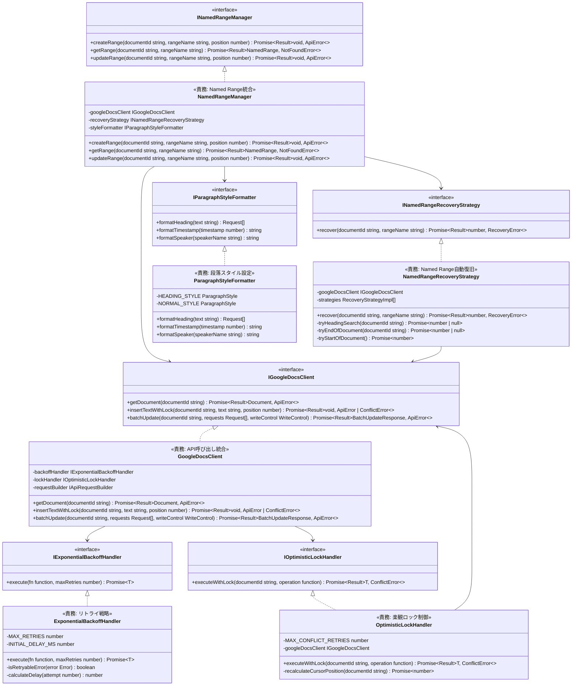

# API Domain - Class Diagram

> **親ドキュメント**: [phase-0-design-validation.md](/.kiro/specs/meeting-minutes-docs-sync/task-details/phase-0-design-validation.md)
> **関連設計**: [design-components.md#API Domain](/.kiro/specs/meeting-minutes-docs-sync/design-modules/design-components.md)
> **Requirements**: DOCS-REQ-002.1-13, DOCS-REQ-003.1-8, DOCS-REQ-006.1-6

## Class Diagram

## Metrics

| クラス | 公開メソッド数 | プライベートメソッド数 | 依存先数 | テスト容易性 |
|--------|---------------|-------------------|---------|-------------|
| GoogleDocsClient | 3 | 0 | 3 | ⭐⭐⭐⭐ |
| ExponentialBackoffHandler | 1 | 2 | 0 | ⭐⭐⭐⭐⭐ |
| OptimisticLockHandler | 1 | 1 | 1 | ⭐⭐⭐⭐ |
| NamedRangeManager | 3 | 0 | 3 | ⭐⭐⭐⭐ |
| NamedRangeRecoveryStrategy | 1 | 3 | 1 | ⭐⭐⭐⭐ |
| ParagraphStyleFormatter | 3 | 0 | 0 | ⭐⭐⭐⭐⭐ |

**Total Classes**: 6
**Average Public Methods**: 2.0
**Test Ease ⭐4+**: 100% (6/6 classes)
