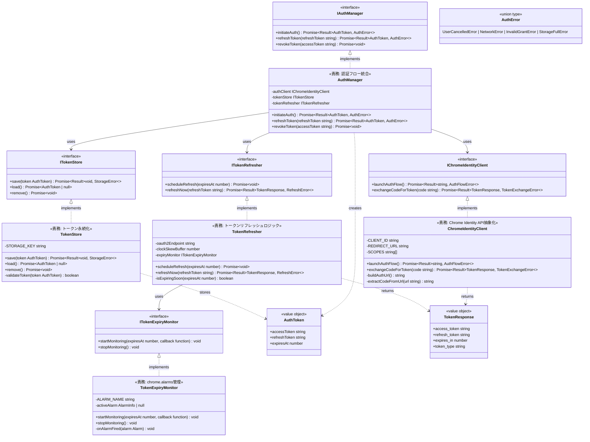

# Auth Domain - Class Diagram

> **親ドキュメント**: [phase-0-design-validation.md](/.kiro/specs/meeting-minutes-docs-sync/task-details/phase-0-design-validation.md)
> **関連設計**: [design-components.md#Auth Domain](/.kiro/specs/meeting-minutes-docs-sync/design-modules/design-components.md)
> **Requirements**: DOCS-REQ-001.1-9, DOCS-NFR-003.1, DOCS-NFR-003.3

## Overview

Auth Domainは、OAuth 2.0認証フロー、トークン管理、トークンリフレッシュを担当します。責務を5クラスに分割し、各クラスが単一責務を持つように設計されています。

---

## Class Diagram



---

## Class Responsibilities

### AuthManager
**責務**: 認証フロー全体の統合調整

- OAuth 2.0認証フロー全体のオーケストレーション
- 認証成功時のトークン保存とリフレッシュスケジューリング
- トークン無効化の調整

**依存関係**:
- IChromeIdentityClient: Chrome Identity API呼び出し
- ITokenStore: トークンの永続化
- ITokenRefresher: トークンリフレッシュのスケジューリング

**テスト戦略**: 依存性注入によるモック化で完全にユニットテスト可能

---

### ChromeIdentityClient
**責務**: Chrome Identity APIの低レベル呼び出しをカプセル化

- `chrome.identity.launchWebAuthFlow()`の実行
- 認証コードからアクセストークンへの交換（Google OAuth 2.0 Token Endpoint）
- 認証URLの構築
- リダイレクトURLからの認証コード抽出

**依存関係**:
- chrome.identity API（外部依存）

**テスト戦略**: chrome.identity APIをモック化してユニットテスト

---

### TokenStore
**責務**: トークンの永続化のみ

- `chrome.storage.local`への保存
- `chrome.storage.local`からの読み込み
- `chrome.storage.local`からの削除
- トークンの基本検証（型チェック）

**依存関係**:
- chrome.storage.local API（外部依存）

**テスト戦略**: インメモリ実装で完全にモック可能、最もテスト容易

---

### TokenRefresher
**責務**: トークンリフレッシュロジックの実行

- リフレッシュトークンを使用した新しいアクセストークンの取得
- トークンリフレッシュのスケジューリング（有効期限60秒前）
- クロックスキュー対策（60秒バッファ）

**依存関係**:
- ITokenExpiryMonitor: chrome.alarmsによるタイマー管理
- Google OAuth 2.0 Token Endpoint（fetch）

**テスト戦略**: TokenExpiryMonitorをモック化してユニットテスト

---

### TokenExpiryMonitor
**責務**: chrome.alarmsの管理のみ

- chrome.alarms.create()の実行
- chrome.alarms.clear()の実行
- アラームコールバックの管理

**依存関係**:
- chrome.alarms API（外部依存）

**テスト戦略**: chrome.alarms APIをモック化してユニットテスト

---

## Design Principles Adherence

### Single Responsibility Principle (SRP)
- ✅ AuthManager: 認証フロー統合のみ
- ✅ ChromeIdentityClient: Chrome API呼び出しのみ
- ✅ TokenStore: ストレージ操作のみ
- ✅ TokenRefresher: リフレッシュロジックのみ
- ✅ TokenExpiryMonitor: chrome.alarms管理のみ

### Open/Closed Principle (OCP)
- ✅ 全クラスがインターフェース経由で依存
- ✅ 新しい認証プロバイダー追加時は、IChromeIdentityClientの新実装を追加

### Liskov Substitution Principle (LSP)
- ✅ 全インターフェース実装がスーパークラス型で置換可能

### Interface Segregation Principle (ISP)
- ✅ 各インターフェースが必要最小限のメソッドのみ公開（2-3メソッド）

### Dependency Inversion Principle (DIP)
- ✅ AuthManagerは具象クラスではなくインターフェースに依存
- ✅ 依存性注入パターンで依存関係を外部から注入

---

## Metrics

| クラス | 公開メソッド数 | プライベートメソッド数 | 依存先数 | テスト容易性 |
|--------|---------------|-------------------|---------|-------------|
| AuthManager | 3 | 0 | 3 | ⭐⭐⭐⭐ |
| ChromeIdentityClient | 2 | 2 | 1 | ⭐⭐⭐ |
| TokenStore | 3 | 1 | 1 | ⭐⭐⭐⭐⭐ |
| TokenRefresher | 2 | 1 | 2 | ⭐⭐⭐⭐ |
| TokenExpiryMonitor | 2 | 1 | 1 | ⭐⭐⭐ |

**Total Classes**: 5
**Average Public Methods**: 2.4
**Average Private Methods**: 1.0
**Test Ease ⭐4+**: 80% (4/5 classes)

---

## File Structure

```
extension/src/auth/
├── interfaces/
│   ├── IAuthManager.ts
│   ├── IChromeIdentityClient.ts
│   ├── ITokenStore.ts
│   ├── ITokenRefresher.ts
│   └── ITokenExpiryMonitor.ts
├── types/
│   ├── AuthToken.ts
│   ├── TokenResponse.ts
│   └── AuthError.ts
├── AuthManager.ts
├── ChromeIdentityClient.ts
├── TokenStore.ts
├── TokenRefresher.ts
└── TokenExpiryMonitor.ts

extension/tests/unit/auth/
├── AuthManager.test.ts
├── ChromeIdentityClient.test.ts
├── TokenStore.test.ts
├── TokenRefresher.test.ts
├── TokenExpiryMonitor.test.ts
└── mocks/
    ├── MockChromeIdentityClient.ts
    ├── MockTokenStore.ts
    ├── MockTokenRefresher.ts
    └── MockTokenExpiryMonitor.ts
```

---

## References

- [design-components.md#AuthManager](../../design-modules/design-components.md) L72-155
- [design-flows.md#OAuth 2.0 Authentication Flow](../../design-modules/design-flows.md) L9-46
- [design-testing-security.md#Token Storage](../../design-modules/design-testing-security.md) L66-88
- [phase-0-design-validation.md](../../task-details/phase-0-design-validation.md) Task 0.1.1
